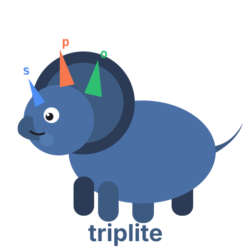

<p align="center">
  
</p>

# triplite

**The SQLite of triple stores.** A knowledge graph that lives in a single YAML file, with a graph-database interface. Built for LLM agents.

```yaml
triples:
  - {s: salesflow-crm, p: PROVIDES, o: crm-sync-job}
  - {s: crm-sync-job, p: INGESTS_TO, o: RAW_CRM_CONTACTS, schedule: hourly}
  - {s: LEGACY_DUMP, p: MIGRATED_TO, o: RAW_CRM_CONTACTS, deprecated: true}
```

That file **is** the database. No server, no daemon, no cloud deployment. It diffs cleanly in git, survives in a repo next to your code, and — the part triplite is actually designed around — **an LLM agent can `Read` it directly and reason over your domain without hallucinating entity names.**

## Why

RDF graph databases are like Oracle: powerful, correct, and heavy. SPARQL endpoints, OWL reasoners, enterprise semantic layers — great at scale, overkill when what you need is a curated map of a few hundred facts that your AI agents (and teammates) can trust.

SQLite proved that "the database is just a file" unlocks a huge class of use cases. triplite applies the same move to knowledge graphs:

|  | Full triple store (Jena, Virtuoso, Neptune, ...) | triplite |
|---|---|---|
| Storage | server / cloud service | one YAML file |
| Query | SPARQL | triple patterns with variable joins |
| Schema | OWL + reasoners | a list of allowed predicates |
| Agent integration | MCP / API layer | the agent just reads the file |
| Setup time | an afternoon (or a sprint) | `pip install triplite` |

If you need inference engines, named graphs, and multi-tenant governance, use a real triple store (AWS's [context-ontology-accelerator](https://github.com/aws/context-ontology-accelerator) is the enterprise-grade take on the same "give agents trustworthy context" problem). If you want a knowledge graph **today, in a file, in git** — that's triplite.

### Curation-first, not extraction-first

Most "AI knowledge graph" tools use an LLM to extract triples from text. That's great for bootstrapping, but extracted graphs inherit hallucinations. triplite takes the opposite stance: **the graph is curated data** (by humans, or by agents you supervise), the ontology constrains what can be said, and LLMs *consume* the graph rather than invent it. When an agent reads

```yaml
- {s: crm-sync-job, p: INGESTS_TO, o: RAW_CRM_CONTACTS}
```

there is no step where a table name can be made up.

## Install

```bash
pip install triplite
```

## Quickstart (Python)

```python
from triplite import TripLite

db = TripLite("pipeline.yaml", ontology={
    "PROVIDES": "SaaS vendor -> ingestion job",
    "INGESTS_TO": "ingestion job -> warehouse table",
    "MIGRATED_TO": "deprecated table -> its replacement",
})

db.add("salesflow-crm", "PROVIDES", "crm-sync-job")
db.add("crm-sync-job", "INGESTS_TO", "RAW_CRM_CONTACTS", schedule="hourly")
db.add("crm-sync-job", "OWNS", "x")   # OntologyError: predicate not declared

# Pattern matching — None is a wildcard, '*' globs
for t in db.triples(p="INGESTS_TO", o="RAW_*"):
    print(t.s, "->", t.o, t.attrs)

# Multi-pattern queries with variable joins (SPARQL-style basic graph patterns)
db.query(["?vendor PROVIDES ?job", "?job INGESTS_TO ?table"])
# [{'vendor': 'salesflow-crm', 'job': 'crm-sync-job', 'table': 'RAW_CRM_CONTACTS'}]

db.save()                    # writes pipeline.yaml
db.to_html("pipeline.html")  # interactive vis-network visualization
db.to_jsonld()               # best-effort export for real RDF tooling
```

## Quickstart (CLI)

```bash
triplite add pipeline.yaml salesflow-crm PROVIDES crm-sync-job
triplite add pipeline.yaml crm-sync-job INGESTS_TO RAW_CRM_CONTACTS -a schedule=hourly

triplite query pipeline.yaml -w "?vendor PROVIDES ?job" -w "?job INGESTS_TO ?table"
# vendor         job           table
# -------------  ------------  ----------------
# salesflow-crm  crm-sync-job  RAW_CRM_CONTACTS

triplite stats pipeline.yaml
triplite html pipeline.yaml -o pipeline.html
triplite jsonld pipeline.yaml
```

## The file format

A triplite file is ordinary YAML with two top-level keys:

```yaml
ontology:            # optional — omit it for free-form predicates
  predicates:
    PROVIDES: "SaaS vendor -> ingestion job"
    AFFECTED_BY: "table -> change event"

triples:
  # compact form for plain facts
  - {s: adastra-ads, p: PROVIDES, o: ads-spend-collector}

  # any extra keys become edge attributes
  - s: RAW_AD_SPEND_DAILY
    p: AFFECTED_BY
    o: "2025-04-01 adastra API v3: spend now in micros (was cents)"
```

Three conventions worth stealing (see [`examples/acme_pipeline.yaml`](examples/acme_pipeline.yaml)):

- **Change events as objects.** `AFFECTED_BY` edges pointing at dated event strings give your graph a memory — "why did this number change in April?" becomes a query.
- **`deprecated: true`** on edges renders them dashed in the HTML view and lets agents filter dead paths.
- **`via:` / `schedule:`** attributes carry operational detail without polluting the node set.

## Using it with LLM agents

The intended loop:

1. Keep `graph.yaml` in your repo, next to the code it describes.
2. Tell your agent about it once (e.g. in `CLAUDE.md` / your system prompt):

   > Before any task touching the data pipeline, read `pipeline.yaml`.
   > It is the source of truth for which jobs feed which tables.
   > Predicates are limited to the ontology declared in the file.

3. Agents propose edits as diffs to the YAML — reviewable in a PR like any other change. The ontology check (`triplite.add` raises on unknown predicates) keeps generated edits inside the vocabulary you chose.
4. Humans browse the same graph via `triplite html`.

One source of truth, two projections: YAML for machines, HTML for people.

## What triplite is not

- **Not a SPARQL engine.** Queries are basic graph patterns (conjunctive triple patterns with variables). No `OPTIONAL`, no `FILTER`, no federation. If you outgrow this, export JSON-LD and graduate to real RDF tooling.
- **Not an extraction pipeline.** It won't turn your PDFs into a graph. Pair it with an extractor if you want that — then curate what comes out.
- **Not for millions of triples.** Everything is in memory and scans are linear. The sweet spot is the hundreds-to-thousands range, where a curated graph is even possible.

## Examples

- [`examples/acme_pipeline.yaml`](examples/acme_pipeline.yaml) — a fictional company's data platform: vendors, ingestion jobs, warehouse tables, change events, migrations. The use case triplite was born from.
- [`examples/python_ecosystem.yaml`](examples/python_ecosystem.yaml) — dependencies and deprecations in the Python packaging world, with free-form predicates.

```bash
triplite html examples/acme_pipeline.yaml -o acme.html && open acme.html
```

## Development

```bash
pip install -e '.[dev]'
pytest
```

## License

MIT
