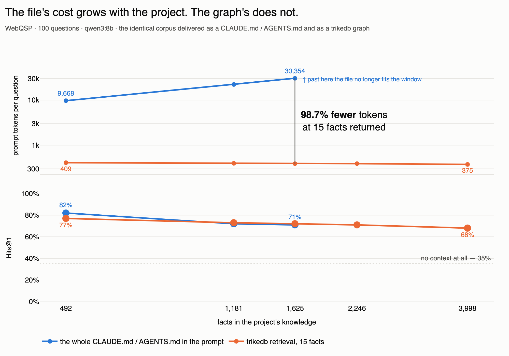
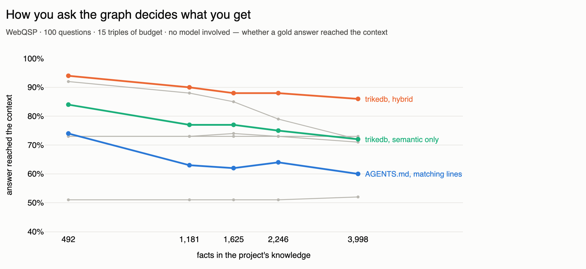
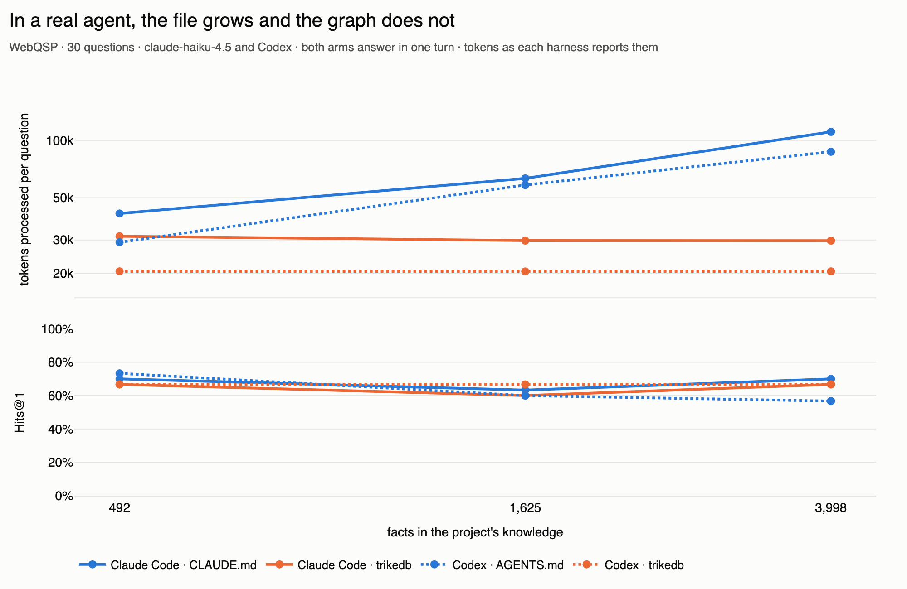

<p align="center">
  <b>English</b>
  &nbsp;·&nbsp; <a href="https://github.com/RyutoYoda/trikedb/blob/main/benchmarks/README_jp.md">日本語</a>
  &nbsp;·&nbsp; <a href="https://github.com/RyutoYoda/trikedb/blob/main/benchmarks/README_zh.md">简体中文</a>
</p>

# Benchmarks

Measured on [WebQSP](https://aclanthology.org/P16-2033/), 300 questions.

| | |
|---|---|
| **Retrieval** | trikedb put the gold answer in front of the model for **89.3%** of questions |
| **Speed** | **0.59 s** of the 22.5 s an answer takes — no server, no index, one file |
| **Scale** | fast to **100,000 triples**; semantic search gives out first, at 30,000 |
| **End to end** | a laptop-sized 8B reader then answers **77.7%** correctly, against **42.7%** with no graph |
| **Against a file** | the same facts as `CLAUDE.md` / `AGENTS.md` cost **78x** the tokens per question, for the same answers |

## Accuracy


| condition | Hits@1 | F1 | n |
|---|---|---|---|
| `qwen3:8b` alone | 42.7% | 27.9% | 300 |
| `qwen3:8b` + graph | **77.7%** | **57.4%** | 300 |
| `qwen3.8:27b` alone | 44.0% | 30.6% | 150 |
| `qwen3.8:27b` + graph | 67.3% | 57.1% | 150 |

Same model, same prompt, same questions. The only change is whether the
retrieved triples are in the context. The graph is worth +35 points on the 8B
(paired McNemar p = 9e-20) — while **3.4x the parameters is worth nothing
without one** (44.0% against 42.7%, p = 1.0).

The 27B scores lower *with* a graph, and that is not a capability result: it
answers "I don't know" on 30 of 150 questions where the 8B does on 4, and 19 of
those had the answer in the context. Restrict to the 120 questions both
answered and the difference disappears (88.3% against 84.2%, p = 0.27). Swap
the reader and the abstention instruction needs retuning.

The chart above reads as one pipeline: of the same 300 questions, trikedb put
the answer in the context for 89.3%, and the reader turned 77.7% of them into a
correct answer. The 11.6-point gap is 38 questions whose answer was in front of
the model and did not come out of it — so a perfect reader on this same
retrieval would score 89.3%, and the ceiling here belongs to the reader, not
the graph.

## Against a knowledge file

Project knowledge reaches a model somehow. The usual way is `CLAUDE.md` /
`AGENTS.md` — the whole file, in the context, on every question. The
alternative is a graph the model retrieves from. `memory_bench.py` builds one
corpus and renders it both ways: same facts, same questions, same reader, one
request each, and the corpus grows.

The two filenames are the same mechanism under different harnesses, and both
were measured in the one that reads them — `CLAUDE.md` in Claude Code,
`AGENTS.md` in Codex, in the agent section below. The table here is a raw
model behind one HTTP call, where the file is a payload and its name is
arbitrary.



| facts in the project | as a knowledge file | with trikedb | tokens |
|---|---|---|---|
| 492 | 9,668 tok · 82.0% | 409 tok · 77.0% | 24x |
| 1,181 | 22,153 tok · 72.0% | 397 tok · **73.0%** | 56x |
| 1,625 | 30,354 tok · 71.0% | 389 tok · **72.0%** | **78x** |
| 2,246 | does not fit | 390 tok · 71.0% | — |
| 3,998 | does not fit | 375 tok · 68.0% | — |

100 questions, `qwen3:8b`, temperature 0, one request per question so the arms
are turn-matched. No context at all scores 35.0%.

The reason the gap grows is that markdown has no index. The file has to be
sent whole, because there is no way to hand over only the Solomon section
without reading the file first — so its cost is the size of the *project*.
The graph is addressable, so its cost is the size of the *answer*: ~15 triples
whether the corpus holds 492 facts or 3,998. The ratio is roughly total facts
over facts the question needs, and only the numerator grows.

"Does not fit" is measured, not skipped: at 2,246 facts the rendered file is
143,157 characters and the reader read 20,482 tokens of it — 7.0 characters
per token against 3.4 for a prompt that fits. Ollama does not refuse an
over-long prompt, it cuts it in half and answers from the remainder.

**Retrieval, not just retrieval.** Grepping the same file at the graph's
budget is the control, and it costs the same ~380 tokens: 68.0% at 492 facts
falling to 61.0% at 3,998, against the graph's 77.0% → 68.0%. So 7-14 points
of the graph's result is the graph and not the act of retrieving.

**Which retrieval matters more than whether.** trikedb can be asked six ways
and they are not interchangeable, so all of them are priced before any model
runs — no LLM, just whether a gold answer reached a 15-triple context:



| method | 492 facts | 3,998 facts |
|---|---|---|
| `hybrid` (entity + semantic) | **94%** | **86%** |
| `find` (node payloads) | 92% | 72% |
| `search` (semantic only) | 84% | 72% |
| `1-hop + CVT` | 73% | 73% |
| `2-hop` | 73% | 71% |
| `1-hop` | 51% | 52% |
| `AGENTS.md`, matching lines | 74% | 60% |

Picking `search` and calling it "the graph" costs 10-14 points against
`hybrid` at the same budget. The numbers above use `hybrid`.

### Inside a real agent

The same corpora through Claude Code and Codex, with the file loaded from disk
into the system prompt the way each harness actually does it. Tokens as the
harness reports them, not dollars: cost depends on which cache band a token
lands in and on session lifetime, and this benchmark controls neither.



| | 492 facts | 1,625 facts | 3,998 facts |
|---|---|---|---|
| Claude Code, `CLAUDE.md` | 41,318 · 70.0% | 63,172 · 63.3% | 110,839 · 70.0% |
| Claude Code, trikedb | 31,377 · 66.7% | 29,769 · 60.0% | **29,758 · 66.7%** |
| Codex, `AGENTS.md` | 29,173 · 73.3% | 58,308 · 60.0% | 87,153 · 56.7% |
| Codex, trikedb | 20,523 · 66.7% | 20,503 · 66.7% | **20,510 · 66.7%** |

30 questions, `claude-haiku-4.5` and Codex's default. Every row is one turn
except Codex's file arm, which took a second turn at 1,625 facts and a third
at 3,998 — it starts working to find things in a file that large, and that is
part of why its cost climbs. Most of each number is the harness's own system
prompt — 31,014 tokens for Claude Code with no project knowledge at all —
which neither arm avoids.
Subtract it and the knowledge itself costs **+10,304 tokens as a file against
+363 as a graph**, a factor of 28.

Codex is the cleaner result: as the corpus grows its file arm gets both more
expensive and *less* accurate (73.3% → 56.7%) while the graph arm holds
66.7% on a flat 20,510 tokens.

**Letting the agent query the graph itself was worse.** Given the MCP server
and told to use it, both harnesses spent three or four turns, and every turn
re-sends the prefix: 85,098 tokens at 26.7% for Claude Code, 84,730 at 70.0%
for Codex. Retrieving once *before* the agent runs and putting the result in
the prompt beat it on tokens in both harnesses and on accuracy in one. That is
the configuration the rows above use, and it is what a context hook does.

## Speed


Retrieval is 0.59 s: building the whole 4,640-triple subgraph into a graph
(effectively instant) and running `search()` + `find()` over it. No server, no
index to build, no second store. Everything else is the model reading 4,377
tokens of context — which is also why a 27B reader costs 70.4 s per question
instead of 22.5 s.

| retrieval | answer in context | prompt |
|---|---|---|
| 1-hop + CVT, 250 triples | 70.7% | ~4,377 tokens |
| **hybrid, 250 triples** | **89.3%** | ~4,377 tokens |
| semantic only, 250 triples | 88.7% | ~4,377 tokens |
| hybrid, 100 triples | 81.3% | ~1,823 tokens |

Same budget, better selection: +18.6 points of usable context for free. The
entity anchor is worth almost nothing next to plain ranking — 0.6 points at 250
triples, and a slight loss at 100.

## Scale


| triples | open `.json` | open `.yaml` | save `.yaml` | SPARQL 2-hop | `to_html` | `search()` |
|---|---|---|---|---|---|---|
| 733 | 1 ms | 9 ms | 8 ms | 1 ms | 14 ms | 19 ms |
| 7,333 | 5 ms | 122 ms | 101 ms | 9 ms | 163 ms | 155 ms |
| 20,400 | 13 ms | 456 ms | 305 ms | 26 ms | 491 ms | 4.3 s |
| 73,333 | 71 ms | 1.6 s | 1.0 s | 94 ms | 1.9 s | 13.5 s |
| 204,000 | 147 ms | 4.6 s | 3.2 s | 297 ms | 6.0 s | 41.9 s |

The features do not degrade together, so there is no single size limit:

- **to ~1,000** — everything is instant and the whole graph fits in a pull
  request. This is the size the tool is shaped for.
- **to ~10,000** — still comfortable everywhere, semantic search included.
  Reviewing the whole graph stops being realistic; reviewing diffs does not.
- **to ~100,000** — SPARQL stays fast. Semantic search (13 s), the HTML
  workbench (17 MB) and saving as YAML stop being pleasant. Naming the file
  `.json` keeps open and save an order of magnitude cheaper.
- **past ~500,000** — it works and it is outside the design. GitHub stops
  rendering the diff.

What does *not* degrade: a one-fact change is one line of diff at any size, and
the backend never affects query time — a `snowflake://` row, an `s3://` object
and a local file answer identically, because the graph is answered from memory.

## Reproduce

```bash
uv run --extra all --with polars --with model2vec \
    python benchmarks/webqsp_bench.py prepare --n 300 --seed 42 \
    --retrieval "hybrid (entity + semantic)" --cap 250 --out bench_out/hybrid

for cond in nograph graph; do
  uv run --extra all --with polars python benchmarks/webqsp_bench.py run \
      bench_out/hybrid/eval_set.json --model qwen3:8b --condition $cond \
      --style grounded --out bench_out/ans_$cond.jsonl --workers 8
done

uv run --extra all python benchmarks/webqsp_bench.py score \
    bench_out/hybrid/eval_set.json bench_out/ans_*.jsonl
uv run --extra all python benchmarks/webqsp_bench.py compare \
    bench_out/hybrid/eval_set.json bench_out/ans_nograph.jsonl bench_out/ans_graph.jsonl
```

The reader is local and named on purpose: the score depends on it, so it has to
be re-runnable without an API key. `score` prints Wilson intervals; `compare`
runs the paired test, which is the right one here because both runs answer the
same questions with the same model.

Scale numbers come from `ceiling_bench.py` (medians of three, one synthetic
pipeline-shaped graph, Apple silicon); backend numbers from `backend_bench.py`;
the retrieval comparison from `retrieval_bench.py`, which `webqsp_bench.py`
imports rather than reimplementing.

The knowledge-file comparison is `memory_bench.py`. One `prepare` builds every
corpus size as a nested tier, so the questions are identical at every size:

```bash
uv run --extra all --with polars --with model2vec \
    python benchmarks/memory_bench.py prepare --n 100 --seed 42 \
    --distractors 0,150,250,400,900 --facts-per-q 5 --out bench_out/memory

for tier in d0 d150 d250 d400 d900; do
  for cond in none md md_grep graph; do
    uv run --extra all --with polars --with model2vec \
        python benchmarks/memory_bench.py run bench_out/memory/$tier \
        --condition $cond --model qwen3:8b \
        --out bench_out/memory/$tier/ans_$cond.jsonl
  done
done

uv run --extra all --with model2vec \
    python benchmarks/memory_bench.py methods bench_out/memory --cap 15
uv run --extra all python benchmarks/memory_bench.py sweep bench_out/memory
```

`methods` needs no model and finishes in seconds; `sweep` is the growth curve.
The agent rows are `agent_bench.py`, which drives the `claude` and `codex`
CLIs (`--harness`) and reads the token counts each one reports. Put its
workspaces outside a git repository with `--workspace-root`: both CLIs walk up
from the working directory looking for a knowledge file, and an unrelated
`CLAUDE.md` two levels up gets measured as part of the condition.

## What this does not show

- **Not a comparison against other tools.** No vector store, no other triple
  store, no plain-text RAG was run. "A graph helps" is measured; "trikedb helps
  more than X" is not.
- **Not the curation premise.** The graphs here are the dataset's own Freebase
  subgraphs, so this validates trikedb as a retrieval and storage layer, not
  the claim that hand-curated graphs are better.
- **Not the file story.** Each question uses a fresh in-memory graph, so
  nothing here exercises git review, diffs, or a persisted file.
- **Absolute scores are below published SOTA** (mid-to-high 80s Hits@1), which
  uses GPT-4-class or task-fine-tuned readers.
  [RoG](https://arxiv.org/abs/2310.01061) (ICLR 2024) reports F1 70.8 with a
  fine-tuned LLaMA-2-7B, and its metric implementation is what `score`
  reproduces. Other leaderboard figures are deliberately not tabulated here:
  they are easy to mis-transcribe, and a table of unverified numbers next to
  your own is worse than no table.
- **Gold labels are noisy.** Roughly 10% of sampled questions have
  questionable answers, which caps honest absolute scores on raw WebQSP labels.
- **Not dollars.** The agent rows are token counts. Cost depends on which
  cache band each token lands in — a cache read is a tenth of normal input, a
  cache write more than one — and on whether the session was still alive.
  Every `claude -p` and `codex exec` here is a fresh session, which is what a
  scripted or CI task is and is *not* what a long interactive session is. In a
  session that stays warm the file is written to cache once and read cheaply
  after, and the dollar gap narrows while the token gap does not.
- **Not the agent's own retrieval.** The knowledge-file rows retrieve once
  before the agent runs. Letting the agent drive the MCP server itself is
  measured and reported, and it was worse; making *that* path good is not
  something this benchmark shows how to do.
- **The corpus bounds it.** The answer is reachable within two hops of
  something the question names for 76 of 100 questions, so no arm can score
  much above that. Fixing an earlier curation bug moved this from 36 to 76 —
  the check that missed it asked whether the answer *string* was in the file,
  which a disconnected corpus passes.
