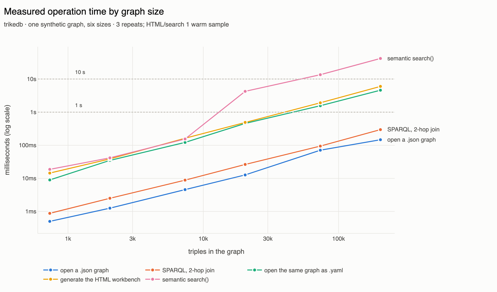

# Benchmarks

Two questions, in the order they matter:

1. **[Does the graph make an LLM more accurate?](#kgqa-does-the-graph-reduce-hallucination)**
   — 60% → 83% on WebQSP, with the measurement protocol's own sensitivity
   reported alongside it, because the headline number moves depending on how
   you score.
2. **[Where is the ceiling?](#where-is-the-ceiling)** — which operation stops
   being usable first, and at what graph size. Not the same as "how many
   triples fit", which nothing reaches.

## KGQA: does the graph reduce hallucination?

**Question:** if an LLM answers factual questions with a trikedb graph as
context, how much more accurate is it than the same LLM answering alone?

**Setup:** [WebQSP](https://aclanthology.org/P16-2033/) questions via the
[RoG-WebQSP](https://huggingface.co/datasets/rmanluo/RoG-webqsp) repack
(gold answers + Freebase subgraph per question, downloaded at runtime —
no dataset content is stored in this repository). Per-question context is
retrieved with trikedb's pattern API: the 1-hop neighborhood of the
question entity, expanded through Freebase mediator (CVT) nodes, capped
at 250 triples. Scoring is a case-insensitive containment match against
the gold answers.

**Pilot result** (N=30, seed 42, model: claude-haiku-4-5, 2026-08):

| condition | accuracy |
|---|---|
| LLM alone | 18/30 (60%) |
| LLM + trikedb context | **25/30 (83%)** |

Retrieval ceiling for the graph condition: the gold answer was present in
the retrieved context for 20/30 questions — the graph condition scores
above the ceiling because the prompt allows falling back to model
knowledge when the triples don't contain the answer. 4 of its 5 remaining
misses are retrieval misses (answer deeper than the retrieved hops), not
reasoning errors.

Typical failures of the no-graph condition are classic hallucinations:
confidently naming the wrong record label, the wrong Soviet leader for
the asked time frame, or missing minority languages of a country — all of
which the graph condition answers from triples.

**Reproduce:**

```bash
uv run --with pandas --with pyarrow --with trikedb \
    python benchmarks/webqsp_bench.py prepare --n 30 --seed 42
# run bench_out/prompts_*.json through your LLM of choice,
# save [{"id", "answer"}] arrays as answers_nograph.json / answers_graph.json
uv run --with trikedb python benchmarks/webqsp_bench.py score \
    bench_out/eval_set.json answers_nograph.json answers_graph.json
```

Caveats: N=30 is a pilot, containment matching is generous to both
conditions equally, and WebQSP subgraphs are larger than trikedb's
intended sweet spot (they are loaded in-memory per question, which works
fine — the YAML file is not the bottleneck here).

## What the retrieval method is worth

Everything above the retrieval layer was held fixed — same 300 questions,
same model, same prompt, **same 250-triple budget** — so the only variable is
*which* 250 triples get picked:

| retrieval | answer present in context |
|---|---|
| 1-hop + CVT (what this benchmark used until now) | 212/300 · 70.7% |
| **hybrid — entity anchor + `search()` ranking** | **268/300 · 89.3%** |

Same amount of context, 18.6 points more of it useful. The retrieval is
trikedb's own `search()` and `find()`, and the comparison harness is
`retrieval_bench.py` — `webqsp_bench.py` imports the methods from it rather
than keeping a second copy, because the retrieval numbers are what the
accuracy numbers are supposed to be explained by.

**A bigger dump is not the lever — better selection is.** Uncapping the
context (below) made every gold answer reachable and accuracy did not move.

**The entity anchor only earns its keep at a large budget.** Rebuilt at
smaller caps, hybrid and pure semantic search are indistinguishable:

| retrieval | cap | answer in context |
|---|---|---|
| hybrid | 250 | 89.3% |
| hybrid | 150 | 84.7% |
| semantic search | 150 | 84.7% |
| semantic search | 100 | 81.7% |
| hybrid | 100 | 81.3% |

At 150 triples they tie exactly, and at 100 the anchor is a slight *loss*.
Half a small budget spent guaranteeing the question's own entity is half a
budget not spent on ranking, and ranking is what finds the answer.

## What the context costs

Worth knowing before running this yourself: the wall-clock is almost entirely
**prompt prefill**, not generation. The answers are short — a median of two
lines — so the run time is set by how many context tokens the model has to
read per question.

| condition | prompt | 300 questions |
|---|---|---|
| no graph | ~120 tokens | **7 min** (measured) |
| graph, 250 triples | ~5,400 tokens | ~60 min (measured) |

That ratio is why the retrieval table above matters twice: a method that needs
fewer triples for the same reach is also several times faster. Concurrency is
not the fix — the GPU is already saturated by prefill, and raising
`OLLAMA_NUM_PARALLEL` to 8 with `--workers 8` bought far less than the token
count did. `--workers` exists anyway because it is free on the no-graph
condition and on any machine where prefill is not the wall.

## Where published numbers sit

Published WebQSP leaders report Hits@1 in the mid-to-high 80s and F1 around
70. The one figure quoted here is the one that can be checked and that this
harness is built against:
[RoG](https://arxiv.org/abs/2310.01061) (ICLR 2024) reports **F1 70.8** on
WebQSP with a fine-tuned LLaMA-2-7B reader, and its metric implementation is
what `score` reproduces.

Other numbers from that leaderboard are deliberately *not* tabulated here.
They are easy to mis-transcribe — the same method appears with different
figures across papers depending on the split, the retriever, and whether the
reader was fine-tuned — and a table of unverified numbers next to your own is
worse than no table.

What matters when reading any of them against the numbers above:

- **The reader model.** The leaders run a GPT-4-class model or one fine-tuned
  on the task. This benchmark runs an 8B open model, zero-shot, on a laptop,
  and names it, so the number is reproducible without an API key.
- **The protocol.** That part *is* comparable: Hits@1 and F1 computed the way
  the RoG reference implementation computes them — normalise, drop articles
  and punctuation, substring match, credit each gold answer once. Departing
  from it produces a number that looks comparable and is not, which is why
  `_normalize` and `f1` carry that note in the source.

## Scoring sensitivity (why we report the containment protocol)

We also ran three variants and report them for transparency:

| protocol | LLM alone | LLM + graph | delta |
|---|---|---|---|
| containment match (primary) | 60% | **83%** | **+23pt** |
| containment, retrieval v2 (relevance-sorted context) | — | 77% | — |
| containment, retrieval v3 (deeper CVT expansion) | — | 80% | — |
| LLM-judge, gold-anchored, applied to both conditions | 73% | 77% | +4pt |

Findings worth knowing before you tune this benchmark yourself:

- **Relevance-sorting the context hurt.** Sorting triples by question-word
  overlap pushed the actual answer triples past the context cap in
  several questions (e.g. GDP-measurement `currency` triples outranked
  the country's real currency). Plain hop-order retrieval did better.
- **Gold labels are noisy.** ~10% of sampled questions have questionable
  gold answers (e.g. "soviet leader during world war ii" → gold
  *Brezhnev/Khrushchev*; "what did galileo do to become famous" → gold
  is a profession list). This caps honest absolute scores on raw WebQSP
  labels — published SOTA sits around ~86% for the same reason.
- **LLM-judge scoring is unstable.** A judge that accepts granularity
  variants rescues the no-graph condition's vague answers and compresses
  the delta; a stricter judge restores it. We therefore report the
  deterministic containment protocol as primary — it is reproducible
  from the committed script with no judgment calls.

The robust claim is the **delta**: under any fixed protocol applied to
both conditions equally, the graph condition wins. Absolute 90%+ scores
on WebQSP raw labels are not honestly reachable (label noise); a
1-hop benchmark over a self-contained KB (e.g. MetaQA 1-hop, currently
gated on HF) is the right target for high absolute numbers.

## Retrieval-depth experiment (does more context help?)

Follow-up experiments on the same 30 questions:

| retrieval | answer-reachable ceiling | accuracy |
|---|---|---|
| 1-hop + CVT, capped 250 (v1) | 20/30 | **83%** |
| deeper CVT expansion, capped 400 (v3) | 23/30 | 80% |
| same, **uncapped** (median 912 triples/question) | **30/30** | 80% |
| + OWL-RL transitivity materialization (19,070 inferred facts) | 23/30 | not rerun |

Two findings worth internalizing:

- **Reachability is not accuracy.** Removing the context cap made every
  gold answer reachable (30/30), yet accuracy did not improve: with
  ~900 triples per question the model starts picking plausible-but-wrong
  entries from the flood (a TV show instead of a film, one obscure song
  instead of the famous ones). The bottleneck moved from retrieval to
  attention. The fix is not a bigger dump but *iterative* retrieval —
  letting the agent query the graph over MCP turn by turn.
- **Inference is orthogonal.** Materializing transitive closure over the
  location predicates added 19,070 correct facts and made zero
  additional answers reachable: WebQSP's multi-hop questions chain
  *different* predicates through mediator nodes, which no OWL axiom
  shortens. OWL earns its keep on same-predicate chains (role
  inheritance, containment hierarchies), not on this benchmark.

The remaining misses at any depth are dominated by gold-label noise
(4/30) and answer-granularity mismatches — consistent with published
SOTA plateauing in the mid-80s.

## Where is the ceiling?

**Question:** how big can a graph get and still be a graph you keep in git,
review in a pull request, and query without waiting?

The size a document *fits* in turns out to be the least interesting answer.
Extrapolating from the measurements below at roughly 58 bytes and 3 KB of RAM
per triple:

| Limit | Triples | Binding? |
|---|---|---|
| 8 GB of RAM | ~2,500,000 | no — you hit everything else first |
| GitHub's 100 MB file block | ~1,700,000 | no |
| GitHub's 50 MB file warning | **~870,000** | the hard stop, and nothing reaches it |

Nothing curated gets near 870,000. The graphs this is actually used for —
an ops map, a domain ontology, a chatbot's knowledge base — run two to three
orders of magnitude below that. So "how many triples fit" is not the question
worth answering.

**What you actually hit is one feature at a time getting slow, and they do not
degrade together.**



Semantic search leaves the pack at 10k triples and is unusable by 30k, while
SPARQL over the same graph is still answering in a quarter of a second at
200k. Reading and writing sit in between, and *which format you chose* moves
them by an order of magnitude.

| triples | YAML | open `.json` | open `.yaml` | save `.yaml` | SPARQL 2-hop | `to_html` | HTML | `search()` |
|---|---|---|---|---|---|---|---|---|
| 733 | 0.0 MB | 1 ms | 9 ms | 8 ms | 1 ms | 14 ms | 0.2 MB | 19 ms |
| 2,040 | 0.1 MB | 1 ms | 35 ms | 26 ms | 2 ms | 39 ms | 0.5 MB | 42 ms |
| 7,333 | 0.4 MB | 5 ms | 122 ms | 101 ms | 9 ms | 163 ms | 1.7 MB | 155 ms |
| 20,400 | 1.1 MB | 13 ms | 456 ms | 305 ms | 26 ms | 491 ms | 4.8 MB | 4.3 s |
| 73,333 | 3.9 MB | 71 ms | 1.6 s | 1.0 s | 94 ms | 1.9 s | 16.9 MB | 13.5 s |
| 204,000 | 11.2 MB | 147 ms | 4.6 s | 3.2 s | 297 ms | 6.0 s | 48.9 MB | 41.9 s |

`ceiling_bench.py` produced this; `ceiling_chart.py` draws the plot from its
JSON. Medians of three on an Apple-silicon laptop, one synthetic
pipeline-shaped graph (vendors → jobs → tables, a third of the edges carrying
note/prov attributes). Absolute numbers will differ on your hardware; the
*shape* of each curve is the point.

### How to read it

**Up to ~1,000 triples.** Everything is immediate and you can review the whole
graph in a pull request. This is the size the tool is shaped for.

**Up to ~10,000.** Still comfortable everywhere, semantic search included
(155 ms). Reviewing the whole graph stops being realistic around here — 10k
triples is 10k lines — so review moves to diffs. A one-fact change is one
line of diff at *every* size, so that keeps working indefinitely.

**Up to ~100,000.** SPARQL and pattern queries stay fast (93 ms for a 2-hop
join). Three things stop being pleasant: semantic search (13 s), the HTML
workbench (1.9 s to generate, 17 MB to open in a browser), and saving as YAML
(1.1 s — which with the default `autosave=True` is the cost of *every*
`add()`; open with `autosave=False` and batch instead). Naming the file
`.json` keeps opening and saving an order of magnitude cheaper.

**Past ~500,000.** It works, and it is outside what the design is for. Save
times are seconds, git is carrying a 20 MB text file, and GitHub stops
rendering the diff.

### What does *not* degrade

- **The diff for one change.** One line, at 700 triples and at 700,000 —
  because triples serialise one per line and the save is deterministic.
- **Queries, by backend.** A `snowflake://` row, an `s3://` object and a
  local file answer the same query in the same time; the graph is answered
  from memory, so the backend only decides what opening and saving cost. See
  `backend_bench.py`.
- **Building the graph.** `add()` was O(n²) until 0.27.0 — a linear scan for
  the upsert check made 100k triples take 289 seconds to build, with the cost
  of a single `add` growing from 60 µs to 2.9 ms. It is indexed now, so
  importing a large graph is linear. Loading was never affected.
