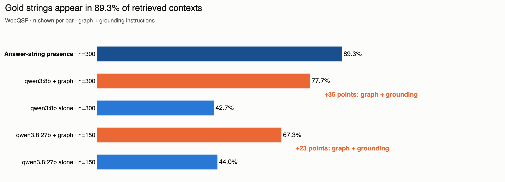
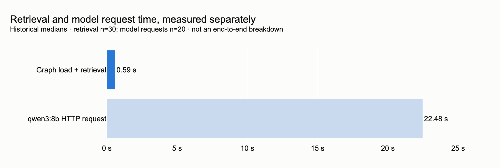

<p align="center">
  <b>English</b>
  &nbsp;·&nbsp; <a href="https://github.com/RyutoYoda/trikedb/blob/main/benchmarks/README_jp.md">日本語</a>
  &nbsp;·&nbsp; <a href="https://github.com/RyutoYoda/trikedb/blob/main/benchmarks/README_zh.md">简体中文</a>
</p>

# Benchmarks

Measured on [WebQSP](https://aclanthology.org/P16-2033/), 300 questions.

| | |
|---|---|
| **Retrieval** | trikedb put the gold answer in front of the model for **89.3%** of questions |
| **Speed** | **0.59 s** of the 22.5 s an answer takes — no server, no index, one file |
| **Scale** | fast to **100,000 triples**; semantic search gives out first, at 30,000 |
| **End to end** | a laptop-sized 8B reader then answers **77.7%** correctly, against **42.7%** with no graph |

## Accuracy



| condition | Hits@1 | F1 | n |
|---|---|---|---|
| `qwen3:8b` alone | 42.7% | 27.9% | 300 |
| `qwen3:8b` + graph | **77.7%** | **57.4%** | 300 |
| `qwen3.8:27b` alone | 44.0% | 30.6% | 150 |
| `qwen3.8:27b` + graph | 67.3% | 57.1% | 150 |

Same model, same prompt, same questions. The only change is whether the
retrieved triples are in the context. The graph is worth +35 points on the 8B
(paired McNemar p = 9e-20) — while **3.4x the parameters is worth nothing
without one** (44.0% against 42.7%, p = 1.0).

The 27B scores lower *with* a graph, and that is not a capability result: it
answers "I don't know" on 30 of 150 questions where the 8B does on 4, and 19 of
those had the answer in the context. Restrict to the 120 questions both
answered and the difference disappears (88.3% against 84.2%, p = 0.27). Swap
the reader and the abstention instruction needs retuning.

The chart above reads as one pipeline: of the same 300 questions, trikedb put
the answer in the context for 89.3%, and the reader turned 77.7% of them into a
correct answer. The 11.6-point gap is 38 questions whose answer was in front of
the model and did not come out of it — so a perfect reader on this same
retrieval would score 89.3%, and the ceiling here belongs to the reader, not
the graph.

## Speed



Retrieval is 0.59 s: building the whole 4,640-triple subgraph into a graph
(effectively instant) and running `search()` + `find()` over it. No server, no
index to build, no second store. Everything else is the model reading 4,377
tokens of context — which is also why a 27B reader costs 70.4 s per question
instead of 22.5 s.

| retrieval | answer in context | prompt |
|---|---|---|
| 1-hop + CVT, 250 triples | 70.7% | ~4,377 tokens |
| **hybrid, 250 triples** | **89.3%** | ~4,377 tokens |
| semantic only, 250 triples | 88.7% | ~4,377 tokens |
| hybrid, 100 triples | 81.3% | ~1,823 tokens |

Same budget, better selection: +18.6 points of usable context for free. The
entity anchor is worth almost nothing next to plain ranking — 0.6 points at 250
triples, and a slight loss at 100.

## Scale


| triples | open `.json` | open `.yaml` | save `.yaml` | SPARQL 2-hop | `to_html` | `search()` |
|---|---|---|---|---|---|---|
| 733 | 1 ms | 9 ms | 8 ms | 1 ms | 14 ms | 19 ms |
| 7,333 | 5 ms | 122 ms | 101 ms | 9 ms | 163 ms | 155 ms |
| 20,400 | 13 ms | 456 ms | 305 ms | 26 ms | 491 ms | 4.3 s |
| 73,333 | 71 ms | 1.6 s | 1.0 s | 94 ms | 1.9 s | 13.5 s |
| 204,000 | 147 ms | 4.6 s | 3.2 s | 297 ms | 6.0 s | 41.9 s |

The features do not degrade together, so there is no single size limit:

- **to ~1,000** — everything is instant and the whole graph fits in a pull
  request. This is the size the tool is shaped for.
- **to ~10,000** — still comfortable everywhere, semantic search included.
  Reviewing the whole graph stops being realistic; reviewing diffs does not.
- **to ~100,000** — SPARQL stays fast. Semantic search (13 s), the HTML
  workbench (17 MB) and saving as YAML stop being pleasant. Naming the file
  `.json` keeps open and save an order of magnitude cheaper.
- **past ~500,000** — it works and it is outside the design. GitHub stops
  rendering the diff.

What does *not* degrade: a one-fact change is one line of diff at any size, and
the backend never affects query time — a `snowflake://` row, an `s3://` object
and a local file answer identically, because the graph is answered from memory.

## Reproduce

```bash
uv run --extra all --with polars --with model2vec \
    python benchmarks/webqsp_bench.py prepare --n 300 --seed 42 \
    --retrieval "hybrid (entity + semantic)" --cap 250 --out bench_out/hybrid

for cond in nograph graph; do
  uv run --extra all --with polars python benchmarks/webqsp_bench.py run \
      bench_out/hybrid/eval_set.json --model qwen3:8b --condition $cond \
      --style grounded --out bench_out/ans_$cond.jsonl --workers 8
done

uv run --extra all python benchmarks/webqsp_bench.py score \
    bench_out/hybrid/eval_set.json bench_out/ans_*.jsonl
uv run --extra all python benchmarks/webqsp_bench.py compare \
    bench_out/hybrid/eval_set.json bench_out/ans_nograph.jsonl bench_out/ans_graph.jsonl
```

The reader is local and named on purpose: the score depends on it, so it has to
be re-runnable without an API key. `score` prints Wilson intervals; `compare`
runs the paired test, which is the right one here because both runs answer the
same questions with the same model.

Scale numbers come from `ceiling_bench.py` (medians of three, one synthetic
pipeline-shaped graph, Apple silicon); backend numbers from `backend_bench.py`;
the retrieval comparison from `retrieval_bench.py`, which `webqsp_bench.py`
imports rather than reimplementing.

## What this does not show

- **Not a comparison against other tools.** No vector store, no other triple
  store, no plain-text RAG was run. "A graph helps" is measured; "trikedb helps
  more than X" is not.
- **Not the curation premise.** The graphs here are the dataset's own Freebase
  subgraphs, so this validates trikedb as a retrieval and storage layer, not
  the claim that hand-curated graphs are better.
- **Not the file story.** Each question uses a fresh in-memory graph, so
  nothing here exercises git review, diffs, or a persisted file.
- **Absolute scores are below published SOTA** (mid-to-high 80s Hits@1), which
  uses GPT-4-class or task-fine-tuned readers.
  [RoG](https://arxiv.org/abs/2310.01061) (ICLR 2024) reports F1 70.8 with a
  fine-tuned LLaMA-2-7B, and its metric implementation is what `score`
  reproduces. Other leaderboard figures are deliberately not tabulated here:
  they are easy to mis-transcribe, and a table of unverified numbers next to
  your own is worse than no table.
- **Gold labels are noisy.** Roughly 10% of sampled questions have
  questionable answers, which caps honest absolute scores on raw WebQSP labels.
