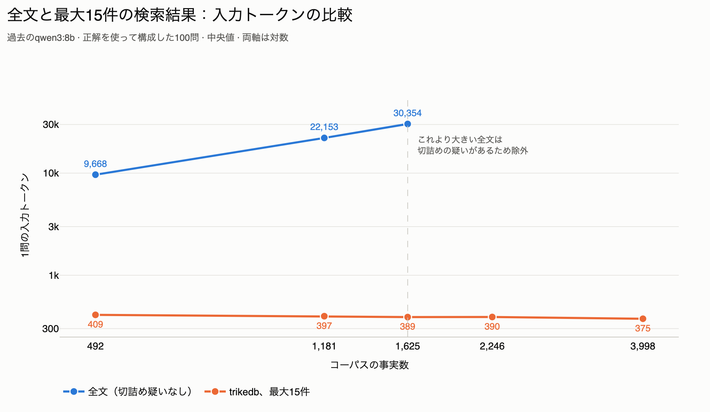
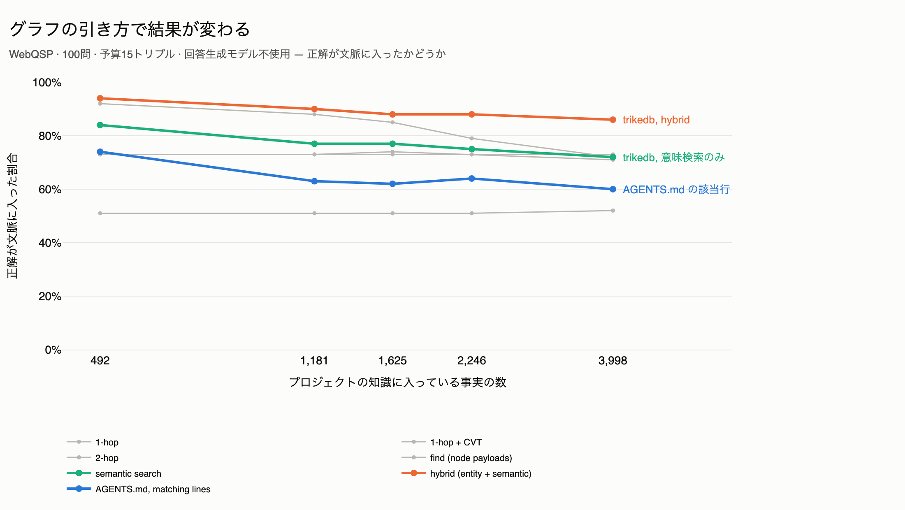
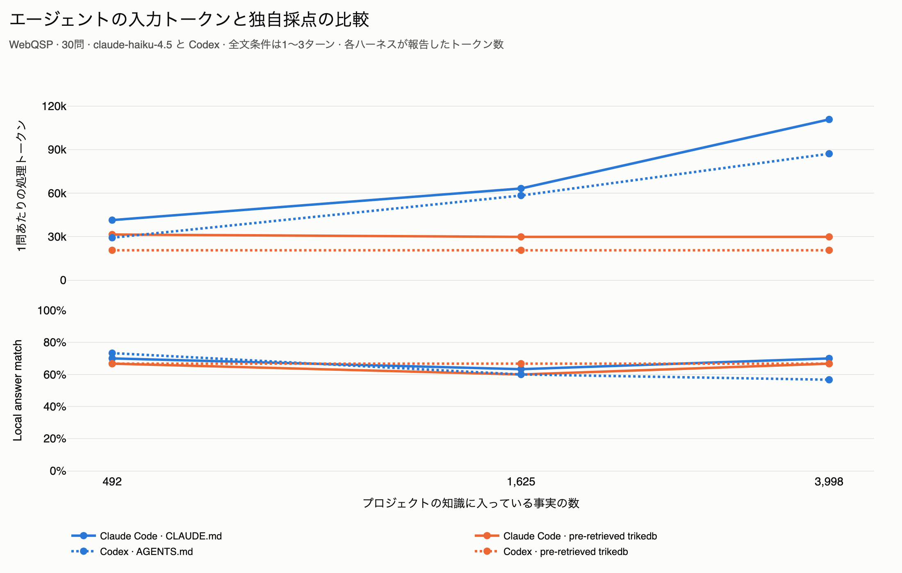

<p align="center">
  <a href="https://github.com/RyutoYoda/trikedb/blob/main/benchmarks/README.md">English</a>
  &nbsp;·&nbsp; <b>日本語</b>
  &nbsp;·&nbsp; <a href="https://github.com/RyutoYoda/trikedb/blob/main/benchmarks/README_zh.md">简体中文</a>
</p>

**評価の範囲：** 過去の回答は独自の部分文字列採点で、WebQSP公式指標ではありません。メモリ・エージェント用コーパスは正解への経路を使って構成し、到達できる質問を選別しています。50件検索の86%と全文の82%は、同じ100問の検定で p=0.454 となり、精度向上が実証されたとは言えません。入力トークン中央値の88.4%減は確認できました。[監査と再現性の記録](VALIDATION.md)も参照してください。

# ベンチマーク

過去の測定です。8Bは300問、27Bは150問。2026-09-09にF1を再採点し、速度は再測定していません。グラフ条件にはgrounding指示も含まれます。

| | |
|---|---|
| **検索** | trikedb は **89.3%** の質問で、正解をモデルの目の前に置きました |
| **速度** | 検索の過去報告値 **0.59秒**、別測定のモデル応答 **22.48秒** |
| **規模** | **10万トリプル**まで速い。最初に苦しくなるのは意味検索で3万から |
| **端から端まで** | ノートPCの8Bを載せると **77.7%** が正解（グラフなしでは **42.7%**） |
| **ファイルとの比較** | 492件で入力中央値88.4%減、独自採点86%対82%（有意差なし） |

## 精度


| 条件 | Hits@1 | F1 | n |
|---|---|---|---|
| `qwen3:8b` 単体 | 42.7% | 27.7% | 300 |
| `qwen3:8b` + グラフ | **77.7%** | **59.2%** | 300 |
| `qwen3.8:27b` 単体 | 44.0% | 30.2% | 150 |
| `qwen3.8:27b` + グラフ | 67.3% | 56.7% | 150 |

各モデル内では、グラフあり・なしで同じ質問を比較しています。8Bは各300問、27Bは各150問です。保存済みのグラフ条件は `grounded` と命名され、検索トリプルに加えて正解名をコピーする指示を使っています。8Bの+35ポイントは**検索とgrounding指示の複合効果**です。過去の回答ログにはプロンプト全文がないため、回答だけから正確なstyleを独立検証できません。今後の実行は全文・SHA-256・model・condition・styleを記録します。

同じ300問で、検索文脈に正解文字列があるのは268問（89.3%）、回答正解は233問（77.7%）です。

| | 回答正解 | 回答不正解 |
|---|---:|---:|
| 文脈に正解文字列あり | 230 | 38 |
| 文脈に正解文字列なし | 3 | 29 |

取りこぼし38問は12.7ポイント。文脈外正解3問を引いた純差は35/300、丸め前で11.7ポイントです。文字列があることは根拠の十分性を保証せず、回答精度の厳密な上限でもありません。

## ナレッジファイルとの比較

プロジェクトの知識は何らかの形でモデルに届けなければなりません。よくやる方法は
`CLAUDE.md` / `AGENTS.md` — ファイル全文を、毎回の質問で文脈に入れる。もう一方は、
モデルが引いてくるグラフです。`memory_bench.py` はコーパスを1つ作り、それを両方の
形に書き出します。同じ事実、同じ質問、同じリーダー、どちらも1リクエスト。そして
コーパスを大きくしていきます。

2つのファイル名は、ハーネスが違うだけで同じ仕組みです。どちらもそれを読む
ハーネスで実測しました — Claude Code では `CLAUDE.md`、Codex では `AGENTS.md`
（下のエージェントの節）。この表はHTTP1回で叩く素のモデルで、ファイルは単なる
ペイロードなので名前に意味はありません。



| プロジェクトの事実数 | ナレッジファイル全文 | trikedb、15件返す |
|---|---|---|
| 492 | 9,668 tok · 82.0% | 409 tok · 77.0% |
| 1,181 | 22,153 tok · 72.0% | 397 tok · **73.0%** |
| 1,625 | 30,354 tok · 71.0% | 389 tok · **72.0%** |
| 2,246 | 窓に入らない | 390 tok · 71.0% |
| 3,998 | 窓に入らない | 375 tok · 68.0% |

100問、`qwen3:8b`、temperature 0、1問1リクエストなので両条件のターン数は一致して
います。文脈なしは 35.0%。

2つの列は別々に読んでください。492 facts では等価ではありません — グラフは5
ポイント負けているので、409トークンで買っているのは劣った答えであり、この比は
等価な削減ではありません。trikedb が何件返すかはツマミ（`--cap`）で、誠実な比較は
それを**答えが並ぶところ**に合わせます:

| 492 facts、ファイルは 82.0% / 9,668 トークン | 精度 | トークン | 削減 |
|---|---|---|---|
| trikedb 15件 | 77.0% | 409 | 95.8%、ただし精度は5pt負け |
| **trikedb 50件** | **86.0%** | **1,117** | **88.4%、しかも精度は4pt勝ち** |
| trikedb 150件 | 88.0% | 3,125 | 67.7%、精度は6pt勝ち |

削減率は検索件数に依存します。50件の精度差は有意ではありません（p=0.454）。同じテスト問題の結果で件数を選んでいるため、独立した評価用データによる検証ではなく探索的な調整です。

全文条件は、意図的にMarkdown全体を送るハーネスです。492件での82%は、このプロンプト・モデル・標本での観測値で、ファイル一般の上限ではありません。Markdownにも索引・節単位取得・意味検索を適用できます。トークン88.4%削減、精度86%対82%は100問での観測であり、普遍的な精度優位は示しません。

全文条件の入力はコーパスとともに増え、件数制限付き検索は指定件数までを返します。2,246件と3,998件では記録された文字数・トークン数に文脈切り詰めの兆候があり、全文を読んだ条件にはなっていません。Ollama一般の切り詰め方を保証する測定でもありません。

同じMarkdownのキーワード検索は68%→61%、15件のhybrid検索は77%→68%でした。これは検索アルゴリズムの比較です。グラフ構造だけの寄与を分離するには、同じembedding・rankingを使うMarkdown対照が必要です。

**どう引くかは、引くかどうかより効きます。** trikedb には6通りの引き方があり、
互換ではありません。だからモデルを動かす前に全部を測りました。LLM は使わず、
15トリプルの文脈に正解が入ったかどうかだけを見ます:



| 手法 | 492 facts | 3,998 facts |
|---|---|---|
| `hybrid`（エンティティ+意味） | **94%** | **86%** |
| `find`（ノード単位） | 92% | 72% |
| `search`（意味検索のみ） | 84% | 72% |
| `1-hop + CVT` | 73% | 73% |
| `2-hop` | 73% | 71% |
| `1-hop` | 51% | 52% |
| `AGENTS.md` の該当行 | 74% | 60% |

`search` を選んで「グラフの成績」と呼ぶと、同じ予算の `hybrid` に対して10〜14
ポイント損をします。上の数字はすべて `hybrid` です。

### 実エージェントの中では

同じコーパスを Claude Code と Codex に通しました。ファイルは各ハーネスが実際に
やる通り、ディスクから読まれてシステムプロンプトに入ります。金額ではなく、
ハーネスが報告したトークン数を載せます — コストはトークンがどのキャッシュ帯に
乗るかとセッションの寿命で決まり、このベンチマークはそのどちらも統制していません。



| | 492 facts | 1,625 facts | 3,998 facts |
|---|---|---|---|
| Claude Code, `CLAUDE.md` | 41,318 · 70.0% | 63,172 · 63.3% | 110,839 · 70.0% |
| Claude Code, trikedb | 31,377 · 66.7% | 29,769 · 60.0% | **29,758 · 66.7%** |
| → トークン削減 | 24.1% | 52.9% | **73.2%** |
| Codex, `AGENTS.md` | 29,173 · 73.3% | 58,308 · 60.0% | 87,153 · 56.7% |
| Codex, trikedb | 20,523 · 66.7% | 20,503 · 66.7% | **20,510 · 66.7%** |
| → トークン削減 | 29.7% | 64.8% | **76.5%** |

今回のCodexの観測では、コーパスが育つとファイル条件は**高くなり、同時に
精度も落ちる**（73.3% → 56.7%）のに対し、グラフ条件は 20,510 トークン横ばいで
66.7% を保ちます。

**エージェントに自分でグラフを引かせるほうは悪化しました。** MCP サーバを渡して
「使え」と指示すると、両ハーネスとも3〜4ターン回り、毎ターン接頭辞を送り直します。
Claude Code は 85,098 トークンで 26.7%、Codex は 84,730 トークンで 70.0%。
**エージェントを起動する前に一度引いて、結果をプロンプトに入れる**ほうが、
トークンでは両ハーネスとも、精度では一方で勝ちました。上の表はその構成で、
これはコンテキストフックがやっていることです。

## 速度


過去に報告した検索時間は、グラフ構築＋hybrid検索の **30問の中央値0.59秒** です。一方、モデルのHTTP応答は検索を含まない **20問の中央値22.48秒** です。別の標本なので、差し引きや積み上げで合計時間の内訳を示すことはできません。従来の「3%」の図は誤りでした。モデル応答の集計記録は確認できましたが、検索の個別タイミングは残っていないため、0.59秒は過去の報告値として扱います。意味検索は埋め込みとキャッシュを使います。下表のトークン数は文字数からの概算です。

| 検索 | 正解が文脈に入った率 | プロンプト |
|---|---|---|
| 1-hop + CVT、250トリプル | 70.7% | 約4,377トークン |
| **hybrid、250トリプル** | **89.3%** | 約4,377トークン |
| 意味検索のみ、250トリプル | 88.7% | 約4,377トークン |
| hybrid、100トリプル | 81.3% | 約1,823トークン |

同じ予算で選び方を変えるだけで、使える文脈が18.6ポイント増えます。なお、エンティティ
を軸にすることは、素のランキングに比べてほとんど価値がありません — 250トリプルで
0.6ポイント、100トリプルではむしろ少し損です。

## 規模


| トリプル | `.json`を開く | `.yaml`を開く | `.yaml`を保存 | SPARQL 2ホップ | `to_html` | `search()` |
|---|---|---|---|---|---|---|
| 733 | 1 ms | 9 ms | 8 ms | 1 ms | 14 ms | 19 ms |
| 7,333 | 5 ms | 122 ms | 101 ms | 9 ms | 163 ms | 155 ms |
| 20,400 | 13 ms | 456 ms | 305 ms | 26 ms | 491 ms | 4.3 s |
| 73,333 | 71 ms | 1.6 s | 1.0 s | 94 ms | 1.9 s | 13.5 s |
| 204,000 | 147 ms | 4.6 s | 3.2 s | 297 ms | 6.0 s | 41.9 s |

過去の測定範囲は、Apple silicon上の1種類の合成グラフ、733〜204,000トリプルです。一般的な容量上限や、それ以上の規模での動作を保証するものではありません。読込・保存・SPARQLは3回の中央値、HTML・検索はウォームアップ後の1回です。検索には初回のモデル・索引構築時間を含みません。クエリは読込後にメモリ上で実行しますが、読込・保存を含む時間は保存先に依存します。従来のバックエンド「+1件」測定は同じ事実を繰り返し追加していたため、実際に追加されたのは初回のみで、過去の列は読込・保存時間として扱います。

## 再現方法

```bash
uv run --extra all --with polars --with model2vec \
    python benchmarks/webqsp_bench.py prepare --n 300 --seed 42 \
    --retrieval "hybrid (entity + semantic)" --cap 250 --out bench_out/hybrid

for cond in nograph graph; do
  uv run --extra all --with polars python benchmarks/webqsp_bench.py run \
      bench_out/hybrid/eval_set.json --model qwen3:8b --condition $cond \
      --style grounded --out bench_out/ans_$cond.jsonl --workers 8
done

uv run --extra all python benchmarks/webqsp_bench.py score \
    bench_out/hybrid/eval_set.json bench_out/ans_nograph.jsonl bench_out/ans_graph.jsonl
uv run --extra all python benchmarks/webqsp_bench.py compare \
    bench_out/hybrid/eval_set.json bench_out/ans_nograph.jsonl bench_out/ans_graph.jsonl
```

リーダーをローカルにして名前を書いているのは意図的です。スコアはモデルに依存する
ので、APIキーなしで誰でも再実行できないと意味がありません。`score` はWilsonの
信頼区間も出します。`compare` は対応のある検定を行います — 2つの実行が同じ質問に
同じモデルで答えているので、ここでは対応のある検定が正しい選択です。

規模の数字は `ceiling_bench.py`（読込・保存・SPARQLは3回、HTML・検索はウォーム1回、パイプライン型の合成グラフ1つ、
Apple silicon）、バックエンドの数字は `backend_bench.py`、検索手法の比較は
`retrieval_bench.py` から出しています。`webqsp_bench.py` は検索手法をそこから
importしていて、実装のコピーは持っていません。

ナレッジファイルとの比較は `memory_bench.py` です。`prepare` 1回でコーパスサイズを
入れ子の tier としてすべて作るので、どのサイズでも質問は同一になります:

```bash
uv run --extra all --with polars --with model2vec \
    python benchmarks/memory_bench.py prepare --n 100 --seed 42 \
    --distractors 0,150,250,400,900 --facts-per-q 5 --out bench_out/memory

for tier in d0 d150 d250 d400 d900; do
  for cond in none md md_grep graph; do
    uv run --extra all --with polars --with model2vec \
        python benchmarks/memory_bench.py run bench_out/memory/$tier \
        --condition $cond --model qwen3:8b \
        --out bench_out/memory/$tier/ans_$cond.jsonl
  done
done

uv run --extra all --with model2vec \
    python benchmarks/memory_bench.py methods bench_out/memory --cap 15
uv run --extra all python benchmarks/memory_bench.py sweep bench_out/memory
```

`methods` はモデルを使わないので数秒で終わります。`sweep` が成長曲線です。
エージェントの行は `agent_bench.py` で、`claude` と `codex` の CLI を回して
（`--harness`）各ハーネスが報告したトークン数を読みます。作業ディレクトリは
`--workspace-root` で git リポジトリの外に置いてください — どちらの CLI も
カレントディレクトリから上に遡ってナレッジファイルを探すので、2階層上の無関係な
`CLAUDE.md` が条件の一部として測られてしまいます。

## この結果が示していないこと

- 過去の観測です。この版でLLMや速度を再測定してはいません。F1修正後に保存回答を再採点し、時間・トークンの実測値は保持しました。
- Hits@1は回答文全体に対する正規化部分文字列判定です。F1は改行区切り予測の一致率とgoldの再現率を使い、0〜1に収まります。WebQSP/RoG公式採点との一致は主張せず、論文のスコアとは直接順位比較できません。
- 質問別WebQSPグラフと知識ファイル用コーパスは別実験です。正解を参照したキュレーションと到達可能な質問の選別は一般化を制限します。文字列の存在や2ホップ到達率は精度上限ではありません。
- 同じ条件のvector-RAGや他DB対照はありません。検索・指示・構造・rankingの効果は分離していません。
- エージェントは新規セッションです。同一ハーネス・コーパス・条件・キャッシュ状態で比較してください。cache-write/read・fresh input・outputは価格が違い、トークン差は金額差ではありません。別々の中央値の差から知識だけの費用も分離できません。
- Codex全文条件の中央値は492/1,625/3,998件で1/2/3ターン、検索済みグラフは1ターンです。Claude Codeは両方1ターン。図にはハーネスの反復回数の差も含まれます。
- 実倉庫の耐久性・本番負荷・長い対話セッションはこの結果の検証対象外です。
