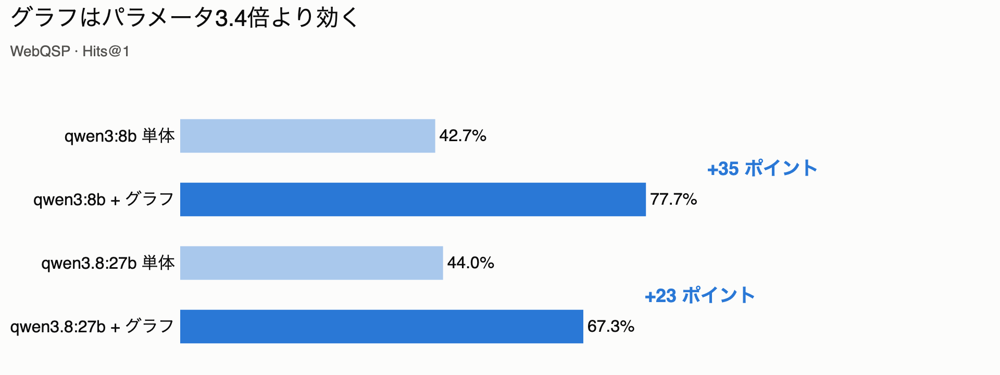
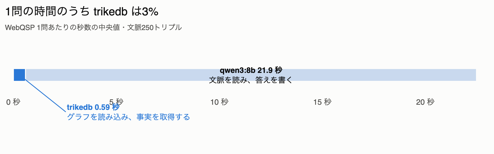
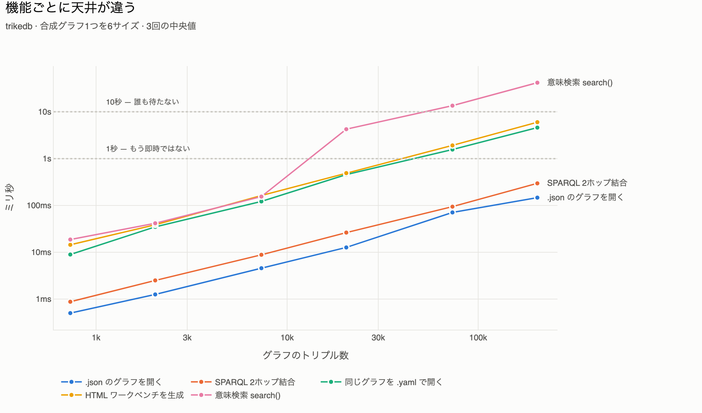

<p align="center">
  <a href="https://github.com/RyutoYoda/trikedb/blob/main/benchmarks/README.md">English</a>
  &nbsp;·&nbsp; <b>日本語</b>
  &nbsp;·&nbsp; <a href="https://github.com/RyutoYoda/trikedb/blob/main/benchmarks/README_zh.md">简体中文</a>
</p>

# ベンチマーク

[WebQSP](https://aclanthology.org/P16-2033/) の300問で測りました。

| | |
|---|---|
| **検索** | trikedb は **89.3%** の質問で、正解をモデルの目の前に置きました |
| **速度** | 1問22.5秒のうち **0.59秒** — サーバもインデックスもなく、ファイル1つ |
| **規模** | **10万トリプル**まで速い。最初に苦しくなるのは意味検索で3万から |
| **端から端まで** | ノートPCの8Bを載せると **77.7%** が正解（グラフなしでは **42.7%**） |

## 精度



| 条件 | Hits@1 | F1 | n |
|---|---|---|---|
| `qwen3:8b` 単体 | 42.7% | 27.9% | 300 |
| `qwen3:8b` + グラフ | **77.7%** | **57.4%** | 300 |
| `qwen3.8:27b` 単体 | 44.0% | 30.6% | 150 |
| `qwen3.8:27b` + グラフ | 67.3% | 57.1% | 150 |

同じモデル、同じプロンプト、同じ質問。変えたのは取得したトリプルを文脈に入れるか
どうかだけです。8Bではグラフが **+35ポイント**（対応のあるMcNemar検定 p = 9e-20）。
一方で**パラメータを3.4倍にしても、グラフがなければ何も変わりません**
（44.0% 対 42.7%、p = 1.0）。

27Bはグラフありで低く出ていますが、これは能力の差ではありません。150問のうち
30問で「I don't know」と答えており（8Bは4問）、そのうち19問は正解が文脈の中に
ありました。両方が答えた120問だけで比べると差は消えます（88.3% 対 84.2%、
p = 0.27）。リーダーを差し替えるなら、「分からなければそう言え」という指示も
調整し直す必要があります。

**検索は89.3%の質問で正解を文脈に入れられています。** 端から端まで77.7%という
ことは、渡した分のうち85.8%をモデルが正解に変えたということです。残る差はリーダー
側で、グラフ側ではありません。

## 速度



検索が0.59秒です。4,640トリプルのサブグラフ全体をグラフとして構築し（実質即時）、
その上で `search()` と `find()` を走らせる時間です。サーバも、構築するインデックス
も、第二のストアもありません。残りはすべてモデルが4,377トークンの文脈を読む時間で、
27Bのリーダーだと1問22.5秒ではなく70.4秒かかるのも同じ理由です。

| 検索 | 正解が文脈に入った率 | プロンプト |
|---|---|---|
| 1-hop + CVT、250トリプル | 70.7% | 約4,377トークン |
| **hybrid、250トリプル** | **89.3%** | 約4,377トークン |
| 意味検索のみ、250トリプル | 88.7% | 約4,377トークン |
| hybrid、100トリプル | 81.3% | 約1,823トークン |

同じ予算で選び方を変えるだけで、使える文脈が18.6ポイント増えます。なお、エンティティ
を軸にすることは、素のランキングに比べてほとんど価値がありません — 250トリプルで
0.6ポイント、100トリプルではむしろ少し損です。

## 規模



| トリプル | `.json`を開く | `.yaml`を開く | `.yaml`を保存 | SPARQL 2ホップ | `to_html` | `search()` |
|---|---|---|---|---|---|---|
| 733 | 1 ms | 9 ms | 8 ms | 1 ms | 14 ms | 19 ms |
| 7,333 | 5 ms | 122 ms | 101 ms | 9 ms | 163 ms | 155 ms |
| 20,400 | 13 ms | 456 ms | 305 ms | 26 ms | 491 ms | 4.3 s |
| 73,333 | 71 ms | 1.6 s | 1.0 s | 94 ms | 1.9 s | 13.5 s |
| 204,000 | 147 ms | 4.6 s | 3.2 s | 297 ms | 6.0 s | 41.9 s |

機能は一緒に劣化しないので、「ここまで」という単一の上限はありません。

- **1,000まで** — すべて即時で、グラフ全体がプルリクエストに収まります。この
  ツールが想定しているサイズです。
- **1万まで** — 意味検索を含めてどこも快適です。グラフ全体をレビューするのは
  現実的でなくなりますが、diffのレビューは変わりません。
- **10万まで** — SPARQLは速いままです。意味検索（13秒）、HTMLワークベンチ
  （17MB）、YAMLでの保存が快適でなくなります。ファイル名を `.json` にすれば、
  開くのと保存するのは1桁安く済みます。
- **50万を超えると** — 動きますが設計の外です。GitHubがdiffを描かなくなります。

**劣化しないもの**は2つあります。1件の変更はどのサイズでもdiff 1行であること。
そして保存先はクエリ時間に影響しないこと — `snowflake://` の行でも `s3://` の
オブジェクトでもローカルファイルでも同じ時間で答えます。グラフはメモリから
答えるからです。

## 再現方法

```bash
uv run --extra all --with polars --with model2vec \
    python benchmarks/webqsp_bench.py prepare --n 300 --seed 42 \
    --retrieval "hybrid (entity + semantic)" --cap 250 --out bench_out/hybrid

for cond in nograph graph; do
  uv run --extra all --with polars python benchmarks/webqsp_bench.py run \
      bench_out/hybrid/eval_set.json --model qwen3:8b --condition $cond \
      --style grounded --out bench_out/ans_$cond.jsonl --workers 8
done

uv run --extra all python benchmarks/webqsp_bench.py score \
    bench_out/hybrid/eval_set.json bench_out/ans_*.jsonl
uv run --extra all python benchmarks/webqsp_bench.py compare \
    bench_out/hybrid/eval_set.json bench_out/ans_nograph.jsonl bench_out/ans_graph.jsonl
```

リーダーをローカルにして名前を書いているのは意図的です。スコアはモデルに依存する
ので、APIキーなしで誰でも再実行できないと意味がありません。`score` はWilsonの
信頼区間も出します。`compare` は対応のある検定を行います — 2つの実行が同じ質問に
同じモデルで答えているので、ここでは対応のある検定が正しい選択です。

規模の数字は `ceiling_bench.py`（3回の中央値、パイプライン型の合成グラフ1つ、
Apple silicon）、バックエンドの数字は `backend_bench.py`、検索手法の比較は
`retrieval_bench.py` から出しています。`webqsp_bench.py` は検索手法をそこから
importしていて、実装のコピーは持っていません。

## この結果が言っていないこと

- **他ツールとの比較ではありません。** ベクトルストアも他のトリプルストアも素の
  テキストRAGも走らせていません。測ったのは「グラフが効く」であって、
  「trikedbが他より効く」ではありません。
- **キュレーションの前提は検証していません。** ここで使ったグラフはデータセット
  付属のFreebaseサブグラフです。つまり検証されたのは検索・保存レイヤーとしての
  trikedbで、「人が厳選したグラフの方が良い」という主張ではありません。
- **1ファイルという話も検証していません。** 質問ごとにメモリ上の使い捨てグラフを
  使っているので、gitでのレビューやdiff、永続化されたファイルはここには出て
  きません。
- **絶対値は公開されているSOTA（Hits@1で80台半ば〜後半）より下です。** あちらは
  GPT-4級か、タスクにファインチューニングしたリーダーを使っています。
  [RoG](https://arxiv.org/abs/2310.01061)（ICLR 2024）はファインチューニングした
  LLaMA-2-7BでF1 70.8を報告していて、その指標の実装が `score` が再現しているもの
  です。他のリーダーボードの数字は意図的に表にしていません。取り違えやすく、
  検証していない数字の表を自分の数字の隣に置くのは、表がないより悪いからです。
- **正解ラベルにノイズがあります。** 抽出した質問の約10%で正解が疑わしく、これが
  素のWebQSPラベルに対する誠実な絶対スコアの上限を作っています。

## 訂正した誤り

上の数字を出す過程で見つけて直した誤りです。同じ間違いは繰り返しやすいので
残しておきます。

- **対応のあるデータに独立2標本の信頼区間を当てていた。** 2つの実行は同じ質問に
  同じモデルで答えているので、独立した区間を比べると対応を捨てることになり、実在
  する9ポイントの差を「分離できていない」と判定してしまっていました。
- **条件付きの率を数えずに、2つの率を割っていた。** 「77.7 / 89.3 = 87%が変換
  された」は変換率ではありません。正しく数えると268中230で85.8%です。
- **違う質問集合を比べていた。** 「エンティティ軸は予算が大きいときだけ元が取れる」
  は、300問でのhybridを全1,628問で測った意味検索と比べたものでした。同じ集合で
  測ると軸の価値は0.6ポイントです。
- **測らずに決めつけたのが2回。** 回答数の上限は明らかに正しく見えて、実際は稼ぐ
  より多く失っていました（上限5でHits@1が1.7ポイント低下）。小さい文脈もほぼ無料
  だろうと予想しましたが、それは「文脈を*増やしても*効かなかった」からで、収穫は
  250トリプルでもまだ登っていました。
- **誰も見直していなかった検索。** 精度のパイプラインは測定した中で最も弱い検索を
  使い続けていて、しかも `prepare` に未定義の定数があったため、eval setを作り直して
  気づくこともできませんでした。

**置き換えられた初期のパイロット**: 30問を `claude-haiku-4-5` で測って 60% → 83%
でした。そこでの発見2つは今も成立していて、上の検索を「大きくする」のではなく
「作り直した」理由になっています — 文脈の上限を外すとすべての正解が到達可能に
なったが精度は動かなかったこと、そしてOWLの推移性を実体化すると19,070件の正しい
事実が増えたのに到達可能な正解は1つも増えなかったことです。
