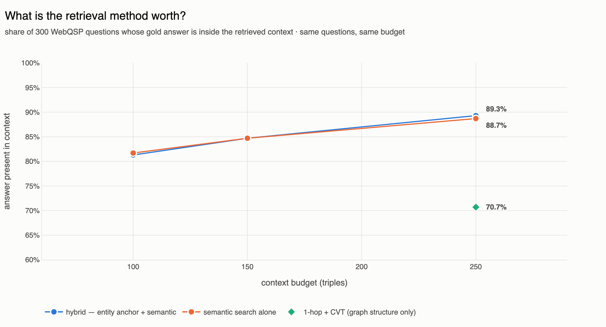
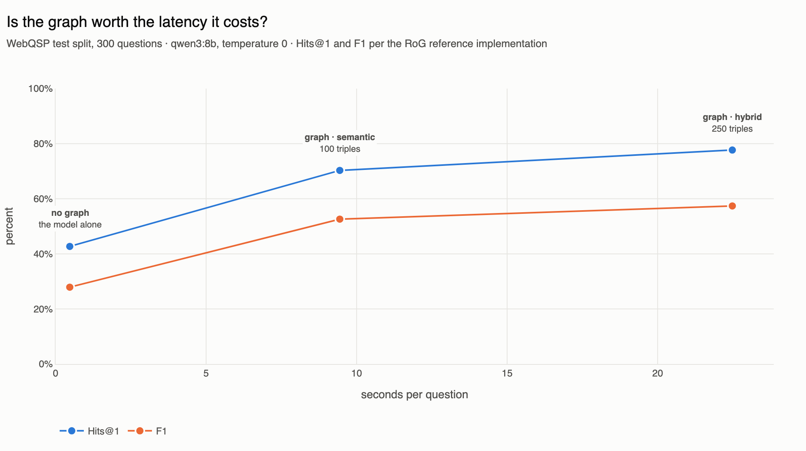

<p align="center">
  <a href="https://github.com/RyutoYoda/trikedb/blob/main/benchmarks/README.md">English</a>
  &nbsp;·&nbsp; <b>日本語</b>
  &nbsp;·&nbsp; <a href="https://github.com/RyutoYoda/trikedb/blob/main/benchmarks/README_zh.md">简体中文</a>
</p>

# ベンチマーク

重要な順に、2つの問い:

1. **[グラフはLLMの精度を上げるか？](#kgqa-グラフはハルシネーションを減らすか)**
   — WebQSP 300問で Hits@1 42.7% → 77.7%、どちらも同じモデル。採点方法によって
   見出しの数字は動くので、プロトコル自身の感度も併記する。
2. **[天井はどこか？](#天井はどこか)** — どの操作が最初に使えなくなるか、そして
   それはどのグラフサイズか。「何トリプル入るか」とは別の問いで、そちらには
   何も到達しない。

## KGQA: グラフはハルシネーションを減らすか

**問い:** LLM が trikedb のグラフを文脈として事実質問に答えるとき、同じ LLM が
単独で答えるのに比べてどれだけ正確になるか。

**設定:** [WebQSP](https://aclanthology.org/P16-2033/) のテスト分割 全1,628問から
300問を抽出（seed 42）。[RoG-WebQSP](https://huggingface.co/datasets/rmanluo/RoG-webqsp)
のリパック経由 — 質問ごとに正解と Freebase のサブグラフが付き、実行時にダウンロード
され、データセットの内容はこのリポジトリに保存しない。各サブグラフはメモリ上の
TrikeDB に読み込まれ（中央値 5,088 トリプル）、質問ごとの文脈は trikedb 自身の
`search()` と `find()` で取得する: 質問エンティティの近傍を軸に、意味でランク付け
された事実を合わせて、250トリプルで打ち切り。リーダーモデルは Ollama 経由の
`qwen3:8b`、temperature 0。Hits@1 と F1 は RoG の参照実装と同じ計算。

**結果**（n=300、両条件とも全問に回答）:

| 条件 | Hits@1 | F1 |
|---|---|---|
| モデル単体 | 42.7% | 27.9% |
| **モデル + trikedb のグラフ** | **77.7%** | **57.4%** |
| 差 | **+35.0pt** | **+29.6pt** |


同じモデル、同じプロンプト、同じ質問。変わるのは取得したトリプルが文脈に
あるかどうかだけ。

その隣に置く価値のある数字が2つ:

|  | 正解を言えた | 言えなかった | 計 |
|---|---|---|---|
| 検索が正解に届いた | 230 | 38 | 268 |
| 届かなかった | 3 | 29 | 32 |
| 計 | **233** | 67 | 300 |

見出しを横に読むより、この表を縦に読んでほしい:

- **残る差はどこにあるか。** 38問は正解が文脈に座っていたのにモデルが出せな
  かった。これはリーダーの問題でグラフの問題ではない — そして 12.7ポイント分
  なので、同じ検索で完璧なリーダーなら 89.3% になる。
- **検索の到達率は精度とは別の量。** 質問の 89.3% は正解が文脈にあり、77.7% が
  正解を出せた。到達したものに対して、モデルは **85.8%**（268中230）を変換した。
  2つの率を割る（77.7 / 89.3 = 87%）のはその数字ではなく、何の意味もない —
  条件付きの率は数えなければならない。
- **ここではモデルは自力でほとんど貢献していない。** 届かなかった32問のうち、
  モデルが既に知っていて正解できたのは3問だけ。検索が弱いときはもっと多かった:
  1-hop + CVT の実行では、検索が外した質問から24問の正解が出ていた。検索を
  良くすることは正解を足すだけでなく、モデルが記憶で担っていた分を引き取ること
  でもある。

**300問で足りるのか？** 公開されている数値は1,628問全部で計算されているので、
確認すべきは区間と標本の2つ。

| | Hits@1 | Wilson 95% 信頼区間 |
|---|---|---|
| モデル単体 | 42.7% | 37.2 – 48.3 |
| モデル + グラフ | 77.7% | 72.6 – 82.0 |

区間は重ならない — 48.3 は 72.6 より下 — なので35ポイントの差は300問の標本が
偶然で出せるものではない。個々の数字は ±5ポイント程度を抱えており、それが
絶対値ではなく差を読むべき理由。

標本（seed 42）は、簡単になりうるすべての軸で全分割と一致している: 正解件数の
中央値 2 対 2、サブグラフの中央値 4,588トリプル 対 4,415、質問語数の中央値
7語 対 7。1つの軸では*より難しい* — 正解件数の平均 13.0 対 10.2、正解が多い
質問の裾が重い — これは F1 に不利であって有利ではない。

**再現:**

```bash
uv run --extra all --with polars --with model2vec \
    python benchmarks/webqsp_bench.py prepare --n 300 --seed 42 \
    --retrieval "hybrid (entity + semantic)" --cap 250 --out bench_out/hybrid

for cond in nograph graph; do
  uv run --extra all --with polars python benchmarks/webqsp_bench.py run \
      bench_out/hybrid/eval_set.json --model qwen3:8b --condition $cond \
      --style grounded --out bench_out/ans_$cond.jsonl --workers 8
done

uv run --extra all python benchmarks/webqsp_bench.py score \
    bench_out/hybrid/eval_set.json bench_out/ans_*.jsonl \
    --json benchmarks/accuracy_data.json
```

モデルをローカルにして名前を書いているのは意図的である: スコアはモデルに依存
するので、数字を読む人が再実行できなければならない。有料エンドポイントの裏の
API キーは、名前も付けられず安定もしない。

**留保。** 包含一致は寛容だが、両条件に等しく寛容である。WebQSP の正解ラベルには
ノイズがあり（後述）、これが誠実な絶対スコアの上限を作る。リーダーは8Bの
オープンモデルの零ショット回答である — 比較する前に
[公開されている数値の位置](#公開されている数値の位置)を読んでほしい。同じ設定を
30問・`claude-haiku-4-5` で行った以前のパイロットは素の包含プロトコルで
60% → 83% を記録したが、10倍の質問数と誰でも実行できるモデルを使う上の表に
置き換えられている。

## 検索手法にはどれだけの価値があるか

検索層より上はすべて固定した — 同じ300問、同じモデル、同じプロンプト、
**同じ250トリプルの予算** — なので変数は*どの*250トリプルを選ぶかだけ:

| 検索 | 正解が文脈にあった割合 |
|---|---|
| 1-hop + CVT（このベンチマークがこれまで使っていたもの） | 212/300 · 70.7% |
| **hybrid — エンティティを軸に `search()` でランク付け** | **268/300 · 89.3%** |

文脈の量は同じで、そのうち有用な分が18.6ポイント多い。この数字は300問全部を
数えたもので、推定ではない。

それが買う精度を、両方の実行が答えた質問で検定すると:

| 検索 | Hits@1 | n |
|---|---|---|
| 1-hop + CVT | 68.6% | 245 |
| hybrid | 77.7% | 300 |

対応を取ると、hybrid は相手が外した36問で正解し、相手が正解した19問で外して
いる — 厳密 McNemar 検定で **p = 0.03**。実在するが、グラフ対グラフなしの結果
（125対20、p = 9e-20）からは遠く、2つの主張のうち弱い方として扱うべきもの。

その検定の当て方について一言。ここでは自明に見える方法が間違っている。これらの
実行は*同じ*質問に*同じ*モデルで答えているので、対応があることが本質である。
2つの Wilson 区間（62.5–74.1 対 72.6–82.0）を比べると、区間が触れているという
理由だけで差が未解決に見えてしまう。`compare` は代わりに対応のある検定を行う —
情報を持つのは2つの実行が食い違った質問だけで、問うべきはその内訳がどれだけ
偏っているかである。

検索は trikedb 自身の `search()` と `find()` であり、比較のハーネスは
`retrieval_bench.py` である — `webqsp_bench.py` は2つ目のコピーを持つのではなく
そこから手法を import している。検索の数字は、精度の数字を説明するためのもの
だからである。

**多く流し込むことがてこではなく、良く選ぶことがてこである。** 文脈の上限を
外すと（後述）すべての正解が到達可能になったが、精度は動かなかった。

**そのほとんどはランキングから来ており、エンティティの軸から来ていない。**
3つの予算で作り直すと、hybrid と純粋な意味検索は重なる:



| 検索 | 100トリプル | 150 | 250 |
|---|---|---|---|
| hybrid — エンティティ軸 + 意味 | 81.3% | 84.7% | **89.3%** |
| 意味検索のみ | **81.7%** | 84.7% | 88.7% |
| 1-hop + CVT（構造のみ） | — | — | 70.7% |

軸の価値は250で0.6ポイント、150ではゼロ、100では軽い*損失*である。小さい予算の
半分を質問自身のエンティティの保証に使うことは、その半分をランキングに使わない
ことであり、正解を見つけるのはランキングの側である。

この訂正は明記する価値がある。この節の最初の版は、軸が「予算が大きいときだけ元が
取れる」と主張していた。それはこの300問での hybrid を、全1,628問で測った意味検索の
数字と比べていた — 2つの異なる質問集合である。同じ集合で測ると、軸はほとんど
現れない。2つの数字が比較可能なのは、検証対象以外のすべてが固定されているときだけ
であり、ああいう一文はまさにその規律が緩む場所である。

## 小さい文脈で足りるか

250トリプルの文脈が実行時間のほとんどなので、自然な問いは「安いもので足りるか」
である。純粋な意味ランキングで100トリプルに作り直すと — 到達率 81.7% 対 89.3%、
プロンプトは半分未満:

| 条件 | Hits@1 | F1 | n |
|---|---|---|---|
| グラフなし | 42.7% | 27.9% | 300 |
| グラフ · 意味検索、100トリプル | 70.3% | 52.6% | 300 |
| グラフ · hybrid、250トリプル | **77.7%** | **57.4%** | 300 |

足りない — そしてこれは測った答えであって仮定ではない。対応を取ると、250トリプル
の設定は100トリプルの設定が外した34問で正解し、相手が正解した12問で外している。
厳密 McNemar 検定で **p = 0.002**。追加の文脈はそのレイテンシの元を取っている。

書いておく価値があるのは、この曲線の形を測る前に読み違えていたからである:
パイロットで上限を外しても効かなかったことから、250より下のどこかで収穫が
逓減し、小さい文脈はほぼ無料だろうと予想していた。収穫は250でもまだ登っている。
「文脈を増やしても効かない」と「減らしても平気」は別の主張であり、テストされて
いたのは前者だけだった。

## 文脈のコスト

自分で回す前に知っておく価値があること: 実時間はほぼ全部が**プロンプトの
プリフィル**で、生成ではない。回答は短く — 中央値2行 — なので、実行時間は
1問あたり何トークンの文脈をモデルが読まなければならないかで決まる。

| 条件 | プロンプト | 300問 |
|---|---|---|
| グラフなし | 約120トークン | **7分**（実測） |
| グラフ、250トリプル | 約5,400トークン | 約60分（実測） |

この比率は、上の検索の表が二重に重要である理由である: 同じ到達率をより少ない
トリプルで達成する手法は、同時に数倍速い。並列化は解ではない — GPU はすでに
プリフィルで飽和しており、`OLLAMA_NUM_PARALLEL` を8にして `--workers 8` にしても、
トークン数の効果よりはるかに小さかった。`--workers` を残しているのは、グラフ
なし条件では無料で効き、プリフィルが壁ではないマシンでも効くからである。

## グラフはそのレイテンシに見合うか

グラフはプロンプトのトークンを費い、プロンプトのトークンが実行時間である。
何もしていないマシンで、1リクエストずつ単独で測った — 1問だけ聞く人が実際に
待つレイテンシ:



| 条件 | 秒数の中央値 | プロンプト | Hits@1 |
|---|---|---|---|
| グラフなし | 0.47 | 約56トークン | 42.7% |
| グラフ · 意味検索、100トリプル | 9.44 | 約1,823トークン | 70.3% |
| グラフ · hybrid、250トリプル | 22.48 | 約4,377トークン | 77.7% |

最初の9秒が27.6ポイントを買う。次の13秒がさらに7.4ポイントを買い、対応のある
検定はそれが実在すると言う（p = 0.002）— つまり曲線は測定範囲の端でまだ登って
おり、ここでは「文脈を増やしても払う価値がなくなる点」は見つかっていない。

これらは意図的に単独リクエストの数字である。バッチ実行中に記録した回答ごとの
レイテンシはずっと高く — 100トリプル設定で中央値31.7秒 — 8リクエストが同時に
飛んでいて、それぞれが他の後ろで待っていたからである。その数字はスループットの
計画には正しく、「答えが見えるまでどれだけか」には誤りなので、両者は分けて
ある。

## このうちどこが trikedb か

分けて書く価値がある。パイプラインの2つの半分はここで別々に測られており、
限界も同じではないからである。

**trikedb の仕事は、正解をモデルの目の前に置くことである。** この300問では
**89.3%** でそれを達成し、その作業は1問あたり **0.59秒** だった — 4,640トリプルの
サブグラフ全体をグラフに構築し（実質即時）、その上で hybrid 検索を走らせて。
これは1問が端から端まで22.5秒かかるうちの2.6%であり、残りの21.9秒はモデルが
文脈を読む時間である。サーバなし、構築するインデックスなし、第二のストアなし:
1つの文書に対する `search()` と `find()` だけ。

**モデルの仕事はそれを答えに変えることであり**、届かないのはこちらの半分である。
渡されたものの85.8%を変換し、正解が目の前にあった38問を落とした — 全体の
12.7ポイント分。

| | 到達 / 変換 | 1問あたりの時間 |
|---|---|---|
| trikedb — 事実を見つける | 質問の 89.3% | 0.59 秒 |
| `qwen3:8b` — それを使う | そのうち 85.8% | 21.9 秒 |
| 端から端まで | **77.7%** | 22.5 秒 |

そこから2つのことが従い、どちらも率直に書く価値がある:

- **検索側はボトルネックではなく、しかも大きく改善した。** 検索手法を差し替える
  だけで、同一の文脈予算のまま到達率が70.7%から89.3%になった。使ったのは
  trikedb 自身のプリミティブだけである。89.3% は、このベンチマークで公開手法が
  端から端まで報告している帯の中に入る — 上限はスコアではないが、供給されている
  事実が数字を抑えている原因ではない、という意味にはなる。
- **端から端までの数字はリーダーに連動する。** 77.7% は、8Bのオープンモデルが
  零ショットでこの文脈に対して出す値である。公開されている上位勢は GPT-4 級か
  タスクにファインチューニングしたリーダーを走らせており、落とした38問はまさに
  より強いリーダーが得点する場所である。リーダーの差し替えはフラグ1つ
  （`--model`）で、2つの半分を分離可能に保っている狙いがそれである。

## 公開されている数値の位置

公開されている WebQSP の上位勢は Hits@1 が80台半ばから後半、F1 が70前後を
報告している。ここで引用する唯一の数字は、確認でき、かつこのハーネスがそれに
対して作られているものである:
[RoG](https://arxiv.org/abs/2310.01061)（ICLR 2024）は WebQSP で
**F1 70.8** を、ファインチューニングした LLaMA-2-7B のリーダーで報告しており、
その指標の実装が `score` が再現しているものである。

そのリーダーボードの他の数値は意図的に表にしていない。取り違えやすく — 同じ
手法が、分割・検索器・リーダーがファインチューニング済みかどうかによって論文
ごとに違う数字で現れる — 検証していない数値の表を自分の数字の隣に置くのは、
表がないより悪い。

それらを上の数字と並べて読むときに効いてくること:

- **リーダーモデル。** 上位勢は GPT-4 級か、タスクにファインチューニングした
  モデルを走らせている。このベンチマークはノートPC上で8Bのオープンモデルを
  零ショットで走らせ、その名前を書いているので、API キーなしで数字を再現できる。
- **プロトコル。** そこは*比較できる*: Hits@1 と F1 を RoG の参照実装と同じに
  計算する — 正規化し、冠詞と句読点を落とし、部分文字列一致を取り、各正解を
  一度だけ数える。そこから外れると、比較できるように見えて実はできない数字が
  できる。だから `_normalize` と `f1` のソースにその注意書きが付いている。

## 採点の感度（なぜ包含プロトコルを報告するのか）

*この節と次の節の数値はすべて、上の300問の表ではなく、以前の30問・
`claude-haiku-4-5` のパイロットから来ている。プロトコルについて言っていること
は今も成立し、またそこでの発見が上の検索の作業に繋がったので、残している。*

透明性のために、3つの採点の変種:

| プロトコル | LLM 単体 | LLM + グラフ | 差 |
|---|---|---|---|
| 包含一致（主） | 60% | **83%** | **+23pt** |
| 包含、検索 v2（関連度で並べ替えた文脈） | — | 77% | — |
| 包含、検索 v3（より深い CVT 展開） | — | 80% | — |
| LLM 審判、正解を基準に、両条件へ適用 | 73% | 77% | +4pt |

自分でこのベンチマークを調整する前に知っておく価値のある発見:

- **文脈を関連度で並べ替えると悪化した。** 質問語の重なりでトリプルを並べ替える
  と、いくつかの質問で実際の正解トリプルが文脈の上限の外に押し出された（例:
  GDP 測定の `currency` トリプルが、その国の実際の通貨より上に来た）。素の
  ホップ順の検索の方が良かった。
- **正解ラベルにはノイズがある。** 抽出した質問の約10%で正解が疑わしい（例:
  「第二次世界大戦中のソ連の指導者」→ 正解が*ブレジネフ/フルシチョフ*、
  「ガリレオは何をして有名になったか」→ 正解が職業のリスト）。これが素の WebQSP
  ラベルに対する誠実な絶対スコアの上限を作る — 公開されている SOTA が約86%
  付近にいるのも同じ理由である。
- **LLM 審判による採点は不安定である。** 粒度の違いを受け入れる審判はグラフ
  なし条件の曖昧な回答を救って差を圧縮し、厳しい審判は差を戻す。したがって
  決定的な包含プロトコルを主として報告する — コミット済みのスクリプトから、
  判断の入る余地なく再現できる。

頑健な主張は**差**である: 両条件に等しく適用される任意の固定プロトコルの下で、
グラフ条件が勝つ。素の WebQSP ラベルに対する90%超の絶対スコアは誠実には到達
できない（ラベルのノイズ）。自己完結した KB に対する1ホップのベンチマーク
（例: MetaQA 1-hop、現在 HF でゲートされている）が、高い絶対値を狙うべき対象で
ある。

## 検索の深さの実験（文脈を増やすと効くか）

同じ30問のパイロットに対する追加実験。これが上の検索の作業に化けた節である:
*より多い*文脈がてこではないことを確立しており、だから直し方は上限を上げるの
ではなく、より良く選んだ250トリプルにすることだった。

| 検索 | 正解到達の上限 | 精度 |
|---|---|---|
| 1-hop + CVT、上限250（v1） | 20/30 | **83%** |
| より深い CVT 展開、上限400（v3） | 23/30 | 80% |
| 同じもの、**上限なし**（中央値 912トリプル/問） | **30/30** | 80% |
| + OWL-RL の推移性の実体化（19,070件の導出事実） | 23/30 | 再実行せず |

内在化する価値のある発見が2つ:

- **到達可能性は精度ではない。** 文脈の上限を外すとすべての正解が到達可能に
  なった（30/30）が、精度は上がらなかった: 1問あたり約900トリプルになると、
  モデルはその洪水から「もっともらしいが違う」項目を拾い始める（映画ではなく
  テレビ番組、有名な曲ではなく無名の1曲）。ボトルネックが検索から注意へ移動
  した。直し方はより大きく流し込むことではなく*逐次的な*検索である — エージェント
  に MCP 越しでターンごとにグラフを問い合わせさせること。
- **推論は直交している。** 場所の述語に対して推移閉包を実体化すると19,070件の
  正しい事実が増えたが、到達可能になった正解は1つも増えなかった: WebQSP の
  マルチホップの質問は*異なる*述語をメディエータノード越しに連鎖させており、
  それを短縮する OWL 公理はない。OWL が元を取るのは同一述語の連鎖（ロールの
  継承、包含の階層）であって、このベンチマークではない。

どの深さでも残る失敗は、正解ラベルのノイズ（4/30）と回答の粒度の不一致が
支配的である — 公開されている SOTA が80台半ばで平らになるのと整合している。

## 天井はどこか

**問い:** グラフは、git に置き、プルリクエストでレビューし、待たずに問い合わ
せられるグラフでありながら、どこまで大きくなれるか。

文書が*入る*サイズは、最も面白くない答えだと分かる。下の測定から、1トリプル
あたり約58バイト・RAM 約3KBで外挿すると:

| 限界 | トリプル数 | 束縛的か |
|---|---|---|
| RAM 8GB | 約2,500,000 | いいえ — その前に他のすべてに当たる |
| GitHub の100MBファイルブロック | 約1,700,000 | いいえ |
| GitHub の50MBファイル警告 | **約870,000** | 硬い停止点。そして何もここに到達しない |

キュレーションされたものが870,000に近づくことはない。これが実際に使われている
グラフ — 運用の地図、ドメインのオントロジー、チャットボットの知識ベース — は
そこから2〜3桁下で動く。だから「何トリプル入るか」は答える価値のある問いでは
ない。

**実際に当たるのは、機能が1つずつ遅くなることであり、それらは一緒に劣化しない。**


意味検索は10kトリプルで集団から離れ、30kで使えなくなる。一方、同じグラフに
対する SPARQL は200kでもまだ4分の1秒で答えている。読み書きはその中間にあり、
*どの形式を選んだか*がそれらを1桁動かす。

| トリプル | YAML | `.json` を開く | `.yaml` を開く | `.yaml` を保存 | SPARQL 2ホップ | `to_html` | HTML | `search()` |
|---|---|---|---|---|---|---|---|---|
| 733 | 0.0 MB | 1 ms | 9 ms | 8 ms | 1 ms | 14 ms | 0.2 MB | 19 ms |
| 2,040 | 0.1 MB | 1 ms | 35 ms | 26 ms | 2 ms | 39 ms | 0.5 MB | 42 ms |
| 7,333 | 0.4 MB | 5 ms | 122 ms | 101 ms | 9 ms | 163 ms | 1.7 MB | 155 ms |
| 20,400 | 1.1 MB | 13 ms | 456 ms | 305 ms | 26 ms | 491 ms | 4.8 MB | 4.3 s |
| 73,333 | 3.9 MB | 71 ms | 1.6 s | 1.0 s | 94 ms | 1.9 s | 16.9 MB | 13.5 s |
| 204,000 | 11.2 MB | 147 ms | 4.6 s | 3.2 s | 297 ms | 6.0 s | 48.9 MB | 41.9 s |

これを作ったのは `ceiling_bench.py` で、`ceiling_chart.py` がその JSON から
プロットを描く。Apple silicon のノートPCで3回の中央値、パイプライン型の合成
グラフ1つ（ベンダー → ジョブ → テーブル、エッジの3分の1が note/prov 属性を
持つ）。絶対値はあなたのハードウェアでは違う。各曲線の*形*が要点である。

### 読み方

**約1,000トリプルまで。** すべてが即時で、グラフ全体をプルリクエストでレビュー
できる。このツールがそのために形作られているサイズ。

**約10,000まで。** 意味検索を含めてどこも快適（155 ms）。グラフ全体をレビュー
することが現実的でなくなるのはこの辺り — 10kトリプルは10k行 — なのでレビューは
diff に移る。1件の変更は*どのサイズでも* diff 1行なので、そちらは無期限に
機能し続ける。

**約100,000まで。** SPARQL とパターンクエリは速いままである（2ホップ結合で
93 ms）。快適でなくなるものが3つ: 意味検索（13秒）、HTML ワークベンチ（生成に
1.9秒、ブラウザで開くのに17MB）、そして YAML としての保存（1.1秒 — 既定の
`autosave=True` では*すべての* `add()` のコストになる。`autosave=False` で開いて
まとめること）。ファイル名を `.json` にすれば、開くのと保存するのは1桁安い
ままである。

**約500,000を超えると。** 動くが、設計の対象外である。保存に数秒かかり、git が
20MB のテキストファイルを運び、GitHub は diff の描画をやめる。

### 劣化*しない*もの

- **1件の変更の diff。** 700トリプルでも700,000トリプルでも1行 — トリプルは
  1行に1つで直列化され、保存が決定的だからである。
- **バックエンドごとのクエリ。** `snowflake://` の行、`s3://` のオブジェクト、
  ローカルファイルは、同じクエリに同じ時間で答える。グラフはメモリから答える
  ので、バックエンドが決めるのは開くコストと保存コストだけである。
  `backend_bench.py` を参照。
- **グラフの構築。** `add()` は 0.27.0 まで O(n²) だった — upsert の確認のための
  線形走査により、100kトリプルの構築に289秒かかり、1回の `add` のコストが
  60µs から 2.9ms まで増えていた。今はインデックス化されているので、大きな
  グラフの取り込みは線形である。読み込みは影響を受けていなかった。
