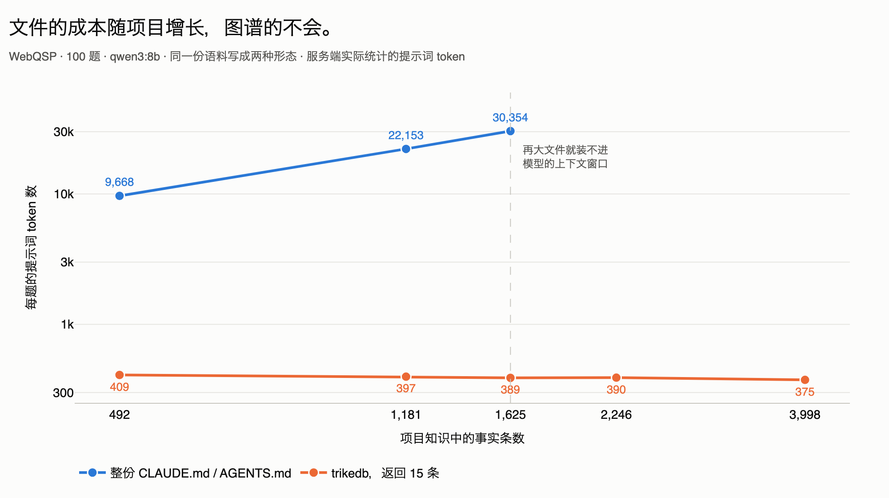
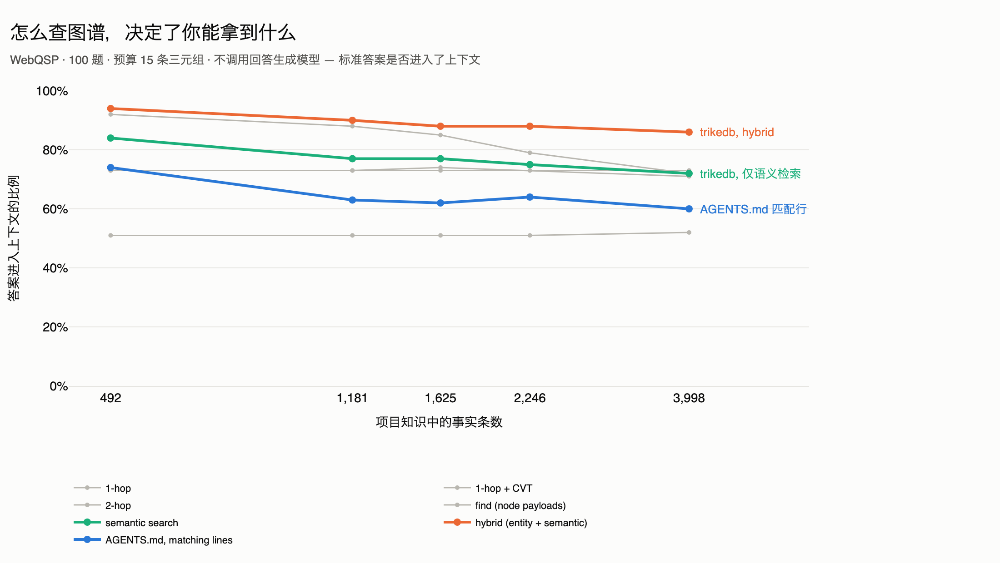
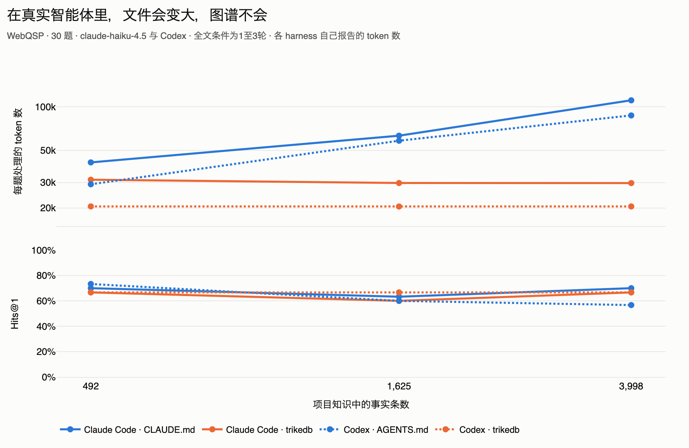

<p align="center">
  <a href="https://github.com/RyutoYoda/trikedb/blob/main/benchmarks/README.md">English</a>
  &nbsp;·&nbsp; <a href="https://github.com/RyutoYoda/trikedb/blob/main/benchmarks/README_jp.md">日本語</a>
  &nbsp;·&nbsp; <b>简体中文</b>
</p>

# 基准测试

历史测量：8B使用300题，27B使用150题。2026-09-09重新评分F1，未重跑速度。图谱条件也包含grounding指令。

| | |
|---|---|
| **检索** | trikedb 在 **89.3%** 的题目上把标准答案摆到了模型面前 |
| **速度** | 一题 22.5 秒里的 **0.59 秒** — 没有服务器，没有索引，只有一个文件 |
| **规模** | 到 **10 万条三元组**仍然很快；最先撑不住的是语义检索，3 万条 |
| **端到端** | 接上一个笔记本级 8B 阅读模型后答对 **77.7%**（没有图谱时是 **42.7%**） |
| **与文件的对比** | 在准确率高于 `CLAUDE.md` / `AGENTS.md` 的同时，**token 减少 88.4%**；文件越大差距越明显 |

## 准确率


| 条件 | Hits@1 | F1 | n |
|---|---|---|---|
| `qwen3:8b` 单独 | 42.7% | 27.7% | 300 |
| `qwen3:8b` + 图谱 | **77.7%** | **59.2%** | 300 |
| `qwen3.8:27b` 单独 | 44.0% | 30.2% | 150 |
| `qwen3.8:27b` + 图谱 | 67.3% | 56.7% | 150 |

每个模型内部使用匹配的问题：8B每组300题，27B每组150题。保存的图谱运行名为 `grounded`，除了检索三元组，还增加了复制答案名称的指令。因此8B的+35个百分点是**检索与grounding指令的组合效果**。旧回答日志没有完整提示，无法只凭回答独立验证style。新运行记录完整提示、SHA-256、model、condition和style。

同一批300题中，268题的上下文包含标准答案字符串（89.3%），233题回答正确（77.7%）。

| | 回答正确 | 回答错误 |
|---|---:|---:|
| 上下文包含答案字符串 | 230 | 38 |
| 上下文不包含答案字符串 | 3 | 29 |

38题漏答占12.7个百分点；扣除3题上下文外答对，净差为35/300，四舍五入前为11.7个百分点。字符串存在不等于证据充分，也不是准确率的严格上限。

## 与知识文件的对比

项目知识总得以某种方式送到模型面前。常见做法是 `CLAUDE.md` / `AGENTS.md` —— 整个
文件，每道题都放进上下文。另一种是让模型去图谱里检索。`memory_bench.py` 构建同一份
语料，然后把它渲染成两种形态：同样的事实、同样的题目、同样的阅读模型、各一次请求，
再让语料不断变大。

这两个文件名只是 harness 不同，机制是同一个，而且都在真正会读它的 harness 里
测过 —— Claude Code 用 `CLAUDE.md`，Codex 用 `AGENTS.md`（见下面的智能体一节）。
这里这张表是一次 HTTP 调用背后的原始模型，文件只是一段载荷，叫什么名字无关紧要。



| 项目中的事实条数 | 整份知识文件 | trikedb，返回 15 条 |
|---|---|---|
| 492 | 9,668 tok · 82.0% | 409 tok · 77.0% |
| 1,181 | 22,153 tok · 72.0% | 397 tok · **73.0%** |
| 1,625 | 30,354 tok · 71.0% | 389 tok · **72.0%** |
| 2,246 | 装不进窗口 | 390 tok · 71.0% |
| 3,998 | 装不进窗口 | 375 tok · 68.0% |

100 道题，`qwen3:8b`，temperature 0，每题一次请求，因此两组的轮数完全一致。完全
没有上下文时是 35.0%。

这两列要分开读，因为在 492 条时它们并不等价：图谱那边低 5 个百分点，也就是说
409 个 token 换来的是更差的答案，这个比值不是同等条件下的节省。trikedb 返回多少
条是一个旋钮（`--cap`），诚实的比较要把它调到**答案打平的位置**：

| 492 条，文件是 82.0% / 9,668 token | 准确率 | token | 节省 |
|---|---|---|---|
| trikedb 15 条 | 77.0% | 409 | 95.8%，但低 5 个百分点 |
| **trikedb 50 条** | **86.0%** | **1,117** | **88.4%，而且高 4 个百分点** |
| trikedb 150 条 | 88.0% | 3,125 | 67.7%，高 6 个百分点 |

所以 492 条时同等条件下的说法是 **「准确率更高，同时 token 减少 88.4%」**，而不是
第一张表原始 token 比所暗示的 95.8%。

在 1,625 条时返回 15 条就已经与文件打平（72.0% 对 71.0%），节省达到 98.7% —— 但
这是整个区间里最讨巧的一端，引用时必须带上条件。文件在 492 条时是 82.0%，到
1,625 条时只有 71.0%：它变大之后反而更差，门槛因此降低了。**在文件表现最好的
那个点上测出的 88.4%，才是该引用的数字。**

全文条件是主动发送全部Markdown的实验设置。492条时的82%是该提示、模型和样本的观测结果，不是文件的一般上限。Markdown也能建立索引、分节读取和语义检索。token减少88.4%、准确率86%对82%是100题的观察，不证明普遍的准确率优势。

全文输入随语料增长，有限检索最多返回指定条数。2,246和3,998条时，记录的字符/token数显示上下文截断迹象，因此并未完整读取语料。这也不说明Ollama在所有情况下的截断策略。

同一Markdown的关键词检索为68%→61%，15条hybrid检索为77%→68%。这是检索算法的比较；要分离图结构的因果作用，需要采用相同embedding和ranking的Markdown对照。

**怎么查，比查不查更要紧。** trikedb 有六种查法，彼此并不等价，所以在跑任何模型
之前先把它们全部量了一遍。不涉及 LLM，只看标准答案有没有进入 15 条三元组的上下文：



| 方法 | 492 facts | 3,998 facts |
|---|---|---|
| `hybrid`（实体 + 语义） | **94%** | **86%** |
| `find`（节点为单位） | 92% | 72% |
| `search`（仅语义） | 84% | 72% |
| `1-hop + CVT` | 73% | 73% |
| `2-hop` | 73% | 71% |
| `1-hop` | 51% | 52% |
| `AGENTS.md` 的匹配行 | 74% | 60% |

挑 `search` 然后把它称作「图谱的成绩」，相当于在同样预算下比 `hybrid` 少 10〜14
个百分点。上面所有数字用的都是 `hybrid`。

### 在真实的智能体里

把同样的语料送进 Claude Code 与 Codex，文件按各 harness 实际的方式从磁盘读入并
进入系统提示。这里报告的是各 harness 自己给出的 token 数，而不是金额 —— 成本取决
于 token 落在哪个缓存档位、以及会话是否还活着，而这两者本基准都没有控制。



| | 492 facts | 1,625 facts | 3,998 facts |
|---|---|---|---|
| Claude Code, `CLAUDE.md` | 41,318 · 70.0% | 63,172 · 63.3% | 110,839 · 70.0% |
| Claude Code, trikedb | 31,377 · 66.7% | 29,769 · 60.0% | **29,758 · 66.7%** |
| → token 减少 | 24.1% | 52.9% | **73.2%** |
| Codex, `AGENTS.md` | 29,173 · 73.3% | 58,308 · 60.0% | 87,153 · 56.7% |
| Codex, trikedb | 20,523 · 66.7% | 20,503 · 66.7% | **20,510 · 66.7%** |
| → token 减少 | 29.7% | 64.8% | **76.5%** |

30 道题，`claude-haiku-4.5` 与 Codex 的默认模型。除了 Codex 的文件组 —— 它在
1,625 条时用了两轮、3,998 条时用了三轮，因为它开始在这么大的文件里翻找，这也是
它 token 增加的一部分原因 —— 其余每一行都是一轮。每个数字的大部分是 harness 自身的
系统提示（Claude Code 在完全没有项目知识时也要 31,014 个 token），两组都躲不开。
Codex 的结果更干净：语料变大时，它的文件组既更贵、准确率又*更低*（73.3% →
56.7%），而图谱组稳定在 20,510 个 token、66.7%。

**让智能体自己去查图谱，结果更差。** 把 MCP 服务器交给它并要求使用，两个 harness
都跑了三到四轮，而每一轮都要重发前缀：Claude Code 85,098 个 token、26.7%，Codex
84,730 个 token、70.0%。**在启动智能体之前先查一次、把结果放进提示**，在两个
harness 上 token 都更省，准确率则在其中一个上更高。上表用的就是这个配置，也正是
上下文钩子在做的事。

## 速度


检索是 0.59 秒：把整个 4,640 条三元组的子图构建成一个图（几乎是瞬时的），并在它
之上跑 `search()` 和 `find()`。没有服务器，没有要构建的索引，没有第二份存储。其余
全部是模型在读那 4,377 个 token 的上下文 — 这也是为什么换成 27B 的阅读模型后，
一题要 70.4 秒而不是 22.5 秒。

| 检索 | 答案进入上下文的比例 | 提示 |
|---|---|---|
| 1-hop + CVT，250 条 | 70.7% | 约 4,377 token |
| **hybrid，250 条** | **89.3%** | 约 4,377 token |
| 仅语义检索，250 条 | 88.7% | 约 4,377 token |
| hybrid，100 条 | 81.3% | 约 1,823 token |

同样的预算，只换选法，可用的上下文就多了 18.6 个百分点。顺带说，相比单纯的排序，
实体锚点几乎没有价值 — 250 条时值 0.6 个百分点，100 条时反而略有损失。

## 规模


| 三元组 | 打开 `.json` | 打开 `.yaml` | 保存 `.yaml` | SPARQL 两跳 | `to_html` | `search()` |
|---|---|---|---|---|---|---|
| 733 | 1 ms | 9 ms | 8 ms | 1 ms | 14 ms | 19 ms |
| 7,333 | 5 ms | 122 ms | 101 ms | 9 ms | 163 ms | 155 ms |
| 20,400 | 13 ms | 456 ms | 305 ms | 26 ms | 491 ms | 4.3 s |
| 73,333 | 71 ms | 1.6 s | 1.0 s | 94 ms | 1.9 s | 13.5 s |
| 204,000 | 147 ms | 4.6 s | 3.2 s | 297 ms | 6.0 s | 41.9 s |

各项功能不是同步退化的，所以不存在一个统一的规模上限：

- **到约 1,000 条** — 一切都是瞬时的，整个图谱能装进一个 pull request。这就是这个
  工具为之成形的规模。
- **到约 1 万条** — 各处仍然舒适，语义检索也一样。审阅整个图谱不再现实，但审阅
  diff 不受影响。
- **到约 10 万条** — SPARQL 仍然很快。语义检索（13 秒）、HTML 工作台（17 MB）和
  以 YAML 保存不再令人愉快。把文件命名为 `.json`，打开和保存就便宜一个数量级。
- **超过约 50 万条** — 能跑，但已在设计范围之外。GitHub 不再渲染 diff。

**不会退化的**有两件：一条事实的改动在任何规模下都是一行 diff；后端从不影响查询
时间 — 一个 `snowflake://` 行、一个 `s3://` 对象和一个本地文件用同样的时间作答，
因为图是从内存里回答的。

## 复现

```bash
uv run --extra all --with polars --with model2vec \
    python benchmarks/webqsp_bench.py prepare --n 300 --seed 42 \
    --retrieval "hybrid (entity + semantic)" --cap 250 --out bench_out/hybrid

for cond in nograph graph; do
  uv run --extra all --with polars python benchmarks/webqsp_bench.py run \
      bench_out/hybrid/eval_set.json --model qwen3:8b --condition $cond \
      --style grounded --out bench_out/ans_$cond.jsonl --workers 8
done

uv run --extra all python benchmarks/webqsp_bench.py score \
    bench_out/hybrid/eval_set.json bench_out/ans_*.jsonl
uv run --extra all python benchmarks/webqsp_bench.py compare \
    bench_out/hybrid/eval_set.json bench_out/ans_nograph.jsonl bench_out/ans_graph.jsonl
```

阅读模型放在本地并且写明名字，这是有意的：分数取决于它，所以必须能在没有 API key
的情况下被任何人重跑。`score` 会同时打印 Wilson 置信区间；`compare` 做配对检验 —
两轮是用同一个模型回答同一批问题，所以在这里配对检验才是正确的选择。

规模的数字来自 `ceiling_bench.py`（三次取中位数，一个流水线形状的合成图谱，
Apple silicon）；后端的数字来自 `backend_bench.py`；检索方法的比较来自
`retrieval_bench.py`，而 `webqsp_bench.py` 是从那里 import 这些方法的，没有留
第二份实现。

与知识文件的对比是 `memory_bench.py`。一次 `prepare` 就把所有语料规模构建成嵌套的
tier，因此每个规模下的题目完全相同：

```bash
uv run --extra all --with polars --with model2vec \
    python benchmarks/memory_bench.py prepare --n 100 --seed 42 \
    --distractors 0,150,250,400,900 --facts-per-q 5 --out bench_out/memory

for tier in d0 d150 d250 d400 d900; do
  for cond in none md md_grep graph; do
    uv run --extra all --with polars --with model2vec \
        python benchmarks/memory_bench.py run bench_out/memory/$tier \
        --condition $cond --model qwen3:8b \
        --out bench_out/memory/$tier/ans_$cond.jsonl
  done
done

uv run --extra all --with model2vec \
    python benchmarks/memory_bench.py methods bench_out/memory --cap 15
uv run --extra all python benchmarks/memory_bench.py sweep bench_out/memory
```

`methods` 不涉及模型，几秒就跑完；`sweep` 给出增长曲线。智能体那几行来自
`agent_bench.py`，它驱动 `claude` 和 `codex` 两个 CLI（`--harness`），并读取各自
报告的 token 数。请用 `--workspace-root` 把它的工作目录放在 git 仓库之外 —— 两个
CLI 都会从当前目录向上寻找知识文件，上两层里一个无关的 `CLAUDE.md` 会被当成条件的
一部分测进去。

## 这些结果没有说明什么

- 这些是历史观测，并未用此版本重跑LLM或速度测试。修正F1后重新评分了保存的回答，保留时间和token实测值。
- Hits@1对整段回答做归一化子串匹配；F1按换行预测的precision和标准答案recall计算，范围为0到1。不宣称复现WebQSP/RoG官方评分，不能直接与论文分数排名。
- 每题WebQSP子图和知识文件语料属于不同实验。使用答案进行整理及筛选可达问题限制了泛化。字符串存在或两跳可达率不是准确率上限。
- 没有同条件vector-RAG或其他数据库对照。检索、指令、结构及ranking的作用未被单独识别。
- 智能体使用新会话。应在同一harness、语料、条件和缓存状态内比较。cache-write/read、fresh input和output的价格不同，token节省不等于金额节省。独立中位数的差也不能隔离知识成本。
- Codex全文条件在492/1,625/3,998条时的中位轮数为1/2/3，预检索图谱为1。Claude Code两组均为1。图中包含harness循环次数的差异。
- 实际数仓耐久性、生产负载和长交互会话不在这些结果的验证范围内。
