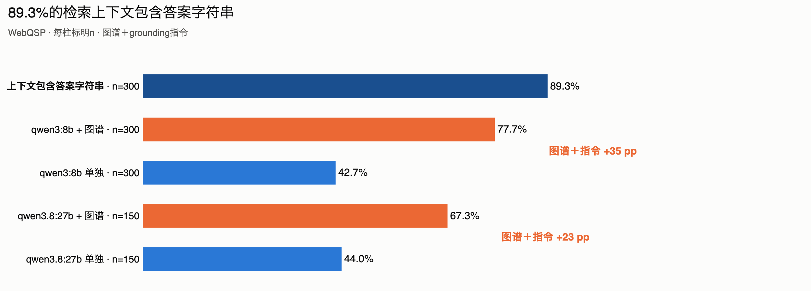
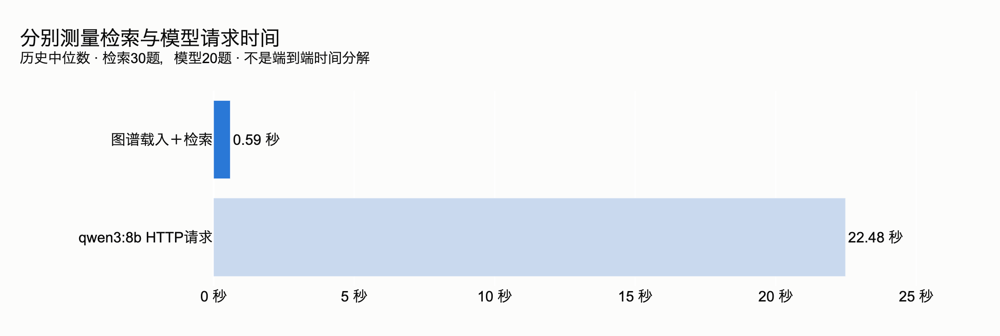
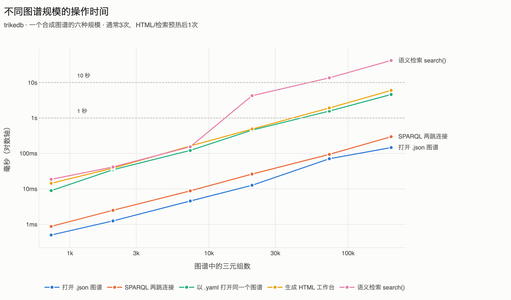

<p align="center">
  <a href="https://github.com/RyutoYoda/trikedb/blob/main/benchmarks/README.md">English</a>
  &nbsp;·&nbsp; <a href="https://github.com/RyutoYoda/trikedb/blob/main/benchmarks/README_jp.md">日本語</a>
  &nbsp;·&nbsp; <b>简体中文</b>
</p>

# 基准测试

在 [WebQSP](https://aclanthology.org/P16-2033/) 的 300 道题上测量。

| | |
|---|---|
| **检索** | trikedb 在 **89.3%** 的题目上把标准答案摆到了模型面前 |
| **速度** | 一题 22.5 秒里的 **0.59 秒** — 没有服务器，没有索引，只有一个文件 |
| **规模** | 到 **10 万条三元组**仍然很快；最先撑不住的是语义检索，3 万条 |
| **端到端** | 接上一个笔记本级 8B 阅读模型后答对 **77.7%**（没有图谱时是 **42.7%**） |

## 准确率



| 条件 | Hits@1 | F1 | n |
|---|---|---|---|
| `qwen3:8b` 单独 | 42.7% | 27.9% | 300 |
| `qwen3:8b` + 图谱 | **77.7%** | **57.4%** | 300 |
| `qwen3.8:27b` 单独 | 44.0% | 30.6% | 150 |
| `qwen3.8:27b` + 图谱 | 67.3% | 57.1% | 150 |

同一个模型，同一个提示，同一批问题。唯一改变的是检索到的三元组是否进入上下文。
在 8B 上图谱值 **+35 个百分点**（配对 McNemar 检验 p = 9e-20）。相比之下，
**把参数变成 3.4 倍，在没有图谱时一文不值**（44.0% 对 42.7%，p = 1.0）。

27B 在有图谱时分数更低，但这不是能力上的结论：它在 150 题里有 30 题回答
「I don't know」（8B 只有 4 题），而其中 19 题的答案就在上下文里。只看两个模型都
作答的那 120 题，差异就消失了（88.3% 对 84.2%，p = 0.27）。换阅读模型的话，那条
「不知道就说不知道」的指令也需要重新调。

上面这张图可以当成一条流水线来读：在同一批 300 道题里，trikedb 有 89.3% 把答案放进
了上下文，而阅读模型把其中 77.7% 变成了正确答案。相差的 11.6 个百分点是 38 道题 —
答案就在模型眼前，却没有从它嘴里出来。也就是说，在同样的检索上换一个完美的阅读
模型就是 89.3%，这里的天花板属于阅读模型，不属于图谱。

## 速度



检索是 0.59 秒：把整个 4,640 条三元组的子图构建成一个图（几乎是瞬时的），并在它
之上跑 `search()` 和 `find()`。没有服务器，没有要构建的索引，没有第二份存储。其余
全部是模型在读那 4,377 个 token 的上下文 — 这也是为什么换成 27B 的阅读模型后，
一题要 70.4 秒而不是 22.5 秒。

| 检索 | 答案进入上下文的比例 | 提示 |
|---|---|---|
| 1-hop + CVT，250 条 | 70.7% | 约 4,377 token |
| **hybrid，250 条** | **89.3%** | 约 4,377 token |
| 仅语义检索，250 条 | 88.7% | 约 4,377 token |
| hybrid，100 条 | 81.3% | 约 1,823 token |

同样的预算，只换选法，可用的上下文就多了 18.6 个百分点。顺带说，相比单纯的排序，
实体锚点几乎没有价值 — 250 条时值 0.6 个百分点，100 条时反而略有损失。

## 规模



| 三元组 | 打开 `.json` | 打开 `.yaml` | 保存 `.yaml` | SPARQL 两跳 | `to_html` | `search()` |
|---|---|---|---|---|---|---|
| 733 | 1 ms | 9 ms | 8 ms | 1 ms | 14 ms | 19 ms |
| 7,333 | 5 ms | 122 ms | 101 ms | 9 ms | 163 ms | 155 ms |
| 20,400 | 13 ms | 456 ms | 305 ms | 26 ms | 491 ms | 4.3 s |
| 73,333 | 71 ms | 1.6 s | 1.0 s | 94 ms | 1.9 s | 13.5 s |
| 204,000 | 147 ms | 4.6 s | 3.2 s | 297 ms | 6.0 s | 41.9 s |

各项功能不是同步退化的，所以不存在一个统一的规模上限：

- **到约 1,000 条** — 一切都是瞬时的，整个图谱能装进一个 pull request。这就是这个
  工具为之成形的规模。
- **到约 1 万条** — 各处仍然舒适，语义检索也一样。审阅整个图谱不再现实，但审阅
  diff 不受影响。
- **到约 10 万条** — SPARQL 仍然很快。语义检索（13 秒）、HTML 工作台（17 MB）和
  以 YAML 保存不再令人愉快。把文件命名为 `.json`，打开和保存就便宜一个数量级。
- **超过约 50 万条** — 能跑，但已在设计范围之外。GitHub 不再渲染 diff。

**不会退化的**有两件：一条事实的改动在任何规模下都是一行 diff；后端从不影响查询
时间 — 一个 `snowflake://` 行、一个 `s3://` 对象和一个本地文件用同样的时间作答，
因为图是从内存里回答的。

## 复现

```bash
uv run --extra all --with polars --with model2vec \
    python benchmarks/webqsp_bench.py prepare --n 300 --seed 42 \
    --retrieval "hybrid (entity + semantic)" --cap 250 --out bench_out/hybrid

for cond in nograph graph; do
  uv run --extra all --with polars python benchmarks/webqsp_bench.py run \
      bench_out/hybrid/eval_set.json --model qwen3:8b --condition $cond \
      --style grounded --out bench_out/ans_$cond.jsonl --workers 8
done

uv run --extra all python benchmarks/webqsp_bench.py score \
    bench_out/hybrid/eval_set.json bench_out/ans_*.jsonl
uv run --extra all python benchmarks/webqsp_bench.py compare \
    bench_out/hybrid/eval_set.json bench_out/ans_nograph.jsonl bench_out/ans_graph.jsonl
```

阅读模型放在本地并且写明名字，这是有意的：分数取决于它，所以必须能在没有 API key
的情况下被任何人重跑。`score` 会同时打印 Wilson 置信区间；`compare` 做配对检验 —
两轮是用同一个模型回答同一批问题，所以在这里配对检验才是正确的选择。

规模的数字来自 `ceiling_bench.py`（三次取中位数，一个流水线形状的合成图谱，
Apple silicon）；后端的数字来自 `backend_bench.py`；检索方法的比较来自
`retrieval_bench.py`，而 `webqsp_bench.py` 是从那里 import 这些方法的，没有留
第二份实现。

## 这份结果没有说的

- **不是与其他工具的对比。** 我们没有跑向量库、别的三元组存储，也没有跑纯文本
  RAG。被测量的是「图谱有帮助」，而不是「trikedb 比某某更有帮助」。
- **没有验证「以整理为先」这个前提。** 这里用的图谱是数据集自带的 Freebase
  子图，所以被验证的是作为检索与存储层的 trikedb，而不是「人工整理的图谱更好」
  这个主张。
- **也没有验证「单文件」那套说法。** 每道题用的都是内存里的一次性图谱，所以这里
  完全没有涉及 git 审阅、diff 或一个被持久化的文件。
- **绝对分数低于已发表的 SOTA**（Hits@1 在 80 多的中段到高段），而那些用的是
  GPT-4 级或针对任务微调过的阅读模型。
  [RoG](https://arxiv.org/abs/2310.01061)（ICLR 2024）用微调过的 LLaMA-2-7B 报告
  F1 70.8，而它的指标实现正是 `score` 所复现的。榜单上的其他数字被刻意没有列成
  表格：它们很容易被抄错，而把一张未经核实的数字表放在你自己的数字旁边，比没有
  表更糟。
- **标准答案有噪声。** 抽样题目里约 10% 的答案是可疑的，这为在原始 WebQSP 标签上
  诚实的绝对分数设了上限。
