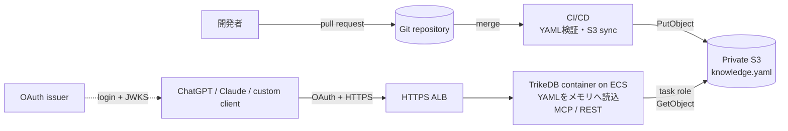
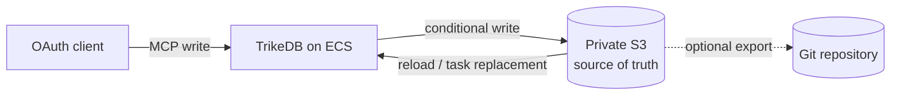

# TrikeDB remote MCP の構成例

Gitで管理したYAMLをprivate S3へ届け、ECS上のTrikeDBをMCPサーバーとして利用する構成です。AWSアカウント、バケット、ドメインは利用者自身のものに置き換えてください。

## Gitを正本にする構成



1. 開発者が `knowledge.yaml` をGitにコミットし、レビューしてmergeします。
2. CI/CDがYAMLを検証し、S3の固定キーへアップロードします。
3. ECSタスクがS3からYAMLを読み込み、メモリ上のグラフとしてMCPとRESTを提供します。
4. ChatGPTやClaudeはOAuthでALBのHTTPSエンドポイントへ接続します。

この構成でMCPからの書き込みも許可すると、S3がGitより先に変わり、Gitとの差分が発生します。Gitを唯一の正本にする場合は、MCPを読み取り専用にするか、書き込みを管理者だけに制限してください。

## S3を正本にする構成



MCP経由の編集を保存したい場合はS3を正本にします。TrikeDBはS3のバージョン情報を使って古い内容の上書きを拒否します。編集結果をGitにも残したい場合は、S3からGitへエクスポートする同期処理を別途用意します。

## Terraformが作る主なもの

private S3 bucket、ECR repository、ECS/Fargate taskとservice、最小権限のtask role、execution role、CloudWatch Logs、HTTPS ALB、target group、security groupです。OAuth issuer、ACM証明書、DNS、ChatGPT/Claude側のOAuthクライアント登録は別途用意します。

```text
Gitを正本にする → CI/CDだけがS3を書き込む。MCPは読み取り中心。
S3を正本にする → MCPの書き込みを許可し、Gitへは別途エクスポート。
```

S3は公開せず、AWS認証情報やOAuthトークンをイメージ・YAML・Gitへ入れないでください。詳細な手順は [`README.md`](README.md) と [`terraform/README.md`](terraform/README.md) を参照してください。
