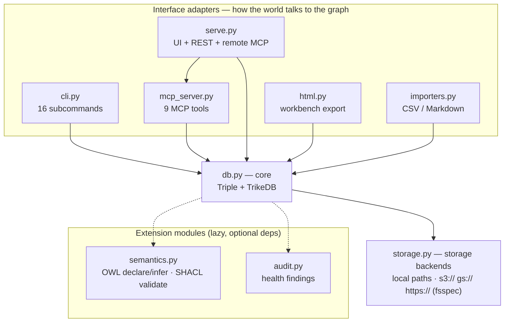

# Architecture

trikedb is layered so each concern can be replaced or extended without
touching the others. Dependencies point inward only:

## Layers

- **`db.py` — core.** The `Triple` model and the `TrikeDB` store:
  CRUD with ontology enforcement, pattern matching, SPARQL (delegated to
  rdflib), workspace unions, exports. Depends only on `storage` and
  (lazily) `semantics`. No HTTP, no CLI, no HTML in here — ever.
- **`storage.py` — storage backends.** `read_text` / `write_text` /
  `exists` over local paths and remote URLs (fsspec). Anything about
  *where bytes live* — new URL schemes, optimistic locking (conditional
  PUT), caching — belongs here and nowhere else.
- **`semantics.py` — optional semantic layers.** OWL declarations +
  OWL-RL materialization (owlrl) and SHACL validation (pySHACL). The
  core must stay useful without these extras installed, so they are
  imported lazily and fail with actionable install hints.
- **Interface adapters** — each is a thin translation of the core API
  into one medium, and none of them contain graph logic:
  - `cli.py`: argparse commands, one `_cmd_*` per subcommand.
  - `mcp_server.py`: the FastMCP server definition (9 tools). Transport
    is chosen by the caller — stdio (`trikedb mcp`) and Streamable HTTP
    (`trikedb serve`) share this single definition.
  - `serve.py`: the HTTP composition — workbench UI + `/sparql` REST +
    the mounted MCP app, wrapped in bearer-token auth.
  - `html.py`: the self-contained workbench page (vis-network +
    in-browser SPARQL via Oxigraph WASM), generated from graph data.
  - `importers.py`: deterministic CSV/TSV/Markdown-table ingestion.

## Rules of thumb for changes

- New way to *store* a graph → `storage.py` only.
- New *reasoning/validation* capability → `semantics.py`, exposed as a
  delegating method on `TrikeDB`, behind an optional extra.
- New way to *talk to* a graph (protocol, format, UI) → a new adapter
  module + a CLI subcommand; never import one adapter from another
  (compose them in `serve.py`-style composition modules instead).
- Anything agents can do must exist in all three interfaces (Python API,
  CLI, MCP) — parity is a feature.
- Heavy dependencies are always optional extras (`[remote]`, `[shacl]`,
  `[owl]`, `[mcp]`, `[serve]`); the core stays PyYAML + rdflib.
