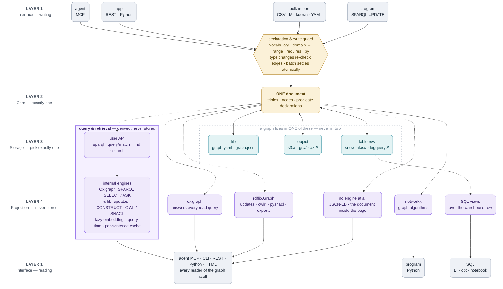

<b>English</b> · [English](ARCHITECTURE.md) · [日本語](ARCHITECTURE_jp.md) · [简体中文](ARCHITECTURE_zh.md)

# Architecture

One graph is one YAML or JSON document. Storage owns bytes and version tokens; the core owns facts and metadata; adapters expose Python, CLI, MCP and HTTP. This is a small embedded graph library, not a transactional RDF dataset server.



Read the diagram top to bottom: the core is one document, storage is one
chosen destination, and projections are derived views rather than additional
copies. Solid arrows move or persist the document; dotted arrows are built on
demand. The guard protects supported API writes; hand-edited files and raw
`load`/`save` remain document-shape validation paths.

## Data and projections

`Triple` stores `s`, `p`, `o`, edge attributes and optional `rdf_terms`. Existing documents retain the legacy mapping: names become IRIs under `urn:trikedb:` (http/https/urn stay absolute); whitespace-containing objects become literals. Explicit RDF terms preserve IRIs, blank nodes, literal datatypes and language tags. Use an explicit IRI object for entity names with spaces.

`_statements()` defines the RDF projection. rdflib and Oxigraph consume it; JSON-LD serializes the same projection. Node properties become literals, and edge attributes attach to generated blank-node statements. These synthetic triples are readable in UPDATE WHERE but cannot be deleted through SPARQL. NetworkX and warehouse views independently expose a lexical property-graph projection from the document. They are not lossless RDF datasets; KG_NODE includes metadata-only nodes and all edge endpoints.

## Writes and failures

With a nonempty ontology, `add`, imports and SPARQL insertions check predicates. Absolute HTTP(S) predicates are an intentional exception for RDF/OWL vocabulary. Hand-edited files and `load`/`save` do not enforce this whitelist: loading validates document shape, not ontology membership. `reload()` rebuilds ontology from the stored document.

Public Triple/property returns are detached snapshots. Mutate through APIs to invalidate query caches; direct changes to `nodes_meta`, `ontology` or internal fields are unsupported as cache-coherent writes. `batch()` rolls back in-memory triples, metadata and ontology if its body or final save fails, including nested batches. It is not a distributed transaction; explicit saves or external side effects inside it cannot be undone.

## Persistence and concurrency

Local saves write and fsync a same-directory temporary file, then replace the destination. Existing permissions and symlink targets are preserved; newly created files are private (0600). Failure before replacement preserves previous bytes. This does not claim directory-fsync power-loss durability or multi-process compare-and-swap: separate local writers remain last-write-wins.

S3 uses conditional single PUT (ETag/If-Match or create-if-absent); SQL uses a version predicate and affected-row count. The successful write returns **its own** committed token. Never read HEAD after saving to discover that token: another writer could already have committed. S3 multipart conditional writes are deliberately unsupported. Other fsspec backends have no compare-and-swap guarantee.

REST and MCP in one `serve` process share one TrikeDB and serialize operations under its reentrant lock. MCP retries conditional conflicts by reloading and reapplying its mutation. Separate processes do not share memory. Python callers must serialize access themselves; external edits require reload. Read-only flags guard public mutations, not arbitrary Python memory access.

## Modules and layering

`model` holds what a fact is. `rules`, `rdf` and `reasoning` say what a document means; `storage` and `persistence` move it; `audit` reads the finished thing and `merge` says what an incoming batch would do to it. `db` is the store those add up to — a facade whose methods delegate to those modules, which take the store as their first argument rather than importing it back. `html`, `importers`, `extract` and `embeddings` sit **above** the core, not inside it: a graph must not depend on the page that draws it, on the file formats it can be built from, on an extractor, or on an embedding model that may not be installed. `prompts` is at the bottom with `templates` — prompt text is data, so a change to extraction accuracy arrives as a diff somebody can read. `cli`, `mcp_server` and `serve` are entry points on top.

Imports run one way only, from a higher layer to a strictly lower one. An import inside a function is how an optional adapter stays optional, so it does not count as a dependency — `db.to_html()` imports `html` when called, and `db.extract()` imports `extract`. A regression test also parses `extract.py` and fails if it ever imports anything but the standard library and trikedb itself: declining to bundle a model provider is the feature, and a guarantee nothing checks is a guarantee until somebody adds an import. `tests/test_architecture.py` declares the layers and fails the build when the code stops matching them, including when a new module is added without being placed in one. The layering is a declaration that is enforced, which is the same argument the library makes about ontologies.

## Query execution and boundaries

Oxigraph normally answers SELECT and ASK. rdflib handles CONSTRUCT/DESCRIBE and fallback reads, SPARQL updates, OWL and SHACL. Pattern queries use the core's own matching code. Prefixes and comments are parsed when dispatching ambiguous SPARQL text.

`search()` is a semantic retrieval projection: it turns the current triples and
node properties into sentences, embeds only when a query asks for it, and keeps
vectors as a replaceable per-sentence cache outside the graph document.
`find()` composes that broad semantic recall with an exact structured filter;
neither changes the stored facts.

Updates support INSERT/DELETE and CLEAR/DROP DEFAULT on one default graph. Named-graph writes, WITH/USING datasets, LOAD, CREATE, COPY, MOVE and ADD are rejected before persistence. Deleting projected metadata is rejected; use property APIs instead. SPARQL response rows expose lexical strings, not a full typed SPARQL-results protocol. Use `to_rdflib()`/`to_jsonld()` for typed RDF export.

Query caches rebuild after API mutations. Semantic embeddings are cached per sentence and changed sentences are encoded as needed. Whole-document storage still rewrites the document on save. Historical timing charts describe their recorded versions and hardware; they are not a current performance guarantee.

## HTML and verification

The workbench is distributed as one HTML file but loads vis-network and Oxigraph WASM from external CDNs; it is not fully offline. Graph data is encoded as script-safe JSON and escaped according to DOM context. Internal numeric visualization IDs avoid special-name collisions; original names remain visible. Nonfinite numeric properties display as text.

`tests/test_review_regressions.py` covers audit failures and RDF/storage edge cases; `tests/browser_smoke.py` exercises a fresh browser against ordinary and hostile graph data. Release verification also tests packaged sdists and the declared dependency floor. Fake storage tests establish protocol behavior, not live cloud durability. See [the API reference](REFERENCE.md) and [benchmarks](../benchmarks/README.md) for contracts and measurement limits.

### What the write guard accepts and rejects

The guard is declaration-driven; it does not ask an LLM whether a fact sounds
reasonable. A declaration can be only a description (allowed vocabulary), or a
rule with `domain`, `range`, `requires` and `by` (enforced constraints). Both
facts and declarations live in the same document and diff.

```yaml
ontology:
  SHIPPED_FROM: {domain: order, range: warehouse}
  DELIVERED_TO:
    domain: order
    range: region
    requires: SHIPPED_FROM
    by: courier
```

```python
db.add("ORD-1", "SHIPPED_FROM", "WH-1")       # accepted if types fit
db.add("ORD-1", "DELIVERED_TO", "Tokyo",       # rejected: no `by`
       at="2026-09-14")
db.act("ORD-1", "DELIVERED_TO", "Tokyo",        # accepted after shipping
       by="Courier-7", at="2026-09-14")
db.add("ORD-1", "DELIVER_TO", "Tokyo")          # rejected: undeclared name
```

Unknown predicates are refused before they land. Known endpoint types make a
reversed or incompatible edge fail (`order -> warehouse` cannot become
`warehouse -> order`). `by` requires an actor and checks its known type;
`requires` requires a time and an earlier fact on either end, including exact
multi-step patterns such as `?order PLACED_BY ?s` joined to
`?order CONTAINS ?o`. Malformed requirements fail when declared, not later as
an impossible rule.

Imports use the same `add()` path. In a `batch()` or bulk import, a prerequisite
whose evidence may arrive later is held and checked again at batch exit; if it
still fails, the whole batch rolls back. `set_node()` rechecks existing edges
when a type is added later. Unknown types are not guessed invalid; `audit()`
reports the unresolved case.

The boundary is deliberate: API `add`, `act`, imports and supported SPARQL
insertions enforce applicable checks. Hand-edited YAML and raw `load()` /
`save()` check shape and syntax, but do not run the predicate whitelist.

### What the guard actually does in code

The critical path is ordinary Python code. Every supported API write enters
the checks in this order:

```python
self._check_predicate(p)          # is the relationship name declared?
self._check_link(s, p, o)         # do the endpoint types and direction fit?
self._check_action(triple)        # are time, prerequisites and actor valid?
```

The first check is a membership test. The second reads the declared
`domain`/`range` and the types attached to the two endpoints. The third checks
`by`, checks that `requires` has a time, then searches the existing graph for
the required earlier facts. A failed check raises `OntologyError`, before the
new fact is stored.

The search for a prerequisite is not an LLM call. TrikeDB keeps indexes by
predicate and by `(predicate, endpoint)`, compares timestamps, and joins
fixed-length `(subject, predicate, object)` patterns when a requirement has
multiple steps. During a batch, an answer that may change as later input
arrives is held and asked again at the end; an unresolved failure aborts the
batch and restores its previous state.

`rdflib` and `Oxigraph` are not secretly making this decision. They execute
RDF/SPARQL queries and related projections; `rules.py` is the write guard.
