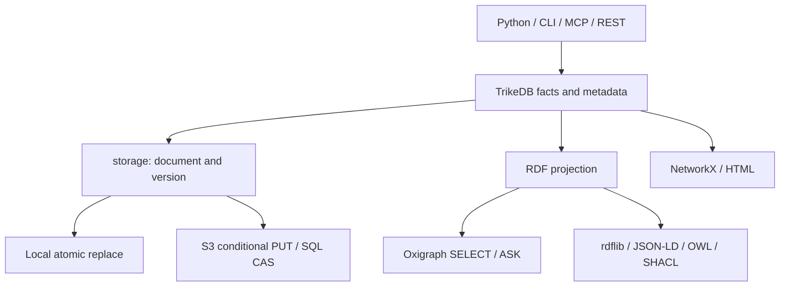

<b>English</b> · [English](ARCHITECTURE.md) · [日本語](ARCHITECTURE_jp.md) · [简体中文](ARCHITECTURE_zh.md)

# Architecture

One graph is one YAML or JSON document. Storage owns bytes and version tokens; the core owns facts and metadata; adapters expose Python, CLI, MCP and HTTP. This is a small embedded graph library, not a transactional RDF dataset server.

## Data and projections

`Triple` stores `s`, `p`, `o`, edge attributes and optional `rdf_terms`. Existing documents retain the legacy mapping: names become IRIs under `urn:trikedb:` (http/https/urn stay absolute); whitespace-containing objects become literals. Explicit RDF terms preserve IRIs, blank nodes, literal datatypes and language tags. Use an explicit IRI object for entity names with spaces.

`_statements()` defines the RDF projection. rdflib and Oxigraph consume it; JSON-LD serializes the same projection. Node properties become literals, and edge attributes attach to generated blank-node statements. These synthetic triples are readable in UPDATE WHERE but cannot be deleted through SPARQL. NetworkX and warehouse views independently expose a lexical property-graph projection from the document. They are not lossless RDF datasets; KG_NODE includes metadata-only nodes and all edge endpoints.

## Writes and failures

With a nonempty ontology, `add`, imports and SPARQL insertions check predicates. Absolute HTTP(S) predicates are an intentional exception for RDF/OWL vocabulary. Hand-edited files and `load`/`save` do not enforce this whitelist: loading validates document shape, not ontology membership. `reload()` rebuilds ontology from the stored document.

Public Triple/property returns are detached snapshots. Mutate through APIs to invalidate query caches; direct changes to `nodes_meta`, `ontology` or internal fields are unsupported as cache-coherent writes. `batch()` rolls back in-memory triples, metadata and ontology if its body or final save fails, including nested batches. It is not a distributed transaction; explicit saves or external side effects inside it cannot be undone.

## Persistence and concurrency

Local saves write and fsync a same-directory temporary file, then replace the destination. Existing permissions and symlink targets are preserved; newly created files are private (0600). Failure before replacement preserves previous bytes. This does not claim directory-fsync power-loss durability or multi-process compare-and-swap: separate local writers remain last-write-wins.

S3 uses conditional single PUT (ETag/If-Match or create-if-absent); SQL uses a version predicate and affected-row count. The successful write returns **its own** committed token. Never read HEAD after saving to discover that token: another writer could already have committed. S3 multipart conditional writes are deliberately unsupported. Other fsspec backends have no compare-and-swap guarantee.

REST and MCP in one `serve` process share one TrikeDB and serialize operations under its reentrant lock. MCP retries conditional conflicts by reloading and reapplying its mutation. Separate processes do not share memory. Python callers must serialize access themselves; external edits require reload. Read-only flags guard public mutations, not arbitrary Python memory access.

## Query execution and boundaries

Oxigraph normally answers SELECT and ASK. rdflib handles CONSTRUCT/DESCRIBE and fallback reads, SPARQL updates, OWL and SHACL. Pattern queries use the core's own matching code. Prefixes and comments are parsed when dispatching ambiguous SPARQL text.

Updates support INSERT/DELETE and CLEAR/DROP DEFAULT on one default graph. Named-graph writes, WITH/USING datasets, LOAD, CREATE, COPY, MOVE and ADD are rejected before persistence. Deleting projected metadata is rejected; use property APIs instead. SPARQL response rows expose lexical strings, not a full typed SPARQL-results protocol. Use `to_rdflib()`/`to_jsonld()` for typed RDF export.

Query caches rebuild after API mutations. Semantic embeddings are cached per sentence and changed sentences are encoded as needed. Whole-document storage still rewrites the document on save. Historical timing charts describe their recorded versions and hardware; they are not a current performance guarantee.

## HTML and verification

The workbench is distributed as one HTML file but loads vis-network and Oxigraph WASM from external CDNs; it is not fully offline. Graph data is encoded as script-safe JSON and escaped according to DOM context. Internal numeric visualization IDs avoid special-name collisions; original names remain visible. Nonfinite numeric properties display as text.

`tests/test_review_regressions.py` covers audit failures and RDF/storage edge cases; `tests/browser_smoke.py` exercises a fresh browser against ordinary and hostile graph data. Release verification also tests packaged sdists and the declared dependency floor. Fake storage tests establish protocol behavior, not live cloud durability. See [the API reference](REFERENCE.md) and [benchmarks](../benchmarks/README.md) for contracts and measurement limits.
