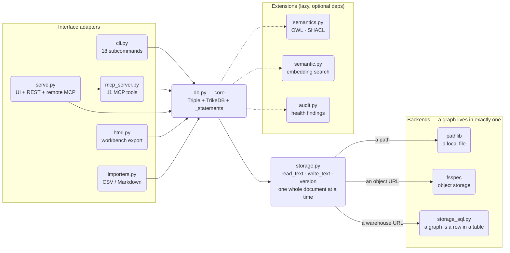

# Architecture

This document is about *why*, not what. For the API see
[REFERENCE.md](REFERENCE.md); for measurements see
[benchmarks/](../benchmarks/README.md).

## One decision, and everything that follows from it

**The layer below the core moves one whole document at a time.** Not a row,
not a delta, not a page — the entire graph, in and out, as text.

```
storage:  read_text · write_text · exists · version
                    ↑
          one document. always.
```

Nearly every property trikedb has, good and bad, is a consequence of that
one line:

- **The destination becomes swappable.** Anywhere that can hold one document
  can hold a graph — a file on disk, an object in a bucket, a row in a
  warehouse. Nothing above the storage layer learns which one it got.
- **Concurrency control becomes whole-document compare-and-swap.** There is
  no row locking to design because there are no rows; a save either replaces
  the document it read or is refused. Simple, and it means there is no
  partial write either.
- **The ceiling is a few MB.** Adding one fact rewrites everything. That is
  not a bug to fix later; it is the same decision, seen from the other side.

Being able to name the trade in one sentence is the point. A design where the
flexibility and the limit come from *different* places is a design where you
can't predict either.

The claim was tested rather than asserted: adding a backend that is not a
filesystem at all — a graph as a row in a SQL table, with network round trips
and a real transaction model — required no change to SPARQL, the MCP tools,
SHACL, OWL inference, `to_networkx`, or the CLI. `storage.py` and one new
module, and nothing else moved.

## Projection, not translation

A graph has many useful shapes. trikedb stores **one** and derives the rest:

```
_statements()          ← the single source of truth for what the graph MEANS
      ├─→ rdflib graph        (the RDF view — exports, OWL, SHACL, updates)
      ├─→ oxigraph store      (the same RDF view, for fast reads)
      ├─→ networkx graph      (the property-graph view — algorithms)
      └─→ SQL views           (the table view — whatever else reads SQL)
```

None of those is stored. They are projections, built on demand from the same
generator, which decides the things that are easy to get subtly wrong: which
objects are URIs and which are literals, how edge attributes reify, which node
properties surface.

That matters because the failure mode of duplicating those rules is the worst
kind. Two engines answering *differently* about the same graph both look
plausible; nothing raises. Keeping one source of truth makes that impossible
by construction rather than by discipline — and it is why a second SPARQL
engine could be introduced at all. (25 of 26 SPARQL forms then agreed
exactly; the 26th was a case the spec leaves undefined. See
`test_engines_agree_across_the_sparql_surface`.)

The same principle draws the line for new features: **a new way to look at the
graph is a projection; it does not get to add a second copy of the data.**

## The guard is at the write boundary

The ontology — a whitelist of predicates — is enforced when a fact is
*written*, not when it is read or in a later linting pass. Every write path
goes through it: the Python API, the CLI, CSV/Markdown import, SPARQL
`INSERT`, the MCP tools an agent calls, OWL materialization, and a person
editing the file by hand.

The consequence is the reason for the design: **"an agent wrote it" and "a
human wrote it" cannot diverge in vocabulary.** An agent cannot invent a
predicate, because the invented predicate never lands. Checking after the
fact would report the problem; checking at the boundary means there is no
problem to report.

This is the trade in the other direction from a schema-on-read system, which
accepts anything and applies meaning later. That is the better choice when you
are putting meaning on top of data you did not write. This is the better one
when the writer is a language model.

## Different features have different ceilings

A single number for "how big can it get" would be misleading, because the
features do not degrade together. Semantic search becomes unusable while
SPARQL over the same graph is still answering in milliseconds; the workbench
export gets unwieldy long before storage does.

This is a design fact, not an accident of tuning: each capability has a
different relationship to graph size. Search re-embeds everything per query
(deliberately index-free, so results can never drift from the file). SPARQL
runs against a built index. Save rewrites the document.

So the honest answer to "how large" is per-feature, and it is measured rather
than estimated — see
[benchmarks: where is the ceiling](../benchmarks/README.md#where-is-the-ceiling).
The one thing that does *not* degrade is the diff: a one-fact change is one
line at any size, which is what keeps review possible even when reading the
whole graph is not.

## The layers

Dependencies point inward only.



`storage.py` dispatches on the URL scheme and **exactly one branch runs**.
A warehouse graph never touches fsspec; an object-storage graph never opens a
database connection. They are alternatives, not a pipeline, and nothing is
stored twice.

- **`db.py` — core.** The `Triple` model and the `TrikeDB` store: CRUD with
  ontology enforcement, pattern matching, SPARQL, workspace unions, and
  `_statements()` — the projection source above. Depends only on `storage`
  and (lazily) `semantics`. No HTTP, no CLI, no HTML in here, ever.
- **`storage.py` — the interface and its dispatcher.** Anything about *where
  bytes live* — new schemes, optimistic locking, caching, which
  serialization a destination wants — belongs here and nowhere else.
- **`storage_sql.py` — the same interface over a SQL table.** A database is
  not a filesystem, so it does not reach fsspec: a graph is a row
  (`name`, `doc`, `version`), and one table holds many graphs, so adopting
  trikedb costs an organisation one table rather than one per graph.
  Everything a given engine does differently — its types, its upsert syntax,
  how it opens a JSON document, how the projection views are spelled — lives
  in a `_Dialect`, which is *data*. A second engine is one more literal, not
  a refactor.

  Two things land more cleanly here than on object storage. Optimistic
  locking goes inside the statement (`UPDATE ... WHERE version = ?`), so a
  conflict is an affected-row count of zero rather than an error message to
  pattern-match. And the document can be *read by other tools*: stored as
  JSON, views project it as ordinary node/edge/triple tables, so anything
  that speaks SQL can query the graph without knowing trikedb exists.

  The trade to know: a database typically serialises writes per *table*, where
  object storage serialises per object. One table holding many graphs means
  writers to unrelated graphs still queue behind each other. Harmless at the
  rate a person or an agent edits a graph; it does mean a more generous retry
  budget than object storage needs.
- **`semantics.py` — optional semantic layers.** OWL declarations and OWL-RL
  materialization, SHACL validation. Imported lazily; the core stays useful
  without them and failures name the extra to install.
- **`semantic.py` — optional embedding search.** Index-free on purpose: the
  whole graph is re-embedded per query, so a result can never disagree with
  the file. That choice is also the reason search has the earliest ceiling —
  a legible cost rather than a hidden one.
- **Interface adapters** — each a thin translation of the core API into one
  medium; none contains graph logic:
  - `cli.py`: argparse commands, one `_cmd_*` per subcommand.
  - `mcp_server.py`: the FastMCP server definition. Transport is the caller's
    choice — stdio and Streamable HTTP share this one definition.
  - `serve.py`: the HTTP composition — workbench UI, `/sparql` REST, the
    mounted MCP app, wrapped in auth.
  - `html.py`: the self-contained workbench page, generated from graph data.
  - `importers.py`: deterministic CSV/TSV/Markdown-table ingestion.

## Rules of thumb for changes

- **`storage.py` must stay importable on its own.** trikedb gets vendored as a
  subset of its files into hosts that cannot install packages, so
  `db.py` + `storage.py` + `__init__.py` has to be a working install. Only a
  warehouse URL may reach for `storage_sql` — which is why the SQL schemes are
  *named* in `storage.py` rather than imported from it. This has been broken
  once by an unconditional import; it turned "open a local file" into an
  ImportError.
- **New way to *store* a graph** → `storage.py` (a filesystem-shaped backend)
  or a `_Dialect` in `storage_sql.py` (a table-shaped one). Never above those
  two files.
- **New way to *look at* a graph** → a projection over `_statements()`. If it
  needs its own copy of the data, that is the signal to stop and reconsider.
- **New *reasoning or validation*** → `semantics.py`, exposed as a delegating
  method, behind an optional extra.
- **New way to *talk to* a graph** (protocol, format, UI) → a new adapter
  module plus a CLI subcommand. Never import one adapter from another;
  compose them in a `serve.py`-style module.
- **Anything an agent can do must exist in all three interfaces** — Python
  API, CLI, MCP. Parity is a feature, not a coincidence.
- **A cache is a correctness problem before it is a speed problem.** Two live
  here: the built query graph and the `(s, p, o)` index behind `add()`. Both
  fail *silently* when stale — answering from a graph that moved, or deciding
  a triple already exists and dropping the write. So invalidation is
  deliberately over-eager, and every path that replaces the triple list
  clears them explicitly. A length check is a backstop, never the mechanism:
  two different lists can be the same length.
- **Heavy dependencies are optional extras.** The core is PyYAML, rdflib and
  pyoxigraph. pyoxigraph earned it by being faster at every graph size
  measured, down to a few hundred triples; rdflib stays because `owlrl` and
  `pyshacl` take rdflib graphs and updates diff through one.
- **Claims about behaviour get a test; claims about speed get a benchmark.**
  Both of those directories exist so that a sentence in a README can be
  checked rather than believed.
