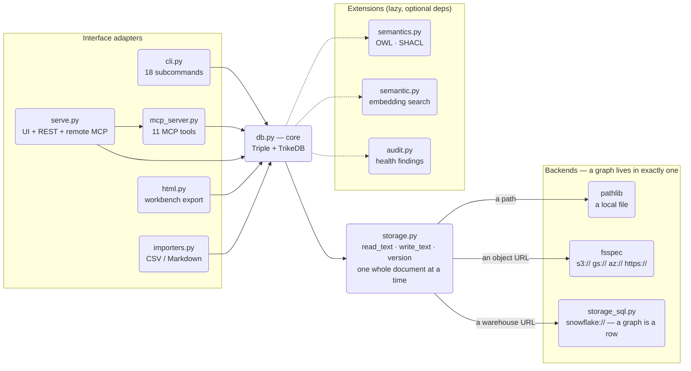

# Architecture

trikedb is layered so each concern can be replaced or extended without
touching the others. Dependencies point inward only:

`storage.py` dispatches on the scheme and exactly one branch runs. A
`snowflake://` graph never touches fsspec or S3, and an `s3://` graph
never opens a warehouse connection — they are alternatives, not a
pipeline, and nothing is stored twice.

## Layers

- **`db.py` — core.** The `Triple` model and the `TrikeDB` store:
  CRUD with ontology enforcement, pattern matching, SPARQL (delegated to
  rdflib), workspace unions, exports. Depends only on `storage` and
  (lazily) `semantics`. No HTTP, no CLI, no HTML in here — ever.
- **`storage.py` — the storage interface and its dispatcher.**
  `read_text` / `write_text` / `exists` / `version`, resolved to one
  backend by the URL scheme: a bare path to `pathlib`, an object URL to
  fsspec, a warehouse URL to `storage_sql`. Anything about *where bytes
  live* — new schemes, optimistic locking, caching — belongs here and
  nowhere else. The interface is deliberately one whole document at a
  time: that is what lets the destination change without anything above
  noticing.
- **`storage_sql.py` — the same interface over a SQL table.** A
  warehouse is not a filesystem, so it does not reach fsspec: a graph is
  a row (`name`, `doc`, `version`), and one table holds many graphs.
  Everything a warehouse differs about is a `_Dialect` — four SQL
  templates and a connect function — so the next one is data, not code.
  Optimistic locking lands more cleanly here than on object storage: the
  condition goes inside the statement (`UPDATE ... WHERE version = ?`)
  and a conflict comes back as an affected-row count of zero rather than
  an error to pattern-match.
- **`semantics.py` — optional semantic layers.** OWL declarations +
  OWL-RL materialization (owlrl) and SHACL validation (pySHACL). The
  core must stay useful without these extras installed, so they are
  imported lazily and fail with actionable install hints.
- **`semantic.py` — optional embedding search.** Static multilingual
  embeddings (model2vec) behind `db.search()`. Deliberately index-free:
  the whole graph is re-embedded per query so results can never drift
  from the YAML. The model is a parameter — heavier backends can be
  swapped in without touching callers.
- **Interface adapters** — each is a thin translation of the core API
  into one medium, and none of them contain graph logic:
  - `cli.py`: argparse commands, one `_cmd_*` per subcommand.
  - `mcp_server.py`: the FastMCP server definition (11 tools). Transport
    is chosen by the caller — stdio (`trikedb mcp`) and Streamable HTTP
    (`trikedb serve`) share this single definition.
  - `serve.py`: the HTTP composition — workbench UI + `/sparql` REST +
    the mounted MCP app, wrapped in bearer-token auth.
  - `html.py`: the self-contained workbench page (vis-network +
    in-browser SPARQL via Oxigraph WASM), generated from graph data.
  - `importers.py`: deterministic CSV/TSV/Markdown-table ingestion.

## Rules of thumb for changes

- New way to *store* a graph → `storage.py` (a filesystem-shaped
  backend) or a `_Dialect` in `storage_sql.py` (a SQL-table-shaped
  one). Never above those two files.
- New *reasoning/validation* capability → `semantics.py`, exposed as a
  delegating method on `TrikeDB`, behind an optional extra.
- New way to *talk to* a graph (protocol, format, UI) → a new adapter
  module + a CLI subcommand; never import one adapter from another
  (compose them in `serve.py`-style composition modules instead).
- Anything agents can do must exist in all three interfaces (Python API,
  CLI, MCP) — parity is a feature.
- Heavy dependencies are always optional extras (`[remote]`,
  `[snowflake]`, `[shacl]`, `[owl]`, `[mcp]`, `[serve]`); the core
  stays PyYAML + rdflib.
