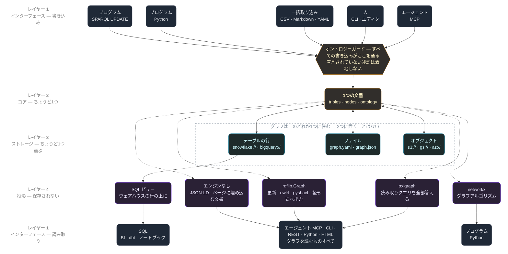
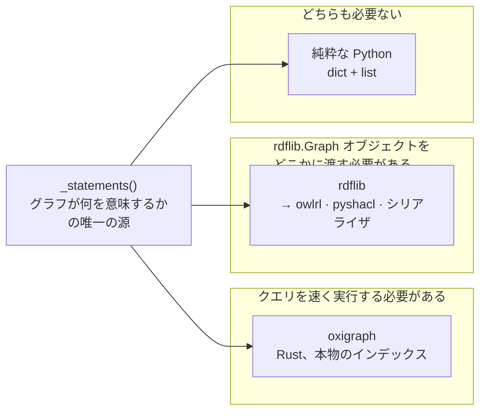
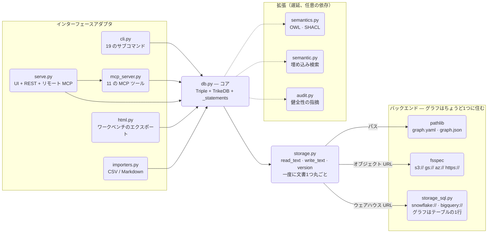

<p align="center">
  <a href="https://github.com/RyutoYoda/trikedb/blob/main/docs/ARCHITECTURE.md">English</a>
  &nbsp;·&nbsp; <b>日本語</b>
  &nbsp;·&nbsp; <a href="https://github.com/RyutoYoda/trikedb/blob/main/docs/ARCHITECTURE_zh.md">简体中文</a>
</p>

# アーキテクチャ



点線の矢印は導出である — 都度作られて捨てられる。各列は端から端までの1本の実際の
経路である: `oxigraph → MCP 越しのエージェント`、`SQL ビュー → dbt`、
`エンジンなし → HTML ワークベンチ`。

| レイヤー | 担当するもの | 担当*しない*もの |
|---|---|---|
| **1 · インターフェース** | CLI / MCP / REST / HTML をコアの呼び出しに翻訳する | グラフのロジック |
| **2 · コア** | 文書、ガード、そしてグラフが何を*意味するか* | バイトの行き先、クエリの実行方法 |
| **3 · ストレージ** | どの保存先か、そしてそれを守る条件付き書き込み | 意味に関すること |
| **4 · 投影** | 同じ文の別の見え方 — RDF、プロパティグラフ、SQL | 何かを保存すること |

このスタックについて声に出して言う価値のあることが2つある。どちらも選択であって
欠落ではないからだ。

**独立したメタデータレイヤーは存在しない。** オントロジーはデータの横のレジストリ
ではなく、トリプルと同じ文書のキーである。だから語彙への変更と事実への変更が同じ
diff に着地し、同期させるべきものが何もない。意味をデータの上のレイヤーに置く
システムは、データに触らずにそれを変えられる — データが大きすぎて動かせないときは
そちらが良い取引であり、変更全体を一度にレビューしたいときは悪い取引である。

**状態を持つクエリレイヤーは存在しない。** レイヤー4はレイヤー2から都度作られて
捨てられる。それが2つの SPARQL エンジンをそもそも可能にしているものであり、
両者の間で何もずれえない理由である。

この文書は*なぜ*その形なのかについてのものである。API は
[REFERENCE_jp.md](REFERENCE_jp.md)、測定値は
[benchmarks/](../benchmarks/README_jp.md) を参照。

## 1つの決定と、そこから従うすべて

**コアの下のレイヤーは、一度に文書1つ丸ごとを動かす。** 行でもデルタでもページ
でもなく、グラフ全体を、テキストとして出し入れする。

```
storage:  read_text · write_text · exists · version
                    ↑
          one document. always.
```

trikedb が持つ性質のほぼすべてが、良いものも悪いものも、その一行の帰結である:

- **保存先が差し替え可能になる。** 文書1つを保持できる場所ならどこでもグラフを
  保持できる — ディスク上のファイル、バケット内のオブジェクト、ウェアハウスの行。
  ストレージレイヤーより上は、どれを渡されたのかを知らない。
- **同時実行制御が文書全体の compare-and-swap になる。** 設計すべき行ロックが
  ない。行がないからである。保存は、読んだ文書を置き換えるか、拒否されるかの
  どちらかである。単純で、しかも部分書き込みも存在しないという意味になる。
- **上限は数MBである。** 事実を1つ足すとすべてが書き直される。これは後で直す
  バグではなく、同じ決定を反対側から見たものである。

その取引を一文で言えることが要点である。柔軟性と限界が*別々の*場所から来る設計
は、どちらも予測できない設計である。

この主張は断言ではなく検証された: ファイルシステムですらないバックエンドの追加 —
ネットワークの往復と本物のトランザクションモデルを持つ、SQL テーブルの1行としての
グラフ — に対して、SPARQL、MCP ツール、SHACL、OWL 推論、`to_networkx`、CLI の
いずれも変更を必要としなかった。`storage.py` と新しいモジュール1つ、それ以外は
何も動いていない。

## 翻訳ではなく投影

グラフには有用な形が多くある。trikedb は**1つ**を保存し、残りを導出する:

```
_statements()          ← the single source of truth for what the graph MEANS
      ├─→ rdflib graph        (the RDF view — exports, OWL, SHACL, updates)
      ├─→ oxigraph store      (the same RDF view, for fast reads)
      ├─→ networkx graph      (the property-graph view — algorithms)
      └─→ SQL views           (the table view — whatever else reads SQL)
```

どれも保存されない。それらは投影であり、同じジェネレータから都度作られる。その
ジェネレータが、微妙に間違えやすいことを決めている: どの目的語が URI でどれが
リテラルか、エッジ属性がどう具象化されるか、どのノードプロパティが表に出るか。

これが重要なのは、その規則を二重化したときの失敗モードが最悪の種類だからである。
2つのエンジンが同じグラフについて*違う*答えを返すとき、どちらももっともらしく
見え、何も例外を投げない。真実の源を1つに保つことが、規律ではなく構成によって
それを不可能にする — そしてそれが、2つ目の SPARQL エンジンをそもそも導入できた
理由である。（26の SPARQL 形式のうち25が厳密に一致した。26番目は仕様が未定義に
している場合である。`test_engines_agree_across_the_sparql_surface` を参照。）

同じ原則が新機能の線を引く: **グラフを見る新しい方法は投影である。データの2つ目
のコピーを持つことは許されない。**

## ガードは書き込み境界にある

オントロジー — 述語のホワイトリスト — は、事実が*書かれる*ときに強制される。
読まれるときでも、後のリンティング工程でもない。すべての書き込み経路がそこを
通る: Python API、CLI、CSV/Markdown の取り込み、SPARQL の `INSERT`、エージェント
が呼ぶ MCP ツール、OWL の実体化、そしてファイルを手で編集する人。

その帰結が設計の理由である: **「エージェントが書いた」と「人間が書いた」が語彙で
乖離できない。** エージェントは述語を発明できない。発明された述語が着地しないから
である。事後に確認すれば問題を報告することになるが、境界で確認すれば報告すべき
問題が存在しない。

これは schema-on-read のシステムとは反対方向の取引である。あちらは何でも受け入れ、
意味を後から適用する。自分が書いていないデータの上に意味を載せるときはそちらが
良い選択である。書き手が言語モデルであるときはこちらが良い。

## 機能ごとに天井が違う

「どこまで大きくできるか」の単一の数字は誤解を招く。機能が一緒に劣化しないから
である。同じグラフに対して SPARQL がまだミリ秒で答えているのに意味検索は使えなく
なり、ワークベンチのエクスポートはストレージよりずっと早く扱いにくくなる。

これは調整の事故ではなく設計上の事実である: 各能力はグラフサイズに対して異なる
関係を持つ。検索はクエリごとに全体を再埋め込みする（意図的にインデックスを
持たないので、結果がファイルからずれることがありえない）。SPARQL は構築された
インデックスに対して走る。保存は文書を書き直す。

だから「どれくらい大きく」への誠実な答えは機能ごとであり、推定ではなく測定されて
いる —
[ベンチマーク: 天井はどこか](../benchmarks/README_jp.md#天井はどこか)を参照。
劣化*しない*唯一のものは diff である: 1件の変更はどのサイズでも1行で、それが
グラフ全体を読むことが不可能になってもレビューを可能に保つものである。

## 実際、すべてはどこにあるのか

人はこの順で3つのことを聞くので、その順で答える: 何が*保存*されているか、
*意味*はどこに保たれているか、そして何が*クエリを実行*するか。

```yaml
# one file, three keys — this is the whole storage format
ontology:                       # the meaning: which predicates may exist
  predicates:
    PROVIDES: "vendor -> job"

nodes:                          # what is known about an entity itself
  crm-sync-job: {type: job, owner: data-platform}

triples:                        # the facts, with attributes on the edge
  - {s: salesflow, p: PROVIDES, o: crm-sync-job, prov: runbook.md}
```

**データとメタデータは同じ文書である。** オントロジーはスキーマレジストリでは
なく、ノードプロパティはサイドテーブルではない: `triples`、`nodes`、`ontology` は
1つの YAML/JSON 文書の3つのキーであり、一緒に保存され一緒に読み込まれる。だから
語彙への変更と事実への変更が*同じ* diff で届き、どちらが動いても移行工程が存在
しない。

**バックエンドはそのバイトがどこに座るか以外、何も決めない。** 開くことと保存する
ことは違うが、その後はすべて同一である。グラフはメモリから答えられるからである。
`snowflake://` の行とローカルファイルは、同じクエリに同じ時間で同じ答えを返す —
測定済み、[ベンチマーク](../benchmarks/README_jp.md#天井はどこか)を参照。

| | 文書がある場所 | 何が変わるか |
|---|---|---|
| `graph.yaml` | ディスク上のファイル | diff でレビューできる。開くのが最も遅い |
| `graph.json` | ディスク上のファイル | 開くのが約17倍速い。誰も楽しめない diff |
| `s3://` `gs://` `az://` | バケット内のオブジェクト | 共有でき、S3 は条件付き書き込みが使える |
| `snowflake://` `bigquery://` | 1テーブルの1行 | 共有でき、条件付き書き込みがあり、**さらに SQL から読める** |

本当に新しい能力を追加しているのは最後の行だけである: 文書は JSON として保存され、
`sql-init` がそれを普通のテーブルとして投影するビュー（`KG_NODE`、`KG_EDGE`、
`KG_PREDICATE`、`KG_TRIPLE`）を作る。だから同じグラフがメモリからは SPARQL に、
ウェアハウスからは SQL に答え、第二のコピーは存在しない。

## どのエンジンが何をするのか

内部について最もよく聞かれることである。RDF エンジンが2つあり、しかも互換ではない
からだ。

この分かれ目は読み取り対書き込み**ではない** — それは誤ったラベル付けで、説明する
より混乱させる。`validate()` と `to_rdflib()` は何も書かず、`infer(apply=False)`
も何も書かない。本当の問いは、その操作が何を*必要とするか*である:



`owlrl` と `pyshacl` は、API が `rdflib.Graph` を取る第三者ライブラリである。
`to_rdflib()` と `to_jsonld()` はエクスポートであり、そこでは rdflib *が*形式で
ある。そして `update()` は SPARQL の更新を rdflib のグラフ上で走らせ、その結果を
ストアに差分として戻す — 答えだけでなくオブジェクトそのものを必要とする。どれも
クエリエンジンが代わりにできることではなく、それが代替がどれだけ速くなっても
rdflib が残る理由である。

| 操作 | エンジン | グラフを変えるか？ | なぜそのエンジンか |
|---|---|---|---|
| `sparql()` — SELECT, ASK | **oxigraph** | いいえ | 答えだけが必要で、そして速い。8,000トリプルで実測 7〜47倍（2ホップ10倍、集約34倍、FILTER REGEX 47倍、プロパティパス7倍） |
| `sparql()` — INSERT, DELETE | rdflib | **はい** | グラフ上で更新を走らせ、差分を戻す |
| `infer()` — OWL-RL | rdflib | `apply=True` のときだけ | `owlrl` が `rdflib.Graph` を取る |
| `validate()` — SHACL | rdflib | いいえ | `pyshacl` が `rdflib.Graph` を取る |
| `sparql()` — CONSTRUCT, DESCRIBE | rdflib | いいえ | 束縛ではなくグラフを返す形式。`{s, p, o}` の行として返す |
| `to_rdflib()`, `to_jsonld()` | rdflib | いいえ | エクスポート。rdflib *が*形式である |
| `triples()`, `query()` | なし | いいえ | Python のリストに対するパターンマッチ |
| `search()`, `find()` | なし | いいえ | 静的な埋め込み。SPARQL は関与しない |
| `to_networkx()` | なし | いいえ | networkx オブジェクトへの投影 |

その表で書き込む行は1つだけである。残りを「書き込み」としてまとめたのは、単純に
誤りだった。

この分かれ目について知る価値のあることが2つ。

**oxigraph が来たときに削られたものは何もない。** OWL と SHACL はクエリの経路を
通っていなかった — それらは `to_rdflib()` から rdflib のグラフを受け取り、そこは
手つかずである。仮定ではなく検証済み: 両エンジンが同一の推論と同一の SHACL 判定を
生む（`test_engines_agree_across_the_sparql_surface` が25の SPARQL 形式を覆う。
26番目は仕様が未定義にしている場合である）。

**推論はクエリ時ではなく書き込み時に起きる。** `infer(apply=True)` が OWL-RL を
走らせ、導出された事実を `inferred: true` のタグ付きで文書に書き込む。その後
それらは普通のトリプルであり、クエリエンジンは何についても推論しない。だから
エンジンの差し替えが推論の精度を一切損なえなかった — そしてそれは取引でもある:
実体化された事実はスナップショットなので、より多くを含意するような事実を足したら
`infer()` を再実行することになる。自動的な鮮度よりレビュー可能性を選んだ。

その理由でどちらもコア依存のままである: rdflib は `owlrl` と `pyshacl` がそれを
必要とし更新が差分でそこを通るため、pyoxigraph は測定したすべてのグラフサイズで
速かったため。pyoxigraph が使えない場所 — 選別されたパッケージチャネル、ファイル
の一部だけをベンダリングした場合 — では読み取りは rdflib に落ち、すべてが遅く
なりつつ動き続ける。


## レイヤー

依存は内向きにしか向かない。



`storage.py` は URL のスキームで振り分け、**ちょうど1つの分岐だけが走る**。
ウェアハウスのグラフが fsspec に触れることはなく、オブジェクトストレージのグラフ
がデータベース接続を開くことはない。それらはパイプラインではなく代替であり、
二重に保存されるものは何もない。

- **`db.py` — コア。** `Triple` モデルと `TrikeDB` ストア: オントロジー強制付きの
  CRUD、パターンマッチ、SPARQL、ワークスペースの統合、そして `_statements()` —
  上で言う投影の源。*どのエンジン*が読み取りに答えるか、行き先が*どの直列化*を
  望むかもここが決める。「どのエンジンが何をするのか」を参照。依存は `storage` と
  （遅延で）`semantics` だけ。HTTP も CLI も HTML も、ここには決して入らない。
- **`storage.py` — インターフェースとその振り分け役。** *バイトがどこに住むか*に
  関すること — 新しいスキーム、楽観的ロック、キャッシュ、行き先がどの直列化を
  望むか — はここに属し、他のどこにも属さない。
- **`storage_sql.py` — SQL テーブルに対する同じインターフェース。** データベースは
  ファイルシステムではないので fsspec には届かない: グラフは1行
  （`name`, `doc`, `version`, `updated_at`）であり、1テーブルが多数のグラフを
  持つので、trikedb の採用が組織に払わせるのはグラフごとに1テーブルではなく
  全体で1テーブルである。2つのエンジンが実装されている — `snowflake://` と
  `bigquery://` — そして両者が違うやり方をするすべては `_Dialect` に入っており、
  それは*データ*である:

  | | Snowflake | BigQuery |
  |---|---|---|
  | JSON を開く | `TRY_PARSE_JSON` + `LATERAL FLATTEN` | `SAFE.PARSE_JSON` + `JSON_QUERY_ARRAY` + `UNNEST` |
  | パラメータ | 位置指定の `%s` | 名前付きの `%(name)s` |
  | 識別子 | `A-Za-z0-9_$`、引用なし | ハイフン可、バックティックで引用 |
  | ハッシュ | `MD5(...)` | `TO_HEX(MD5(...))` |

  BigQuery の追加にかかったのは `_Dialect` のリテラル1つと、共有コードが普遍的だと
  思い込んでいた3つ — 識別子の規則1つ、引用する場所1つ、パラメータの順序1つ。
  3つとも例外を投げるのではなく*静かに*失敗し、それがその変更履歴で面白い部分で
  ある理由である。

  オブジェクトストレージよりここに綺麗に収まるものが2つある。楽観的ロックは
  ステートメントの内側に入る（`UPDATE ... WHERE version = ?`）ので、衝突は
  パターンマッチすべきエラーメッセージではなく影響行数ゼロになる — 両エンジンで
  同一だと検証済み。そして文書は*他のツールから読める*: JSON として保存され、
  4つのビューがそれを普通のテーブルとして投影する（`KG_NODE`、`KG_EDGE`、
  `KG_PREDICATE`、`KG_TRIPLE`）ので、SQL を話すものは trikedb の存在を知らずに
  グラフを問い合わせられる。

  知っておくべき取引: データベースは通常*テーブル*単位で書き込みを直列化し、
  オブジェクトストレージはオブジェクト単位で直列化する。1テーブルが多数のグラフを
  持つということは、無関係なグラフへの書き手同士も互いの後ろで待つという意味に
  なる。人やエージェントがグラフを編集する速度では無害だが、オブジェクトストレージ
  より寛大なリトライ予算が必要になる。
- **`semantics.py` — 任意の意味レイヤー。** OWL の宣言と OWL-RL の実体化、SHACL
  検証。遅延 import されるので、コアはそれらなしでも有用なままで、失敗は入れる
  べきエクストラの名前を告げる。
- **`semantic.py` — 任意の埋め込み検索。** 意図的にインデックスを持たない:
  クエリごとにグラフ全体を再埋め込みするので、結果がファイルと食い違うことが
  ありえない。その選択は、検索が最も早い天井を持つ理由でもある — 隠れたコストで
  はなく読めるコストである。
- **インターフェースアダプタ** — それぞれがコア API を1つの媒体へ薄く翻訳する
  もので、どれもグラフのロジックを含まない:
  - `cli.py`: argparse のコマンド。サブコマンドごとに `_cmd_*` が1つ。
  - `mcp_server.py`: FastMCP のサーバ定義。トランスポートは呼び出す側の選択 —
    stdio と Streamable HTTP がこの1つの定義を共有する。
  - `serve.py`: HTTP の合成 — ワークベンチ UI、`/sparql` の REST、マウントされた
    MCP アプリを、認証で包んだもの。
  - `html.py`: グラフのデータから生成される、自己完結したワークベンチのページ。
  - `importers.py`: 決定的な CSV/TSV/Markdown 表の取り込み。

## 変更のときの経験則

- **`storage.py` は単体で import 可能なままでなければならない。** trikedb は
  パッケージを入れられないホストへファイルの一部としてベンダリングされるので、
  `db.py` + `storage.py` + `__init__.py` が動くインストールでなければならない。
  ウェアハウスの URL だけが `storage_sql` に手を伸ばしてよい — だから SQL の
  スキームは `storage.py` から import されるのではなく、そこに*名前で*書かれて
  いる。これは無条件の import によって一度壊された。「ローカルファイルを開く」が
  ImportError に化けた。
- **グラフを*保存*する新しい方法** → `storage.py`（ファイルシステム型の
  バックエンド）か `storage_sql.py` の `_Dialect`（テーブル型）。その2ファイルより
  上には決して置かない。
- **グラフを*見る*新しい方法** → `_statements()` の上の投影。自分のコピーを必要と
  するなら、それは立ち止まって考え直す合図である。
- **新しい*推論または検証*** → `semantics.py`。委譲するメソッドとして露出し、
  任意のエクストラの後ろに置く。
- **グラフと*話す*新しい方法**（プロトコル、形式、UI）→ 新しいアダプタモジュールと
  CLI サブコマンド。アダプタから別のアダプタを import しないこと。`serve.py` 型の
  モジュールで合成する。
- **エージェントができることは3つのインターフェースすべてに存在しなければ
  ならない** — Python API、CLI、MCP。同等性は偶然ではなく機能である。そして
  うっかり破りやすい規則でもある。`find` は API と MCP にあって CLI
  サブコマンドが無い状態が数リリース続いた。規則を書いておきながら同時に
  破っていたことになる。
- **キャッシュは速度の問題である前に正しさの問題である。** ここには2つある:
  構築されたクエリグラフと、`add()` の裏の `(s, p, o)` インデックス。どちらも
  古くなったとき*静かに*失敗する — 動いてしまったグラフから答えるか、トリプルが
  既に存在すると判断して書き込みを落とすか。だから無効化は意図的に過剰であり、
  トリプルのリストを置き換えるすべての経路が明示的にそれらをクリアする。長さの
  確認は最後の砦であって仕組みではない: 違う2つのリストが同じ長さになりうる。
- **重い依存は任意のエクストラである。** コアは PyYAML、rdflib、pyoxigraph。
  pyoxigraph は測定したすべてのグラフサイズで、数百トリプルまで下げても速かった
  ことでその地位を得た。rdflib が残るのは `owlrl` と `pyshacl` が rdflib のグラフを
  取り、更新がそれを通して差分を取るからである。
- **振る舞いについての主張にはテストが付き、速度についての主張にはベンチマークが
  付く。** その2つのディレクトリが存在するのは、README の一文を信じるのではなく
  確認できるようにするためである。
