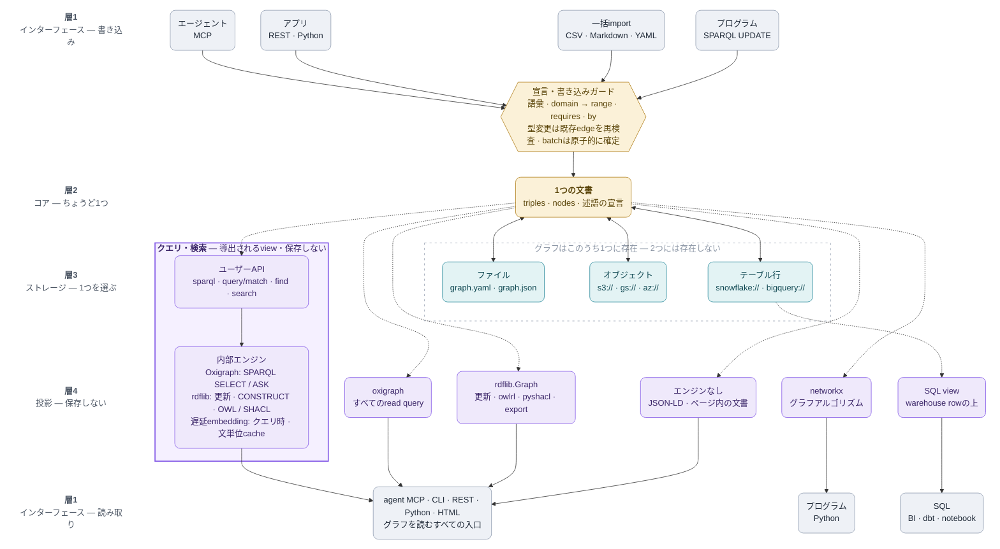

<b>日本語</b> · [English](ARCHITECTURE.md) · [日本語](ARCHITECTURE_jp.md) · [简体中文](ARCHITECTURE_zh.md)

# アーキテクチャ

1グラフは1つのYAMLまたはJSON文書です。ストレージはバイト列とversion token、コアは事実とメタデータ、アダプターはPython・CLI・MCP・HTTPを担当します。小さな組み込みグラフライブラリで、トランザクション付きRDF datasetサーバーではありません。



図は上から下へ読みます。コアは1つの文書、ストレージは選んだ保存先1つ、
投影は追加コピーではなく導出されたviewです。実際に文書を運ぶ矢印は実線、
必要なときだけ作るものは点線です。ガードは対応するAPI書き込みを守りますが、
手編集ファイルとrawな`load`/`save`は文書の形だけを検証します。

## データと投影

`Triple`はs/p/o・edge属性・任意の`rdf_terms`を保存します。既存文書は従来どおり、名前を`urn:trikedb:`配下のIRIにし（http/https/urnは絶対値）、空白入りobjectはliteralにします。明示RDF termはIRI・blank node・literalのdatatype/languageを保持します。空白入りエンティティ名にはobjectを明示IRIにしてください。

`_statements()`がRDF投影を定義し、rdflib・Oxigraph・JSON-LDが共有します。node属性はliteral、edge属性は生成blank nodeのstatementに付きます。合成メタデータはUPDATE WHEREで読めますが、SPARQLでは削除できません。NetworkXとSQL viewは文書から独立に文字列表現のproperty graphを作り、無損失RDF datasetではありません。KG_NODEはメタデータだけのnodeと全edge端点を含みます。

## 更新と失敗

ontologyが空でない場合、add・import・SPARQL INSERTは述語を検査します。HTTP(S)の絶対述語はRDF/OWL語彙用の例外です。手編集やload/saveはホワイトリストを強制せず、loadは文書の形を検証します。reloadは保存文書からontologyを再構築します。

APIが返すTriple・属性は独立したコピーです。変更はAPIを通してキャッシュを無効化してください。nodes_meta・ontology・内部フィールドの直接変更はキャッシュ整合性のある更新として未対応です。batchは本体や最終saveの失敗時に事実・属性・ontologyを戻し、入れ子にも対応します。分散トランザクションではなく、内部で明示saveした内容や外部副作用は取り消せません。

## 永続化と競合

ローカルsaveは同じディレクトリの一時ファイルをwrite/fsync後にreplaceします。既存権限とsymlink先を保ち、新規ファイルは0600です。replace前の失敗では旧内容を保持します。ディレクトリfsyncを含む停電耐性や複数プロセスCASの保証はなく、別ローカルwriterはlast-write-winsです。

S3は条件付き単一PUT（ETag/If-Matchまたは存在しない場合の作成）、SQLはversion条件と更新行数を使います。成功したwrite自身のcommit tokenを返し、保存後HEADで別writerのtokenを採用しません。S3の条件付きmultipartは未対応。他のfsspec backendにはCAS保証がありません。

1つのserve内のREST/MCPは同じTrikeDBを共有し、再入可能lockで操作を直列化します。MCPは条件付き保存の競合時にreloadして操作を再適用します。別プロセスはメモリを共有しません。Python呼出側は自分で同期し、外部編集はreloadしてください。read_onlyは公開APIを保護し、任意のPythonメモリ操作までは制限しません。

## モジュールと層

`model` は「事実とは何か」。`rules` / `rdf` / `reasoning` が文書の意味を、`storage` / `persistence` が入出力を、`audit` が出来上がった文書の読み取りを担当します。`db` はそれらを束ねたストア — メソッドは各モジュールへの委譲で、モジュール側はストアを第一引数で受け取り、`db` を import し返しません。`html` / `importers` / `embeddings` はコアの**上**に置いています: グラフが、それを描くページや、そこから組み立てられるファイル形式や、入っているとは限らない埋め込みモデルに依存してはいけないからです。`cli` / `mcp_server` / `serve` がその上の入口です。

import は上の層から厳密に下の層へ、一方向だけ。関数内 import は任意アダプタを任意のままにする手段なので依存には数えません（`db.to_html()` は呼ばれたときに `html` を import します）。`tests/test_architecture.py` が層を宣言し、コードが合わなくなればビルドが落ちます — 層を決めずに新しいモジュールを足した場合も含めて。**宣言し、それを強制する**、このライブラリがオントロジーについて主張しているのと同じことを、リポジトリ自身にも適用しています。

## クエリと対応範囲

SELECT/ASKは通常Oxigraph、CONSTRUCT/DESCRIBE・fallback・更新・OWL/SHACLはrdflibです。pattern queryは独自のマッチングです。SPARQLの曖昧な先頭はパーサーで判定し、PREFIXやコメントにも対応します。

`search()`は意味検索の投影です。現在のtripleとnode属性を文にし、クエリされたときだけembeddingを遅延生成し、グラフ文書の外に文単位の交換可能なcacheとして保持します。`find()`は広い意味検索のrecallと厳密な構造filterを組み合わせます。どちらも保存された事実を変更しません。

更新は単一default graphのINSERT/DELETEとCLEAR/DROP DEFAULTに対応します。named graph更新、WITH/USING、LOAD/CREATE/COPY/MOVE/ADDは保存前に拒否します。合成メタデータの削除には属性APIを使ってください。SPARQLの戻り値は文字列で、型付きresults protocolではありません。型付きRDFはto_rdflib/to_jsonldで取得できます。

API更新後はクエリキャッシュを再構築します。意味検索は文ごとにembeddingをキャッシュし、変更分を再計算します。保存は文書全体を書き直します。過去の速度図は記録当時の版・環境の観測で、現行版の速度保証ではありません。

## HTMLと検証

配布物はHTML1個ですがvis-networkとOxigraph WASMをCDNから取得するため、完全オフラインではありません。グラフはscript-safe JSONと文脈別DOMエスケープで出力します。描画内部は数値ID、表示は元の名前を使い、特殊名との衝突を避けます。非有限数は文字列として表示します。

tests/test_review_regressions.pyは監査での不具合とRDF・保存境界、tests/browser_smoke.pyは通常・悪意ある入力を新規ブラウザで検証します。公開前の検証はsdistと依存下限も対象にします。fake storageテストはプロトコルの検証で、実クラウド耐久性の証明ではありません。[API](REFERENCE_jp.md)と[測定条件](../benchmarks/README_jp.md)も参照してください。

### 書き込みガードが通すもの・弾くもの

ガードは自然文をLLMが読んで「もっともらしいか」を推測するものではなく、宣言に
基づく書き込み検証です。ここでいう述語は、`SHIPPED_FROM`（どこから出荷したか）や
`DELIVERED_TO`（どこへ配送したか）のような「関係の名前」です。宣言は説明だけ
（許可する関係の一覧）にも、`domain`・`range`・`requires`・`by`を持つルール
（プログラムが書き込み時に自動チェックする決まり）にもできます。事実と宣言は
同じ文書とdiffに入ります。

この判定に使っている技術は、自然言語AIやベクトル検索ではありません。TrikeDBの
Pythonコードにある決定的なルール検証器が、毎回同じ入力に同じ結果を返します。

- 関係名は宣言一覧との文字列照合で確認します。
- `domain`・`range`は、ノードに記録された種類とedgeの両端を照合します。
- `requires`は、述語と端点の索引（検索用のハッシュ表）から過去の事実を探し、
  時刻を比較します。複数段の条件は、固定長の`(主語・関係・目的語)`パターンを
  変数で結ぶ、決定的なグラフ照合です。
- `by`は担当者の有無と、分かっている担当者の種類を確認します。
- `batch()`は処理途中の状態を保存し、最後に条件を再確認します。失敗したら、
  事実・ノード情報・宣言を元の状態へ戻します。

つまり「論理的におかしい」をAIが意味で判断しているのではなく、宣言を小さな
プログラム上の条件に変換し、書き込みの直前に照合しています。`rdflib`と
`Oxigraph`は主にRDF/SPARQLのクエリ実行エンジンであり、この基本的な書き込み
ガードそのものではありません。OWL推論やSHACL検証も別の読み取り・検証機能で、
書き込みガードの代わりに曖昧な判断をするものではありません。

```yaml
ontology:
  SHIPPED_FROM: {domain: 注文, range: 倉庫}
  DELIVERED_TO:
    domain: 注文
    range: 地域
    requires: SHIPPED_FROM
    by: courier
```

```python
db.add("ORD-1", "SHIPPED_FROM", "WH-1")       # 注文から倉庫への関係なので通る
db.add("ORD-1", "DELIVERED_TO", "Tokyo",       # 担当者が指定されていないので弾く
       at="2026-09-14")
db.act("ORD-1", "DELIVERED_TO", "Tokyo",        # 先に出荷済みなら通る
       by="Courier-7", at="2026-09-14")
db.add("ORD-1", "DELIVER_TO", "Tokyo")          # 関係名の書き間違いなので弾く
```

`注文-1`や`東京`のようなノード名・値は、日本語でも自由に付けられます。
`SHIPPED_FROM`や`DELIVERED_TO`は、上の宣言と照合する関係名そのものなので、
この例では実際のコードで使われる名前を残しています。つまり、上の例は説明の
ために英語の識別子を使っていますが、実際には次のようにも書けます。

```text
db.add("注文-1", "SHIPPED_FROM", "倉庫-1")
db.act("注文-1", "DELIVERED_TO", "東京", by="配送担当-7", at="2026-09-14")
```

未宣言の関係名は保存前に拒否します。端点（関係の両端）の種類が分かっていれば、
逆向き・不適合なedgeも拒否します。`by`は「誰が担当したか」を必須にし、担当者の
種類も検査します。`requires`は「先に何が起きていなければならないか」という前提で、
時刻と、actionのどちらかの端点に必要な過去の事実を要求します。
たとえば「その注文が先に出荷され、同じ商品を含んでいること」のような複数段の前提も、
関係をたどって厳密に照合します。形式が壊れた`requires`は、実行時ではなく宣言時に
弾きます。

ファイル取り込み（import）も同じ`add()`経路を通ります。`batch()`や一括import中に
後から証拠が届き得る前提は保留し、処理の最後に再検査します。それでも失敗すれば
取り込み全体をrollback（なかったことに戻す）します。`set_node()`で後から種類を
付けた場合も既存edgeを再検査します。まだ種類が不明なら推測で拒否せず、`audit()`が
未解決として報告します。

境界も意図的です。APIの`add`・`act`、ファイル取り込み、対応するSPARQL insertは
該当する検証を強制します。一方、手編集YAMLとrawな`load()` / `save()`は文書の形と
構文だけを検証し、関係名の一覧までは検査しません。
