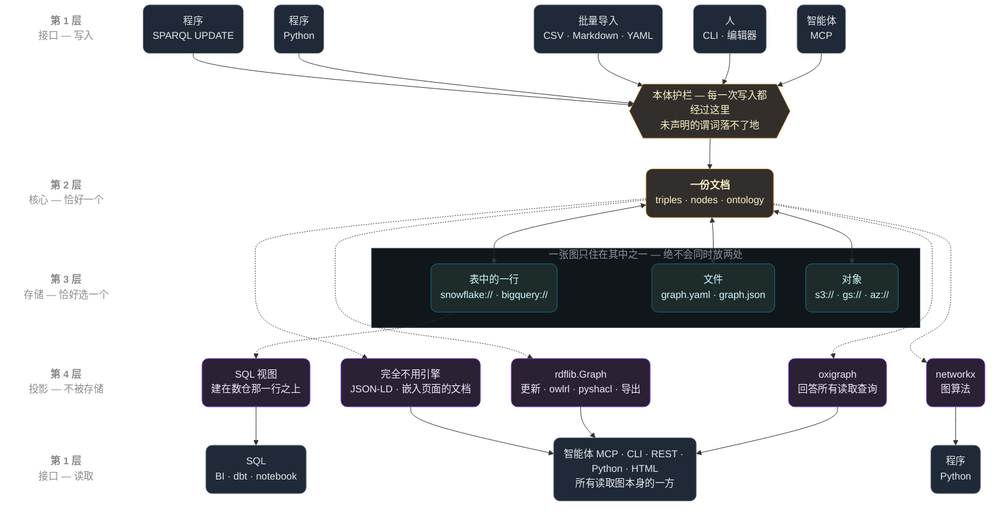
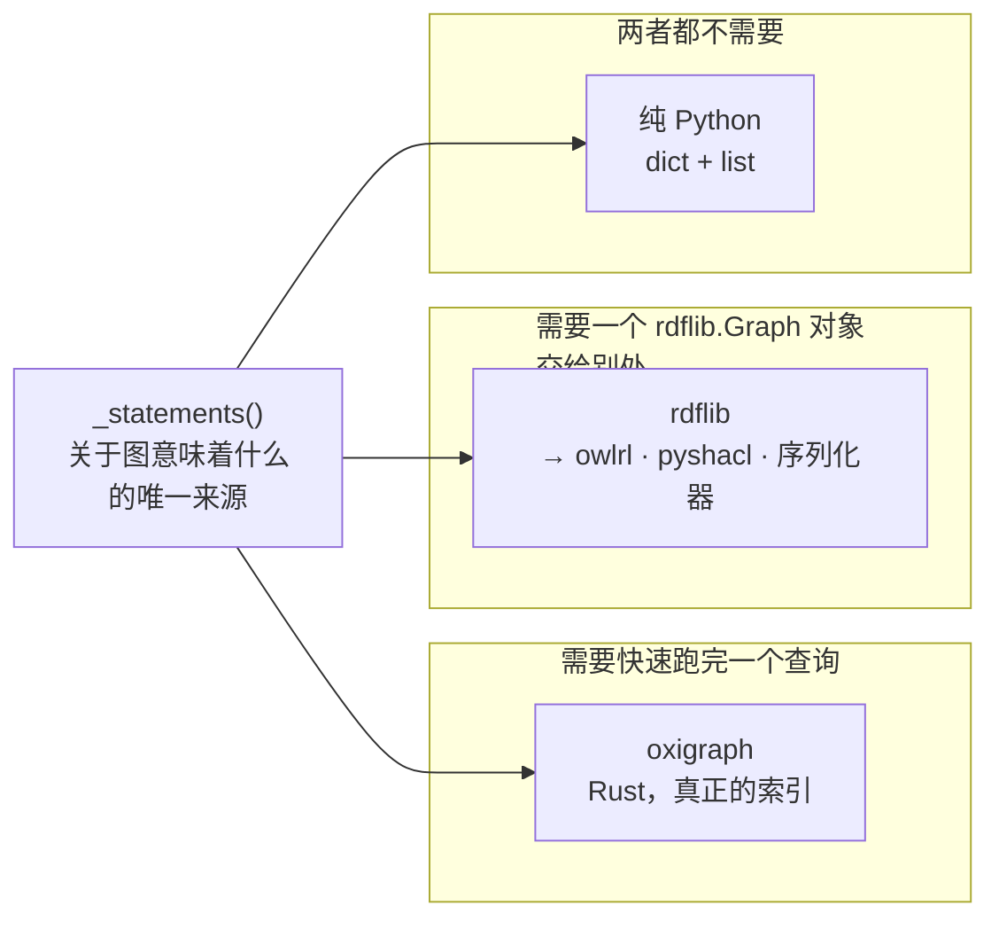
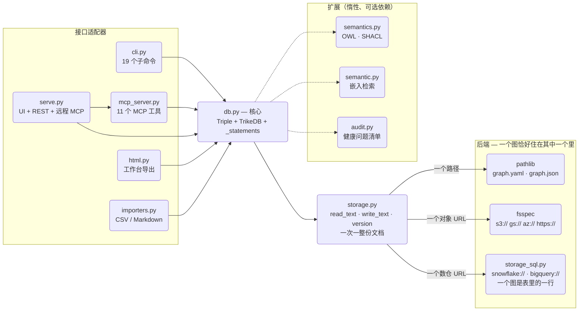

<p align="center">
  <a href="https://github.com/RyutoYoda/trikedb/blob/main/docs/ARCHITECTURE.md">English</a>
  &nbsp;·&nbsp; <a href="https://github.com/RyutoYoda/trikedb/blob/main/docs/ARCHITECTURE_jp.md">日本語</a>
  &nbsp;·&nbsp; <b>简体中文</b>
</p>

# 架构



虚线箭头表示派生 — 按需构建，用完就丢。投影与接口**不是**一对一的：
**oxigraph 回答所有读取查询，无论是哪个接口发起的** — MCP、CLI、REST、
Python、工作台页面。rdflib 是更新、OWL、SHACL 和导出器所需要的。右侧两列
才是真正独立的路径：`networkx → 图算法`、`SQL 视图 → dbt`。

| 层 | 负责什么 | *不*负责什么 |
|---|---|---|
| **1 · 接口** | 把 CLI / MCP / REST / HTML 翻译成对核心的调用 | 任何图逻辑 |
| **2 · 核心** | 文档、护栏，以及图*意味着*什么 | 字节去哪里、查询怎么执行 |
| **3 · 存储** | 是哪个目的地，以及保护它的条件写入 | 任何与含义有关的事 |
| **4 · 投影** | 同一批陈述的不同视图 — RDF、属性图、SQL | 存储任何东西 |

关于这个栈有两件事值得说出来，因为两者都是选择，而不是遗漏。

**不存在独立的元数据层。** 本体不是数据旁边的一份注册表；它是与三元组同一份文档
里的一个键。所以对词汇的修改和对事实的修改落在同一个 diff 里，也没有什么需要保持
同步。一个把含义放在数据之上一层的系统，可以在不碰数据的情况下修改它 — 当数据大
到搬不动时那是更好的取舍，而当你希望整个改动一次性可审阅时那是更差的。

**不存在持有状态的查询层。** 第 4 层是从第 2 层按需构建、用完即丢的。正是这一点让
两个 SPARQL 引擎成为可能，也是它们之间不可能发生漂移的原因。

这份文档讲的是它*为什么*是这个形状。API 见
[REFERENCE.md](REFERENCE.md)；测量数据见
[benchmarks/](../benchmarks/README_zh.md)。

## 一个决定，以及由它推出的一切

**核心之下的那一层一次搬动一整份文档。** 不是一行，不是一个增量，不是一页 —
而是整个图，以文本的形式进出。

```
storage:  read_text · write_text · exists · version
                    ↑
          one document. always.
```

trikedb 拥有的几乎每一个性质，无论好坏，都是这一行的结果：

- **目的地变得可替换。** 任何能装下一份文档的地方都能装下一个图 — 磁盘上的文件、
  桶里的对象、数仓里的一行。存储层之上的任何东西都不知道它拿到的是哪一个。
- **并发控制变成整份文档的 compare-and-swap。** 没有行锁需要设计，因为没有行；
  一次保存要么替换掉它读到的那份文档，要么被拒绝。简单，而且这也意味着不存在
  部分写入。
- **上限是几 MB。** 加一条事实会重写全部内容。这不是一个留待以后修的 bug；这是
  同一个决定，从另一面看过去。
 
能用一句话说清这笔取舍，正是重点所在。一个灵活性和限制来自*不同*地方的设计，是
一个你两样都预测不了的设计。

这个主张是被检验过的，不是断言的：加入一个根本不是文件系统的后端 — 一个作为 SQL
表中一行的图，带着网络往返和真正的事务模型 — 不需要改动 SPARQL、MCP 工具、SHACL、
OWL 推理、`to_networkx` 或 CLI 中的任何一个。`storage.py` 加一个新模块，其他什么
都没动。

## 是投影，不是翻译

一个图有很多有用的形状。trikedb 存储**一个**，并派生出其余的：

```
_statements()          ← the single source of truth for what the graph MEANS
      ├─→ rdflib graph        (the RDF view — exports, OWL, SHACL, updates)
      ├─→ oxigraph store      (the same RDF view, for fast reads)
      ├─→ networkx graph      (the property-graph view — algorithms)
      └─→ SQL views           (the table view — whatever else reads SQL)
```

它们都不被存储。它们是投影，由同一个生成器按需构建，而那个生成器决定了那些很容易
在细节上弄错的事情：哪些宾语是 URI、哪些是字面量，边属性如何具体化，哪些节点属性
浮到表面。

这很重要，因为把那些规则复制一份之后的失败模式是最糟的那一种。两个引擎对同一个图
给出*不同的*答案时，两边都看起来合理，而且什么都不会报错。保持单一事实来源让这件
事在构造上不可能，而不是靠纪律 — 这也正是第二个 SPARQL 引擎能被引入的原因。
（随后 26 种 SPARQL 形式里有 25 种完全一致；第 26 种是规范留作未定义的情形。参见
`test_engines_agree_across_the_sparql_surface`。）

同样的原则也为新功能划线：**看图的新方式是一个投影；它无权再加一份数据的拷贝。**

## 护栏在写入边界上

本体 — 一份谓词白名单 — 是在一条事实被*写入*时强制的，不是在读取时，也不是在
之后的某次 lint 过程中。每一条写入路径都经过它：Python API、CLI、CSV/Markdown
导入、SPARQL 的 `INSERT`、智能体调用的 MCP 工具、OWL 物化，以及一个手动编辑文件
的人。

其结果正是这个设计的理由：**「智能体写的」和「人写的」不可能在词汇上分叉。** 智能体
无法发明一个谓词，因为被发明出来的谓词根本落不了地。事后检查会报告这个问题；在
边界上检查意味着没有问题可报告。

这与 schema-on-read 的系统是反方向的取舍，后者接受一切，事后再赋予含义。当你要在
不是自己写的数据之上赋予含义时，那是更好的选择。当写入者是一个语言模型时，这边
才是。

## 不同功能有不同的天花板

用一个数字回答「它能多大」会造成误导，因为这些功能不是同步退化的。语义检索会在
对同一个图的 SPARQL 还在毫秒级作答时就变得不可用；工作台导出远在存储之前就变得
笨重。

这是一个设计事实，不是调参的偶然：每种能力与图谱规模的关系都不同。检索每次查询都
重新嵌入全部内容（有意不建索引，这样结果永远不会和文件产生分歧）。SPARQL 跑在一个
已建好的索引上。保存会重写整份文档。

所以对「能多大」的诚实回答是按功能给出的，而且是测量出来的，不是估计的 — 参见
[基准测试：天花板在哪里](../benchmarks/README_zh.md#天花板在哪里)。唯一*不*退化的
是 diff：一条事实的改动在任何规模下都是一行，正是这一点让审阅在「读完整个图」已经
不可能之后仍然可行。

## 所有东西究竟都在哪里

人们会按这个顺序问三个问题，所以就按这个顺序回答：什么被*存储*，*含义*保存在哪里，
以及什么在*执行查询*。

```yaml
# one file, three keys — this is the whole storage format
ontology:                       # the meaning: which predicates may exist
  predicates:
    PROVIDES: "vendor -> job"

nodes:                          # what is known about an entity itself
  crm-sync-job: {type: job, owner: data-platform}

triples:                        # the facts, with attributes on the edge
  - {s: salesflow, p: PROVIDES, o: crm-sync-job, prov: runbook.md}
```

**数据和元数据是同一份文档。** 本体不是一个模式注册表，节点属性不是一张旁表：
`triples`、`nodes` 和 `ontology` 是同一份 YAML/JSON 文档的三个键，一起保存、一起
加载。这就是为什么对词汇的修改和对事实的修改会出现在*同一个* diff 里，也是为什么
两者中任何一个变动时都不存在迁移步骤。

**除了那些字节坐在哪里，后端什么都不决定。** 打开和保存有区别；之后的一切完全
相同，因为图是从内存里作答的。一个 `snowflake://` 行和一个本地文件对同一个查询给出
同样的答案、用同样的时间 — 已测量，参见
[基准测试](../benchmarks/README_zh.md#天花板在哪里)。

| | 文档在哪里 | 什么会变 |
|---|---|---|
| `graph.yaml` | 磁盘上的一个文件 | 可以在 diff 里审阅；打开最慢 |
| `graph.json` | 磁盘上的一个文件 | 打开快约 17 倍；一份没人喜欢的 diff |
| `s3://` `gs://` `az://` | 桶里的一个对象 | 可共享，而且 S3 支持条件写入 |
| `snowflake://` `bigquery://` | 一张表的一行 | 可共享、支持条件写入，**而且能被 SQL 读取** |

只有最后一行真正增加了一项新能力：文档以 JSON 存储，而 `sql-init` 会创建把它投影成
普通表的视图（`KG_NODE`、`KG_EDGE`、`KG_PREDICATE`、`KG_TRIPLE`）。于是同一个图既
从内存回答 SPARQL，也从数仓回答 SQL，而且没有第二份拷贝。

## 哪个引擎做什么

这是关于内部实现最常被问到的问题，因为这里有两个 RDF 引擎，而它们并不可以互换。

这条分界线**不是**读与写 — 那是一个贴错的标签，它造成的混淆比解释更多。
`validate()` 和 `to_rdflib()` 什么都不写；`infer(apply=False)` 也什么都不写。真正的
问题是这个操作*需要*什么：



`owlrl` 和 `pyshacl` 是第三方库，它们的 API 接受一个 `rdflib.Graph`。`to_rdflib()`
和 `to_jsonld()` 是导出，在那里 rdflib *就是*那个格式。而 `update()` 在一个 rdflib
图上执行 SPARQL 更新，然后把结果作为差异写回存储 — 它需要那个对象，而不只是一个
答案。这些都不是一个查询引擎能替我们做的事，这也正是为什么无论替代品变得多快，
rdflib 都会留下。

| 操作 | 引擎 | 会改变图吗？ | 为什么是这个引擎 |
|---|---|---|---|
| `sparql()` — SELECT, ASK | **oxigraph** | 不会 | 只需要一个答案，而且更快：在 8,000 条三元组上实测 7–47 倍（两跳 10 倍、聚合 34 倍、FILTER REGEX 47 倍、属性路径 7 倍） |
| `sparql()` — INSERT, DELETE | rdflib | **会** | 在一个图上执行更新，然后把差异写回 |
| `infer()` — OWL-RL | rdflib | 只在 `apply=True` 时 | `owlrl` 接受一个 `rdflib.Graph` |
| `validate()` — SHACL | rdflib | 不会 | `pyshacl` 接受一个 `rdflib.Graph` |
| `sparql()` — CONSTRUCT, DESCRIBE | rdflib | 不会 | 返回的是图而不是绑定；以 `{s, p, o}` 行返回 |
| `to_rdflib()`, `to_jsonld()` | rdflib | 不会 | 导出；rdflib *就是*那个格式 |
| `triples()`, `query()` | 无 | 不会 | 在一个 Python 列表上做模式匹配 |
| `search()`, `find()` | 无 | 不会 | 静态嵌入；不涉及 SPARQL |
| `to_networkx()` | 无 | 不会 | 投影成 networkx 对象 |

那张表里只有一行会写入。把其余的归为「写入」，就是单纯地错了。

关于这条分界线有两件事值得知道。

**oxigraph 到来时没有任何东西被拿掉。** OWL 和 SHACL 从来不走查询路径 — 它们从
`to_rdflib()` 拿 rdflib 图，而那条路径没有被碰过。这是验证过的，不是假定的：两个
引擎产生完全相同的推理结果和完全相同的 SHACL 判定
（`test_engines_agree_across_the_sparql_surface` 覆盖 25 种 SPARQL 形式；第 26 种是
规范留作未定义的情形）。

**推理发生在写入时，不是查询时。** `infer(apply=True)` 运行 OWL-RL，并把推导出的
事实写进文档，打上 `inferred: true` 标签。此后它们就是普通的三元组，而查询引擎
不对任何东西做推理。这就是为什么换引擎不可能损失任何推理准确度 — 而这也是那笔
取舍：被物化的事实是一个快照，所以加入一条会蕴含更多结论的事实，意味着要再跑一次
`infer()`。这里选择了可审阅性，而不是自动的时效性。

正因如此两者都是核心依赖：rdflib 是因为 `owlrl` 和 `pyshacl` 需要它、并且更新要
通过它做差异；pyoxigraph 是因为在所有测过的图谱规模上它都更快。在 pyoxigraph 不
可用的地方 — 一个受管的包渠道、只 vendored 了部分文件 — 读取会回落到 rdflib，一切
继续工作，只是更慢。


## 各个层

依赖只向内指。



`storage.py` 按 URL 的 scheme 分派，而且**恰好只有一个分支会运行**。一个数仓图谱
永远不会碰到 fsspec；一个对象存储图谱永远不会打开数据库连接。它们是彼此的替代，
不是一条流水线，而且没有任何东西被存两次。

- **`db.py` — 核心。** `Triple` 模型和 `TrikeDB` 存储：带本体强制的 CRUD、模式
  匹配、SPARQL、工作区并集，以及 `_statements()` — 上文说的那个投影来源。它还决定
  *哪个引擎*来回答一次读取，以及一个目的地想要*哪种序列化*；参见「哪个引擎做
  什么」。它只依赖 `storage` 和（惰性的）`semantics`。这里永远不会有 HTTP、CLI 或
  HTML。
- **`storage.py` — 那个接口及其分派器。** 任何关于*字节住在哪里*的事 — 新的
  scheme、乐观锁、缓存、一个目的地想要哪种序列化 — 都属于这里，而且不属于别处。
- **`storage_sql.py` — 建在一张 SQL 表之上的同一个接口。** 数据库不是文件系统，
  所以它不去找 fsspec：一个图是一行（`name`、`doc`、`version`、`updated_at`），
  而一张表装很多个图，所以采用 trikedb 让一个组织付出的是一张表，而不是每个图
  一张。这里实现了两个引擎 — `snowflake://` 和 `bigquery://` — 而两者做法不同的
  一切都住在一个 `_Dialect` 里，它是*数据*：

  | | Snowflake | BigQuery |
  |---|---|---|
  | 打开 JSON | `TRY_PARSE_JSON` + `LATERAL FLATTEN` | `SAFE.PARSE_JSON` + `JSON_QUERY_ARRAY` + `UNNEST` |
  | 参数 | 位置式 `%s` | 命名式 `%(name)s` |
  | 标识符 | `A-Za-z0-9_$`，不加引号 | 允许连字符，用反引号引用 |
  | 哈希 | `MD5(...)` | `TO_HEX(MD5(...))` |

  加入 BigQuery 的代价是一个 `_Dialect` 字面量，外加三件共享代码原以为是普适的
  东西 — 一条标识符规则、一处引用的位置、一个参数顺序。这三件都是*静默*失败而不是
  报错，这正是那段变更历史里有意思的部分。

  有两件事在这里比在对象存储上落得更干净。乐观锁进到语句内部
  （`UPDATE ... WHERE version = ?`），于是一次冲突是受影响行数为零，而不是一条
  需要去做模式匹配的错误消息 — 已在两个引擎上验证行为一致。而且这份文档*可以被
  别的工具读取*：它以 JSON 存储，四个视图把它投影成普通表（`KG_NODE`、`KG_EDGE`、
  `KG_PREDICATE`、`KG_TRIPLE`），于是任何会说 SQL 的东西都能查询这个图，而不需要
  知道 trikedb 的存在。

  需要知道的取舍：数据库通常按*表*串行化写入，而对象存储按对象串行化。一张表装
  很多个图，意味着写入互不相关的图的人仍然会排在彼此后面。在一个人或一个智能体
  编辑图的速率下这是无害的；它确实意味着需要比对象存储更宽松的重试预算。
- **`semantics.py` — 可选的语义层。** OWL 声明与 OWL-RL 物化、SHACL 校验。惰性
  导入；没有它们核心依然可用，而失败会说出该装哪个附加项。
- **`semantic.py` — 可选的嵌入检索。** 有意不建索引：每次查询都重新嵌入整个图，
  所以一个结果永远不可能和文件不一致。这个选择也是检索拥有最早的那个天花板的
  原因 — 一份看得见的代价，而不是一份隐藏的代价。
- **接口适配器** — 每一个都是把核心 API 薄薄地翻译到一种媒介上；它们都不包含图
  逻辑：
  - `cli.py`：argparse 的命令，每个子命令一个 `_cmd_*`。
  - `mcp_server.py`：FastMCP 的服务器定义。传输由调用方选择 — stdio 和 Streamable
    HTTP 共享这同一份定义。
  - `serve.py`：HTTP 层的组合 — 工作台 UI、`/sparql` REST、挂载的 MCP 应用，外面
    包一层认证。
  - `html.py`：那个自包含的工作台页面，从图数据生成。
  - `importers.py`：确定性的 CSV/TSV/Markdown 表格摄取。

## 改动时的经验法则

- **`storage.py` 必须保持可以单独 import。** trikedb 会以部分文件的形式被 vendored
  进那些装不了包的宿主环境，所以 `db.py` + `storage.py` + `__init__.py` 必须是一个
  能工作的安装。只有数仓 URL 才可以去碰 `storage_sql` — 这也是为什么那些 SQL
  scheme 是在 `storage.py` 里*写出名字*，而不是从它那里 import。这一点曾被一个无
  条件的 import 破坏过一次；它把「打开一个本地文件」变成了 ImportError。
- **存储一个图的新方式** → `storage.py`（文件系统形状的后端）或 `storage_sql.py`
  里的一个 `_Dialect`（表形状的）。永远不要放在这两个文件之上。
- **看一个图的新方式** → 建在 `_statements()` 之上的一个投影。如果它需要自己那份
  数据拷贝，那就是该停下来重新考虑的信号。
- **新的*推理或校验*** → `semantics.py`，以一个转发方法的形式暴露，藏在一个可选
  附加项后面。
- **和一个图*对话*的新方式**（协议、格式、UI）→ 一个新的适配器模块加一个 CLI
  子命令。永远不要从一个适配器 import 另一个；在一个 `serve.py` 风格的模块里做
  组合。
- **智能体能做的任何事都必须在三种接口里都存在** — Python API、CLI、MCP。对等
  不是巧合，而是一项功能。这也是最容易被无意破坏的规则：`find` 在 API 和 MCP 里存在，却有好几个版本没有对应的 CLI 子命令——规则写着，同时又被违反着。
- **缓存首先是一个正确性问题，其次才是一个速度问题。** 这里有两个：构建好的查询图，
  以及 `add()` 背后的 `(s, p, o)` 索引。两者在过期时都是*静默*失败 — 从一个已经
  变过的图上作答，或者判定一条三元组已经存在从而丢掉这次写入。所以失效处理是有意
  过度积极的，而且每一条替换三元组列表的路径都会显式清掉它们。长度检查是最后一道
  防线，绝不是那个机制：两个不同的列表可以有相同的长度。
- **重依赖都是可选附加项。** 核心是 PyYAML、rdflib 和 pyoxigraph。pyoxigraph 靠
  在所有测过的图谱规模上（一直下探到几百条三元组）都更快而赢得了这个位置；rdflib
  留下是因为 `owlrl` 和 `pyshacl` 接受 rdflib 图，而更新要通过其中一个做差异。
- **关于行为的主张会配一个测试；关于速度的主张会配一个基准测试。** 那两个目录之所以
  存在，就是为了让 README 里的一句话可以被核对，而不是被相信。
