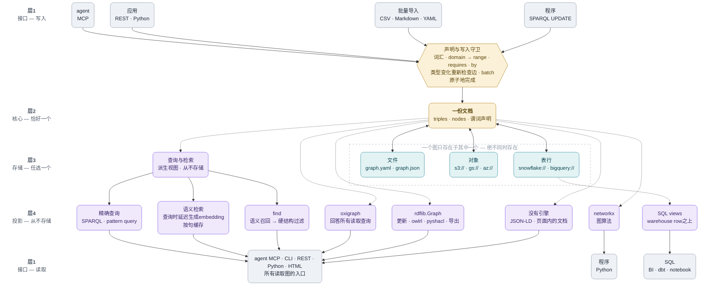

<b>简体中文</b> · [English](ARCHITECTURE.md) · [日本語](ARCHITECTURE_jp.md) · [简体中文](ARCHITECTURE_zh.md)

# 架构

一个图对应一份YAML或JSON文档。存储层负责字节与版本令牌，核心负责事实与元数据，适配器提供Python、CLI、MCP和HTTP。这是小型嵌入式图库，不是事务型RDF dataset服务器。



按从上到下阅读：核心是一份文档，存储是选定的一个目的地，投影是按需生成的
视图，而不是额外副本。实线表示文档移动或持久化，虚线表示按需生成。守卫保护
受支持的 API 写入；手工编辑的文件以及原始`load`/`save`只进行文档形状验证。

## 数据与投影

Triple保存s/p/o、边属性和可选rdf_terms。旧文档保留原映射：名称变为urn:trikedb:下的IRI（http/https/urn保持绝对值），含空白的object为literal。显式RDF term保留IRI、blank node、literal的datatype/language。含空格实体应显式声明IRI object。

_statements()定义rdflib、Oxigraph和JSON-LD共享的RDF投影。节点属性是literal，边属性挂在生成的blank-node statement上。UPDATE WHERE能读取合成元数据，但SPARQL不能删除它们。NetworkX和SQL view分别从文档构建词法property graph，不是无损RDF dataset。KG_NODE包含仅有元数据的节点及所有边端点。

## 更新与失败

非空ontology在add、import、SPARQL INSERT时检查谓词；HTTP(S)绝对谓词是RDF/OWL词汇的例外。手工编辑及load/save不强制白名单，load只验证文档形状。reload从存储文档重建ontology。

API返回的Triple和属性是独立副本。通过API修改以使缓存失效；直接修改nodes_meta、ontology或内部字段不提供缓存一致性。batch在其主体或最终save失败时回滚事实、属性及ontology，也支持嵌套。它不是分布式事务，内部显式save及外部副作用不能撤销。

## 持久化与并发

本地save先写入同目录临时文件并fsync，再replace。保留已有权限和symlink目标，新文件权限0600。replace前失败保留旧内容。不保证目录fsync级断电耐久性或多进程CAS；独立本地writer仍为last-write-wins。

S3使用条件单次PUT（ETag/If-Match或不存在时创建），SQL使用version条件和影响行数。write返回自身提交token，保存后不通过HEAD误用其他writer的token。S3条件multipart不支持，其他fsspec后端无CAS保证。

同一serve进程中的REST/MCP共享TrikeDB并在可重入锁下串行操作。MCP遇到条件保存冲突后reload并重放操作。不同进程不共享内存；Python调用者须自行同步，外部编辑须reload。read_only保护公开API，不限制任意Python内存操作。

## 模块与分层

`model` 定义事实本身。`rules` / `rdf` / `reasoning` 说明文档的含义，`storage` / `persistence` 负责读写，`audit` 读取成品文档。`db` 是它们合起来的那个存储——它的方法都在向这些模块委派，而模块把存储当第一个参数收下，不会反过来 import `db`。`html` / `importers` / `embeddings` 放在核心**之上**：图谱不该依赖画它的那张页面，不该依赖它可以从哪些文件格式构建，也不该依赖一个未必装了的嵌入模型。`cli` / `mcp_server` / `serve` 是最上层的入口。

import 只能从高层指向严格更低的层，单向。函数内部的 import 是让可选适配器保持可选的手段，因此不算依赖——`db.to_html()` 在被调用时才 import `html`。`tests/test_architecture.py` 声明了这些层，代码一旦对不上就让构建失败，包括新增模块却没有给它定层的情况。**声明出来，并且强制执行**——这正是这个库对本体所主张的那件事，用在了仓库自己身上。

## 查询与边界

SELECT/ASK通常由Oxigraph执行；CONSTRUCT/DESCRIBE、fallback、更新、OWL/SHACL由rdflib执行。pattern query使用核心匹配代码。存在PREFIX或注释的模糊SPARQL开头通过解析器分派。

`search()`是语义检索投影：它把当前triple和节点属性转换为句子，只有查询时才延迟生成embedding，并把向量作为图文档之外、可替换的逐句缓存保存。`find()`把宽泛的语义召回与精确的结构过滤组合起来；两者都不会修改已存储的事实。

更新支持单一default graph的INSERT/DELETE及CLEAR/DROP DEFAULT。named graph、WITH/USING、LOAD/CREATE/COPY/MOVE/ADD在持久化前拒绝。合成元数据通过属性API修改。SPARQL返回词法字符串，不是完整的带类型results protocol；类型信息请使用to_rdflib/to_jsonld。

API更新使查询缓存失效。语义搜索按句缓存embedding，只重新编码变化内容。保存仍重写整个文档。历史速度图描述当时的版本和硬件，不保证当前性能。

## HTML与验证

工作台可作为一个HTML文件分发，但依赖CDN的vis-network和Oxigraph WASM，并非完全离线。图数据使用script-safe JSON及按上下文转义的DOM输出。内部绘图ID为数值，显示保留原名称，避免特殊名冲突。非有限数值显示为文字。

tests/test_review_regressions.py覆盖审计问题及RDF/存储边界；tests/browser_smoke.py在新浏览器中测试正常和恶意数据。发布前验证也测试sdist及依赖下限。fake storage测试说明协议行为，不证明云服务耐久性。参见[API](REFERENCE.md)与[测量限制](../benchmarks/README_zh.md)。

### 写入守卫接受和拒绝什么

守卫不是让LLM阅读自然语言、猜测事实是否“听起来合理”，而是基于声明的写入检查。
声明可以只是描述（允许的词汇），也可以带有`domain`、`range`、`requires`和`by`
（强制约束）。事实与声明位于同一份文档和diff中。

```yaml
ontology:
  SHIPPED_FROM: {domain: order, range: warehouse}
  DELIVERED_TO:
    domain: order
    range: region
    requires: SHIPPED_FROM
    by: courier
```

```python
db.add("ORD-1", "SHIPPED_FROM", "WH-1")       # 类型匹配则接受
db.add("ORD-1", "DELIVERED_TO", "Tokyo",       # 没有by：拒绝
       at="2026-09-14")
db.act("ORD-1", "DELIVERED_TO", "Tokyo",        # 已发货后接受
       by="Courier-7", at="2026-09-14")
db.add("ORD-1", "DELIVER_TO", "Tokyo")          # 未声明名称：拒绝
```

未声明的谓词在落地前拒绝。端点类型已知时，方向错误或不兼容的边也拒绝：声明为
`order -> warehouse`的关系不能反写为`warehouse -> order`。`by`要求执行者并检查其
已知类型；`requires`要求时间，并要求action任一端点上存在更早的前置事实。像
`?order PLACED_BY ?s`与`?order CONTAINS ?o`这样的多步条件会进行精确匹配。格式错误
的`requires`在声明时拒绝，不会拖到运行时变成无法满足的规则。

import使用同一个`add()`路径。在`batch()`或批量导入期间，可能稍后到达证据的前置条件
会暂存，并在batch结束时重新检查；仍失败时整个batch回滚。`set_node()`稍后添加类型时
也会重新检查已有的边。类型未知时不靠猜测判为无效，而由`audit()`报告未解决的情况。

边界是有意设计的：API的`add`、`act`、import及受支持的SPARQL insert执行适用的检查。
手工编辑的YAML以及原始`load()` / `save()`只检查形状和语法，不执行谓词白名单。
