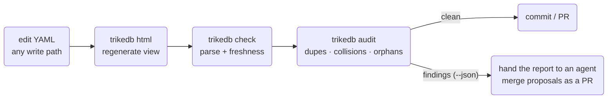

# trikedb Reference

[日本語版はこちら / Japanese version](REFERENCE_jp.md)

Every feature, and how to use it. For the design rationale see
[ARCHITECTURE.md](ARCHITECTURE.md); for benchmark methodology see
[benchmarks/](../benchmarks/).

## The big picture


## The file format

One YAML file is the database. Three top-level keys; only `triples` is
required:

```yaml
ontology:              # optional predicate whitelist (+ descriptions)
  predicates:
    PROVIDES: "SaaS vendor -> ingestion job"

nodes:                 # optional free-form node properties
  salesflow-crm: {type: saas, label: SalesFlow, url: "https://...", plan: enterprise}

triples:
  - {s: salesflow-crm, p: PROVIDES, o: crm-sync-job}          # compact form
  - s: crm-sync-job                                            # any extra keys
    p: INGESTS_TO                                              # become edge
    o: RAW_CRM_CONTACTS                                        # attributes
    schedule: hourly
    prov: "design_doc.md"
```

Conventions worth adopting: `prov:` (where a fact came from),
`deprecated: true` (rendered dashed), change events as dated free-text
objects on an `AFFECTED_BY` predicate.

**Workspace files** union many graphs read-only:

```yaml
graphs:                # local paths and remote URLs mix freely
  finance:  finance.yaml
  platform: s3://team-bucket/kg/platform.yaml
```

Every triple in a union carries a `graph:` attribute naming its source;
shared node names auto-join across members; writes are refused with a
pointer to the member files.

## Properties and labels

There are three places to attach information, and knowing which to use
keeps a graph clean:

| Where | How many | Set with | Good for |
|---|---|---|---|
| **Node properties** | unlimited keys per node | `set_node()` / `trikedb node -a` | facts about the entity itself: `url`, `owner`, `schema`, `pii`... |
| **Edge attributes** | unlimited keys per triple | `add(..., **attrs)` / `-a k=v` | facts about the *relationship*: `schedule`, `prov`, `deprecated`, `since`... |
| **More triples** | unlimited | `add()` | anything another entity shares, or that you want to query |

Three node-property keys have UI meaning (one value each):

```python
db.set_node("svc-etl-01",
    label="etl-bot",    # display name in the workbench (the node ID stays the key — never rename IDs, edges point at them)
    type="bot",         # color group + legend entry
    level=2)            # column in the flow layout (only honored when every node has one)
db.set_node("svc-etl-01", owner="data-platform", pii=False)   # set_node merges — add keys any time
```

```bash
trikedb node graph.yaml svc-etl-01 -a label=etl-bot -a type=bot -a pii=false   # true/false become booleans
trikedb node graph.yaml svc-etl-01          # show everything known about the node
```

**Multi-valued facts: prefer triples over list properties.** A node can
hold a list (`aliases: [Tokyo, TYO]`), but each value as its own triple
is queryable in SPARQL and joins across graphs:

```python
db.add("tokyo", "HAS_ALIAS", "TYO")     # SELECT ?a WHERE { t:tokyo t:HAS_ALIAS ?a } works
```

Rule of thumb: *metadata about the node itself → property; anything
shared, counted, or queried → triple.* Node properties are exposed to
SPARQL too (as literals: `?x t:type \"bot\"`), and since predicates are
just names, even a predicate can carry properties
(`db.set_node("PROVIDES", since="2024")`) — the RDF way.

## Python API

```python
from trikedb import TrikeDB, Triple, OntologyError
db = TrikeDB("graph.yaml", ontology={...}, autosave=False)
```

| Method | What it does |
|---|---|
| `add(s, p, o, **attrs)` | Upsert a triple (same s,p,o merges attrs). Raises `OntologyError` for undeclared predicates; absolute-URI predicates are exempt (OWL meta-statements) |
| `remove(s=, p=, o=)` | Remove all matches; returns count |
| `triples(s=, p=, o=, **attrs)` | Pattern match. `None` = wildcard, `*`/`?` glob, attrs filter exactly |
| `query([patterns])` | Multi-pattern joins with `?variables` (SPARQL-style BGP, zero deps) |
| `sparql(q)` | Full SPARQL 1.1 via rdflib. SELECT→rows, ASK→bool, INSERT/DELETE→net triple delta |
| `update(q)` | SPARQL Update explicitly (what `sparql` routes write forms to) |
| `subjects(p=, o=)` / `objects(s=, p=)` / `predicates()` / `nodes()` | Distinct term helpers |
| `set_node(name, **props)` / `node(name)` | Node properties (unlimited keys; `label`/`type`/`level` have UI meaning). Queryable in SPARQL as literals |
| `import_file(path)` | Merge from CSV/TSV (s,p,o header), Markdown (s/p/o tables), or another YAML graph |
| `declare(pred, characteristic)` | OWL semantics: `transitive` / `symmetric` / `functional` / `inverse_of:X` — stored as a reviewable triple |
| `infer(apply=False)` | OWL-RL materialization; `apply=True` adds facts tagged `inferred: true` |
| `validate(shapes)` | SHACL via pySHACL → `(conforms, report)` |
| `audit()` | Health findings (see `trikedb audit` below) |
| `content_hash()` | Stable fingerprint of graph content (embedded in HTML exports) |
| `to_html(path, title=, event_predicates=, layout=)` | Interactive workbench (see below) |
| `to_rdflib()` / `to_jsonld()` | Interop exports |
| `save(path=)` | Write YAML (local or remote URL). `autosave=True` does this on every mutation |
| `.workspace` / `.read_only` / `.ontology` / `.path` | State attributes |

## CLI

Everything the API can do (`pip install trikedb`, or `uvx --from trikedb trikedb ...`):

| Command | Purpose |
|---|---|
| `trikedb add FILE S P O [-a k=v]...` | Add a triple with attributes |
| `trikedb rm FILE [-s] [-p] [-o]` | Remove matching triples |
| `trikedb query FILE -w "?s PRED ?o" [-w ...]` | Pattern joins (table or `--json`) |
| `trikedb sparql FILE "SELECT/INSERT..."` | SPARQL 1.1 read & write (writes persist) |
| `trikedb import FILE SRC...` | Merge CSV/TSV/Markdown/YAML sources |
| `trikedb node FILE NAME [-a k=v]...` | Show a node (props + edges) or set properties |
| `trikedb ontology FILE [--set P=desc]` | Show / extend the predicate vocabulary |
| `trikedb stats FILE` | Triples per predicate, node count |
| `trikedb html FILE [-o] [--title] [--events P1,P2] [--layout auto\|flow\|free]` | Export the workbench |
| `trikedb jsonld FILE` | JSON-LD to stdout |
| `trikedb validate FILE SHAPES.ttl` | SHACL; exit 1 on violations (CI-friendly) |
| `trikedb infer FILE [--apply]` | OWL-RL inference; `--apply` persists tagged facts |
| `trikedb check FILE [--html PATH]` | Parse check + stale-HTML detection via embedded content hash |
| `trikedb audit FILE [--json] [--strict]` | Health findings; exit 1 on errors (`--strict`: warnings too) |
| `trikedb mcp FILE` | MCP server over stdio |
| `trikedb serve FILE [--host] [--port] [--token]` | UI + REST + MCP over Streamable HTTP |

All `FILE` arguments accept local paths, `s3://`/`gs://`/`https://`
URLs (`[remote]` extra), and workspace files.

## MCP: the ontology layer for agents

Nine tools, one server definition, two transports:

| Tool | Kind | Notes |
|---|---|---|
| `sparql` | read/write | prefix `t:` pre-bound; updates persist |
| `match` | read | pattern matching with attrs |
| `get_node` | read | props + outgoing/incoming edges |
| `ontology` / `stats` | read | vocabulary / summary |
| `add_triple` / `set_node` / `remove_triples` | write | ontology-guarded, autosaved |
| `import_source` | write | deterministic file ingestion |

```bash
# local (stdio) — the agent session spawns the server
claude mcp add kg -- uvx --from 'trikedb[mcp]' trikedb mcp /abs/path/graph.yaml

# remote (Streamable HTTP) — one server, whole team
trikedb serve s3://team-bucket/kg/graph.yaml --port 8080 --token $SECRET
claude mcp add kg https://kg.internal:8080/mcp --transport http \
  --header "Authorization: Bearer $SECRET"
```

`trikedb serve` exposes three doors from one process: `/` (workbench UI,
always current), `/sparql` (REST: `POST {"query": ...}` → JSON), `/mcp`.
v1 auth is a single static Bearer token.

## The HTML workbench

`to_html()` / `trikedb html` produce a self-contained page:

- force-directed clusters or left-to-right flow (`--layout auto` picks
  by graph shape); workspaces tile each member graph into its own cell
  with per-graph filter chips
- click a node → detail panel (all properties, URLs linkified, in/out edges)
- full-text search over node ids, labels, node properties, edge
  attributes and free-text facts — type for a live count,
  Enter/Shift+Enter cycles hits, and **→SPARQL** turns the search into
  an editable CONTAINS query in the console
- in-browser SPARQL console (Oxigraph WASM, loaded from CDN on demand)
- change events as red diamonds + a bottom timeline bar
  (`--events AFFECTED_BY` to pin which predicates count)
- light/dark toggle (persisted), content hash embedded for `trikedb check`

## Remote graphs

`TrikeDB("s3://bucket/kg/graph.yaml")` — reads and writes through
fsspec (`[remote]` extra). Auth is delegated to the standard AWS
credential chain (env vars, profiles, SSO, IAM roles); trikedb stores
no credentials and your bucket policy is the access control.
Concurrency is last-write-wins: point writers through one MCP/serve
process or git-reviewed batches.

## Validation & inference

- **SHACL** (`[shacl]`): real shape constraints — cardinality, value
  ranges — against the `urn:trikedb:` namespace. `trikedb validate` is
  CI-ready.
- **OWL-RL** (`[owl]`): declare characteristics, materialize what
  follows. Inference is *materialization, not magic*: derived facts land
  in the YAML tagged `inferred: true`, reviewable in the diff. For
  ad-hoc transitivity, SPARQL property paths (`t:INHERITS+`) need no
  OWL at all.

## Keeping a growing graph healthy



`audit` is deterministic on purpose; semantic near-duplicates beyond its
heuristics are an agent's job, with the ontology guard keeping whatever
the agent writes inside your vocabulary.

## Extras

| Extra | Adds | Dependencies |
|---|---|---|
| *(core)* | everything above except ↓ | PyYAML, rdflib |
| `[mcp]` | `trikedb mcp` (stdio) | mcp (1.x) |
| `[serve]` | `trikedb serve` | mcp, uvicorn, starlette |
| `[remote]` | `s3://` etc. | fsspec, s3fs |
| `[shacl]` | `validate` | pyshacl |
| `[owl]` | `declare` / `infer` | owlrl |
