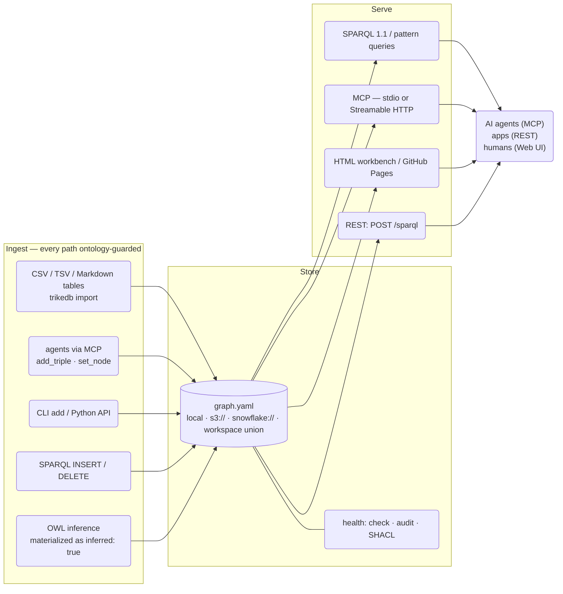

<b>English</b> · [English](REFERENCE.md) · [日本語](REFERENCE_jp.md) · [简体中文](REFERENCE_zh.md)

# trikedb Reference

Every feature, and how to use it. For the design rationale see
[ARCHITECTURE.md](ARCHITECTURE.md); for benchmark methodology see
[benchmarks/](../benchmarks/).


**Compatibility and safety contract.** This is one default graph: SPARQL reads plus default-graph INSERT/DELETE and CLEAR/DROP, with named-graph/dataset updates rejected. Legacy objects containing whitespace are literals; use `rdf_terms={"o": {"kind": "iri"}}` for an entity such as `New York`. SPARQL-inserted RDF types, language tags and blank nodes now survive save/reload. RDF/JSON-LD exports preserve the RDF projection, including metadata; pattern/NetworkX/SQL views use lexical names.

API-returned triples/properties are snapshots; use mutation APIs, not edits to returned objects. `batch()` rolls back its in-memory state on body or final-save failure; explicit saves/external effects inside it cannot be undone. `reload()` uses the stored ontology. The whitelist applies to API insertions when configured, with HTTP(S) predicate exceptions; manually edited files are not schema-checked on load.

Local writes replace complete files atomically but independent local processes are last-write-wins. One HTTP server shares and serializes REST/MCP state; external edits still require reload. S3/SQL conditional saves use the token returned by their own commit. Other fsspec backends lack that guarantee. Exported HTML requires network access to vis-network/Oxigraph CDNs. See [the API contract](https://github.com/RyutoYoda/trikedb/blob/main/docs/REFERENCE.md).


**Performance numbers below are historical measurements on their recorded hardware and version, not freshly measured guarantees for this release.**

## The big picture



## The file format

One YAML file is the database. Three top-level keys; only `triples` is
required:

```yaml
ontology:              # optional predicate whitelist (+ descriptions)
  predicates:
    PROVIDES: "SaaS vendor -> ingestion job"   # a description documents
    # a shape is enforced: the edge written between the wrong node types
    # is refused on the way in, not stored and reported later
    INGESTS_TO: {description: "job -> table", domain: job, range: table}

nodes:                 # optional free-form node properties
  salesflow-crm: {type: saas, label: SalesFlow, url: "https://...", plan: enterprise}

triples:
  - {s: salesflow-crm, p: PROVIDES, o: crm-sync-job}          # compact form
  - s: crm-sync-job                                            # any extra keys
    p: INGESTS_TO                                              # become edge
    o: RAW_CRM_CONTACTS                                        # attributes
    schedule: hourly
    prov: "design_doc.md"
```

Conventions worth adopting: `prov:` (where a fact came from),
`deprecated: true` (rendered dashed), and change events written on the
node they changed — an `AFFECTED_BY` triple whose subject is that node,
carrying `at:` (when), `by:` (who) and `state:` (what it left behind).

Write those through `act()` rather than `add()`: it stamps the time,
appends the event and moves the node to the state that action left it
in, as one write. An event's identity includes its time, so the same
action run twice leaves two records — appending to a log can never
overwrite it.

A predicate declaration can be a description (a comment; nothing checks
it) or a shape (`domain` = the node type allowed as the subject,
`range` = the type allowed as the object), which is enforced by every
write path: `add`, `act`, SPARQL `INSERT`, the MCP tools and the CLI.
The check runs only where the endpoint's type is known — types are
written after the edges that use them as often as before — and
`set_node` runs the same check from the node's side, so the order the
two were written in cannot decide whether the graph obeys its own
ontology. What no write path could check yet, `audit` reports as
`unchecked-link`; a contradiction that got in some other way (a
hand-edited file, a declaration added afterwards) is an error finding.

A shape says what an action may connect. Two further keys say **when it
may run** and **who may run it**, which is the half a type check cannot
reach — an order delivered before it shipped breaks no type, and a price
change approved by nobody is type-correct:

```yaml
ontology:
  predicates:
    SHIPPED_FROM: {description: "order -> depot", domain: order, range: depot}
    DELIVERED_TO:
      description: "order -> where it was handed over"
      domain: order
      range: region
      requires: SHIPPED_FROM     # this has to have happened first
      by: courier                # and this is who may do it
```

`requires` names a predicate that must already have happened, no later
than the action being written, to something the action touches; a list
means all of them, because that is what the word says. **Touches**, and
not "is the subject of", because promotion moves the thing an action is
about from one end of the edge to the other, and it does so in both
directions:

- the *required* event gets promoted — a retirement with a reason and an
  approver is written `RET-0007 RETIRED "Copper Kettle"`, leaving the
  kettle with no `RETIRED` of its own;
- the *action itself* gets promoted — `MIT-0007 MITIGATED INC-2025-01`
  makes the mitigation its own subject, and a mitigation created this
  moment has no history to ask about. The incident that had to have been
  raised first is on the far side.

So both ends of both edges are read, the way `history()` reads a node.
Restricting either to subjects would make preconditions stop holding in
exactly the case promotion exists for. An action carrying no time is
refused outright: "before" is otherwise a question nothing can answer.

Preconditions cross member graphs. In the demo `SHIPPED_FROM` is declared
to require `PLACED_BY`, and the two live in different files — the union is
where an order's story is whole, and it is the union that `audit` reads.

`by` names the node type of whoever performed it, checked against the
`by=` attribute. Declaring it makes an actor mandatory — an action nobody
signed is a type-correct hole in the audit trail.

### Conditions that span more than one step

One edge is often not enough to say what makes an action legal. "A review
may only be written by someone who bought the thing" is `PLACED_BY`
joined to `CONTAINS`, and the order in the middle is named by neither end
of the review, so no single-edge check can reach it. Write the steps as
`(s p o)` patterns instead of a name, and they join on their shared
variables — `?s` and `?o` stand for the two ends of the action itself:

```yaml
    REVIEWED:
      description: "customer -> product they rated"
      domain: customer
      range: product
      requires:
        - "?order PLACED_BY ?s"
        - "?order CONTAINS ?o"
```

Quote them: in YAML flow style a leading `?` is the explicit-key marker.
A `requires` entry is one term or three; anything else is refused when
the declaration is read, rather than kept as a predicate name nothing can
ever match.

The clock applies to every step, and a step carrying no date — `CONTAINS`
here — is simply already true rather than something that happened that
day. When a condition fails, the message names **which step** came up
empty and whether it was empty by then or empty at all, because a
three-step condition is only debuggable if it says where it broke:

```
REVIEWED is declared to require (?order PLACED_BY ?s; ?order CONTAINS ?o)
first, but for (TC-1008 REVIEWED Cast Iron Skillet 26cm) nothing
satisfies (?order CONTAINS ?o) at all
```

That customer is real, the product is real, both types are right, and the
date is plausible. A type check passes it; the condition does not.

### When the answer is not final yet

`requires` is **monotone**: writing more triples can satisfy a condition,
never break one. So a condition that fails on a half-built graph is
evidence that has not been written yet, not a violation — and the only
thing that can be wrong about refusing it is the timing of the refusal.

That is what decides where each check lives. What the triple settles by
itself — a missing `by=`, an action with no time — is refused where it is
written, because nothing written later repairs it. What needs the rest of
the graph is refused where it is written too, *unless a batch is open*, in
which case the graph is still being assembled: the question is held and
asked again on the way out, where the graph is whole and the answer is
final. Nothing is skipped either way; only the moment the exception
arrives moves. A bulk load therefore enforces its conditions without the
order of its lines ever deciding the outcome, and a failure rolls the
whole block back rather than leaving a half-applied import behind.

Both follow the same two-stage discipline as `domain`/`range`: `add` and
`act` refuse what the graph in front of them can settle, and `audit` reads
the finished file for the rest — asking `_unmet`, the same call the write
path makes, so the two cannot drift apart. `precondition-unmet`,
`action-has-no-actor` and `actor-contradicts-declaration` are errors,
`unchecked-actor` (an actor nobody has typed yet) a warning. Loading is
never rejected on line order; the clock decides what came first.

Conditions are indexed by predicate *and* by the node at either end, so a
step that already knows one of its ends goes straight to the handful of
triples that touch it. A two-step condition costs about 50µs to check
whether the graph holds a thousand triples or two hundred thousand —
which is what makes it affordable to enforce on every write rather than
only in `audit`.

Edge attributes are **SPARQL-queryable**: every attributed triple is
also exported as a standard RDF reification (a statement resource with
`rdf:subject/predicate/object` plus the attributes), so the operational
gold — notes, provenance, schedules — can be filtered and joined, not
just read:

```sparql
# every fact sourced from a given doc
SELECT ?s ?p ?o WHERE {
  ?st rdf:subject ?s ; rdf:predicate ?p ; rdf:object ?o ;
      t:prov "design_doc.md" }
```

This works in `db.sparql()`, `trikedb sparql`, the MCP `sparql` tool and
the HTML console alike (`rdf:` is pre-bound everywhere). Reification is
generated from edge attributes. UPDATE WHERE can read this projection; deleting generated metadata raises ValueError. Explicitly inserted RDF statements remain ordinary facts.

**Workspace files** union many graphs read-only:

```yaml
graphs:                # local paths and remote URLs mix freely
  finance:  finance.yaml
  platform: s3://team-bucket/kg/platform.yaml
```

Every triple in a union carries a `graph:` attribute naming its source;
shared node names auto-join across members; writes are refused with a
pointer to the member files.

Members can be warehouse rows too, and they inherit the connection — which
is what makes a union usable somewhere that cannot open one of its own:

```yaml
# workspace.yaml, itself stored as a row
graphs:
  ontology: snowflake://DB.SCHEMA.T/kg/ontology
  skills:   snowflake://DB.SCHEMA.T/kg/skills
```

```python
db = TrikeDB("snowflake://DB.SCHEMA.T/kg/workspace",
             connection=get_active_session(), read_only=True)
```

**Let `TrikeDB` build the union rather than reading the members and merging
them yourself.** Three details decide what a union contains, and getting
one wrong is silent — the graph just comes out slightly poorer than the
files it was built from:

- **Node properties merge per key, not per node.** A node declared in two
  members keeps the first value of each *key*, so a `description` only the
  second member carries still survives. Taking the whole dict from the
  first member drops it with no error anywhere.
- **Ontologies merge per predicate**, first member wins the description.
- **A triple's `graph` attribute is the workspace key**, not the member's
  filename or path.

`content_hash()` is the cheap way to prove a union you built matches one
trikedb built: same hash, same graph.


## Properties and labels

There are three places to attach information, and knowing which to use
keeps a graph clean:

| Where | How many | Set with | Good for |
|---|---|---|---|
| **Node properties** | unlimited keys per node | `set_node()` / `trikedb node -a` | facts about the entity itself: `url`, `owner`, `schema`, `pii`... |
| **Edge attributes** | unlimited keys per triple | `add(..., **attrs)` / `-a k=v` | facts about the *relationship*: `schedule`, `prov`, `deprecated`, `since`... |
| **More triples** | unlimited | `add()` | anything another entity shares, or that you want to query |

Three node-property keys have UI meaning (one value each):

```python
db.set_node("svc-etl-01",
    label="etl-bot",    # display name in the workbench (the node ID stays the key — never rename IDs, edges point at them)
    type="bot",         # color group + legend entry
    level=2)            # column in the flow layout (only honored when every node has one)
db.set_node("svc-etl-01", owner="data-platform", pii=False)   # set_node merges — add keys any time
```

```bash
trikedb node graph.yaml svc-etl-01 -a label=etl-bot -a type=bot -a pii=false   # true/false become booleans
trikedb node graph.yaml svc-etl-01          # show everything known about the node
```

**Multi-valued facts: prefer triples over list properties.** A node can
hold a list (`aliases: [Tokyo, TYO]`), but each value as its own triple
is queryable in SPARQL and joins across graphs:

```python
db.add("tokyo", "HAS_ALIAS", "TYO")     # SELECT ?a WHERE { t:tokyo t:HAS_ALIAS ?a } works
```

Rule of thumb: *metadata about the node itself → property; anything
shared, counted, or queried → triple.* Node properties are exposed to
SPARQL too (as literals: `?x t:type "bot"`), and since predicates are
just names, even a predicate can carry properties
(`db.set_node("PROVIDES", since="2024")`) — the RDF way.

## Python API

```python
from trikedb import TrikeDB, Triple, OntologyError
db = TrikeDB("graph.yaml", ontology={...})   # autosave=True is the default
```

Mutations write straight back to the file — what you `add()` is what's
on disk, same as the CLI. That is one full YAML rewrite per mutation, so
a bulk import wants `with db.batch():` (one save at the end, autosave
still on for everything else) or `autosave=False` and your own `save()`.
Loading tens of thousands of triples one autosaved `add()` at a time is
quadratic and takes minutes; inside `batch()` the same load is seconds.

| Method | What it does |
|---|---|
| `add(s, p, o, **attrs)` | Upsert a triple (same s,p,o merges attrs — an event also by its time, so two runs of one action stay two facts). Raises `OntologyError` for undeclared predicates, for links that contradict a declared `domain`/`range`, and for actions that contradict a declared `requires`/`by`; absolute-URI predicates are exempt (OWL meta-statements) |
| `act(s, p, o, state=, by=, at=, **attrs)` | Run an action: stamp the time (`at=` overrides, else now), append the event, and move node `s` to `state` — one write, all of it or none. Appends rather than merges: the same action twice is two records |
| `history(name, p=None, *, incoming=True)` | Everything that happened to a node, newest first (ties on the day broken by file order). **Both directions**: an event that points *at* a node belongs to that node's record too, which is what lets an action be [promoted to an object](#the-file-format) without cutting the things it touched off from their own history. `incoming=False` narrows it to what the node is the subject of |
| `state(name)` | The state the node is in now: the property `act()` wrote, else the state the node's **own** latest event left behind. Deliberately not the two-way view — an event pointing at a node says something happened to it, not that it took the event's state, so a price change left `applied` does not leave the approver applied |
| `declare_link(p, domain=, range=, requires=, by=, description=)` | Declare what a predicate connects, when it may run and who may run it, and have it enforced from then on. `requires` takes predicate names, `(s p o)` patterns that join on shared variables (`?s`/`?o` are the action's own ends), or both. Measures the graph it is added to and raises if an existing link or action already contradicts it. A declaration is the whole shape restated, not a patch: what you leave out is withdrawn |
| `remove(s=, p=, o=)` | Remove all matches; returns count |
| `triples(s=, p=, o=, **attrs)` | Pattern match. `None` = wildcard, `*`/`?` glob, attrs filter exactly |
| `query([patterns])` | Multi-pattern joins with `?variables` (SPARQL-style BGP, zero deps) |
| `sparql(q)` | SPARQL 1.1 reads and supported default-graph updates. Reads run on Oxigraph, writes on rdflib (see [Speed](#speed)). SELECT→rows, ASK→bool, INSERT/DELETE→net triple delta. `t:` and `rdf:` are pre-bound. Node names become IRIs as written — `t:調査工程` names the node `調査工程`. Only what an IRI cannot carry is escaped, so a name with a space needs `<urn:trikedb:Baltic%20states>`. A term with a dot (`location.location.events`) also needs the full IRI — SPARQL reads the dot in a prefixed name as a number |
| `search(q, k=10)` | Semantic search (`[semantic]` extra): rank facts by meaning, not spelling. `score`/`kind`/`node`/`chunk`/`chunk_text` are the payload's own keys; an attribute with one of those names is preserved as `attr_<name>` — "認証まわりの注意点" finds keypair/MFA facts with zero shared keywords. Vectors are cached per sentence, so a graph that gained one fact re-encodes one sentence (see [Embedding cache](#embedding-cache)) |
| `find(question, where=None, k=10)` | Hybrid retrieval (`[semantic]` extra): semantic recall then a hard structured filter (`where`: dict of required node props, or a `(name, props) -> bool` callable). Returns `{node, props, facts}` payloads |
| `update(q)` | SPARQL Update explicitly (what `sparql` routes write forms to) |
| `subjects(p=, o=)` / `objects(s=, p=)` / `predicates()` / `nodes()` | Distinct term helpers |
| `set_node(name, **props)` / `node(name)` | Node properties (unlimited keys; `label`/`type`/`level` have UI meaning). Queryable in SPARQL as literals. Changing an existing `type` is refused (two things sharing a name would silently overwrite each other) — pass `replace=True` to mean it |
| `batch()` | Context manager: mutate freely, save once on exit. `autosave=True` otherwise rewrites the whole file per mutation, which is quadratic over a bulk import |
| `import_file(path)` | Merge from CSV/TSV (s,p,o header), Markdown (s/p/o tables), or another YAML graph |
| `read_file(path)` | The triples a source file holds, as dicts, without adding them — `import_file` split in two, so a source can be judged before it is merged |
| `preview(incoming)` | What those rows would do to the graph, without doing it: one verdict each (`conflict` / `rejected` / `update` / `new` / `same`) with the reason and the triple it is about. The checks `add()` runs, in the order it runs them, so a preview cannot promise a write that then fails |
| `extract_prompt(text, relevant_to=, limit=, prompt=)` | The extraction prompt for a document, built from *this* graph: the predicates it declares (the only ones allowed) and the node names it already holds (the spellings to reuse). `relevant_to` chooses which nodes are offered by semantic search instead of taking the first `limit` of them (`[semantic]` extra); `prompt` names one of `trikedb.prompts` |
| `extract(text, llm=)` | The same prompt, called and parsed. `llm` is any callable from prompt to text — there is no default, on purpose. Returns candidate rows and writes nothing; `preview()` comes next |
| `declare(pred, characteristic)` | RDFS/OWL semantics: OWL `transitive` / `symmetric` / `functional` / `inverse_of:X`, or RDFS `subclass_of:X` / `subproperty_of:X` / `domain:X` / `range:X` — stored as a reviewable triple |
| `infer(apply=False)` | OWL-RL materialization (RDFS classification + hierarchy and OWL edges; rdf/owl bookkeeping noise suppressed); `apply=True` adds facts tagged `inferred: true` |
| `validate(shapes)` | SHACL via pySHACL → `(conforms, report)` |
| `audit()` | Health findings (see `trikedb audit` below) |
| `content_hash()` | Stable fingerprint of graph content (embedded in HTML exports) |
| `to_html(path, title=, event_predicates=, layout=)` | Interactive workbench (see below) |
| `to_rdflib()` / `to_jsonld()` | Interop exports (RDF/SPARQL view) |
| `to_networkx(multigraph=True)` | Property-graph projection (`[networkx]` extra): node props + edge label/attrs; run networkx algorithms (shortest path, centrality) on the same file |
| `TrikeDB(path, read_only=True)` | Open a graph for reading only; every mutation raises. Survives `reload()` |
| `TrikeDB(path, sparql_engine="rdflib")` | Pin the SPARQL engine; the default is the core dependency oxigraph, with rdflib fallback |
| `TrikeDB(url, connection=conn)` | Run through an already-open warehouse connection or Snowpark session instead of building one |
| `save(path=)` | Write YAML (local or remote URL). `autosave=True` does this on every mutation |
| `.workspace` / `.read_only` / `.ontology` / `.path` | State attributes |

## CLI

Everything the API can do (`pip install trikedb`, or `uvx --from trikedb trikedb ...`). Two names install: `trikedb` and the shorter `trike` — same command, so `trike ui` and `trikedb ui` are interchangeable:

| Command | Purpose |
|---|---|
| `trikedb init FILE [--template NAME] [--list] [--force]` | Write a starting graph, so the first thing you see is not an empty file |
| `trikedb add FILE S P O [-a k=v]...` | Add a triple with attributes |
| `trikedb rm FILE [-s] [-p] [-o]` | Remove matching triples |
| `trikedb query FILE -w "?s PRED ?o" [-w ...]` | Pattern joins (table or `--json`) |
| `trikedb sparql FILE "SELECT/INSERT..."` | SPARQL 1.1 read & write (writes persist) |
| `trikedb search FILE "query" [-k N]` | Semantic search over facts and nodes (`[semantic]` extra) |
| `trikedb import FILE SRC... [-n\|--dry-run] [--json]` | Merge CSV/TSV/Markdown/YAML sources. `--dry-run` says what every row would do and writes nothing, exiting 1 if anything is blocked |
| `trikedb extract FILE DOC [-o OUT] [--relevant-to TEXT] [--limit N]` | Print the extraction prompt for a document, built from this graph's own predicates and nodes. Calls nothing — the model is yours. `DOC` is a `.docx` or any text file; a `.docx` is read by opening the zip, so it adds no dependency, and its headings, list items and tables survive as Markdown |
| `trikedb node FILE NAME [-a k=v]...` | Show a node (props + edges) or set properties |
| `trikedb ontology FILE [--set P=desc] [--link P=domain>range]` | Show / extend the predicate vocabulary. `--link INGESTS_TO=job>table` declares a shape and has it enforced; either side may be blank, or `a\|b` for several types |
| `trike act FILE S P O [--state] [--by] [--at] [-a k=v]...` | Record something you did: the node moves to its new state and the log keeps the run |
| `trike history FILE NAME` | What happened to a node, newest first, and the state it is in now |
| `trikedb stats FILE` | Triples per predicate, node count |
| `trike ui [FILE]` | Open the workbench in a browser. The file argument is optional: `workspace.yaml` or `graph.yaml` if either is there, else the only graph in the directory, else the only workspace among them (a union is not a rival candidate — it contains the others) |
| `trike ui generate [FILE] [-o] [--title] [--events P1,P2] [--layout auto\|flow\|free]` | Write the workbench to a file you can publish. (`trikedb html` still works and does the same, but the name moved under `ui`) |
| `trikedb jsonld FILE` | JSON-LD to stdout |
| `trikedb validate FILE SHAPES.ttl` | SHACL; exit 1 on violations (CI-friendly) |
| `trikedb infer FILE [--apply]` | OWL-RL inference; `--apply` persists tagged facts |
| `trikedb check FILE [--html PATH]` | Parse check + stale-HTML detection via embedded content hash |
| `trikedb audit FILE [--json] [--strict]` | Health findings; exit 1 on errors (`--strict`: warnings too) |
| `trikedb mcp FILE` | MCP server over stdio |
| `trikedb serve FILE [--host] [--port] [--token] [--oauth-issuer] [--public-url] [--oauth-audience] [--required-scope] [--actor-claim] [--stateless]` | UI + REST + MCP over Streamable HTTP |

All `FILE` arguments accept local paths, `s3://`/`gs://`/`https://`
URLs (`[remote]` extra), `snowflake://` graphs (`[snowflake]` extra),
and workspace files.

### Starting from a template

An empty file is a worse starting point than a wrong one: with nothing on the
screen there is no shape to disagree with. `trikedb init` writes a small graph
that already has a vocabulary, node types and a few facts in it, so the first
edit is a correction rather than an invention.

```bash
trikedb init --list                              # the templates and what each is for
trikedb init graph.yaml --template agent-memory  # write one
trikedb init graph.yaml --template minimal --force   # overwrite an existing file
```

| Template | What it is for |
|---|---|
| `agent-memory` | What your agent keeps getting wrong about your systems — jobs, tables, owners, which of two similar things is the live one |
| `service-map` | Who calls whom, who owns it, and which one is deprecated |
| `decision-log` | Changes that cannot be recorded unless they were approved first: `requires` and `by` on the action itself |
| `minimal` | Three facts and nothing else, to build up from |

Without `--force`, `init` refuses to write over a file that already exists. The
file is the database, so an overwrite here is not a lost draft — it is the whole
database. Every template loads clean under `trikedb audit`, which also makes them
the shortest worked examples of a graph that passes its own checks.

## Extraction: a document in, reviewed facts out

The third way to fill a graph, after typing the facts and after having an
agent add them: hand over a document. It is an adapter rather than part of
the core — `extract` sits above `db`, is imported when it is called, and
imports nothing outside trikedb itself, which a test enforces. Nothing here
calls a model. You have one already; what trikedb contributes is the prompt
and the judgement of the answer.

```python
rows = db.extract(text, llm=my_model)      # or: db.extract_prompt(text), and call it yourself
for f in db.preview(rows):                 # judged against the graph; nothing written yet
    print(f["verdict"], f["triple"], f["detail"])

db.preview(db.read_file("answer.md"))      # the same judgement on a file you already have
```

The prompt is built from the graph it will be written into, and that is the
whole of the idea: the predicates offered are the ones the ontology declares,
the entity names offered are the nodes the file already holds, and each
declared `domain`/`range` goes in as the shape of the row. An extractor that
guesses a vocabulary and is corrected afterwards has already spent the facts
it guessed wrong; one handed the vocabulary up front never writes them.

`llm` is any callable taking the prompt and returning text — three lines
around whichever SDK you use, and five of them are written out in
[examples/extract_providers.py](https://github.com/RyutoYoda/trikedb/blob/main/examples/extract_providers.py).
Or run the two halves from a shell, with a person or a chat window in the
middle:

```bash
trikedb extract graph.yaml report.docx -o prompt.txt # paste it into any model
trikedb import graph.yaml answer.md --dry-run        # what the answer would do
trikedb import graph.yaml answer.md                  # what it did
```

`report.docx` is not a special case: the document argument takes a `.docx` or
any text file, and a `.docx` is read by opening the zip and reading the XML
inside it, so nothing is installed for it. Headings, list items and tables
come through as Markdown, because which section a fact came from and which
rows are separate facts is most of what the extractor has to work with.
Comments and footnotes are left out — a remark in the margin should not
become a triple without a person deciding that it should. Google Docs exports
Markdown directly (File → Download → Markdown), so it needs none of this. On
the Python side the same reader is `trikedb.importers.read_document(path)`,
which returns the text to hand to `extract_prompt`.

A text file is read as UTF-8, or as whatever its byte order mark says it is —
Excel and Notepad both write one, so the files a person is most likely to have
been handed already declare themselves. A file with no mark that is not UTF-8
is refused rather than decoded by guesswork: a wrong guess turns a document
into plausible nonsense, which is worse than an error. The error names the
file and the `iconv` line that converts it.

**The document itself is not one of the facts.** A document's head is the
most prominent string in the file, so it is the first thing a model hands
back as an entity — and that row is the one kind nothing downstream can
repair, because the graph grows a node for a *file* standing among the
people and systems the file is about. The prompt therefore names the head
and says not to write it, and applies the same rule to headings, section
numbers, captions, 「本書」, and to events: a revision history looks exactly
like an event table and is not one. The head is read from the shapes
documents actually arrive in — a Markdown or Word heading at any level, a
Setext underline, YAML or TOML front matter, a forwarded mail's
`Subject:`. When it cannot name one honestly it says nothing rather than
guess. On the Python side that detector is
`trikedb.importers.document_title(text)`, and `graph_filename(title)` is
the YAML name that head becomes — which is where this document's facts
belong if you keep them in a graph of their own, rather than inside the
graph as a node. `trikedb extract` prints both.

`--dry-run` is worth having on its own and works on any source. The verdicts,
worst first — `conflict` and `rejected` are the two it exits 1 on:

| Verdict | What it means |
|---|---|
| `conflict` | the predicate is declared `functional` and the subject already holds a different object. Not a similarity score: a contradiction the ontology can prove. A question for a person, not something to settle by picking one |
| `rejected` | `add()` would refuse the row — an undeclared predicate, a `domain`/`range` it contradicts, a missing `requires`/`by` — reported with its reason instead of raised |
| `update` | the same fact is already here with different attributes; the detail lists the keys that would change |
| `new` | not here yet. The detail names the case where the graph already states the same s/p/o under a different date, which is worth a second look before it lands beside the old row |
| `same` | already in the graph, unchanged |

Every row the model writes carries a short verbatim quote in `prov`, which
makes hallucination checkable by substring instead of by another model.

The prompt bodies live in `trikedb.prompts` as data — `names()`,
`summary(name)`, `render(name, **fields)` — so a change to extraction
accuracy arrives as a diff someone can read. `triples-naive`, the
unconstrained baseline the constrained prompt is measured against, is kept
there beside it rather than in a script. The cases, the answer sheets and the
scorer are in
[evals/](https://github.com/RyutoYoda/trikedb/tree/main/evals); no scores are
committed, because a committed score is one model on one day.

## MCP: the ontology layer for agents

Sixteen tools, one server definition, two transports:

| Tool | Kind | Notes |
|---|---|---|
| `sparql` | read/write | prefixes `t:`/`rdf:` pre-bound; updates persist |
| `search` | read | semantic search for fuzzy questions (`[semantic]` extra) |
| `find` | read | hybrid retrieval: semantic recall + structured `where` filter (`[semantic]` extra) |
| `match` | read | pattern matching with attrs |
| `get_node` | read | props + outgoing/incoming edges |
| `history` | read | a node's events newest-first, plus the state it is in now |
| `ontology` / `stats` | read | vocabulary (declared shapes included) / summary |
| `add_triple` / `set_node` / `remove_triples` | write | ontology-guarded, autosaved |
| `act` | write | an agent recording what it did: appends the event and moves the node to its new state |
| `import_source` | write | deterministic file ingestion |
| `extraction_prompt` | read | a document in, the task to follow out — carrying this graph's predicates and the entity names it already holds |
| `preview_triples` | read | one verdict per row before anything is written: the step between extracting and adding |
| `add_triples` | write | many facts at once, all or nothing — a refused row leaves no half-written extraction behind |

```bash
# local (stdio) — the agent session spawns the server
claude mcp add kg -- uvx --from 'trikedb[mcp]' trikedb mcp /abs/path/graph.yaml

# remote (Streamable HTTP) — one server, whole team
trikedb serve s3://team-bucket/kg/graph.yaml --port 8080 --token $SECRET
claude mcp add kg https://kg.internal:8080/mcp --transport http \
  --header "Authorization: Bearer $SECRET"
```

`trikedb serve` exposes three doors from one process: `/` (workbench UI,
always current), `/sparql` (REST: `POST {"query": ...}` → JSON), `/mcp`.

### Auth

Two mechanisms, both covering all three doors:

| Flag | What it is | Use for |
|---|---|---|
| `--token SECRET` | one static Bearer token | scripts, CI, a trusted network |
| `--oauth-issuer URL` | OAuth 2.1 against your IdP (`[oauth]` extra) | the claude.ai / ChatGPT UIs, per-user identity |
| `--actor-claim CLAIM` | which JWT claim names the caller (default: `sub`) | signing actions with a legible name |

```bash
pip install 'trikedb[serve,oauth]'
trikedb serve graph.yaml \
  --public-url   https://kg.example.com \
  --oauth-issuer https://idp.example.com/ \
  --required-scope kg:read
```

trikedb acts as a **resource server only** — it verifies JWTs and never
issues them, so there is no authorization server, session store, or user
table to operate. On first request it discovers the issuer's metadata
(`/.well-known/openid-configuration`, falling back to
`/.well-known/oauth-authorization-server`), caches the JWKS, and then
checks each token's signature, `iss`, `exp`, and `aud`.

- **Audience** defaults to `<public-url>/mcp`, the canonical MCP URI
  clients send as the RFC 8707 `resource` parameter. Your IdP must mint
  tokens with that `aud`, or point `--oauth-audience` at whatever
  identifier it does use. This check is what stops a token issued for
  another service from opening the graph.
- **Scopes** are read from `scope`, and from the `scp` and `permissions`
  claims that some IdPs use instead. Each `--required-scope` is enforced;
  a token that's short one gets `403 insufficient_scope` naming what's
  missing.
- **Discovery** is published at
  `/.well-known/oauth-protected-resource/mcp` (RFC 9728) and stays
  reachable without a token — an anonymous request to `/mcp` answers
  `401` with a `WWW-Authenticate` header pointing at it, which is how a
  connector bootstraps the login.
- **Client registration** happens at your IdP, and trikedb takes no part
  in it. Dynamic Client Registration is the smooth path; MCP clients also
  accept a Client ID Metadata Document or a client ID you create by hand.
- **Identity is a signature, not only a gate.** An action written through
  `/mcp` gets `by` filled in from the token, and a `by` naming somebody
  else is refused — see [Who an action is by](#who-an-action-is-by).

#### Who an action is by

`by` is the attribute that says who did something, and
`declare_link("APPROVED_BY", by="approver")` is the declaration that only
an approver may. Over a transport that authenticates, trikedb fills `by`
in itself rather than believing what the caller typed:

| Situation | What happens to `by` |
|---|---|
| `act` under OAuth, `by` omitted | stamped with the caller's identity |
| `act` under OAuth, `by` is somebody else | `OntologyError` — the write is refused |
| `add_triple` under OAuth on a predicate declaring `by` | stamped with the caller's identity |
| `add_triple` under OAuth on a plain predicate | left absent — a fact is not a deed |
| static `--token`, stdio, or library use | exactly as before: whatever you pass, nothing if you pass nothing |

The identity in a token (`auth0|ryuto`) is not the name a graph knows
people by, so map the two with a `subject` node property:

```yaml
nodes:
  Rune Halvorsen: {type: approver, subject: "auth0|ryuto"}
  crm-sync-job:   {type: bot,      subject: "auth0|bot"}
```

- The mapped node's name is what gets stamped, and its `type` is what a
  declared `by` is checked against. So the bot's token above cannot
  write `APPROVED_BY` at all — not because it passed the wrong name, but
  because it passed none and the one it has is a `bot`.
- An identity with no `subject` anywhere is stamped verbatim. Zero setup
  still produces signed events; they are signed with IdP subjects.
- Two nodes claiming one `subject` is an error, not a coin flip — one
  identity is one actor.
- `--actor-claim email` signs with the `email` claim instead. A token
  missing the configured claim is refused loudly rather than falling
  back to `sub`, because a signature that is sometimes a different kind
  of name is worse than no signature.
- **The map is not writable by an authenticated caller.** `set_node` with
  a `subject` property is refused whenever a request carries an identity,
  since an actor that can name itself is not an actor. It is curated
  data, like the ontology.

#### What your IdP has to provide

Any OAuth 2.1 / OIDC provider works — there is nothing vendor-specific in
trikedb. Four requirements, and one command to check each:

| Requirement | Check it |
|---|---|
| Publishes metadata at the issuer | `curl -s https://idp.example.com/.well-known/openid-configuration \| jq '{issuer, jwks_uri, registration_endpoint}'` |
| Signs access tokens as JWTs with an asymmetric key (RS256/ES256/PS256) | the token has three dot-separated parts; an opaque string means the IdP didn't know which API the token was for |
| Puts `<public-url>/mcp` in `aud` | decode a real token: `python -c "import jwt,sys;print(jwt.decode(sys.argv[1],options={'verify_signature':False}))" "$TOKEN"` |
| Lets the MCP client obtain a client ID (DCR, CIMD, or one you create) | `registration_endpoint` in the metadata above, or your provider's app list |

Providers differ mostly in where these live in their console. If tokens
come back opaque rather than as JWTs, look for a "default audience" (or
equivalent) setting — that is the usual cause. If a dynamically
registered client is refused, look for a separate default-permissions
setting for third-party applications: allowing "all applications" on the
API often does *not* cover clients that registered themselves.

And verify the trikedb side with no token at all:

```bash
curl -s  https://kg.example.com/.well-known/oauth-protected-resource/mcp | jq
curl -si https://kg.example.com/mcp -X POST -d '{}' | grep -i www-authenticate
```

The first must list your issuer, the second must point back at the first.

#### When it doesn't work

| Symptom | Cause | Fix |
|---|---|---|
| `401` with a token that looks fine | `aud`, `iss`, or `exp` mismatch | decode the token (above); `aud` must equal `<public-url>/mcp`, or set `--oauth-audience` |
| `403 insufficient_scope` | the token lacks a `--required-scope` | grant that scope at the IdP, or drop the flag |
| `421 Misdirected Request` *after* login succeeds | the `Host` header isn't trusted | pass `--public-url` — this is not an auth failure, despite looking like one |
| The connector never reaches a login screen | discovery or client registration failed | run the two `curl`s above, then check `registration_endpoint` |

Remote MCP clients require a public HTTPS endpoint — `localhost` will not
connect, so use a tunnel during development. Note that `--public-url`
also whitelists that hostname for the SDK's DNS-rebinding guard, which
otherwise trusts only localhost: **any** deployment behind a proxy or
tunnel needs the flag, OAuth or not.

### Deploying it

The server is one process with no local state, so any container host runs
it — Cloud Run, ECS, Fly, a VM:

```dockerfile
FROM python:3.12-slim
RUN pip install --no-cache-dir 'trikedb[serve,oauth,remote]'
CMD trikedb serve "$GRAPH" \
      --host 0.0.0.0 --port "$PORT" \
      --public-url "$PUBLIC_URL" \
      --oauth-issuer "$OAUTH_ISSUER" \
      --required-scope kg:read
```

```bash
GRAPH=s3://team-bucket/kg/graph.yaml
PUBLIC_URL=https://kg.example.com
OAUTH_ISSUER=https://idp.example.com/
```

Three things to get right, all of which fail confusingly:

- **`--host 0.0.0.0`.** The default binds to loopback, which is
  unreachable from outside the container.
- **`--public-url` is required, not optional.** Requests arrive with the
  load balancer's hostname in the `Host` header; without the flag they
  are refused with `421` *after* authentication succeeds. Platforms that
  assign the URL at deploy time (Cloud Run) need one deploy to learn it
  and a second to apply it.
- **Keep the graph in remote storage** (`s3://`, `gs://`, `https://` —
  the `[remote]` extra) if agents write to it. A container filesystem is
  ephemeral, so a graph baked in with `COPY` loses every write on the
  next deploy. Remote storage also lets several replicas share one graph;
  writes are last-write-lands, so route them through a single replica or
  keep them in git-reviewed batches.

#### `--stateless`

By default the MCP transport issues an `Mcp-Session-Id` on the first
request and expects it back on every following one. That session lives in
one process's memory, which breaks two setups:

- **More than one replica.** A session opened on replica A is unknown to
  replica B, so a load-balanced deployment answers
  `400 Bad Request: Missing session ID` at random.
- **Clients that don't carry the session forward.** Not every MCP client
  echoes the header back; one that doesn't gets the same 400 immediately
  after connecting, which reads as a server fault when it isn't.

`--stateless` drops session tracking and serves each request on its own
transport, so any replica can answer anything and no header has to be
carried. Nothing the MCP tools do needs the session, so SSE resumability
is the only thing given up. Authentication is unaffected — tokens are
still verified on every request.

Run more than one replica, or find a client stuck on that 400, and this
is the flag.

#### Concurrent writes

A save rewrites the whole document, so two writers that both read version
N each produce a version N+1 and one of them would vanish. On S3 and on a
warehouse that does not happen: the save is conditional on the stored
graph still being the one it was read from, and a write that would clobber
someone else is refused with `ConcurrentWriteError` instead. The MCP write
tools recover on their own — they re-read the graph, re-apply the single
change they were asked to make, and save again, backing off between tries.

Ten concurrent `add_triple` calls against one S3 file, through a Lambda
that scales out to a container per request, land all ten. Before the
conditional write they landed four, and the other six disappeared with no
error anywhere. Ten concurrent writers against one `snowflake://` row land
all ten as well.

The two backends express the same guarantee differently. S3 compares an
ETag through `If-Match` and reports a failed precondition as an error. A
warehouse compares a version column inside the statement itself
(`UPDATE ... WHERE name = ? AND version = ?`) and reports the outcome as
an affected-row count, so a conflict is a plain zero rather than an error
to interpret.

Two limits worth knowing:

- **Only S3 and warehouse backends enforce it.** `gs://`, `az://` and
  plain `https://` have no conditional write yet, so they stay
  last-write-wins. Local files are unguarded too — the assumption there is
  one process.
- **Long-running replicas don't see each other.** The MCP tools hold one
  graph instance for the life of the process and only re-read it when a
  write conflicts. A replica that never writes never notices another
  replica's writes; restart it, or serve read-only replicas from a graph
  that changes through review rather than through agents.

## How an agent should read a graph

Three access methods, chosen by the *shape of the question* — and they
compose into a cascade rather than compete:

| Method | Right question | Guarantee |
|---|---|---|
| **whole-file read** | "what's here?", "any conventions I should know?" — you don't yet know what to ask | sees everything (comfortable to ~1k triples) |
| **`query` / `sparql`** | "who can access X?", "does A depend on B?" — you know the vocabulary | deterministic and complete |
| **`search`** | "認証まわりの注意点は?" — you don't know the node or predicate names | ranked candidates, no guarantee |

The cascade for a fuzzy question: **`search` finds a foothold →
`sparql`/`match` verifies and expands it → answer**. Semantic search is
the index, SPARQL is the proof; never assert a fact from a search hit
without confirming the triple. For small graphs, a whole-file read
replaces the first step. (File-size limits for each rung are measured
in [SCALING.md](SCALING.md).)

## The HTML workbench

`to_html()` / `trike ui generate` produce a single-file, CDN-dependent page:

- force-directed clusters or left-to-right flow (`--layout auto` picks
  by graph shape); workspaces tile each member graph into its own cell
  with per-graph filter chips
- click a node → detail panel (all properties, URLs linkified, in/out edges)
- clickable legend: check a node type on/off to filter nodes, click a
  predicate swatch to hide/show its edges (combines with graph chips)
- full-text search over node ids, labels, node properties, edge
  attributes and free-text facts — type for a live count,
  Enter/Shift+Enter cycles hits, and **text2sparql** turns the search into
  an editable CONTAINS query in the console
- in-browser SPARQL console (Oxigraph WASM, loaded from CDN on demand)
- the action layer: a triple carrying a time attribute (`at:`, `when:`,
  `date:`, ...) is a change event on its subject — the node's label shows
  the latest `state:` and the detail panel the history newest first,
  incoming events included and marked `←`. The event is drawn where it
  happened: **on the line between the two objects**, in the action
  colour, labelled with its date and the state it left behind. Clicking
  any line opens the node it hangs off. The same events also read as a
  strip along the bottom in time order — the one reading the graph
  cannot give — which the `events` button folds away and back, and whose
  label opens the whole log in the panel. Event payloads that are not
  entities render as red diamonds; that is a prompt to promote the event
  rather than a finished shape (`--events AFFECTED_BY` to pin which
  predicates count)
- light/dark toggle (persisted), content hash embedded for `trikedb check`

## Where the graph lives

The layer above storage only ever asks for one whole document, so the
destination is swappable and nothing else changes: SPARQL, the MCP tools,
SHACL and `to_networkx` behave identically wherever the bytes are.

**Object storage** — `TrikeDB("s3://bucket/kg/graph.yaml")` reads and
writes through fsspec (`[remote]` extra). Auth is delegated to the
standard AWS credential chain (env vars, profiles, SSO, IAM roles);
trikedb stores no credentials and your bucket policy is the access
control. `gs://`, `az://` and read-only `https://` work the same way with
the matching fsspec backend installed.

**A warehouse table** — `TrikeDB("snowflake://DB.SCHEMA.TABLE/sales/crm")`
or `TrikeDB("bigquery://project.dataset.TABLE/sales/crm")` keeps the graph in
a row (`[snowflake]` / `[bigquery]` extras). One table holds many
graphs, so adopting trikedb costs one table rather than one per graph:

| column | |
|---|---|
| `name` | the graph, from the path after the table |
| `doc` | the YAML document, byte for byte |
| `version` | the token that makes a save conditional |
| `updated_at` | when it last changed |

There is no local copy and nothing to synchronise — the row *is* the
graph. The whole document is read on open and written on save, so this
suits graphs up to a few MB rather than tens.

That also means there is no working tree and no diff before the fact
lands, so choosing it chooses where review happens too — see
[Curating it through a screen](#curating-it-through-a-screen).

`doc` holds JSON here, where a file holds YAML. That is the one place the
stored format differs, and it buys the next section: SQL has no YAML
parser, so a YAML string in a column would be a graph nothing but trikedb
could read. JSON is a subset of YAML, so the loader is unchanged and
neither is anything above it.

### Reading the graph from SQL

`sql-init` creates four views beside the table, and they are what make a
warehouse graph worth choosing: the same graph answers SPARQL from memory
and SQL from the warehouse, with no second copy to keep in step.

| View | Columns |
|---|---|
| `KG_NODE` | `GRAPH`, `NODE_ID`, `NODE_TYPE`, `NAME`, `PROPS`, `TS_UPDATED` |
| `KG_EDGE` | `GRAPH`, `EDGE_ID`, `SRC_ID`, `DST_ID`, `EDGE_TYPE`, `PROPS`, `TS_UPDATED` |
| `KG_PREDICATE` | `GRAPH`, `PREDICATE`, `DESCRIPTION` |
| `KG_TRIPLE` | `GRAPH`, `S`, `P`, `O`, `ATTRS` |

`KG_NODE` and `KG_EDGE` follow the node/edge column shape conventionally
used for property graphs on Snowflake — the same layout as the
[Snowflake-Labs knowledge-graph reference implementation][kg-ref] — so a
Cortex Analyst semantic model or query pattern written against that shape
applies here too. That alignment is an intended byproduct, not a
dependency: nothing is imported from there, the SQL is generated from
trikedb's own model, and trikedb is not affiliated with or endorsed by
Snowflake.

Projecting a stored document into node/edge/triple views is a generic
idea; only the SQL that spells it is dialect-specific — `TRY_PARSE_JSON`
and `LATERAL FLATTEN` here, `jsonb_to_recordset` on Postgres, `json_each`
on SQLite. So the views live on the `_Dialect` alongside its types and
upsert syntax, and a second warehouse is one more `_Dialect` literal
rather than a change spread across the module. `NODE_ID`, `SRC_ID` and
`EDGE_TYPE` are ordinary property-graph terms and carry over unchanged.

[kg-ref]: https://github.com/Snowflake-Labs/knowledge-graph-snowflake

The projection is the one `to_networkx()` already performs — triples to
nodes and edges — pointed at SQL instead of networkx. `KG_PREDICATE` has
no counterpart there: a property graph's edge type is a bare label, while
a predicate here is a first-class name the ontology describes, and
dropping it would change what the graph means. `KG_TRIPLE` is the RDF view
of the same rows, for anyone who thinks in triples.

Node properties land in `PROPS` and edge attributes in the edge's `PROPS`,
both as VARIANT, so adding a predicate or an attribute never needs a DDL
change. `type` and `label` are lifted into `NODE_TYPE` and `NAME` because
they already carry meaning in the workbench, which makes
`WHERE NODE_TYPE = 'table'` the natural filter. `EDGE_ID` is an MD5 of
`s|p|o`: a triple is unique on those three, so re-reading the view never
renames an edge that did not change.

This is what the whole arrangement is for — asking whether the graph still
matches reality:

```sql
SELECT k.NODE_ID, t.TABLE_NAME
FROM MYDB.PUBLIC.KG_NODE k
LEFT JOIN MYDB.INFORMATION_SCHEMA.TABLES t ON t.TABLE_NAME = k.NODE_ID
WHERE k.NODE_TYPE = 'table' AND t.TABLE_NAME IS NULL;   -- claimed, but gone
```

Views rather than tables on purpose: nothing is stored twice, nothing can
drift, and the cost is zero. Snowflake pushes `AT(TIMESTAMP => ...)` down
to the base table, so a view reads the past as happily as the present:

```sql
SELECT * FROM MYDB.PUBLIC.KG_TRIPLE AT(TIMESTAMP => '2026-08-20 01:21:03-07:00');
```

The trade is that a view cannot prune. Snowflake's own guidance is to
flatten into relational columns once that starts to cost you, so
materialize then — `CLUSTER BY (NODE_TYPE)` on nodes,
`(EDGE_TYPE, SRC_ID, DST_ID)` on edges — and not before. `--no-views`
skips them entirely.

Create the table before first use; trikedb will not run DDL in your
warehouse on its own:

```bash
trikedb sql-init snowflake://DB.SCHEMA.TABLE/sales/crm --print   # show the DDL
trikedb sql-init snowflake://DB.SCHEMA.TABLE/sales/crm           # or run it
trikedb sql-init … --no-views                                    # table only
```

Pick the schema deliberately. Five objects appear — one table and four
views — and if something in your environment counts objects per schema
(a data-quality dashboard using the total as a denominator, a layer
prefix convention), they will show up there. A schema of trikedb's own
avoids the question.

Connection settings come from the environment — `SNOWFLAKE_ACCOUNT`,
`SNOWFLAKE_USER`, and either `SNOWFLAKE_PRIVATE_KEY_PATH` (a PKCS#8 PEM)
or `SNOWFLAKE_PASSWORD`, plus optional `SNOWFLAKE_ROLE`,
`SNOWFLAKE_WAREHOUSE`, `SNOWFLAKE_DATABASE`, `SNOWFLAKE_SCHEMA` and
`SNOWFLAKE_AUTHENTICATOR`. If your organisation already standardises
Snowflake access in `connections.toml`, name the entry instead and the
rest is deferred to it:

```bash
export SNOWFLAKE_CONNECTION_NAME=analytics
```

If your account uses browser-based SSO (`authenticator = externalbrowser`),
install the connector's `secure-local-storage` extra as well. Without it
the SSO token is not cached and *every process* opens a browser — which
makes the CLI unusable in a loop and a CI step impossible:

```bash
pip install 'snowflake-connector-python[secure-local-storage]'
```

**Bringing your own connection.** Some hosts have a session and no way to
make another: inside Streamlit in Snowflake there are no credentials to
find and no outbound connection to open, only the session the host already
holds. Pass it in:

```python
from snowflake.snowpark.context import get_active_session

db = TrikeDB("snowflake://DB.SCHEMA.T/sales/crm",
             connection=get_active_session(),
             read_only=True)
```

A DB-API connection works too. Dispatch is on what the object can do, not
on an imported type, so neither driver has to be installed for the other
path to work: `cursor()` means DB-API and affected rows come from
`rowcount`; `sql()` means Snowpark, where `collect()` returns rows either
way and Snowflake's own answer to DML *is* a row whose first cell is the
count. An injected connection is used as-is — trikedb neither caches nor
reconnects it, because its lifetime belongs to whoever passed it.

**Opening a graph read-only.** `TrikeDB(url, read_only=True)` refuses
every mutation — `add`, `remove`, `set_node`, `save` and SPARQL updates
alike — and keeps refusing after `reload()`. An app that only reads has no
business holding a write path: a bug or an agent cannot spend a capability
it was never given. This is the shape to use when writes belong to a
reviewed file in git and the warehouse is there for distribution and SQL
access.

```python
db = TrikeDB("snowflake://DB.SCHEMA.T/sales/crm", read_only=True)
db.sparql("SELECT ?o WHERE { t:crm-sync-job t:INGESTS_TO ?o }")   # fine
db.add("x", "P", "y")                                             # ValueError
```

Warehouse DML serialises per table, so writers to *different* graphs in
one table serialise too. That is invisible at agent-editing rates; shard
into several tables if you ever push real write throughput through it.

Table names cannot be parameterised, so the one in the URL is validated
as an identifier (`DATABASE.SCHEMA.TABLE`, at most three parts) rather
than quoted, and anything else is rejected before a statement is built.

Adding a backend happens in `storage.py` / `storage_sql.py` and nowhere
else. A warehouse is a `_Dialect` — four SQL templates and a connect
function.

## Speed

The graph lives in memory, so what costs time is opening it and querying it.
Both are tunable, and neither needs a change to how you write the graph.

Measured on 40,800 triples with `benchmarks/backend_bench.py`, medians of
three, Apple silicon:

| backend | open | 1-hop | 2-hop join | write 1 fact |
|---|---|---|---|---|
| local `.yaml` | 992 ms | 0.04 ms | 55 ms | 1,957 ms |
| local `.json` | **57 ms** | 0.04 ms | 55 ms | **148 ms** |
| `snowflake://` row | 507 ms | 0.04 ms | 56 ms | 2,889 ms |

Three things fall out of that. **Queries do not care where the graph lives** —
identical across all three, because they run in memory. **The format matters
more than the medium**: the same graph opens 17x faster as `.json` than as
`.yaml`, and a warehouse row beats a local YAML file despite crossing a
network, because its document is already JSON. **Warehouse writes are the
expensive operation** — read, rewrite, conditional update — so batch with
`autosave=False` rather than putting them in a loop.

And the engine, on the same graph once built:

| | 1-hop | 2-hop join | count all |
|---|---|---|---|
| rdflib | 0.90 ms | 342 ms | 432 ms |
| oxigraph (default) | **0.04 ms** | **52 ms** | **11 ms** |

One knob, and one thing that is already on — neither changes what is
stored:

**Store JSON instead of YAML** for a graph that is read far more often than
it is reviewed — name the file `graph.json`, or keep it in a warehouse row,
which is JSON already. Same API, same SPARQL, ~30x faster to open. The cost
is the thing YAML was picked for: nobody enjoys reading a diff of JSON.

**The fast SPARQL engine is already there.** Read queries run on
[Oxigraph](https://github.com/oxigraph/oxigraph), a Rust engine with real
indexes; `pyoxigraph` is a core dependency because it was faster at every
graph size measured, down to a few hundred triples. Both are SPARQL 1.1 and
the test suite asserts they answer identically — including the sharp edge,
typed literals, where `?x t:pii true` has to match a boolean rather than the
string `"true"`. `TrikeDB(..., sparql_engine="rdflib")` pins the old engine, which is worth
doing if you ever want to compare the two on a real query. If pyoxigraph is
ever absent — a vendored subset of the files, an interpreter it has no wheel
for yet — reads fall back to rdflib on their own rather than failing.

Updates (`INSERT`/`DELETE`), OWL inference and SHACL always use rdflib — those
paths change data or hand the graph to `owlrl`/`pyshacl`, and a second
implementation buys nothing there.

What is *not* tunable is the shape: the whole document is read on open and
rewritten on save. That is the price of a graph you can review in a diff, and
it is why the practical ceiling is a few MB rather than a few GB.

Two things make a big graph feel slow that are not the graph's fault:

- **`autosave=True` in a loop.** One full rewrite per mutation. 28k triples
  that way is about an hour; the same load inside `with db.batch():` is
  seconds.
- **Encoding for semantic search.** 27.5k sentences take ~10s to embed the
  first time, ~0.1s after — see below.

### Embedding cache

`search()` and `find()` embed the graph, and the vectors are cached so they
are computed once. Keyed per *sentence*, so adding one fact re-encodes one
sentence rather than the corpus (27.5k sentences: 10.4s cold, 0.11s warm,
0.10s after a write).

The cache is **not** stored beside the graph — a binary blob next to a YAML
whose point is being a reviewable diff gets committed by the first
`git add -A`. It lives in `TRIKEDB_CACHE_DIR` if set, else
`$XDG_CACHE_HOME/trikedb`, else `~/.cache/trikedb`, as one file per (graph,
model). Deleting it is always safe. Graphs on S3 or in a warehouse are not
cached at all.

A hit on a node whose property holds a whole document returns a labelled
preview of that value plus `chunk_text`, the passage that actually matched —
a 540k-character body used to come back whole. `node()` / `get_node` still
return the untouched value.

## Validation & inference

- **SHACL** (`[shacl]`): real shape constraints — cardinality, value
  ranges — against the `urn:trikedb:` namespace. `trikedb validate` is
  CI-ready.

  **Target on the property, not on a class.** A node's `type` is a node
  *property*, so it projects as `t:type "table"` — a literal, not
  `rdf:type t:table`. A shape written the idiomatic way starts with
  `sh:targetClass`, matches nothing, and reports `Conforms: True`: the
  check passes because it never ran. Use `sh:targetSubjectsOf t:type`
  (every node that has a type) or a SPARQL-based target instead.

  ```turtle
  t:ContractShape a sh:NodeShape ;
    sh:targetSubjectsOf t:type ;          # not sh:targetClass
    sh:property [ sh:path t:契約単位 ; sh:minCount 1 ] .
  ```
- **OWL-RL** (`[owl]`): declare characteristics, materialize what
  follows. Inference is *materialization, not magic*: derived facts land
  in the YAML tagged `inferred: true`, reviewable in the diff. For
  ad-hoc transitivity, SPARQL property paths (`t:INHERITS+`) need no
  OWL at all.

## Do you have to write YAML?

No. YAML is the *storage* format, not the authoring interface — it is
what the graph is written down as, chosen so a human can read a diff.
Nothing requires you to type it. Every write path below goes through the
same core, gets the same ontology check, and produces the same document:

| Write path | Use it when |
|---|---|
| `db.add(s, p, o, **attrs)` | Python — scripts, notebooks, ETL |
| `trikedb add FILE S P O -a k=v` | one fact from a shell or a Makefile |
| `trikedb import FILE data.csv` | a spreadsheet, TSV, or Markdown table already holds the facts |
| `db.sparql("INSERT DATA {...}")` | you think in SPARQL, or you're porting from a triple store |
| MCP `add_triple` / `set_node` | an agent is writing — the usual case |
| `db.infer(apply=True)` | let OWL-RL materialize what already follows |
| editing the YAML by hand | reviewing or correcting a small graph; a text editor is a legitimate client |
| `examples/streamlit_app.py` | someone who knows the business and will never open a diff |

The ontology guard applies to all of them equally, so "an agent wrote it"
and "a human wrote it" cannot diverge in vocabulary. That is the point of
having a controlled predicate list at the write boundary rather than a
linter after the fact.

### Curating it through a screen

The second-to-last row — *editing the YAML by hand* — is honest for
whoever wrote the ontology and useless for everyone else.
`examples/streamlit_app.py` is the other end of it: one form, two object
slots and a relationship between them, in English and Japanese, for
people who know the business and will never open a diff.

It is short because the guard does the work. There is no validation code
in it: every write goes through `db.add` / `db.act` / `db.declare_link`,
and an `OntologyError` is shown as the refusal it already is. The
screen's only real job is to show what is already declared, so that a
person picks rather than invents.

It ships as an example rather than as `trikedb.ui.write` deliberately. A
write surface is where a team's vocabulary shows — the labels, the two or
three predicates that actually matter, which fields are required, what
the Japanese should read like — and that belongs to whoever runs the
graph. A copied file can be edited; a library screen can only be
configured.

**Where you point it decides where review happens.** `TRIKEDB_GRAPH`
takes a path or any storage URL, and the form is identical either way;
only the last section of the page differs:

| `TRIKEDB_GRAPH` | Who can write | Where review happens |
|---|---|---|
| `ontology/graph.yaml`, in a clone of the repo | whoever has the repo checked out | the screen shows the diff and pushes a branch — the pull request is the gate, as usual |
| `snowflake://DB.SCHEMA.TABLE/sales/crm` | anyone who can open the page | the write lands at once; one pull request a day carries the day's work |

The second row is what makes the screen usable by people who do not have
git, which was the point of building it. What it moves is *when* review
happens:

```
a file:      write -> pull request -> review -> the fact is in the graph
a warehouse: write -> the fact is in the graph -> pull request -> review
```

The half that catches dangerous mistakes is kept either way, because the
ontology guard runs at the moment of writing: an undeclared predicate, an
edge written backwards and an action whose precondition never happened
are refused at the screen and never reach the store. What the pull
request adds on top is judgement — *is this true?* — and reading that
once a day is usually fine for a curated graph. Where a well-formed but
wrong fact would be expensive (who owns what, which service is live, who
may read a table), keep that graph on the file path and leave the rest on
the warehouse.

`examples/export_to_git.py` is the daily job: it reads the warehouse
graph, `db.save()`s it into the repo as YAML, and opens the pull request —
or says nothing changed and exits. `examples/graph-export.yml` is the
GitHub Actions schedule that runs it. Nothing in the library exists for
their sake; `db.save(path)` already writes YAML wherever the graph was
read from, which is the whole export.

Running inside Streamlit in Snowflake, the warehouse connection is the
session the app is already in — `get_active_session()`, passed to
`TrikeDB(..., connection=)`. No token, no network rule, no secret to
rotate, and the graph never leaves the account.

## Where the HTML workbench goes

The workbench is a *rendering* of the graph, not part of it. Where the
graph lives never decides where the page goes:

```bash
trike ui generate graph.yaml                      # -> graph.html, next to it
trike ui generate s3://bucket/kg/graph.yaml       # -> graph.html in the working dir
trike ui generate snowflake://DB.SCHEMA.T/sales/crm   # -> crm.html in the working dir
trike ui generate graph.yaml -o docs/index.html   # or say where explicitly
trike ui generate graph.yaml -o s3://site/kg.html # publish it to a bucket
```

A remote graph renders to the working directory by default, named after
the graph, because a URL has no sibling file to put it next to. `-o`
accepts a local path or an object URL. It does not accept a warehouse
URL — a row there holds a graph, and writing a page into it would replace
the graph with markup the loader cannot read.

The page is single-file, CDN-dependent (one file, no build step, no server), so
"publishing" it is just putting it somewhere: commit it for GitHub Pages,
push it to a bucket, or attach it to a ticket. `trikedb check --html
PATH_OR_URL` compares the content hash embedded in the page against the
graph and fails when the page is stale, which is what makes it safe to
keep a generated view in version control.

## Keeping a growing graph healthy


`audit` findings: `duplicate-triple` and `link-contradicts-declaration`
are errors (exit 1); `name-collision`, `similar-facts`, `orphan-node`,
`unused-predicate`, `unchecked-link` and `event-written-on-node` are
warnings. An event is
compared whole: two of them are duplicates only when every attribute
matches — same time, same actor, same state. Two actions that read alike
on two days, or two that landed in the same instant and did different
things, are two things that happened, not one fact written twice. That
is a log doing its job.

`audit` is deterministic on purpose; semantic near-duplicates beyond its
heuristics are an agent's job, with the ontology guard keeping whatever
the agent writes inside your vocabulary.

**How the review step works depends on where the graph lives**, and this
is worth deciding before you pick a backend:

- **A file in git** — the original story, and still the strongest one.
  Every change is a reviewable diff; `audit` and `check` run in CI;
  history and blame come free. Choose this whenever the graph is small
  enough to review and the writers are few.
- **An object or warehouse graph** — there is no pull request. Writes
  land immediately, so review has to move somewhere else: the ontology
  guard at the write boundary (which is why it exists), `audit` on a
  schedule rather than per-change, and the backend's own history — S3
  object versions, or a warehouse's time travel and the `updated_at`
  column. Agents editing a shared graph is exactly the case this is for.
- **Both, deliberately** — some teams keep the reviewed graph in git and
  let agents write to a separate shared graph, then union the two with a
  workspace file. Curation and accumulation stay separate, and neither
  blocks the other.

Whichever you pick, the loop is the same shape: write, regenerate the
view, check, audit, act on findings. Only the gate at the end moves.

## Extras

| Extra | Adds | Dependencies |
|---|---|---|
| *(core)* | everything above except ↓ | PyYAML, rdflib, pyoxigraph |
| `[mcp]` | `trikedb mcp` (stdio) | mcp >=1.30,<2 |
| `[serve]` | `trikedb serve` | mcp, uvicorn, starlette |
| `[oauth]` | `trikedb serve --oauth-issuer` | mcp, pyjwt[crypto] |
| `[remote]` | `s3://` etc. | fsspec, s3fs; add gcsfs for gs:// |
| `[snowflake]` | `snowflake://` graphs | snowflake-connector-python |
| `[bigquery]` | `bigquery://` graphs | google-cloud-bigquery |
| `[shacl]` | `validate` | pyshacl |
| `[owl]` | `declare` / `infer` | owlrl |
| `[semantic]` | `search` (embeddings, multilingual, no torch) | model2vec, numpy |
| `[networkx]` | `to_networkx` (property-graph projection) | networkx |
| `[oxigraph]` | nothing — pyoxigraph is a core dependency | pyoxigraph |

## RDF term representation

`rdf_terms` is a reserved triple field (and `add` keyword), not an edge attribute. It maps `s`/`p`/`o` to a spec with `kind`: `iri`, `bnode`, or `literal`. Only objects can be literals; predicates must be IRIs. Optional `value` supplies the full lexical RDF value, otherwise the s/p/o text is used. Literal specs may set `language` or absolute `datatype`, never both. A literal may be empty. An explicit IRI with no value uses the normal base/name escaping. Type metadata distinguishes otherwise identical lexical triples.

```python
db.add("a", "P", "New York", rdf_terms={"o": {"kind": "iri"}})
db.add("a", "P", "hello", rdf_terms={"o": {"kind": "literal", "language": "en"}})
db.update('INSERT DATA {t:a t:P "42"^^<http://www.w3.org/2001/XMLSchema#integer>}')
```

NetworkX edge keys normally use the predicate; otherwise-colliding RDF terms receive a distinct tuple key. User `label` overrides the display label and user `key` remains an attribute. NetworkX and pattern queries identify endpoints by lexical text, so an IRI and a literal with identical text are not separate property-graph nodes. RDF exports retain that distinction.
