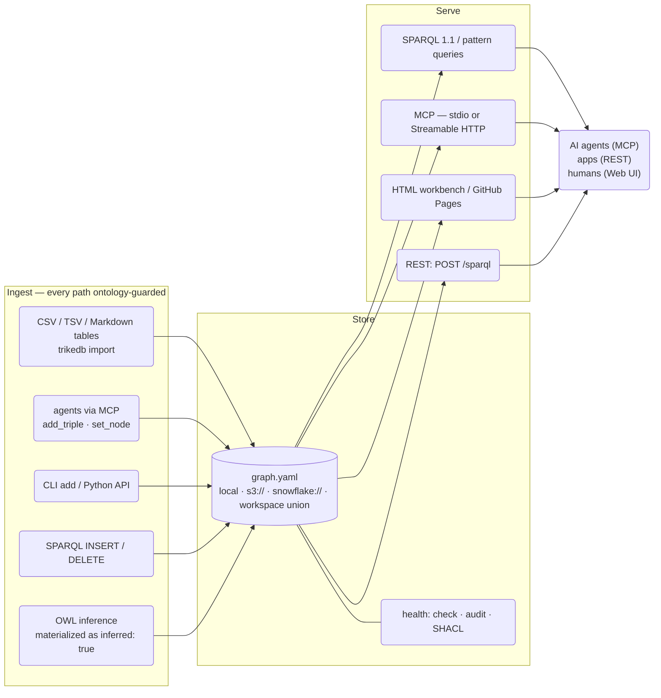
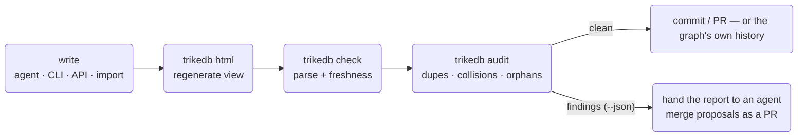

# trikedb Reference

[日本語版はこちら / Japanese version](REFERENCE_jp.md)

Every feature, and how to use it. For the design rationale see
[ARCHITECTURE.md](ARCHITECTURE.md); for benchmark methodology see
[benchmarks/](../benchmarks/).

## The big picture



## The file format

One YAML file is the database. Three top-level keys; only `triples` is
required:

```yaml
ontology:              # optional predicate whitelist (+ descriptions)
  predicates:
    PROVIDES: "SaaS vendor -> ingestion job"

nodes:                 # optional free-form node properties
  salesflow-crm: {type: saas, label: SalesFlow, url: "https://...", plan: enterprise}

triples:
  - {s: salesflow-crm, p: PROVIDES, o: crm-sync-job}          # compact form
  - s: crm-sync-job                                            # any extra keys
    p: INGESTS_TO                                              # become edge
    o: RAW_CRM_CONTACTS                                        # attributes
    schedule: hourly
    prov: "design_doc.md"
```

Conventions worth adopting: `prov:` (where a fact came from),
`deprecated: true` (rendered dashed), change events as dated free-text
objects on an `AFFECTED_BY` predicate.

Edge attributes are **SPARQL-queryable**: every attributed triple is
also exported as a standard RDF reification (a statement resource with
`rdf:subject/predicate/object` plus the attributes), so the operational
gold — notes, provenance, schedules — can be filtered and joined, not
just read:

```sparql
# every fact sourced from a given doc
SELECT ?s ?p ?o WHERE {
  ?st rdf:subject ?s ; rdf:predicate ?p ; rdf:object ?o ;
      t:prov "design_doc.md" }
```

This works in `db.sparql()`, `trikedb sparql`, the MCP `sparql` tool and
the HTML console alike (`rdf:` is pre-bound everywhere). Reification is
export-only — the YAML stays flat, and SPARQL updates never write
statement resources back.

**Workspace files** union many graphs read-only:

```yaml
graphs:                # local paths and remote URLs mix freely
  finance:  finance.yaml
  platform: s3://team-bucket/kg/platform.yaml
```

Every triple in a union carries a `graph:` attribute naming its source;
shared node names auto-join across members; writes are refused with a
pointer to the member files.

Members can be warehouse rows too, and they inherit the connection — which
is what makes a union usable somewhere that cannot open one of its own:

```yaml
# workspace.yaml, itself stored as a row
graphs:
  ontology: snowflake://DB.SCHEMA.T/kg/ontology
  skills:   snowflake://DB.SCHEMA.T/kg/skills
```

```python
db = TrikeDB("snowflake://DB.SCHEMA.T/kg/workspace",
             connection=get_active_session(), read_only=True)
```

**Let `TrikeDB` build the union rather than reading the members and merging
them yourself.** Three details decide what a union contains, and getting
one wrong is silent — the graph just comes out slightly poorer than the
files it was built from:

- **Node properties merge per key, not per node.** A node declared in two
  members keeps the first value of each *key*, so a `description` only the
  second member carries still survives. Taking the whole dict from the
  first member drops it with no error anywhere.
- **Ontologies merge per predicate**, first member wins the description.
- **A triple's `graph` attribute is the workspace key**, not the member's
  filename or path.

`content_hash()` is the cheap way to prove a union you built matches one
trikedb built: same hash, same graph.


## Properties and labels

There are three places to attach information, and knowing which to use
keeps a graph clean:

| Where | How many | Set with | Good for |
|---|---|---|---|
| **Node properties** | unlimited keys per node | `set_node()` / `trikedb node -a` | facts about the entity itself: `url`, `owner`, `schema`, `pii`... |
| **Edge attributes** | unlimited keys per triple | `add(..., **attrs)` / `-a k=v` | facts about the *relationship*: `schedule`, `prov`, `deprecated`, `since`... |
| **More triples** | unlimited | `add()` | anything another entity shares, or that you want to query |

Three node-property keys have UI meaning (one value each):

```python
db.set_node("svc-etl-01",
    label="etl-bot",    # display name in the workbench (the node ID stays the key — never rename IDs, edges point at them)
    type="bot",         # color group + legend entry
    level=2)            # column in the flow layout (only honored when every node has one)
db.set_node("svc-etl-01", owner="data-platform", pii=False)   # set_node merges — add keys any time
```

```bash
trikedb node graph.yaml svc-etl-01 -a label=etl-bot -a type=bot -a pii=false   # true/false become booleans
trikedb node graph.yaml svc-etl-01          # show everything known about the node
```

**Multi-valued facts: prefer triples over list properties.** A node can
hold a list (`aliases: [Tokyo, TYO]`), but each value as its own triple
is queryable in SPARQL and joins across graphs:

```python
db.add("tokyo", "HAS_ALIAS", "TYO")     # SELECT ?a WHERE { t:tokyo t:HAS_ALIAS ?a } works
```

Rule of thumb: *metadata about the node itself → property; anything
shared, counted, or queried → triple.* Node properties are exposed to
SPARQL too (as literals: `?x t:type \"bot\"`), and since predicates are
just names, even a predicate can carry properties
(`db.set_node("PROVIDES", since="2024")`) — the RDF way.

## Python API

```python
from trikedb import TrikeDB, Triple, OntologyError
db = TrikeDB("graph.yaml", ontology={...})   # autosave=True is the default
```

Mutations write straight back to the file — what you `add()` is what's
on disk, same as the CLI. Pass `autosave=False` to batch changes and
call `save()` yourself.

| Method | What it does |
|---|---|
| `add(s, p, o, **attrs)` | Upsert a triple (same s,p,o merges attrs). Raises `OntologyError` for undeclared predicates; absolute-URI predicates are exempt (OWL meta-statements) |
| `remove(s=, p=, o=)` | Remove all matches; returns count |
| `triples(s=, p=, o=, **attrs)` | Pattern match. `None` = wildcard, `*`/`?` glob, attrs filter exactly |
| `query([patterns])` | Multi-pattern joins with `?variables` (SPARQL-style BGP, zero deps) |
| `sparql(q)` | Full SPARQL 1.1. Reads run on Oxigraph, writes on rdflib (see [Speed](#speed)). SELECT→rows, ASK→bool, INSERT/DELETE→net triple delta. `t:` and `rdf:` are pre-bound |
| `search(q, k=10)` | Semantic search (`[semantic]` extra): rank facts by meaning, not spelling. `score`/`kind`/`node` are the payload's own keys; an attribute with one of those names is preserved as `attr_<name>` — "認証まわりの注意点" finds keypair/MFA facts with zero shared keywords |
| `find(question, where=None, k=10)` | Hybrid retrieval (`[semantic]` extra): semantic recall then a hard structured filter (`where`: dict of required node props, or a `(name, props) -> bool` callable). Returns `{node, props, facts}` payloads |
| `update(q)` | SPARQL Update explicitly (what `sparql` routes write forms to) |
| `subjects(p=, o=)` / `objects(s=, p=)` / `predicates()` / `nodes()` | Distinct term helpers |
| `set_node(name, **props)` / `node(name)` | Node properties (unlimited keys; `label`/`type`/`level` have UI meaning). Queryable in SPARQL as literals |
| `import_file(path)` | Merge from CSV/TSV (s,p,o header), Markdown (s/p/o tables), or another YAML graph |
| `declare(pred, characteristic)` | RDFS/OWL semantics: OWL `transitive` / `symmetric` / `functional` / `inverse_of:X`, or RDFS `subclass_of:X` / `subproperty_of:X` / `domain:X` / `range:X` — stored as a reviewable triple |
| `infer(apply=False)` | OWL-RL materialization (RDFS classification + hierarchy and OWL edges; rdf/owl bookkeeping noise suppressed); `apply=True` adds facts tagged `inferred: true` |
| `validate(shapes)` | SHACL via pySHACL → `(conforms, report)` |
| `audit()` | Health findings (see `trikedb audit` below) |
| `content_hash()` | Stable fingerprint of graph content (embedded in HTML exports) |
| `to_html(path, title=, event_predicates=, layout=)` | Interactive workbench (see below) |
| `to_rdflib()` / `to_jsonld()` | Interop exports (RDF/SPARQL view) |
| `to_networkx(multigraph=True)` | Property-graph projection (`[networkx]` extra): node props + edge label/attrs; run networkx algorithms (shortest path, centrality) on the same file |
| `TrikeDB(path, read_only=True)` | Open a graph for reading only; every mutation raises. Survives `reload()` |
| `TrikeDB(path, sparql_engine="rdflib")` | Pin the SPARQL engine; the default is oxigraph when `[oxigraph]` is installed |
| `TrikeDB(url, connection=conn)` | Run through an already-open warehouse connection or Snowpark session instead of building one |
| `save(path=)` | Write YAML (local or remote URL). `autosave=True` does this on every mutation |
| `.workspace` / `.read_only` / `.ontology` / `.path` | State attributes |

## CLI

Everything the API can do (`pip install trikedb`, or `uvx --from trikedb trikedb ...`):

| Command | Purpose |
|---|---|
| `trikedb add FILE S P O [-a k=v]...` | Add a triple with attributes |
| `trikedb rm FILE [-s] [-p] [-o]` | Remove matching triples |
| `trikedb query FILE -w "?s PRED ?o" [-w ...]` | Pattern joins (table or `--json`) |
| `trikedb sparql FILE "SELECT/INSERT..."` | SPARQL 1.1 read & write (writes persist) |
| `trikedb search FILE "query" [-k N]` | Semantic search over facts and nodes (`[semantic]` extra) |
| `trikedb import FILE SRC...` | Merge CSV/TSV/Markdown/YAML sources |
| `trikedb node FILE NAME [-a k=v]...` | Show a node (props + edges) or set properties |
| `trikedb ontology FILE [--set P=desc]` | Show / extend the predicate vocabulary |
| `trikedb stats FILE` | Triples per predicate, node count |
| `trikedb html FILE [-o] [--title] [--events P1,P2] [--layout auto\|flow\|free]` | Export the workbench |
| `trikedb jsonld FILE` | JSON-LD to stdout |
| `trikedb validate FILE SHAPES.ttl` | SHACL; exit 1 on violations (CI-friendly) |
| `trikedb infer FILE [--apply]` | OWL-RL inference; `--apply` persists tagged facts |
| `trikedb check FILE [--html PATH]` | Parse check + stale-HTML detection via embedded content hash |
| `trikedb audit FILE [--json] [--strict]` | Health findings; exit 1 on errors (`--strict`: warnings too) |
| `trikedb mcp FILE` | MCP server over stdio |
| `trikedb serve FILE [--host] [--port] [--token] [--oauth-issuer] [--public-url] [--oauth-audience] [--required-scope] [--stateless]` | UI + REST + MCP over Streamable HTTP |

All `FILE` arguments accept local paths, `s3://`/`gs://`/`https://`
URLs (`[remote]` extra), `snowflake://` graphs (`[snowflake]` extra),
and workspace files.

## MCP: the ontology layer for agents

Eleven tools, one server definition, two transports:

| Tool | Kind | Notes |
|---|---|---|
| `sparql` | read/write | prefixes `t:`/`rdf:` pre-bound; updates persist |
| `search` | read | semantic search for fuzzy questions (`[semantic]` extra) |
| `find` | read | hybrid retrieval: semantic recall + structured `where` filter (`[semantic]` extra) |
| `match` | read | pattern matching with attrs |
| `get_node` | read | props + outgoing/incoming edges |
| `ontology` / `stats` | read | vocabulary / summary |
| `add_triple` / `set_node` / `remove_triples` | write | ontology-guarded, autosaved |
| `import_source` | write | deterministic file ingestion |

```bash
# local (stdio) — the agent session spawns the server
claude mcp add kg -- uvx --from 'trikedb[mcp]' trikedb mcp /abs/path/graph.yaml

# remote (Streamable HTTP) — one server, whole team
trikedb serve s3://team-bucket/kg/graph.yaml --port 8080 --token $SECRET
claude mcp add kg https://kg.internal:8080/mcp --transport http \
  --header "Authorization: Bearer $SECRET"
```

`trikedb serve` exposes three doors from one process: `/` (workbench UI,
always current), `/sparql` (REST: `POST {"query": ...}` → JSON), `/mcp`.

### Auth

Two mechanisms, both covering all three doors:

| Flag | What it is | Use for |
|---|---|---|
| `--token SECRET` | one static Bearer token | scripts, CI, a trusted network |
| `--oauth-issuer URL` | OAuth 2.1 against your IdP (`[oauth]` extra) | the claude.ai / ChatGPT UIs, per-user identity |

```bash
pip install 'trikedb[serve,oauth]'
trikedb serve graph.yaml \
  --public-url   https://kg.example.com \
  --oauth-issuer https://idp.example.com/ \
  --required-scope kg:read
```

trikedb acts as a **resource server only** — it verifies JWTs and never
issues them, so there is no authorization server, session store, or user
table to operate. On first request it discovers the issuer's metadata
(`/.well-known/openid-configuration`, falling back to
`/.well-known/oauth-authorization-server`), caches the JWKS, and then
checks each token's signature, `iss`, `exp`, and `aud`.

- **Audience** defaults to `<public-url>/mcp`, the canonical MCP URI
  clients send as the RFC 8707 `resource` parameter. Your IdP must mint
  tokens with that `aud`, or point `--oauth-audience` at whatever
  identifier it does use. This check is what stops a token issued for
  another service from opening the graph.
- **Scopes** are read from `scope`, and from the `scp` and `permissions`
  claims that some IdPs use instead. Each `--required-scope` is enforced;
  a token that's short one gets `403 insufficient_scope` naming what's
  missing.
- **Discovery** is published at
  `/.well-known/oauth-protected-resource/mcp` (RFC 9728) and stays
  reachable without a token — an anonymous request to `/mcp` answers
  `401` with a `WWW-Authenticate` header pointing at it, which is how a
  connector bootstraps the login.
- **Client registration** happens at your IdP, and trikedb takes no part
  in it. Dynamic Client Registration is the smooth path; MCP clients also
  accept a Client ID Metadata Document or a client ID you create by hand.

#### What your IdP has to provide

Any OAuth 2.1 / OIDC provider works — there is nothing vendor-specific in
trikedb. Four requirements, and one command to check each:

| Requirement | Check it |
|---|---|
| Publishes metadata at the issuer | `curl -s https://idp.example.com/.well-known/openid-configuration \| jq '{issuer, jwks_uri, registration_endpoint}'` |
| Signs access tokens as JWTs with an asymmetric key (RS256/ES256/PS256) | the token has three dot-separated parts; an opaque string means the IdP didn't know which API the token was for |
| Puts `<public-url>/mcp` in `aud` | decode a real token: `python -c "import jwt,sys;print(jwt.decode(sys.argv[1],options={'verify_signature':False}))" "$TOKEN"` |
| Lets the MCP client obtain a client ID (DCR, CIMD, or one you create) | `registration_endpoint` in the metadata above, or your provider's app list |

Providers differ mostly in where these live in their console. If tokens
come back opaque rather than as JWTs, look for a "default audience" (or
equivalent) setting — that is the usual cause. If a dynamically
registered client is refused, look for a separate default-permissions
setting for third-party applications: allowing "all applications" on the
API often does *not* cover clients that registered themselves.

And verify the trikedb side with no token at all:

```bash
curl -s  https://kg.example.com/.well-known/oauth-protected-resource/mcp | jq
curl -si https://kg.example.com/mcp -X POST -d '{}' | grep -i www-authenticate
```

The first must list your issuer, the second must point back at the first.

#### When it doesn't work

| Symptom | Cause | Fix |
|---|---|---|
| `401` with a token that looks fine | `aud`, `iss`, or `exp` mismatch | decode the token (above); `aud` must equal `<public-url>/mcp`, or set `--oauth-audience` |
| `403 insufficient_scope` | the token lacks a `--required-scope` | grant that scope at the IdP, or drop the flag |
| `421 Misdirected Request` *after* login succeeds | the `Host` header isn't trusted | pass `--public-url` — this is not an auth failure, despite looking like one |
| The connector never reaches a login screen | discovery or client registration failed | run the two `curl`s above, then check `registration_endpoint` |

Remote MCP clients require a public HTTPS endpoint — `localhost` will not
connect, so use a tunnel during development. Note that `--public-url`
also whitelists that hostname for the SDK's DNS-rebinding guard, which
otherwise trusts only localhost: **any** deployment behind a proxy or
tunnel needs the flag, OAuth or not.

### Deploying it

The server is one process with no local state, so any container host runs
it — Cloud Run, ECS, Fly, a VM:

```dockerfile
FROM python:3.12-slim
RUN pip install --no-cache-dir 'trikedb[serve,oauth,remote]'
CMD trikedb serve "$GRAPH" \
      --host 0.0.0.0 --port "$PORT" \
      --public-url "$PUBLIC_URL" \
      --oauth-issuer "$OAUTH_ISSUER" \
      --required-scope kg:read
```

```bash
GRAPH=s3://team-bucket/kg/graph.yaml
PUBLIC_URL=https://kg.example.com
OAUTH_ISSUER=https://idp.example.com/
```

Three things to get right, all of which fail confusingly:

- **`--host 0.0.0.0`.** The default binds to loopback, which is
  unreachable from outside the container.
- **`--public-url` is required, not optional.** Requests arrive with the
  load balancer's hostname in the `Host` header; without the flag they
  are refused with `421` *after* authentication succeeds. Platforms that
  assign the URL at deploy time (Cloud Run) need one deploy to learn it
  and a second to apply it.
- **Keep the graph in remote storage** (`s3://`, `gs://`, `https://` —
  the `[remote]` extra) if agents write to it. A container filesystem is
  ephemeral, so a graph baked in with `COPY` loses every write on the
  next deploy. Remote storage also lets several replicas share one graph;
  writes are last-write-lands, so route them through a single replica or
  keep them in git-reviewed batches.

#### `--stateless`

By default the MCP transport issues an `Mcp-Session-Id` on the first
request and expects it back on every following one. That session lives in
one process's memory, which breaks two setups:

- **More than one replica.** A session opened on replica A is unknown to
  replica B, so a load-balanced deployment answers
  `400 Bad Request: Missing session ID` at random.
- **Clients that don't carry the session forward.** Not every MCP client
  echoes the header back; one that doesn't gets the same 400 immediately
  after connecting, which reads as a server fault when it isn't.

`--stateless` drops session tracking and serves each request on its own
transport, so any replica can answer anything and no header has to be
carried. Nothing the MCP tools do needs the session, so SSE resumability
is the only thing given up. Authentication is unaffected — tokens are
still verified on every request.

Run more than one replica, or find a client stuck on that 400, and this
is the flag.

#### Concurrent writes

A save rewrites the whole document, so two writers that both read version
N each produce a version N+1 and one of them would vanish. On S3 and on a
warehouse that does not happen: the save is conditional on the stored
graph still being the one it was read from, and a write that would clobber
someone else is refused with `ConcurrentWriteError` instead. The MCP write
tools recover on their own — they re-read the graph, re-apply the single
change they were asked to make, and save again, backing off between tries.

Ten concurrent `add_triple` calls against one S3 file, through a Lambda
that scales out to a container per request, land all ten. Before the
conditional write they landed four, and the other six disappeared with no
error anywhere. Ten concurrent writers against one `snowflake://` row land
all ten as well.

The two backends express the same guarantee differently. S3 compares an
ETag through `If-Match` and reports a failed precondition as an error. A
warehouse compares a version column inside the statement itself
(`UPDATE ... WHERE name = ? AND version = ?`) and reports the outcome as
an affected-row count, so a conflict is a plain zero rather than an error
to interpret.

Two limits worth knowing:

- **Only S3 and warehouse backends enforce it.** `gs://`, `az://` and
  plain `https://` have no conditional write yet, so they stay
  last-write-wins. Local files are unguarded too — the assumption there is
  one process.
- **Long-running replicas don't see each other.** The MCP tools hold one
  graph instance for the life of the process and only re-read it when a
  write conflicts. A replica that never writes never notices another
  replica's writes; restart it, or serve read-only replicas from a graph
  that changes through review rather than through agents.

## How an agent should read a graph

Three access methods, chosen by the *shape of the question* — and they
compose into a cascade rather than compete:

| Method | Right question | Guarantee |
|---|---|---|
| **whole-file read** | "what's here?", "any conventions I should know?" — you don't yet know what to ask | sees everything (comfortable to ~1k triples) |
| **`query` / `sparql`** | "who can access X?", "does A depend on B?" — you know the vocabulary | deterministic and complete |
| **`search`** | "認証まわりの注意点は?" — you don't know the node or predicate names | ranked candidates, no guarantee |

The cascade for a fuzzy question: **`search` finds a foothold →
`sparql`/`match` verifies and expands it → answer**. Semantic search is
the index, SPARQL is the proof; never assert a fact from a search hit
without confirming the triple. For small graphs, a whole-file read
replaces the first step. (File-size limits for each rung are measured
in [SCALING.md](SCALING.md).)

## The HTML workbench

`to_html()` / `trikedb html` produce a self-contained page:

- force-directed clusters or left-to-right flow (`--layout auto` picks
  by graph shape); workspaces tile each member graph into its own cell
  with per-graph filter chips
- click a node → detail panel (all properties, URLs linkified, in/out edges)
- clickable legend: check a node type on/off to filter nodes, click a
  predicate swatch to hide/show its edges (combines with graph chips)
- full-text search over node ids, labels, node properties, edge
  attributes and free-text facts — type for a live count,
  Enter/Shift+Enter cycles hits, and **text2sparql** turns the search into
  an editable CONTAINS query in the console
- in-browser SPARQL console (Oxigraph WASM, loaded from CDN on demand)
- change events as red diamonds + a bottom timeline bar
  (`--events AFFECTED_BY` to pin which predicates count)
- light/dark toggle (persisted), content hash embedded for `trikedb check`

## Where the graph lives

The layer above storage only ever asks for one whole document, so the
destination is swappable and nothing else changes: SPARQL, the MCP tools,
SHACL and `to_networkx` behave identically wherever the bytes are.

**Object storage** — `TrikeDB("s3://bucket/kg/graph.yaml")` reads and
writes through fsspec (`[remote]` extra). Auth is delegated to the
standard AWS credential chain (env vars, profiles, SSO, IAM roles);
trikedb stores no credentials and your bucket policy is the access
control. `gs://`, `az://` and read-only `https://` work the same way with
the matching fsspec backend installed.

**A warehouse table** — `TrikeDB("snowflake://DB.SCHEMA.TABLE/sales/crm")`
keeps the graph in a row (`[snowflake]` extra). One table holds many
graphs, so adopting trikedb costs one table rather than one per graph:

| column | |
|---|---|
| `name` | the graph, from the path after the table |
| `doc` | the YAML document, byte for byte |
| `version` | the token that makes a save conditional |
| `updated_at` | when it last changed |

There is no local copy and nothing to synchronise — the row *is* the
graph. The whole document is read on open and written on save, so this
suits graphs up to a few MB rather than tens.

`doc` holds JSON here, where a file holds YAML. That is the one place the
stored format differs, and it buys the next section: SQL has no YAML
parser, so a YAML string in a column would be a graph nothing but trikedb
could read. JSON is a subset of YAML, so the loader is unchanged and
neither is anything above it.

### Reading the graph from SQL

`sql-init` creates four views beside the table, and they are what make a
warehouse graph worth choosing: the same graph answers SPARQL from memory
and SQL from the warehouse, with no second copy to keep in step.

| View | Columns |
|---|---|
| `KG_NODE` | `GRAPH`, `NODE_ID`, `NODE_TYPE`, `NAME`, `PROPS`, `TS_UPDATED` |
| `KG_EDGE` | `GRAPH`, `EDGE_ID`, `SRC_ID`, `DST_ID`, `EDGE_TYPE`, `PROPS`, `TS_UPDATED` |
| `KG_PREDICATE` | `GRAPH`, `PREDICATE`, `DESCRIPTION` |
| `KG_TRIPLE` | `GRAPH`, `S`, `P`, `O`, `ATTRS` |

`KG_NODE` and `KG_EDGE` follow the node/edge column shape conventionally
used for property graphs on Snowflake — the same layout as the
[Snowflake-Labs knowledge-graph reference implementation][kg-ref] — so a
Cortex Analyst semantic model or query pattern written against that shape
applies here too. That alignment is an intended byproduct, not a
dependency: nothing is imported from there, the SQL is generated from
trikedb's own model, and trikedb is not affiliated with or endorsed by
Snowflake.

Projecting a stored document into node/edge/triple views is a generic
idea; only the SQL that spells it is dialect-specific — `TRY_PARSE_JSON`
and `LATERAL FLATTEN` here, `jsonb_to_recordset` on Postgres, `json_each`
on SQLite. So the views live on the `_Dialect` alongside its types and
upsert syntax, and a second warehouse is one more `_Dialect` literal
rather than a change spread across the module. `NODE_ID`, `SRC_ID` and
`EDGE_TYPE` are ordinary property-graph terms and carry over unchanged.

[kg-ref]: https://github.com/Snowflake-Labs/knowledge-graph-snowflake

The projection is the one `to_networkx()` already performs — triples to
nodes and edges — pointed at SQL instead of networkx. `KG_PREDICATE` has
no counterpart there: a property graph's edge type is a bare label, while
a predicate here is a first-class name the ontology describes, and
dropping it would change what the graph means. `KG_TRIPLE` is the RDF view
of the same rows, for anyone who thinks in triples.

Node properties land in `PROPS` and edge attributes in the edge's `PROPS`,
both as VARIANT, so adding a predicate or an attribute never needs a DDL
change. `type` and `label` are lifted into `NODE_TYPE` and `NAME` because
they already carry meaning in the workbench, which makes
`WHERE NODE_TYPE = 'table'` the natural filter. `EDGE_ID` is an MD5 of
`s|p|o`: a triple is unique on those three, so re-reading the view never
renames an edge that did not change.

This is what the whole arrangement is for — asking whether the graph still
matches reality:

```sql
SELECT k.NODE_ID, t.TABLE_NAME
FROM MYDB.PUBLIC.KG_NODE k
LEFT JOIN MYDB.INFORMATION_SCHEMA.TABLES t ON t.TABLE_NAME = k.NODE_ID
WHERE k.NODE_TYPE = 'table' AND t.TABLE_NAME IS NULL;   -- claimed, but gone
```

Views rather than tables on purpose: nothing is stored twice, nothing can
drift, and the cost is zero. Snowflake pushes `AT(TIMESTAMP => ...)` down
to the base table, so a view reads the past as happily as the present:

```sql
SELECT * FROM MYDB.PUBLIC.KG_TRIPLE AT(TIMESTAMP => '2026-08-20 01:21:03-07:00');
```

The trade is that a view cannot prune. Snowflake's own guidance is to
flatten into relational columns once that starts to cost you, so
materialize then — `CLUSTER BY (NODE_TYPE)` on nodes,
`(EDGE_TYPE, SRC_ID, DST_ID)` on edges — and not before. `--no-views`
skips them entirely.

Create the table before first use; trikedb will not run DDL in your
warehouse on its own:

```bash
trikedb sql-init snowflake://DB.SCHEMA.TABLE/sales/crm --print   # show the DDL
trikedb sql-init snowflake://DB.SCHEMA.TABLE/sales/crm           # or run it
trikedb sql-init … --no-views                                    # table only
```

Pick the schema deliberately. Five objects appear — one table and four
views — and if something in your environment counts objects per schema
(a data-quality dashboard using the total as a denominator, a layer
prefix convention), they will show up there. A schema of trikedb's own
avoids the question.

Connection settings come from the environment — `SNOWFLAKE_ACCOUNT`,
`SNOWFLAKE_USER`, and either `SNOWFLAKE_PRIVATE_KEY_PATH` (a PKCS#8 PEM)
or `SNOWFLAKE_PASSWORD`, plus optional `SNOWFLAKE_ROLE`,
`SNOWFLAKE_WAREHOUSE`, `SNOWFLAKE_DATABASE`, `SNOWFLAKE_SCHEMA` and
`SNOWFLAKE_AUTHENTICATOR`. If your organisation already standardises
Snowflake access in `connections.toml`, name the entry instead and the
rest is deferred to it:

```bash
export SNOWFLAKE_CONNECTION_NAME=analytics
```

If your account uses browser-based SSO (`authenticator = externalbrowser`),
install the connector's `secure-local-storage` extra as well. Without it
the SSO token is not cached and *every process* opens a browser — which
makes the CLI unusable in a loop and a CI step impossible:

```bash
pip install 'snowflake-connector-python[secure-local-storage]'
```

**Bringing your own connection.** Some hosts have a session and no way to
make another: inside Streamlit in Snowflake there are no credentials to
find and no outbound connection to open, only the session the host already
holds. Pass it in:

```python
from snowflake.snowpark.context import get_active_session

db = TrikeDB("snowflake://DB.SCHEMA.T/sales/crm",
             connection=get_active_session(),
             read_only=True)
```

A DB-API connection works too. Dispatch is on what the object can do, not
on an imported type, so neither driver has to be installed for the other
path to work: `cursor()` means DB-API and affected rows come from
`rowcount`; `sql()` means Snowpark, where `collect()` returns rows either
way and Snowflake's own answer to DML *is* a row whose first cell is the
count. An injected connection is used as-is — trikedb neither caches nor
reconnects it, because its lifetime belongs to whoever passed it.

**Opening a graph read-only.** `TrikeDB(url, read_only=True)` refuses
every mutation — `add`, `remove`, `set_node`, `save` and SPARQL updates
alike — and keeps refusing after `reload()`. An app that only reads has no
business holding a write path: a bug or an agent cannot spend a capability
it was never given. This is the shape to use when writes belong to a
reviewed file in git and the warehouse is there for distribution and SQL
access.

```python
db = TrikeDB("snowflake://DB.SCHEMA.T/sales/crm", read_only=True)
db.sparql("SELECT ?o WHERE { t:crm-sync-job t:INGESTS_TO ?o }")   # fine
db.add("x", "P", "y")                                             # ValueError
```

Warehouse DML serialises per table, so writers to *different* graphs in
one table serialise too. That is invisible at agent-editing rates; shard
into several tables if you ever push real write throughput through it.

Table names cannot be parameterised, so the one in the URL is validated
as an identifier (`DATABASE.SCHEMA.TABLE`, at most three parts) rather
than quoted, and anything else is rejected before a statement is built.

Adding a backend happens in `storage.py` / `storage_sql.py` and nowhere
else. A warehouse is a `_Dialect` — four SQL templates and a connect
function.

## Speed

The graph lives in memory, so what costs time is opening it and querying it.
Both are tunable, and neither needs a change to how you write the graph.

Measured on 40,800 triples with `benchmarks/backend_bench.py`, medians of
three, Apple silicon:

| backend | open | 1-hop | 2-hop join | write 1 fact |
|---|---|---|---|---|
| local `.yaml` | 992 ms | 0.04 ms | 55 ms | 1,957 ms |
| local `.json` | **57 ms** | 0.04 ms | 55 ms | **148 ms** |
| `snowflake://` row | 507 ms | 0.04 ms | 56 ms | 2,889 ms |

Three things fall out of that. **Queries do not care where the graph lives** —
identical across all three, because they run in memory. **The format matters
more than the medium**: the same graph opens 17x faster as `.json` than as
`.yaml`, and a warehouse row beats a local YAML file despite crossing a
network, because its document is already JSON. **Warehouse writes are the
expensive operation** — read, rewrite, conditional update — so batch with
`autosave=False` rather than putting them in a loop.

And the engine, on the same graph once built:

| | 1-hop | 2-hop join | count all |
|---|---|---|---|
| rdflib | 0.90 ms | 342 ms | 432 ms |
| oxigraph (default) | **0.04 ms** | **52 ms** | **11 ms** |

One knob, and one thing that is already on — neither changes what is
stored:

**Store JSON instead of YAML** for a graph that is read far more often than
it is reviewed — name the file `graph.json`, or keep it in a warehouse row,
which is JSON already. Same API, same SPARQL, ~30x faster to open. The cost
is the thing YAML was picked for: nobody enjoys reading a diff of JSON.

**The fast SPARQL engine is already there.** Read queries run on
[Oxigraph](https://github.com/oxigraph/oxigraph), a Rust engine with real
indexes; `pyoxigraph` is a core dependency because it was faster at every
graph size measured, down to a few hundred triples. Both are SPARQL 1.1 and
the test suite asserts they answer identically — including the sharp edge,
typed literals, where `?x t:pii true` has to match a boolean rather than the
string `"true"`. `TrikeDB(..., sparql_engine="rdflib")` pins the old engine, which is worth
doing if you ever want to compare the two on a real query. If pyoxigraph is
ever absent — a vendored subset of the files, an interpreter it has no wheel
for yet — reads fall back to rdflib on their own rather than failing.

Updates (`INSERT`/`DELETE`), OWL inference and SHACL always use rdflib — those
paths change data or hand the graph to `owlrl`/`pyshacl`, and a second
implementation buys nothing there.

What is *not* tunable is the shape: the whole document is read on open and
rewritten on save. That is the price of a graph you can review in a diff, and
it is why the practical ceiling is a few MB rather than a few GB.

## Validation & inference

- **SHACL** (`[shacl]`): real shape constraints — cardinality, value
  ranges — against the `urn:trikedb:` namespace. `trikedb validate` is
  CI-ready.
- **OWL-RL** (`[owl]`): declare characteristics, materialize what
  follows. Inference is *materialization, not magic*: derived facts land
  in the YAML tagged `inferred: true`, reviewable in the diff. For
  ad-hoc transitivity, SPARQL property paths (`t:INHERITS+`) need no
  OWL at all.

## Do you have to write YAML?

No. YAML is the *storage* format, not the authoring interface — it is
what the graph is written down as, chosen so a human can read a diff.
Nothing requires you to type it. Every write path below goes through the
same core, gets the same ontology check, and produces the same document:

| Write path | Use it when |
|---|---|
| `db.add(s, p, o, **attrs)` | Python — scripts, notebooks, ETL |
| `trikedb add FILE S P O -a k=v` | one fact from a shell or a Makefile |
| `trikedb import FILE data.csv` | a spreadsheet, TSV, or Markdown table already holds the facts |
| `db.sparql("INSERT DATA {...}")` | you think in SPARQL, or you're porting from a triple store |
| MCP `add_triple` / `set_node` | an agent is writing — the usual case |
| `db.infer(apply=True)` | let OWL-RL materialize what already follows |
| editing the YAML by hand | reviewing or correcting a small graph; a text editor is a legitimate client |

The ontology guard applies to all of them equally, so "an agent wrote it"
and "a human wrote it" cannot diverge in vocabulary. That is the point of
having a controlled predicate list at the write boundary rather than a
linter after the fact.

## Where the HTML workbench goes

The workbench is a *rendering* of the graph, not part of it. Where the
graph lives never decides where the page goes:

```bash
trikedb html graph.yaml                      # -> graph.html, next to it
trikedb html s3://bucket/kg/graph.yaml       # -> graph.html in the working dir
trikedb html snowflake://DB.SCHEMA.T/sales/crm   # -> crm.html in the working dir
trikedb html graph.yaml -o docs/index.html   # or say where explicitly
trikedb html graph.yaml -o s3://site/kg.html # publish it to a bucket
```

A remote graph renders to the working directory by default, named after
the graph, because a URL has no sibling file to put it next to. `-o`
accepts a local path or an object URL. It does not accept a warehouse
URL — a row there holds a graph, and writing a page into it would replace
the graph with markup the loader cannot read.

The page is self-contained (one file, no build step, no server), so
"publishing" it is just putting it somewhere: commit it for GitHub Pages,
push it to a bucket, or attach it to a ticket. `trikedb check --html
PATH_OR_URL` compares the content hash embedded in the page against the
graph and fails when the page is stale, which is what makes it safe to
keep a generated view in version control.

## Keeping a growing graph healthy



`audit` is deterministic on purpose; semantic near-duplicates beyond its
heuristics are an agent's job, with the ontology guard keeping whatever
the agent writes inside your vocabulary.

**How the review step works depends on where the graph lives**, and this
is worth deciding before you pick a backend:

- **A file in git** — the original story, and still the strongest one.
  Every change is a reviewable diff; `audit` and `check` run in CI;
  history and blame come free. Choose this whenever the graph is small
  enough to review and the writers are few.
- **An object or warehouse graph** — there is no pull request. Writes
  land immediately, so review has to move somewhere else: the ontology
  guard at the write boundary (which is why it exists), `audit` on a
  schedule rather than per-change, and the backend's own history — S3
  object versions, or a warehouse's time travel and the `updated_at`
  column. Agents editing a shared graph is exactly the case this is for.
- **Both, deliberately** — some teams keep the reviewed graph in git and
  let agents write to a separate shared graph, then union the two with a
  workspace file. Curation and accumulation stay separate, and neither
  blocks the other.

Whichever you pick, the loop is the same shape: write, regenerate the
view, check, audit, act on findings. Only the gate at the end moves.

## Extras

| Extra | Adds | Dependencies |
|---|---|---|
| *(core)* | everything above except ↓ | PyYAML, rdflib, pyoxigraph |
| `[mcp]` | `trikedb mcp` (stdio) | mcp (1.x) |
| `[serve]` | `trikedb serve` | mcp, uvicorn, starlette |
| `[oauth]` | `trikedb serve --oauth-issuer` | mcp, pyjwt[crypto] |
| `[remote]` | `s3://` etc. | fsspec, s3fs |
| `[snowflake]` | `snowflake://` graphs | snowflake-connector-python |
| `[shacl]` | `validate` | pyshacl |
| `[owl]` | `declare` / `infer` | owlrl |
| `[semantic]` | `search` (embeddings, multilingual, no torch) | model2vec, numpy |
| `[networkx]` | `to_networkx` (property-graph projection) | networkx |
| `[oxigraph]` | nothing — pyoxigraph is a core dependency | pyoxigraph |
