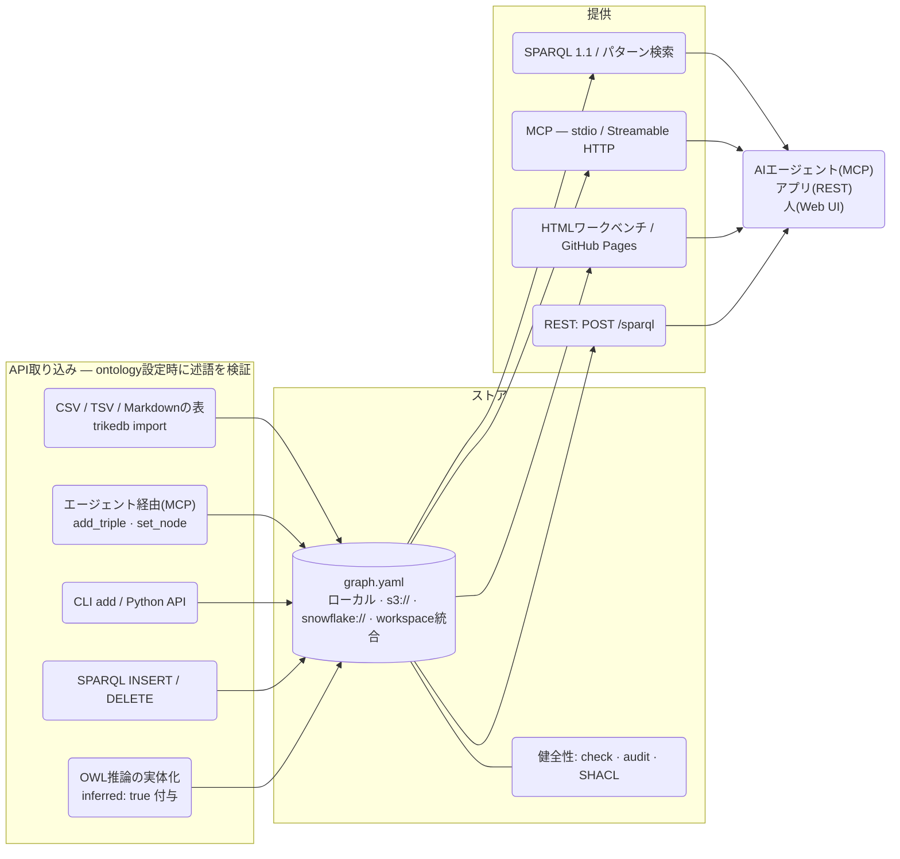
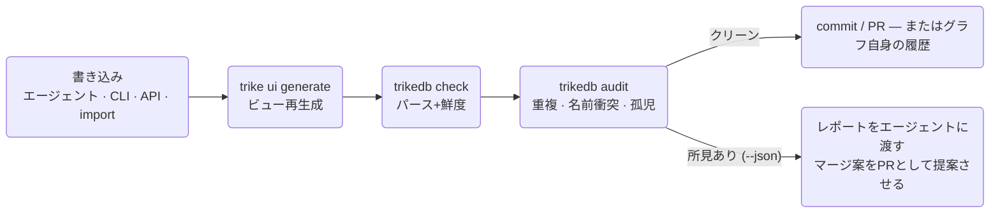

<b>日本語</b> · [English](REFERENCE.md) · [日本語](REFERENCE_jp.md) · [简体中文](REFERENCE_zh.md)

# trikedb リファレンス(日本語版)

全機能と使い方。
設計思想は [ARCHITECTURE_jp.md](ARCHITECTURE_jp.md)、ベンチマークは
[benchmarks/](../benchmarks/) を参照。


**互換性と保証範囲。** 単一default graphのSPARQL読取とINSERT/DELETE・CLEAR/DROPに対応し、named graph/dataset更新は拒否します。従来形式の空白入りobjectはliteralです。`New York`のようなエンティティには `rdf_terms={"o": {"kind": "iri"}}` を指定してください。SPARQLで挿入したRDF型・言語タグ・blank nodeは保存後も保持します。RDF/JSON-LDはメタデータを含むRDF投影を保持し、pattern/NetworkX/SQLは文字列の名前を使います。

返り値のTriple・属性はコピーです。変更は専用APIで行ってください。batchは本体や最終save失敗時にメモリを戻しますが、中の明示save・外部副作用は取り消せません。reloadは保存されたontologyを採用します。設定された述語ホワイトリストはAPI挿入時に検査し、HTTP(S)述語は例外です。手編集ファイルのontology適合性はload時に検査しません。

ローカルは完全なファイルへatomic replaceしますが、別プロセス間はlast-write-winsです。同一HTTPサーバーのREST/MCPは状態を共有して直列化し、外部編集にはreloadが必要です。S3/SQL条件付き保存は自分のcommit tokenを保持し、他のfsspec backendには同じ保証がありません。HTML表示にはvis-network/OxigraphのCDNへの接続が必要です。[APIの詳細](https://github.com/RyutoYoda/trikedb/blob/main/docs/REFERENCE_jp.md)。


**以下の性能値は記録当時の版・環境での観測で、この修正版の速度保証ではありません。**

## 全体像



## ファイル形式

YAMLファイル1枚がデータベース。トップレベルは3キーで、必須は `triples` のみ:

```yaml
ontology:              # 任意 — 述語のホワイトリスト(+説明)
  predicates:
    PROVIDES: "SaaSベンダー -> 取り込みジョブ"   # 説明は「文書」
    # 形(shape)は「強制」される: 型の合わないノード同士に書かれたエッジは、
    # 保存して後で報告するのではなく、書き込み時点で弾かれる
    INGESTS_TO: {description: "ジョブ -> テーブル", domain: job, range: table}

nodes:                 # 任意 — ノードの自由なプロパティ
  salesflow-crm: {type: saas, label: SalesFlow, url: "https://...", plan: enterprise}

triples:
  - {s: salesflow-crm, p: PROVIDES, o: crm-sync-job}    # コンパクト形式
  - s: crm-sync-job                                      # 追加のキーは
    p: INGESTS_TO                                        # すべてエッジ属性になる
    o: RAW_CRM_CONTACTS
    schedule: hourly
    prov: "design_doc.md"
```

採用を勧める慣習: `prov:`(事実の出典)、`deprecated: true`(破線描画)、
変更イベントは変えたノードを主語にした `AFFECTED_BY` トリプルで書き、
`at:`(いつ)・`by:`(誰が)・`state:`(どの状態にしたか)を付ける。

これらは `add()` ではなく `act()` で書く: 時刻を打ち、イベントを追記し、
そのアクションが残した状態へノードを移す — までを1回の書き込みで行う。
イベントの同一性には時刻が含まれるので、同じアクションを2回実行すれば
記録は2件残る — ログへの追記がログを消すことはない。

述語の宣言は、説明(ただのコメント。何も検証しない)にも、形(`domain` =
主語に許されるノード型、`range` = 目的語に許される型)にもできる。形は
すべての書き込み経路 — `add`・`act`・SPARQL `INSERT`・MCPツール・CLI —
で強制される。検証されるのは端点の型が分かっている場合だけ(型はエッジの
後から書かれることも同じくらい多い)で、`set_node` は同じ検証をノード側
から行う。どちらを先に書いたかで、グラフがオントロジーに従うかどうかが
決まることはない。どの書き込み経路でもまだ検証しようがなかったものは
`audit` が `unchecked-link` として報告し、別経路で入り込んだ矛盾
(手編集、後から追加された宣言)はエラー所見になる。

形はアクションが「何と何をつなげるか」を言う。さらに2つのキーが
**いつ実行してよいか**と**誰が実行してよいか**を言う。ここが型検査では
届かない半分だ — 発送前に配達された注文はどの型にも違反しないし、
誰も承認していない値下げは型として正しい:

```yaml
ontology:
  predicates:
    SHIPPED_FROM: {description: "order -> depot", domain: order, range: depot}
    DELIVERED_TO:
      description: "order -> where it was handed over"
      domain: order
      range: region
      requires: SHIPPED_FROM     # これが先に起きていなければならない
      by: courier                # そしてこれが実行してよい人
```

`requires` は、書こうとしているアクションより後でない時刻に、そのアクション
が**触れている**何かに対してすでに起きていなければならない述語を指す。
リストで書けば全部が条件になる — 言葉どおりの意味だ。「主語である」ではなく
**触れている**なのは、promotion がアクションの対象を辺の一方の端から
もう一方へ動かすからで、しかも両方向に動く:

- *要求される側のイベント*が promote される — 理由と承認者つきの廃止は
  `RET-0007 RETIRED "Copper Kettle"` と書かれ、ケトル自身は `RETIRED` を
  持たないまま残る
- *アクション自身*が promote される — `MIT-0007 MITIGATED INC-2025-01` は
  緩和策を自分自身の主語にするが、たった今作られた緩和策に聞ける履歴はない。
  先に起きていなければならないインシデントは、辺の向こう側にいる

だから `history()` がノードを読むのと同じように、両方の辺の両端が読まれる。
どちらかを主語だけに絞れば、まさに promotion が存在する理由になっている
ケースで前提条件が効かなくなる。時刻を持たないアクションは即座に拒否される
— そうでないと「より前」が誰にも答えられない問いになる。

前提条件はメンバーグラフをまたぐ。デモでは `SHIPPED_FROM` が `PLACED_BY` を
要求すると宣言されていて、この2つは別々のファイルにある — 注文の話が
揃うのは union の側であり、`audit` が読むのもその union だ。

`by` は実行者のノード型を指し、`by=` 属性と照合される。宣言すると実行者が
必須になる — 誰も署名していないアクションは、型としては正しい監査証跡の穴だ。

### 複数ステップにまたがる条件

1本の辺では、何がそのアクションを正当にするのか言い切れないことが多い。
「レビューを書いてよいのは、それを買った人だけ」は `PLACED_BY` と
`CONTAINS` の結合で、間に挟まる注文はレビューのどちらの端からも名指し
されていない。だから単一の辺の検査ではそこに届かない。名前の代わりに
`(s p o)` パターンでステップを書けば、共有する変数で結合される —
`?s` と `?o` はアクション自身の両端を指す:

```yaml
    REVIEWED:
      description: "customer -> product they rated"
      domain: customer
      range: product
      requires:
        - "?order PLACED_BY ?s"
        - "?order CONTAINS ?o"
```

必ず引用符で囲むこと: YAMLのflowスタイルでは先頭の `?` は明示キーの
マーカーになる。`requires` の1項目は1語か3語で、それ以外は宣言を読んだ
時点で拒否される — 何にも一致しようのない述語名として黙って抱え込むより
そのほうがいい。

時計はすべてのステップに効く。日付を持たないステップ — ここでは
`CONTAINS` — は「その日に起きたこと」ではなく「すでに真であるもの」と
して扱われる。条件が満たされないとき、メッセージは**どのステップ**が
空だったのか、そしてそれが「その時点で空」なのか「そもそも空」なのかを
名指しする。3ステップの条件は、どこで壊れたか言ってくれなければ
デバッグできないからだ:

```
REVIEWED is declared to require (?order PLACED_BY ?s; ?order CONTAINS ?o)
first, but for (TC-1008 REVIEWED Cast Iron Skillet 26cm) nothing
satisfies (?order CONTAINS ?o) at all
```

その顧客は実在し、その商品も実在し、型はどちらも正しく、日付も筋が通って
いる。型検査はこれを通す。条件は通さない。

### 答えがまだ確定していないとき

`requires` は**単調(monotone)**だ: トリプルを増やせば条件は満たされうるが、
壊れることはない。だから、組み立て途中のグラフで条件が満たされないのは
「まだ書かれていない証拠」であって違反ではない — 拒否することについて
間違いうるのは、拒否する**タイミング**だけだ。

それが、どの検査をどこに置くかを決めている。トリプル自身で決着がつくもの
— `by=` の欠落、時刻のないアクション — は書かれた場所で拒否される。
後から何を書いても直らないからだ。グラフの残りを必要とするものも書かれた
場所で拒否される。**ただしバッチが開いている間は別**で、そのときグラフは
まだ組み立て中だ: 問いは保留され、出口でもう一度尋ねられる。そこでは
グラフが揃っていて、答えが確定している。どちらにせよ省略されるものはなく、
例外が届く瞬間だけが動く。だから一括ロードは、行の順序が結果を左右する
ことなく条件を強制できるし、失敗すればブロック全体がロールバックされ、
中途半端に適用されたインポートが残ることはない。

どちらも `domain`/`range` と同じ2段構えの規律に従う: `add` と `act` は
目の前のグラフで決着がつくものを拒否し、残りは `audit` が完成したファイルを
読んで見る — 書き込み経路が呼ぶのと同じ `_unmet` を呼ぶので、2つが食い違う
ことはない。`precondition-unmet`・`action-has-no-actor`・
`actor-contradicts-declaration` はエラー、`unchecked-actor`(まだ誰も型を
付けていない実行者)は警告。読み込みが行の順序で拒否されることはない。
何が先だったかは時計が決める。

条件は述語ごとに、**さらに**両端のノードごとに索引される。だから片方の端が
すでに分かっているステップは、それに触れるひと握りのトリプルへ直行する。
2ステップの条件の検査コストは、グラフが1千トリプルでも20万トリプルでも
およそ50µs だ — `audit` のときだけでなく、すべての書き込みで強制しても
割に合うのは、これが理由になる。

エッジ属性は**SPARQLで引ける**: 属性付きトリプルは標準のRDF具体化
(reification — `rdf:subject/predicate/object` を持つstatementリソース+属性)
としてもエクスポートされるので、運用の金脈(note・prov・schedule)を
「読む」だけでなく「絞り込んで結合」できる:

```sparql
# 特定のドキュメント由来の事実を全部
SELECT ?s ?p ?o WHERE {
  ?st rdf:subject ?s ; rdf:predicate ?p ; rdf:object ?o ;
      t:prov "design_doc.md" }
```

`db.sparql()`・`trikedb sparql`・MCPの`sparql`ツール・HTMLコンソールの
どこでも同じに動く(`rdf:` は全箇所でpre-bound)。合成reificationはedge属性から生成します。UPDATE WHEREで読めますが、その削除は拒否します。明示的にINSERTしたRDF statementは通常の事実として保存します。

**workspaceファイル**は複数グラフを読み取り専用でunionする:

```yaml
graphs:                # ローカルパスとリモートURLは混在可
  finance:  finance.yaml
  platform: s3://team-bucket/kg/platform.yaml
```

union内の各トリプルには出典グラフ名が `graph:` 属性として付き、
同名ノードはグラフ間で自動的にジョインされる。書き込みは拒否され、
メンバーグラフへの案内が返る。

メンバーはウェアハウスの行でもよく、**接続を継承する**。これが「自分では
接続を開けない場所でunionを使える」理由になる:

```yaml
# workspace.yaml 自体も1行として保存できる
graphs:
  ontology: snowflake://DB.SCHEMA.T/kg/ontology
  skills:   snowflake://DB.SCHEMA.T/kg/skills
```

```python
db = TrikeDB("snowflake://DB.SCHEMA.T/kg/workspace",
             connection=get_active_session(), read_only=True)
```

**unionは自分でメンバーを読んで合成せず、`TrikeDB` に組ませること。**
unionの中身を決める細部が3つあり、どれかを間違えても**エラーは出ない** —
グラフが元のファイルより少し貧しくなるだけになる:

- **ノードプロパティはノード単位ではなくキー単位でマージされる。** 2つの
  メンバーで宣言されたノードは各**キー**の先勝ちなので、後のメンバーだけが
  持つ `description` も残る。先のメンバーのdictを丸ごと採ると、これが
  どこにもエラーを残さず消える
- **オントロジーは述語単位でマージ**され、説明は先のメンバーが勝つ
- **トリプルの `graph` 属性は workspace のキー**であって、メンバーの
  ファイル名やパスではない

自作したunionがtrikedbのものと一致しているかは `content_hash()` で安く
確かめられる。ハッシュが同じなら同じグラフ。


## プロパティとラベルの付け方

情報を付けられる場所は3つあり、使い分けるとグラフが綺麗に保てる:

| 場所 | 個数 | 付け方 | 向いているもの |
|---|---|---|---|
| **ノードプロパティ** | ノードごとにキー無制限 | `set_node()` / `trikedb node -a` | そのエンティティ自身の事実: `url`・`owner`・`schema`・`pii` など |
| **エッジ属性** | トリプルごとにキー無制限 | `add(..., **attrs)` / `-a k=v` | **関係についての**事実: `schedule`・`prov`・`deprecated`・`since` など |
| **トリプル追加** | 無制限 | `add()` | 他のエンティティと共有される値・クエリしたい値 |

ノードプロパティのうち3つのキーはUI上の意味を持つ(各1個):

```python
db.set_node("svc-etl-01",
    label="etl-bot",    # ワークベンチでの表示名(ノードIDはキーのまま — IDは改名しない。エッジが指しているため)
    type="bot",         # 色分けグループ+凡例
    level=2)            # フローレイアウトの列(全ノードに揃っているときだけ有効)
db.set_node("svc-etl-01", owner="data-platform", pii=False)   # set_nodeはマージ — キーは後からいつでも追加できる
```

```bash
trikedb node graph.yaml svc-etl-01 -a label=etl-bot -a type=bot -a pii=false   # true/falseは自動でbool化
trikedb node graph.yaml svc-etl-01          # そのノードの全情報(プロパティ+入出エッジ)を表示
```

**複数値はリストよりトリプルで。** ノードにリスト(`aliases: [Tokyo, TYO]`)
も持てるが、値を1本ずつトリプルにするとSPARQLで個別に引けて、グラフ間の
自動ジョインにも乗る:

```python
db.add("tokyo", "HAS_ALIAS", "TYO")     # SELECT ?a WHERE { t:tokyo t:HAS_ALIAS ?a } が効く
```

目安: **「ノード自身のメタ情報→プロパティ、共有される・数える・クエリする値→トリプル」**。
ノードプロパティはSPARQLからもリテラルとして見える(`?x t:type \"bot\"`)。
さらに述語もただの名前なので、述語自体にプロパティを付けることもできる
(`db.set_node("PROVIDES", since="2024")`)— これはRDF本来の流儀。

## Python API

```python
from trikedb import TrikeDB, Triple, OntologyError
db = TrikeDB("graph.yaml", ontology={...})   # autosave=True がデフォルト
```

変更は即ファイルに書き戻される — `add()` したものがそのままディスクにある
(CLIと同じ感覚)。ただし1回の変更ごとにYAML全体を書き直すので、大量投入は
`with db.batch():` で囲む(最後に1回だけ保存。それ以外はautosaveのまま)か、
`autosave=False` で開いて `save()` を自分で呼ぶ。数万トリプルを
autosaveのまま1件ずつ入れると二次で、分単位かかる。`batch()` なら秒で終わる。

| メソッド | 説明 |
|---|---|
| `add(s, p, o, **attrs)` | トリプルをupsert(同一s,p,oは属性マージ。イベントは時刻も同一性に含むので、同じアクションの2回の実行は2件のまま)。未宣言の述語、および宣言された `domain`/`range` に反するリンクは `OntologyError`。絶対URIの述語は例外(OWLメタ文用) |
| `act(s, p, o, state=, by=, at=, **attrs)` | アクションを実行する: 時刻を打ち(`at=` で上書き、省略なら今)、イベントを追記し、ノード `s` を `state` へ移す — 1回の書き込みで、全部起きるか1つも起きないか。マージではなく追記なので、同じアクション2回は2件の記録 |
| `history(name, p=None, *, incoming=True)` | そのノードに起きたこと全部、新しい順(同日の同着はファイル順で解決)。**双方向**: そのノードを*指している*イベントもそのノードの記録に属する。これがあるから、アクションを[目的語に promote する](#ファイル形式)ときに、そのアクションが触れたものを各自の履歴から切り離さずに済む。`incoming=False` にすると、そのノードが主語の分だけに絞れる |
| `state(name)` | ノードが今いる状態: `act()` が書いたプロパティ、無ければそのノード**自身**の最新イベントが残した状態。双方向ビューをあえて採らない — ノードを指すイベントは「それに何かが起きた」と言っているのであって「そのイベントの状態になった」とは言っていないので、`applied` を残した価格変更が承認者まで applied にすることはない |
| `declare_link(p, domain=, range=, requires=, by=, description=)` | 述語が何と何を繋ぐか、いつ実行してよいか、誰が実行してよいかを宣言し、以後それを強制する。`requires` には述語名、共有変数で結合する `(s p o)` パターン(`?s`/`?o` はアクション自身の両端)、またはその混在を渡せる。追加先のグラフを測り、既存のリンクやアクションが既に矛盾していれば例外。宣言は形の全体を言い直すものでパッチではない: 書かなかった分は取り下げられる |
| `remove(s=, p=, o=)` | パターン一致を全削除。削除数を返す |
| `triples(s=, p=, o=, **attrs)` | パターンマッチ。`None`=ワイルドカード、`*`/`?` glob、attrsは完全一致フィルタ |
| `query([patterns])` | `?変数` の複数パターン結合(SPARQL的BGP、依存ゼロ) |
| `sparql(q)` | SPARQL 1.1フル。読み取りはOxigraph、書き込みはrdflibで実行（速度の節を参照）。SELECT→行、ASK→bool、INSERT/DELETE→増減数。`t:`/`rdf:` pre-bound。ノード名は書いたままIRIになる — `t:調査工程` でそのノードを指せる。IRIに入れられない文字だけをエスケープするので、空白を含む名前は `<urn:trikedb:Baltic%20states>` と書く。ドットを含む項(`location.location.events`)もフルIRIが要る — SPARQLは短縮名の中のドットを数値として読む |
| `search(q, k=10)` | 意味検索(`[semantic]` extra): 綴りでなく意味で事実をランク付け。`score`/`kind`/`node`/`chunk`/`chunk_text` はペイロード側の予約キーで、同名の属性は `attr_<名前>` として保持される — 「認証まわりの注意点」がキーワード共有ゼロのkeypair/MFA事実を見つける。ベクトルは文単位でキャッシュされるので、1件足したグラフの再エンコードは1文だけ(下の「埋め込みキャッシュ」) |
| `find(question, where=None, k=10)` | ハイブリッド検索(`[semantic]` extra): 意味でのrecall→ハードな構造フィルタ(`where`: 必須ノードプロパティのdict、または `(name, props) -> bool` の関数)。`{node, props, facts}` のペイロードを返す |
| `update(q)` | SPARQL Updateを明示実行(`sparql`が書き込み形を委譲する先) |
| `subjects(p=, o=)` / `objects(s=, p=)` / `predicates()` / `nodes()` | 重複なしの項ヘルパー |
| `set_node(name, **props)` / `node(name)` | ノードプロパティ(キー数無制限。`label`/`type`/`level` はUIで意味を持つ)。SPARQLからリテラルとして参照可。既存の `type` の変更は拒否される(同名の別物が黙って上書きし合うため) — 意図的に変えるなら `replace=True` |
| `batch()` | コンテキストマネージャ。中では自由に変更し、抜けるときに1回だけ保存。`autosave=True` のままだと1変更ごとに全体を書き直すので、大量投入では二次になる |
| `import_file(path)` | CSV/TSV(s,p,oヘッダ)・Markdown(s/p/o表)・別のYAMLグラフをマージ |
| `read_file(path)` | ソースファイルが持つトリプルを、追加せずにdictで返す — `import_file` を2つに割ったもの。マージする前に中身を判定できる |
| `preview(incoming)` | その行がグラフに何をするかを、実際にはせずに返す: 1行につき判定1つ(`conflict` / `rejected` / `update` / `new` / `same`)と、その理由と対象トリプル。`add()` が走らせる検査を、同じ順番で走らせるので、プレビューが通った書き込みが後で落ちることはない |
| `extract_prompt(text, relevant_to=, limit=, prompt=)` | ドキュメント用の抽出プロンプトを「このグラフ」から組み立てる: 宣言済みの述語(使ってよいのはこれだけ)と、すでにあるノード名(この綴りを再利用する)。`relevant_to` を渡すと、先頭 `limit` 件ではなく意味検索で提示ノードを選ぶ(`[semantic]` extra)。`prompt` は `trikedb.prompts` の名前 |
| `extract(text, llm=)` | 同じプロンプトを、呼び出しとパースまで込みで。`llm` はプロンプトを受けてテキストを返す任意のcallable — 既定値は意図的に無い。候補行を返すだけで何も書かない。次は `preview()` |
| `declare(pred, characteristic)` | RDFS/OWL意味論の宣言: OWL `transitive` / `symmetric` / `functional` / `inverse_of:X`、または RDFS `subclass_of:X` / `subproperty_of:X` / `domain:X` / `range:X` — レビュー可能なトリプルとして保存 |
| `infer(apply=False)` | OWL-RL推論の実体化（RDFSの分類・階層＋OWLエッジを表面化、rdf/owlの内部ノイズは抑制）。`apply=True` で `inferred: true` 付きで追加 |
| `validate(shapes)` | pySHACLによるSHACL検証 → `(conforms, report)` |
| `audit()` | 健全性の所見(下記 `trikedb audit` 参照) |
| `content_hash()` | グラフ内容の安定指紋(HTML出力に埋め込まれる) |
| `to_html(path, title=, event_predicates=, layout=)` | インタラクティブワークベンチ(後述) |
| `to_rdflib()` / `to_jsonld()` | 相互運用エクスポート(RDF/SPARQLビュー) |
| `to_networkx(multigraph=True)` | プロパティグラフ投影(`[networkx]` extra): ノードのプロパティ＋エッジのlabel/属性を保持。同じファイルでnetworkxのアルゴリズム(最短経路・中心性)が使える |
| `TrikeDB(path, read_only=True)` | 読み取り専用で開く。全ての変更が例外になる。`reload()` 後も維持される |
| `TrikeDB(path, sparql_engine="rdflib")` | SPARQLエンジンを固定する。既定は `[oxigraph]` が入っていれば oxigraph |
| `TrikeDB(url, connection=conn)` | 接続を作る代わりに、既存のウェアハウス接続かSnowparkセッションで実行する |
| `save(path=)` | YAML書き込み(ローカル/リモートURL)。`autosave=True` なら変更のたびに自動 |
| `.workspace` / `.read_only` / `.ontology` / `.path` | 状態属性 |

## CLI

APIでできることは全部CLIでもできる(`pip install trikedb` または `uvx --from trikedb trikedb ...`)。コマンド名は `trikedb` と、短い `trike` の2つが入る（同じもの。`trike ui` と `trikedb ui` は同じ）:

| コマンド | 用途 |
|---|---|
| `trikedb init FILE [--template NAME] [--list] [--force]` | 最初に空のファイルを見ずに済むよう、出発点になるグラフを書き出す |
| `trikedb add FILE S P O [-a k=v]...` | 属性つきでトリプル追加 |
| `trikedb rm FILE [-s] [-p] [-o]` | パターン一致を削除 |
| `trikedb query FILE -w "?s PRED ?o" [-w ...]` | パターン結合(表 or `--json`) |
| `trikedb sparql FILE "SELECT/INSERT..."` | SPARQL 1.1読み書き(書き込みは永続化) |
| `trikedb search FILE "クエリ" [-k N]` | 意味検索 — 事実とノードを意味でランク付け(`[semantic]` extra) |
| `trikedb import FILE SRC... [-n\|--dry-run] [--json]` | CSV/TSV/Markdown/YAMLソースをマージ。`--dry-run` は各行が何をするかだけ言って何も書かず、止まるものがあればexit 1 |
| `trikedb extract FILE DOC [-o OUT] [--relevant-to TEXT] [--limit N]` | このグラフ自身の述語とノードから組み立てた抽出プロンプトを出力する。何も呼び出さない — モデルはあなたのもの。`DOC` は `.docx` かテキストファイル。`.docx` は zip を開いて読むだけなので依存は増えず、見出し・箇条書き・表は Markdown として残る |
| `trikedb node FILE NAME [-a k=v]...` | ノード表示(プロパティ+入出エッジ)/プロパティ設定 |
| `trikedb ontology FILE [--set P=desc] [--link P=domain>range]` | 語彙の表示/拡張。`--link INGESTS_TO=job>table` は形を宣言し、以後強制する。どちらの側も空でよく、`a\|b` で複数型 |
| `trike act FILE S P O [--state] [--by] [--at] [-a k=v]...` | やったことを記録する: ノードは新しい状態に移り、ログには実行が残る |
| `trike history FILE NAME` | そのノードに何が起きたかを新しい順で、いま何の状態かと一緒に |
| `trikedb stats FILE` | 述語別トリプル数・ノード数 |
| `trike ui [FILE]` | ワークベンチをブラウザで開く。ファイル指定は省略可: `workspace.yaml` か `graph.yaml` があればそれ、無ければディレクトリ内の唯一のグラフ、それも無ければ唯一のワークスペース（ユニオンは他を含むので競合候補ではない） |
| `trike ui generate [FILE] [-o] [--title] [--events P1,P2] [--layout auto\|flow\|free]` | 配布用にワークベンチを書き出す。(`trikedb html` も同じ動作のまま残してあるが、名前は `ui` の下に移した) |
| `trikedb jsonld FILE` | JSON-LDを標準出力へ |
| `trikedb validate FILE SHAPES.ttl` | SHACL検証。違反でexit 1(CI向き) |
| `trikedb infer FILE [--apply]` | OWL-RL推論。`--apply` でタグ付き永続化 |
| `trikedb check FILE [--html PATH]` | パース確認+HTML鮮度検出(埋め込みハッシュ照合) |
| `trikedb audit FILE [--json] [--strict]` | 健全性所見。errorでexit 1(`--strict`で警告も) |
| `trikedb mcp FILE` | stdioのMCPサーバー |
| `trikedb serve FILE [--host] [--port] [--token] [--oauth-issuer] [--public-url] [--oauth-audience] [--required-scope] [--actor-claim] [--stateless]` | UI + REST + Streamable HTTPのMCP |

`FILE` 引数はどれもローカルパス・`s3://`/`gs://`/`https://` URL
(`[remote]` extra)・`snowflake://` グラフ(`[snowflake]` extra)・
workspaceファイルを受け付ける。

### テンプレートから始める

空のファイルは、間違ったファイルより始めにくい。何も映っていない画面には、
反論できる形がないからだ。`trikedb init` は語彙とノード型と数件の事実がすでに
入った小さなグラフを書き出す。だから最初の編集が「作り出す」ではなく
「直す」になる。

```bash
trikedb init --list                              # テンプレート一覧と、それぞれの用途
trikedb init graph.yaml --template agent-memory  # 書き出す
trikedb init graph.yaml --template minimal --force   # 既存ファイルを上書きする
```

| テンプレート | 何のためのものか |
|---|---|
| `agent-memory` | エージェントが毎回間違える、自分たちのシステムの話 — ジョブ・テーブル・持ち主・似た2つのうち生きている方 |
| `service-map` | 誰が誰を呼び、誰が持っていて、どれが非推奨か |
| `decision-log` | 先に承認されていなければ記録できない変更。`requires` と `by` をアクション自体に付ける |
| `minimal` | 事実3件だけ。ここから積む |

`--force` なしでは、`init` はすでにあるファイルを上書きしない。ファイルが
データベースそのものなので、ここでの上書きは下書きを失うのではなく、
データベースを丸ごと失うことになる。どのテンプレートも `trikedb audit` を
きれいに通る。つまり、自分の検査を通るグラフの最短の実例でもある。

## 抽出: ドキュメントを入れて、レビュー済みの事実にする

グラフを埋める3つ目のやり方。手で事実を打つ、エージェントに入れさせる、
その次がドキュメントをそのまま渡すこと。これはコアの一部ではなくアダプタで、
`extract` は `db` の上にいて、呼ばれたときに import され、trikedb 自身の外を
import しない(テストで守られている)。ここでは何もモデルを呼ばない。モデルは
すでに手元にある。trikedb が出すのはプロンプトと、答えの判定のほうだ。

```python
rows = db.extract(text, llm=my_model)      # または db.extract_prompt(text) を取って自分で呼ぶ
for f in db.preview(rows):                 # グラフに照らして判定。まだ何も書かれていない
    print(f["verdict"], f["triple"], f["detail"])

db.preview(db.read_file("answer.md"))      # 手元のファイルにも同じ判定を
```

プロンプトは、書き込まれる先のグラフから組み立てられる。それが全部だ。使える
述語はオントロジーが宣言した述語で、提示されるエンティティ名はファイルがすでに
持っているノードで、宣言された `domain`/`range` はそのまま行の形として入る。
語彙を当てずっぽうで作って後から直す抽出器は、間違えた分の事実をもう使い切って
いる。最初に語彙を渡された抽出器は、そもそも書かない。

`llm` はプロンプトを受け取ってテキストを返すcallableなら何でもいい。どのSDKでも
3行で包める。5種類を
[examples/extract_providers.py](https://github.com/RyutoYoda/trikedb/blob/main/examples/extract_providers.py)
に書き出してある。あるいは前半と後半をシェルから走らせて、あいだに人か
チャット画面を挟んでもいい:

```bash
trikedb extract graph.yaml report.docx -o prompt.txt # 好きなモデルに貼る
trikedb import graph.yaml answer.md --dry-run        # その答えが何をするか
trikedb import graph.yaml answer.md                  # 実際にやる
```

`report.docx` は特別扱いではない: ドキュメント引数は `.docx` かテキストファイルを
取り、`.docx` は zip を開いて中の XML を読むだけなので、何もインストールしない。
見出し・箇条書き・表は Markdown として残る。どの節の事実か、どの行が別々の事実かは、
抽出器が手にできる情報のほとんどだからだ。コメントと脚注は落とす — 余白の書き込みは、
人が決めないうちにトリプルになってはいけない。Google ドキュメントは Markdown で直接
書き出せる(ファイル → ダウンロード → Markdown)ので、そもそもこれは要らない。
Python 側では同じリーダーが `trikedb.importers.read_document(path)` で、
`extract_prompt` に渡すテキストを返す。

テキストファイルは UTF-8 として読む。BOM があればそれが宣言している符号化で読む —
Excel も メモ帳 も BOM を書くので、人が渡されがちなファイルは自分で名乗っている。
BOM が無くて UTF-8 でもないファイルは、推測で復号せず断る: 外した推測は文書を
「それらしい別物」に変えてしまい、エラーより悪い。エラーはファイル名と、変換する
`iconv` の1行を出す。

**文書そのものは事実のうちに入らない。** 文書の頭はファイル中でいちばん目立つ
文字列なので、モデルが真っ先にエンティティとして返してくる — そしてその行は、
後から直しようのない唯一の種類だ。ファイルの中身であるはずの人やシステムと
並んで、*ファイル*のノードがグラフに生えてしまう。だからプロンプトは頭を名指し
して「これは書くな」と言い、同じ規則を見出し・節番号・図表キャプション・「本書」
にも、そしてイベントにも適用する: 改訂履歴はイベント表とそっくりの見た目をして
いるが、イベントではない。頭は、文書が実際に届く形から読む — Markdown や Word の
任意の階層の見出し、Setext の下線、YAML / TOML の front matter、転送メールの
`Subject:`。正直に名指しできないときは推測せず何も返さない。Python 側では
その検出が `trikedb.importers.document_title(text)`、`graph_filename(title)` が
その頭のなる YAML 名で、この文書の事実を独立したグラフに置くならそこが置き場に
なる — グラフの中のノードとしてではなく。`trikedb extract` は両方を表示する。

`--dry-run` はそれ自体で価値があり、どのソースにも効く。判定は重い順で、
exit 1 になるのは `conflict` と `rejected` の2つ:

| 判定 | 意味 |
|---|---|
| `conflict` | その述語は `functional` と宣言されていて、主語はすでに別の目的語を持っている。類似度スコアではなく、オントロジーが証明できる矛盾。どちらかを選んで片付けるものではなく、人に投げる質問 |
| `rejected` | `add()` ならその行を拒否する — 未宣言の述語、`domain`/`range` に反する、`requires`/`by` が足りない — それを例外ではなく理由つきで報告する |
| `update` | 同じ事実がすでにあり、属性だけ違う。変わるキーがdetailに並ぶ |
| `new` | まだ無い。ただし同じ s/p/o が別の日付で既にある場合はdetailがそう言う。古い行の隣に増える前に、一度見る価値がある |
| `same` | すでにグラフにあり、変化なし |

モデルが書く行には必ず短い原文引用が `prov` に入る。おかげで幻覚の確認が、
別のモデルではなく部分文字列一致でできる。

プロンプト本文は `trikedb.prompts` にデータとして置いてある(`names()` /
`summary(name)` / `render(name, **fields)`)。抽出精度の変更が、人が読める
diffとして出てくるようにするためだ。制約つきプロンプトの比較対象である
制約なしのベースライン `triples-naive` も、スクリプトの中ではなくその隣に
置いてある。ケース・模範解答・採点器は
[evals/](https://github.com/RyutoYoda/trikedb/tree/main/evals) にある。
スコアは1つもコミットしていない。コミットされたスコアは、ある1日のある1モデルの
話でしかないからだ。

## MCP: エージェントのためのオントロジーレイヤー

ツール16個・サーバー定義は1つ・トランスポートは2つ:

| ツール | 種別 | 備考 |
|---|---|---|
| `sparql` | 読み書き | prefix `t:`/`rdf:` は事前バインド。更新は永続化 |
| `search` | 読み | 曖昧な質問のための意味検索(`[semantic]` extra) |
| `find` | 読み | ハイブリッド検索: 意味recall + 構造`where`フィルタ(`[semantic]` extra) |
| `match` | 読み | 属性つきパターンマッチ |
| `get_node` | 読み | プロパティ+入出エッジ |
| `history` | 読み | ノードのイベントを新しい順で、いまの状態つき |
| `ontology` / `stats` | 読み | 語彙(宣言された形も含む) / サマリ |
| `add_triple` / `set_node` / `remove_triples` | 書き | オントロジー検証つき・autosave |
| `act` | 書き | エージェントが「やったこと」を記録する: イベントを追記し、ノードを新しい状態へ移す |
| `import_source` | 書き | 決定論的ファイル取り込み |
| `extraction_prompt` | 読み | ドキュメントを渡すと、従うべき指示が返る — このグラフの述語と、すでにあるエンティティ名つき |
| `preview_triples` | 読み | 何かを書く前に1行ずつ判定する。抽出と追加のあいだの一段 |
| `add_triples` | 書き | 複数の事実をまとめて、全部か無か — 1行弾かれたら、書きかけの抽出は残らない |

```bash
# ローカル(stdio) — エージェントのセッションが子プロセスとして起動
claude mcp add kg -- uvx --from 'trikedb[mcp]' trikedb mcp /abs/path/graph.yaml

# リモート(Streamable HTTP) — 1サーバーをチーム全員で
trikedb serve s3://team-bucket/kg/graph.yaml --port 8080 --token $SECRET
claude mcp add kg https://kg.internal:8080/mcp --transport http \
  --header "Authorization: Bearer $SECRET"
```

`trikedb serve` は1プロセスで3つの入口を提供する: `/`(常に最新の
ワークベンチUI)、`/sparql`(REST: `POST {"query": ...}` → JSON)、`/mcp`。

### 認証

方式は2つ。どちらも3つの入口すべてを保護する:

| フラグ | 中身 | 用途 |
|---|---|---|
| `--token SECRET` | 静的Bearerトークン1本 | スクリプト、CI、信頼できるネットワーク内 |
| `--oauth-issuer URL` | 自社IdPに委譲するOAuth 2.1 (`[oauth]` extra) | claude.ai / ChatGPT のUI、ユーザー単位の識別 |
| `--actor-claim CLAIM` | 呼び出し元を名指すJWTクレーム(既定: `sub`) | アクションを読める名前で署名する |

```bash
pip install 'trikedb[serve,oauth]'
trikedb serve graph.yaml \
  --public-url   https://kg.example.com \
  --oauth-issuer https://idp.example.com/ \
  --required-scope kg:read
```

trikedbは**リソースサーバーに徹する** — JWTを検証するだけで発行はしない。
つまり認可サーバーもセッションストアもユーザーテーブルも運用しなくていい。
初回リクエスト時にissuerのメタデータ
(`/.well-known/openid-configuration`、無ければ
`/.well-known/oauth-authorization-server`)を引いてJWKSをキャッシュし、
以降は各トークンの署名・`iss`・`exp`・`aud` を検証する。

- **audience** の既定値は `<public-url>/mcp`。クライアントがRFC 8707の
  `resource` パラメータとして送る正規MCP URIそのもの。IdP側でこの `aud` を
  発行させるか、IdPが使う識別子に `--oauth-audience` を合わせる。
  **他サービス向けに発行されたトークンでグラフを開かせない**ための検証で、
  ここを省くと意味がない。
- **スコープ** は `scope` と、IdPによって使われる `scp` / `permissions`
  クレームから読む。`--required-scope` は各々強制され、足りないトークンには
  何が不足かを添えて `403 insufficient_scope` を返す。
- **ディスカバリ** は `/.well-known/oauth-protected-resource/mcp` (RFC 9728)
  に自動で生え、トークン無しでも到達できる。`/mcp` への未認証リクエストは
  そこを指す `WWW-Authenticate` 付きの `401` を返し、これがコネクタの
  ログイン導線になる。
- **クライアント登録** はIdP側の仕事で、trikedbは一切関与しない。Dynamic
  Client Registration対応なら一番楽。MCPクライアントはClient ID Metadata
  Documentや手動発行のclient IDも受け付ける。
- **身元は門であると同時に署名。** `/mcp` 経由で書かれたアクションの `by` は
  トークンから埋められ、他人を名乗る `by` は拒否される →
  [アクションは誰によるものか](#アクションは誰によるものか)

#### アクションは誰によるものか

`by` は「誰がやったか」を言う属性で、
`declare_link("APPROVED_BY", by="approver")` は「承認者しかできない」という
宣言だ。認証のあるトランスポート越しでは、trikedbは呼び出し元が書いた文字列を
信じるのではなく、`by` を自分で埋める:

| 状況 | `by` はどうなるか |
|---|---|
| OAuth下の `act` で `by` 省略 | 呼び出し元の身元が刻まれる |
| OAuth下の `act` で `by` が他人 | `OntologyError` — 書き込み自体が拒否される |
| OAuth下の `add_triple`、`by` を宣言した述語 | 呼び出し元の身元が刻まれる |
| OAuth下の `add_triple`、素の述語 | 付かない — 事実は行為ではない |
| 静的 `--token` / stdio / ライブラリ利用 | 従来どおり。渡した通り、渡さなければ付かない |

トークン中の身元(`auth0|ryuto`)はグラフが人を呼ぶ名前ではないので、
`subject` ノードプロパティで両者を対応させる:

```yaml
nodes:
  Rune Halvorsen: {type: approver, subject: "auth0|ryuto"}
  crm-sync-job:   {type: bot,      subject: "auth0|bot"}
```

- 刻まれるのは対応したノードの**名前**で、宣言された `by` が照合されるのは
  その `type`。だから上のbotのトークンは `APPROVED_BY` を書けない —
  名前を間違えたからではなく、名前を渡さず、持っている名前が `bot` だから。
- どこにも `subject` が無い身元はそのまま刻まれる。設定ゼロでも署名付きの
  イベントは残る。ただし署名はIdPのsubjectになる。
- 2つのノードが同じ `subject` を主張するのはエラー。どちらかに転ぶのではない
  — 1つの身元は1人の行為者。
- `--actor-claim email` にすれば `email` クレームで署名する。設定した
  クレームを持たないトークンは `sub` にフォールバックせず明確に拒否する。
  「時々だけ別種の名前になる署名」は署名が無いより悪い。
- **対応表は認証された呼び出し元には書けない。** リクエストが身元を帯びて
  いる間、`subject` プロパティ付きの `set_node` は拒否される。自分に名前を
  付けられる行為者は行為者ではないからだ。オントロジーと同じキュレーション
  対象データとして扱う。

#### IdPに求める条件

OAuth 2.1 / OIDC のプロバイダなら何でも動く。trikedbにベンダー固有の実装は
入っていない。条件は4つで、それぞれコマンド1本で確認できる:

| 条件 | 確認方法 |
|---|---|
| issuerでメタデータを公開している | `curl -s https://idp.example.com/.well-known/openid-configuration \| jq '{issuer, jwks_uri, registration_endpoint}'` |
| アクセストークンを非対称鍵(RS256/ES256/PS256)のJWTで署名する | トークンがドット区切りの3パートになっていること。不透明な文字列ならIdPがどのAPI向けか判断できていない |
| `aud` に `<public-url>/mcp` を入れる | 実物をデコードする: `python -c "import jwt,sys;print(jwt.decode(sys.argv[1],options={'verify_signature':False}))" "$TOKEN"` |
| MCPクライアントがclient IDを取得できる(DCR / CIMD / 手動発行) | 上のメタデータの `registration_endpoint`、またはプロバイダのアプリ一覧 |

プロバイダごとの違いは、これらが管理画面のどこにあるかだけ。**トークンが
JWTでなく不透明な文字列で返る**なら「デフォルトaudience」に相当する設定を
探すこと(大半はこれが原因)。**動的登録されたクライアントが拒否される**なら、
サードパーティアプリ向けのデフォルト権限設定が別にないか探すこと。API側で
「全アプリを許可」にしても、自分で登録したクライアントは対象外という
プロバイダが多い。

trikedb側はトークン無しで確認できる:

```bash
curl -s  https://kg.example.com/.well-known/oauth-protected-resource/mcp | jq
curl -si https://kg.example.com/mcp -X POST -d '{}' | grep -i www-authenticate
```

1つ目に自分のissuerが並び、2つ目が1つ目を指していれば正しい。

#### うまくいかないとき

| 症状 | 原因 | 対処 |
|---|---|---|
| 正しそうなトークンで `401` | `aud` / `iss` / `exp` の不一致 | 上のコマンドでデコードする。`aud` は `<public-url>/mcp` と一致必須、違うなら `--oauth-audience` |
| `403 insufficient_scope` | `--required-scope` が足りない | IdPでそのスコープを付与するか、フラグを外す |
| ログイン成功**後**に `421 Misdirected Request` | `Host` ヘッダが信用されていない | `--public-url` を渡す。認証エラーに見えるが違う |
| ログイン画面まで到達しない | ディスカバリかクライアント登録の失敗 | 上の `curl` 2本を実行し、`registration_endpoint` を確認する |

リモートMCPクライアントは公開HTTPSエンドポイントを要求する。`localhost` に
は繋がらないので、開発中はトンネルを挟むこと。なお `--public-url` は同時に
SDKのDNSリバインディング対策の許可リストにもそのホスト名を入れる(既定では
localhostしか信用しない)。**プロキシやトンネル越しの構成なら、OAuthの有無に
関わらず**このフラグが必要。

### デプロイ

サーバーはローカル状態を持たない1プロセスなので、コンテナが動く場所なら
どこでもよい (Cloud Run / ECS / Fly / VM):

```dockerfile
FROM python:3.12-slim
RUN pip install --no-cache-dir 'trikedb[serve,oauth,remote]'
CMD trikedb serve "$GRAPH" \
      --host 0.0.0.0 --port "$PORT" \
      --public-url "$PUBLIC_URL" \
      --oauth-issuer "$OAUTH_ISSUER" \
      --required-scope kg:read
```

```bash
GRAPH=s3://team-bucket/kg/graph.yaml
PUBLIC_URL=https://kg.example.com
OAUTH_ISSUER=https://idp.example.com/
```

外すと分かりにくい壊れ方をするのが3つある:

- **`--host 0.0.0.0`** — 既定はループバックに束縛するため、コンテナの外から
  到達できない。
- **`--public-url` は任意ではなく必須** — リクエストはロードバランサの
  ホスト名を `Host` ヘッダに載せて届く。指定しないと**認証が成功した後**に
  `421` で拒否される。デプロイ時にURLが決まるプラットフォーム(Cloud Run)は、
  URLを知るための1回目と、それを反映する2回目でデプロイが2回要る。
- **エージェントに書かせるならグラフはリモートストレージに置く**
  (`s3://` / `gs://` / `https://` — `[remote]` extra)。コンテナの
  ファイルシステムは揮発するので、`COPY` で焼き込んだグラフは次のデプロイで
  書き込みが全部消える。リモートなら複数レプリカで1つのグラフを共有できる。
  書き込みは last-write-lands なので、単一レプリカに寄せるか、gitレビュー
  経由のバッチに寄せること。

#### `--stateless`

既定のMCPトランスポートは初回リクエストで `Mcp-Session-Id` を発行し、以降の
全リクエストでそれを返してくることを期待する。このセッションは1プロセスの
メモリ上にしか無いので、2つの構成が壊れる:

- **レプリカが複数あるとき。** レプリカAで張ったセッションはレプリカBには
  存在しないため、ロードバランサ配下だとランダムに
  `400 Bad Request: Missing session ID` が返る。
- **セッションを持ち回らないクライアント。** ヘッダをエコーしないMCP
  クライアントは、接続直後に同じ400を受け取る。サーバー側の障害に見えるが
  違う。

`--stateless` はセッション管理をやめ、各リクエストを独立したトランスポートで
処理する。どのレプリカでもどのリクエストにも答えられ、ヘッダを持ち回る必要も
なくなる。MCPツールの動作にセッションは不要なので、失うのはSSEの再開機能だけ。
認証には影響しない（トークンは毎回検証される）。

レプリカを複数立てるとき、またはこの400から抜けられないクライアントに
当たったときは、このフラグを使う。

#### 同時書き込み

保存は文書全体を書き直すので、版Nを読んだ2者がそれぞれ版N+1を作れば
片方が消えるはずだった。S3とウェアハウスではそうならない。保存は「そのグラフを
読んだときのままであること」を条件に実行され、他者を上書きしてしまう書き込みは
`ConcurrentWriteError` で拒否される。MCPの書き込みツールは自力で復帰する —
グラフを読み直し、依頼された1つの変更を再適用して保存し直す（間隔を空けながら）。

リクエストごとにコンテナが増えるLambda経由で、1つのS3ファイルに `add_triple` を
10件同時に投げると**10件とも残る**。条件付き書き込みを入れる前は4件で、
残り6件はどこにもエラーを残さず消えていた。1つの `snowflake://` 行に対する
10並列の書き込みも**10件とも残る**。

同じ保証を、2つのバックエンドは別の形で表現する。S3は `If-Match` でETagを
比較し、条件の不成立をエラーとして返す。ウェアハウスは文の中でversion列を
比較し（`UPDATE ... WHERE name = ? AND version = ?`）、結果を影響行数として
返す。つまり競合は解釈すべきエラーではなく、ただのゼロになる。

制約が2つある:

- **保証されるのはS3とウェアハウスだけ。** `gs://` `az://` `https://` は
  まだ条件付き書き込みを持たないので last-write-wins のまま。
  ローカルファイルも保護されない（単一プロセス前提）。
- **長時間動くレプリカは互いを見ない。** MCPツールはプロセスの生存期間中ずっと
  同じグラフインスタンスを保持し、書き込みが衝突したときにだけ読み直す。
  一度も書かないレプリカは他のレプリカの書き込みに気づかない。再起動するか、
  読み取り専用レプリカにはエージェントではなくレビュー経由で変わるグラフを
  配ること。

## エージェントはどう読み分けるべきか

アクセス手段は3つで、**質問の形**で選ぶ — 競合ではなくカスケードに合成する:

| 手段 | 向いている質問 | 保証 |
|---|---|---|
| **ファイル丸読み** | 「何がある?」「規約は?」— 何を聞くべきかまだ不明な段階 | 全部見える(〜1kトリプルまで快適) |
| **`query` / `sparql`** | 「Xにアクセスできるのは誰?」— 語彙(述語名)を知っている | 決定的・網羅的 |
| **`search`** | 「認証まわりの注意点は?」— ノード名も述語名も知らない | ランク付き候補(保証なし) |

曖昧な質問のカスケード: **`search`で足がかり → `sparql`/`match`で裏取り・
展開 → 回答**。意味検索は索引、SPARQLは証明 — 検索ヒットだけを根拠に
事実を断定しない。小さいグラフなら最初の段は丸読みで代替できる。
(各段のサイズ上限の実測は [SCALING.md](SCALING.md) 参照。)

## HTMLワークベンチ

`to_html()` / `trike ui generate` がCDN依存の単一ファイルのページを生成する:

- 力学クラスタ or 左→右フロー(`--layout auto` がグラフの形で自動選択)。
  workspaceでは各グラフが格子のセルに島として並び、グラフ別フィルタチップ付き
- ノードクリック → 詳細パネル(全プロパティ、URLはリンク化、入出エッジ)
- 凡例クリックで絞り込み: ノードtypeのチェックON/OFFでノードを、
  述語スウォッチのクリックでエッジを表示/非表示(グラフチップと併用可)
- 全文検索: ノードID・ラベル・プロパティ・エッジ属性・自由文ファクトを横断。
  入力中に件数表示、Enter/Shift+Enterでヒット巡回、**text2sparql** ボタンで
  検索語をCONTAINSクエリに変換してコンソールで編集続行
- ブラウザ内SPARQLコンソール(Oxigraph WASM、初回使用時にCDNからロード)
- アクションレイヤー: 時刻属性(`at:`・`when:`・`date:` など)付きのトリプルは
  主語ノードの変更イベント。ノードのラベルに最新の `state:`、詳細パネルに
  履歴を新しい順で表示する。入ってくるイベントも含まれ、`←` が付く。
  イベント自体は**起きた場所** — 2つのオブジェクトを結ぶ線の上 —
  にアクション色で描かれ、ラベルは日付と残した状態になる。線をクリックすると
  それがぶら下がっているノードが開く。同じイベント群は画面下部に時系列の帯
  としても読める — グラフを読むだけでは得られない並び — 。`events` ボタンで
  畳んだり戻したりでき、その見出しをクリックするとログ全体がパネルに開く。
  それ自体が実体でないイベント本文は赤いダイヤで描かれる。それは完成した形
  ではなく、そのイベントを promote せよという合図(`--events AFFECTED_BY` で
  どの述語を数えるか固定できる)
- ライト/ダーク切替(保存される)、`trikedb check` 用のコンテンツハッシュ埋め込み

## グラフをどこに置くか

storage層より上は「文書1本まるごと」しか要求しないので、置き場所は差し替え
可能で、それ以外は何も変わらない。SPARQL・MCPツール・SHACL・`to_networkx`
は、バイトがどこにあっても同じように振る舞う。

**オブジェクトストレージ** — `TrikeDB("s3://bucket/kg/graph.yaml")` は
fsspec経由で読み書きする(`[remote]` extra)。認証はAWS標準の認証チェーン
(環境変数・プロファイル・SSO・IAMロール)に委譲。trikedbは認証情報を一切
保存せず、バケットポリシーがそのままアクセス制御になる。`gs://` `az://`
読み取り専用の `https://` も、対応するfsspecバックエンドを入れれば同じ仕組み
で動く。

**ウェアハウスのテーブル** — `TrikeDB("snowflake://DB.SCHEMA.TABLE/sales/crm")`
または `TrikeDB("bigquery://project.dataset.TABLE/sales/crm")` がグラフを1行
として保持する(`[snowflake]` / `[bigquery]` extra)。1つのテーブルが多数の
グラフを持つので、導入コストは「グラフごとに1テーブル」ではなく「1テーブル」:

| カラム | |
|---|---|
| `name` | グラフ名。テーブル名の後ろのパスがそのまま入る |
| `doc` | YAML文書そのもの(1バイトも変えない) |
| `version` | 保存を条件付きにするためのトークン |
| `updated_at` | 最終更新時刻 |

ローカルにコピーは作られず、同期するものも無い — **その行がグラフそのもの**。
開くときに文書全体を読み、保存で全体を書く。数MB程度までのグラフに向く
（数十MB級には向かない）。

同時に、ここにはワーキングツリーが無く、事実が入る前のdiffも無い。つまり
**保存先を選ぶことは、レビューの場所を選ぶこと**でもある —
[画面から育てる](#画面から育てる)を参照。

ここでは `doc` にJSONが入る（ファイルの場合はYAML）。保存形式が変わるのは
この1点だけで、その見返りが次節である。SQLにYAMLパーサは無いので、
カラムにYAML文字列を入れると「trikedb以外の誰も読めないグラフ」になる。
JSONはYAMLの部分集合なので、ローダーもその上の層も一切変わらない。

### SQLからグラフを読む

`sql-init` はテーブルの隣に4つのビューを作る。ウェアハウスを選ぶ価値は
ここにある — **同じグラフが、メモリからSPARQLに答え、ウェアハウスからSQLに
答える**。歩調を合わせるべき2つ目のコピーは存在しない。

| ビュー | カラム |
|---|---|
| `KG_NODE` | `GRAPH`, `NODE_ID`, `NODE_TYPE`, `NAME`, `PROPS`, `TS_UPDATED` |
| `KG_EDGE` | `GRAPH`, `EDGE_ID`, `SRC_ID`, `DST_ID`, `EDGE_TYPE`, `PROPS`, `TS_UPDATED` |
| `KG_PREDICATE` | `GRAPH`, `PREDICATE`, `DESCRIPTION` |
| `KG_TRIPLE` | `GRAPH`, `S`, `P`, `O`, `ATTRS` |

`KG_NODE` と `KG_EDGE` は、Snowflake上でプロパティグラフに慣習的に使われる
node/edge のカラム構成に合わせてある（[Snowflake-Labs の knowledge-graph
参照実装][kg-ref]と同じ形）。そのため、その形に対して書かれた Cortex Analyst の
セマンティックモデルやクエリパターンがそのまま通る。この整合は**意図した
副産物であって依存ではない** — あちらから何も取り込んでおらず、SQLはtrikedb
自身のモデルから生成している。trikedbはSnowflakeと提携しておらず、その裏付けも
受けていない。

「保存された文書をnode/edge/tripleのビューに展開する」という発想は完全に汎用で、
方言依存なのはそれを書き下すSQLだけである（ここでは `TRY_PARSE_JSON` と
`LATERAL FLATTEN`、Postgresなら `jsonb_to_recordset`、SQLiteなら `json_each`）。
そのためビューは型やupsert構文と並んで `_Dialect` が持つ。2つ目のウェアハウスは
モジュール全体に散らばる変更ではなく、`_Dialect` のリテラルが1つ増えるだけになる。
`NODE_ID` / `SRC_ID` / `EDGE_TYPE` は一般的なプロパティグラフの用語なので
そのまま通用する。

[kg-ref]: https://github.com/Snowflake-Labs/knowledge-graph-snowflake

この投影は `to_networkx()` が既に行っているもの（トリプル → ノード+エッジ）を、
networkxではなくSQLに向けただけである。`KG_PREDICATE` にだけ対応物が無い —
プロパティグラフのedge typeは単なるラベルだが、ここでの述語はオントロジーが
説明する第一級の名前なので、落とすとグラフの意味が変わる。`KG_TRIPLE` は
同じ行のRDF的な見え方で、トリプルで考える人向け。

ノードプロパティは `PROPS`、エッジ属性はエッジ側の `PROPS` に入る。どちらも
VARIANTなので、**述語や属性を増やしてもDDL変更は不要**。`type` と `label` は
ワークベンチで既に意味を持つので `NODE_TYPE` / `NAME` に引き上げてある
（`WHERE NODE_TYPE = 'table'` が自然に書けるように）。`EDGE_ID` は `s|p|o` の
MD5 — トリプルはこの3つで一意なので、ビューを読み直しても変わっていない
エッジの名前が変わることはない。

この仕組み全体の目的はこれである。**グラフが現実と合っているかを問う**:

```sql
SELECT k.NODE_ID, t.TABLE_NAME
FROM MYDB.PUBLIC.KG_NODE k
LEFT JOIN MYDB.INFORMATION_SCHEMA.TABLES t ON t.TABLE_NAME = k.NODE_ID
WHERE k.NODE_TYPE = 'table' AND t.TABLE_NAME IS NULL;   -- 主張されているが存在しない
```

テーブルではなくビューにしているのは意図的。二重に保存されず、ズレようがなく、
コストがゼロ。Snowflakeは `AT(TIMESTAMP => ...)` を基底テーブルまで押し下げる
ので、ビューは現在と同じ気軽さで過去を読む:

```sql
SELECT * FROM MYDB.PUBLIC.KG_TRIPLE AT(TIMESTAMP => '2026-08-20 01:21:03-07:00');
```

代償はビューでは pruning が効かないこと。Snowflake自身の推奨は「コストになり
始めたらリレーショナル列にフラット化する」なので、実体化はそのとき行う
（ノードは `CLUSTER BY (NODE_TYPE)`、エッジは `(EDGE_TYPE, SRC_ID, DST_ID)`）。
それより前にやる必要はない。`--no-views` で作成を丸ごと省略できる。

テーブルは事前に作る。trikedbが勝手にウェアハウスへDDLを打つことはない:

```bash
trikedb sql-init snowflake://DB.SCHEMA.TABLE/sales/crm --print   # DDLを表示
trikedb sql-init snowflake://DB.SCHEMA.TABLE/sales/crm           # 実行
trikedb sql-init … --no-views                                    # テーブルのみ
```

**スキーマは意識して選ぶこと。** オブジェクトが5つ増える（テーブル1本 +
ビュー4本）。環境側でスキーマ単位のオブジェクト数を数えているものがあると
（総数を分母に使うデータ品質ダッシュボード、層プレフィックス規約など）
そこに現れる。trikedb専用のスキーマを切ればこの問題は起きない。

接続設定は環境変数から読む — `SNOWFLAKE_ACCOUNT`・`SNOWFLAKE_USER` と、
`SNOWFLAKE_PRIVATE_KEY_PATH`(PKCS#8 PEM)または `SNOWFLAKE_PASSWORD`、
任意で `SNOWFLAKE_ROLE`・`SNOWFLAKE_WAREHOUSE`・`SNOWFLAKE_DATABASE`・
`SNOWFLAKE_SCHEMA`・`SNOWFLAKE_AUTHENTICATOR`。組織で既に
`connections.toml` にSnowflakeアクセスを標準化しているなら、その名前を
指すだけでよく、あとはそちらに委譲される:

```bash
export SNOWFLAKE_CONNECTION_NAME=analytics
```

アカウントがブラウザSSO(`authenticator = externalbrowser`)の場合は、
コネクタの `secure-local-storage` エクストラも入れること。入れないと
SSOトークンがキャッシュされず、**プロセスごとにブラウザが開く** —
CLIをループで回せず、CIのステップにもできない:

```bash
pip install 'snowflake-connector-python[secure-local-storage]'
```

**既存の接続を渡す。** ホストによっては「セッションはあるが新しく作れない」
ことがある。Streamlit in Snowflake の中には探すべき認証情報も、張るべき外向き
接続も存在せず、ホストが既に持っているセッションだけがある。それを渡す:

```python
from snowflake.snowpark.context import get_active_session

db = TrikeDB("snowflake://DB.SCHEMA.T/sales/crm",
             connection=get_active_session(),
             read_only=True)
```

DB-API接続も渡せる。判定はimportした型ではなく**オブジェクトが何をできるか**で
行うので、片方のドライバが入っていなくてももう片方の経路が動く。`cursor()` が
あればDB-APIで影響行数は `rowcount` から、`sql()` があればSnowparkで、
`collect()` はどちらでも行を返し、DMLに対するSnowflakeの答え自体が
「先頭セルが件数の行」になっている。渡された接続はそのまま使う — キャッシュも
再接続もしない。寿命は渡した側のものだから。

**読み取り専用で開く。** `TrikeDB(url, read_only=True)` は全ての変更を拒否する
（`add`・`remove`・`set_node`・`save`・SPARQL update すべて）。`reload()` 後も
拒否し続ける。読むだけのアプリが書き込み経路を握っている必要はない —
与えられていない権能はバグもエージェントも使えない。書き込みはgitのレビュー済み
ファイルが担い、ウェアハウスは配布とSQLアクセスのために置く、という構成で使う形。

```python
db = TrikeDB("snowflake://DB.SCHEMA.T/sales/crm", read_only=True)
db.sparql("SELECT ?o WHERE { t:crm-sync-job t:INGESTS_TO ?o }")   # 通る
db.add("x", "P", "y")                                             # ValueError
```

ウェアハウスのDMLはテーブル単位で直列化されるので、同じテーブル内の
**別のグラフ**への書き込みも直列化される。エージェントが編集する程度の
頻度では見えない差だが、本格的な書き込みスループットを通すならテーブルを
分けること。

テーブル名はパラメータにできないため、URL内のテーブル名は引用符で囲むの
ではなく識別子として検証する(`DATABASE.SCHEMA.TABLE`、最大3階層)。
それ以外は文を組み立てる前に弾かれる。

バックエンドの追加は `storage.py` / `storage_sql.py` だけで完結する。
ウェアハウス1つは `_Dialect` — SQLテンプレート4本とconnect関数だけ。

## 速度

グラフはメモリに載るので、時間を食うのは**開くこと**と**引くこと**の2つ。
どちらも調整でき、グラフの書き方は変えなくてよい。

40,800トリプルで `benchmarks/backend_bench.py` により実測、3回の中央値、
Apple silicon:

| バックエンド | 開く | 1ホップ | 2ホップ結合 | 1事実の書き込み |
|---|---|---|---|---|
| ローカル `.yaml` | 992 ms | 0.04 ms | 55 ms | 1,957 ms |
| ローカル `.json` | **57 ms** | 0.04 ms | 55 ms | **148 ms** |
| `snowflake://` の行 | 507 ms | 0.04 ms | 56 ms | 2,889 ms |

ここから3つ分かる。**クエリはグラフの置き場所を気にしない** — 3つとも同一で、
メモリ上で走るため。**形式の方が媒体より効く**: 同じグラフが `.json` なら
`.yaml` の17倍速く開き、ウェアハウスの行はネットワークを越えるのにローカルの
YAMLより速い（文書が既にJSONだから）。**ウェアハウスへの書き込みが高い操作** —
読んで書き直して条件付き更新なので、ループに入れず `autosave=False` で
まとめること。

エンジン側は、構築済みの同じグラフで:

| | 1ホップ | 2ホップ結合 | 全件カウント |
|---|---|---|---|
| rdflib | 0.90 ms | 342 ms | 432 ms |
| oxigraph（既定） | **0.04 ms** | **52 ms** | **11 ms** |

つまみは1つと、既に有効なものが1つ。どちらも保存されるものは変えない。

**YAMLではなくJSONで保存する** — レビューされる回数より読まれる回数が
ずっと多いグラフ向け。ファイル名を `graph.json` にするか、ウェアハウスの行に
置く（そちらは既にJSON）。API・SPARQLは同じで、開くのが約30倍速い。代償は
YAMLを選んだ理由そのもの — JSONのdiffを読みたい人はいない。

**速いSPARQLエンジンは既に入っている。** 読み取りクエリは
[Oxigraph](https://github.com/oxigraph/oxigraph)（実インデックスを持つRust実装）
で走る。`pyoxigraph` はコア依存 — 測ったすべてのグラフサイズで、数百トリプルでも
速かったため。どちらもSPARQL 1.1で、**両者が同一の答えを返すことをテストで固定**して
いる — 一番危ういのは型付きリテラルで、`?x t:pii true` は文字列 `"true"` ではなく
boolean に一致しなければならない。`TrikeDB(..., sparql_engine="rdflib")` で旧エンジンに固定できる —
実際のクエリで2つを比べたいときに使う。pyoxigraph が無い環境
（ファイルを部分的にvendorした場合、まだホイールが出ていないインタプリタ）では、
失敗せず自動で rdflib に落ちる。

更新（`INSERT`/`DELETE`）・OWL推論・SHACLは常に rdflib を使う。データを変える
経路と、グラフを `owlrl`/`pyshacl` に渡す経路であり、2つ目の実装を挟む利点が
ないため。

**調整できないのは形の方**。開くときに文書全体を読み、保存で全体を書き直す。
これはdiffでレビューできるグラフの代金であり、実用上の天井が数GBではなく
数MBである理由でもある。

大きなグラフを「遅い」と感じさせる原因のうち、グラフのせいでないものが2つある。

- **`autosave=True` のままループを回す**。1変更ごとに全体を書き直す。28kトリプルで
  約1時間。同じ投入を `with db.batch():` の中でやれば秒で終わる。
- **意味検索のエンコード**。27.5k文で初回約10秒、以降0.1秒 — 下記。

### 埋め込みキャッシュ

`search()` と `find()` はグラフを埋め込む。そのベクトルはキャッシュされ、
計算は一度だけになる。キーは**文単位**なので、1件足したときの再エンコードは
コーパス全体ではなく1文だけ(27.5k文で cold 10.4s / warm 0.11s / 書き込み直後 0.10s)。

置き場所はグラフの隣**ではない**。diffでレビューできることが売りのYAMLの隣に
バイナリを置くと、最初の `git add -A` で一緒にコミットされる。`TRIKEDB_CACHE_DIR`、
なければ `$XDG_CACHE_HOME/trikedb`、なければ `~/.cache/trikedb` に、
(グラフ, モデル) につき1ファイル。消しても常に安全。S3やウェアハウス上の
グラフはキャッシュしない。

本文を丸ごと持つプロパティにヒットした場合、その値は「切り詰めた旨が書かれた
プレビュー」＋実際にマッチした箇所 `chunk_text` として返る。以前は54万字の本文が
そのまま返っていた。全文は `node()` / `get_node` 側にそのまま残っている。

## 検証と推論

- **SHACL**(`[shacl]`): 本物の形状制約(カーディナリティ・値域)を
  `urn:trikedb:` 名前空間に対して。`trikedb validate` はCIでそのまま使える

  **クラスではなくプロパティを対象にする。** ノードの `type` はノードの
  *プロパティ*なので、`t:type "table"` というリテラルとして投影される
  (`rdf:type t:table` ではない)。SHACLの定石どおり `sh:targetClass` から
  書くと何にも一致せず、`Conforms: True` が返る。**検査が通ったのではなく、
  検査が走っていない。** `sh:targetSubjectsOf t:type`(型を持つ全ノード)か、
  SPARQLベースのターゲットを使う。

  ```turtle
  t:ContractShape a sh:NodeShape ;
    sh:targetSubjectsOf t:type ;          # sh:targetClass ではなく
    sh:property [ sh:path t:契約単位 ; sh:minCount 1 ] .
  ```
- **OWL-RL**(`[owl]`): 述語に特性を宣言して、導かれる事実を実体化。
  推論は**魔法ではなく実体化** — 導出された事実は `inferred: true` タグ付きで
  YAMLに書かれ、diffでレビューできる。その場限りの推移閉包なら
  SPARQLのプロパティパス(`t:INHERITS+`)でOWL不要

## YAMLは必ず手で書くのか

書かなくていい。YAMLは**保存形式**であって編集インターフェースではない。
人がdiffを読めるように選んだ「書き下し方」であって、それをタイプすることを
要求する仕組みはどこにもない。以下の書き込み経路はすべて同じコアを通り、
同じオントロジー検査を受け、同じ文書を生む:

| 書き込み経路 | 使う場面 |
|---|---|
| `db.add(s, p, o, **attrs)` | Python — スクリプト・ノートブック・ETL |
| `trikedb add FILE S P O -a k=v` | シェルやMakefileから1件 |
| `trikedb import FILE data.csv` | 表計算・TSV・Markdown表に既に事実がある |
| `db.sparql("INSERT DATA {...}")` | SPARQLで考えている / トリプルストアからの移行 |
| MCP の `add_triple` / `set_node` | エージェントが書く — 一番多いケース |
| `db.infer(apply=True)` | 既に導かれている事実をOWL-RLに実体化させる |
| YAMLを直接編集 | 小さいグラフのレビューや修正。テキストエディタも正当なクライアント |
| `examples/streamlit_app.py` | 業務は分かるが、diffは一生開かない人が書く |

オントロジーガードはこの全経路に等しくかかる。だから「エージェントが書いた」
と「人が書いた」で語彙がズレることが起きない。検査を後追いのlinterではなく
**書き込み境界**に置いているのはそのためである。

### 画面から育てる

上の表の下から2行目 — 「YAMLを直接編集」 — はオントロジーを書いた本人には
誠実な選択肢だが、それ以外の全員には使えない。`examples/streamlit_app.py`
はその反対側にある。フォームが1つ、オブジェクトの枠が2つとその間の関係が1つ。
英語と日本語で出て、業務は分かるがdiffは一生開かない人のためのものである。

短いのは、**ガードが仕事をしているから**である。この画面にバリデーションの
コードは1行も無い。書き込みはすべて `db.add` / `db.act` / `db.declare_link`
を通り、`OntologyError` はそのまま拒否の理由として表示される。画面の本当の
仕事は「既に宣言されているものを見せること」だけで、そうすれば人は
発明せずに**選ぶ**。

これを `trikedb.ui.write` としてライブラリに入れず、examples に置いてあるのは
意図的である。書き込み画面はチームの語彙が出る場所で — ラベル、本当に効く
2〜3個の述語、どの項目を必須にするか、日本語をどう言うか — それはグラフを
運用する側のものだ。コピーしたファイルは編集できるが、ライブラリの画面は
設定しかできない。

**どこを指すかが、レビューの場所を決める。** `TRIKEDB_GRAPH` はパスでも
ストレージURLでもよく、フォームはどちらでも同一である。変わるのはページ
最後の節だけ:

| `TRIKEDB_GRAPH` | 誰が書けるか | レビューはどこで起きるか |
|---|---|---|
| リポジトリをcloneした中の `ontology/graph.yaml` | リポジトリを持っている人 | 画面がdiffを見せてブランチをpushする。いつも通りプルリクエストが門になる |
| `snowflake://DB.SCHEMA.TABLE/sales/crm` | そのページを開ける人全員 | 書き込みは即座に入る。1日ぶんをまとめて1本のプルリクエストが運ぶ |

2行目こそが、gitを持っていない人にこの画面を使えるものにする — 作った目的
そのものである。ここで動いているのは「レビューするかどうか」ではなく
**レビューの時刻**である:

```
ファイル:     書く -> プルリクエスト -> レビュー -> 事実がグラフに入る
ウェアハウス: 書く -> 事実がグラフに入る -> プルリクエスト -> レビュー
```

危険な間違いを止める側は、どちらでも残っている。オントロジーガードは
**書いた瞬間**に走るので、宣言されていない述語も、向きが逆の辺も、前提が
起きていないアクションも、画面で拒否されて保存先には届かない。プルリク
エストがその上に足すのは判断 — *それは本当か* — であり、キュレーション
されたグラフならそれを1日1回読めばたいてい足りる。形式は正しいが内容が
間違っている事実の代償が大きいところ（誰が何を持っているか、どのサービスが
生きているか、誰がどのテーブルを読んでよいか）は、そのグラフだけファイル側に
置いて、残りをウェアハウスに置けばよい。

`examples/export_to_git.py` がその日次ジョブである。ウェアハウスのグラフを
読み、`db.save()` でリポジトリにYAMLとして書き出し、プルリクエストを開く —
変化が無ければ何も言わずに終わる。`examples/graph-export.yml` はそれを回す
GitHub Actionsのスケジュールである。この2つのためにライブラリに足したものは
何も無い。`db.save(path)` は元がどこのグラフでもYAMLで書き出すので、それが
エクスポートの全部である。

Streamlit in Snowflake の中で動かす場合、ウェアハウスへの接続はアプリが既に
いるセッションそのものになる — `get_active_session()` を
`TrikeDB(..., connection=)` に渡すだけ。トークンもネットワークルールも
ローテーションすべきシークレットも要らず、グラフはアカウントの外に出ない。

## HTMLワークベンチはどこに出るのか

ワークベンチはグラフの**描画結果**であって、グラフの一部ではない。
グラフがどこにあるかがページの出力先を決めることはない:

```bash
trike ui generate graph.yaml                          # -> graph.html（隣に出る）
trike ui generate s3://bucket/kg/graph.yaml           # -> カレントに graph.html
trike ui generate snowflake://DB.SCHEMA.T/sales/crm   # -> カレントに crm.html
trike ui generate graph.yaml -o docs/index.html       # 明示指定
trike ui generate graph.yaml -o s3://site/kg.html     # バケットに公開
```

リモートグラフはデフォルトでカレントディレクトリに、グラフ名で出る。
URLには「隣に置く」相手のファイルが存在しないため。`-o` はローカルパスと
オブジェクトURLを受け付けるが、**ウェアハウスURLは受け付けない** — あの行は
グラフを保持しているので、ページを書き込むとローダーが読めないマークアップで
グラフを上書きしてしまう。

ページはCDN依存の単一ファイル（1ファイル・ビルド不要・サーバ不要）なので、「公開」は
どこかに置くだけでよい。GitHub Pages用にコミットする、バケットに置く、
チケットに添付する。`trikedb check --html PATH_OR_URL` はページに埋め込まれた
コンテンツハッシュとグラフを照合し、古ければ失敗する。生成物をバージョン管理に
置いても安全なのはこれがあるから。

## 育つグラフを健全に保つ



`audit` の所見: `duplicate-triple` と `link-contradicts-declaration` は
エラー(終了コード1)、`name-collision`・`similar-facts`・`orphan-node`・
`unused-predicate`・`unchecked-link`・`event-written-on-node` は警告。イベントは丸ごと比較される:
時刻・実行者・残した状態まで全部一致して初めて重複。別の日に同じ文面で
書かれた2つも、同じ瞬間に入って別のことをした2つも、二度書かれた1つの
事実ではなく「起きた2つのこと」 — それはログが仕事をしているだけだから。

`audit` は意図的に決定論。ヒューリスティクスを超える意味的な重複整理は
エージェントの仕事で、エージェントが何を書こうとオントロジーガードが
語彙の内側に留める。

**レビュー工程の形は「グラフがどこにあるか」で変わる。** バックエンドを選ぶ
前に決めておく価値がある:

- **gitの中のファイル** — 元々の物語であり、今も一番強い。変更はすべて
  レビュー可能なdiffになり、`audit` と `check` はCIで回り、履歴とblameが
  無料で付く。レビューできる規模で書き手が少ないなら常にこれ。
- **オブジェクトストレージ／ウェアハウスのグラフ** — プルリクエストは無い。
  書き込みは即座に反映されるので、レビューは別の場所へ移す必要がある。
  すなわち書き込み境界のオントロジーガード（これが存在する理由がまさにこれ）、
  変更ごとではなく定期実行の `audit`、そしてバックエンド自身の履歴 —
  S3のオブジェクトバージョン、ウェアハウスのtime travelと `updated_at` 列。
  エージェントが共有グラフを編集するのは、まさにこの形のためのもの。
- **意図的に両方** — レビュー済みのグラフをgitに置き、エージェントには別の
  共有グラフを書かせ、workspaceファイルで2つをunionするチームもある。
  キュレーションと蓄積が分離され、どちらも相手を待たない。

どれを選んでもループの形は同じ: 書く → ビュー再生成 → check → audit →
所見に対処する。動くのは最後のゲートだけ。

## Extras

| Extra | 追加されるもの | 依存 |
|---|---|---|
| *(コア)* | 上記すべて(↓以外) | PyYAML, rdflib, pyoxigraph |
| `[mcp]` | `trikedb mcp`(stdio) | mcp >=1.30,<2 |
| `[serve]` | `trikedb serve` | mcp, uvicorn, starlette |
| `[oauth]` | `trikedb serve --oauth-issuer` | mcp, pyjwt[crypto] |
| `[remote]` | `s3://` 等 | fsspec, s3fs; add gcsfs for gs:// |
| `[snowflake]` | `snowflake://` グラフ | snowflake-connector-python |
| `[bigquery]` | `bigquery://` グラフ | google-cloud-bigquery |
| `[shacl]` | `validate` | pyshacl |
| `[owl]` | `declare` / `infer` | owlrl |
| `[semantic]` | `search`(埋め込み・多言語・torch不要) | model2vec, numpy |
| `[networkx]` | `to_networkx`(プロパティグラフ投影) | networkx |
| `[oxigraph]` | 何も追加しない（pyoxigraphはコア依存） | pyoxigraph |

## RDF termの表現

`rdf_terms` は予約済みの triple フィールド(および `add` のキーワード)で、edge属性ではありません。`s`/`p`/`o` を `kind` 付きの spec にマップします — `iri`・`bnode`・`literal`。literalになれるのは目的語だけで、述語は必ずIRIです。任意の `value` で完全な字句RDF値を指定でき、省略時はs/p/oの文字列を使います。literal specには `language` か絶対 `datatype` のどちらか一方を指定でき、両方は不可。literalは空でも構いません。`value` なしの明示IRIは通常のbase/名前エスケープを使います。型メタデータは、字句上は同一になるtripleを区別します。

```python
db.add("a", "P", "New York", rdf_terms={"o": {"kind": "iri"}})
db.add("a", "P", "hello", rdf_terms={"o": {"kind": "literal", "language": "en"}})
db.update('INSERT DATA {t:a t:P "42"^^<http://www.w3.org/2001/XMLSchema#integer>}')
```

NetworkXのedge keyは通常は述語を使い、そうでなければ衝突するRDF項には別々のtuple keyが割り当てられます。ユーザーの `label` は表示ラベルを上書きし、ユーザーの `key` は属性として残ります。NetworkXとパターンクエリは端点を字句文字列で同定するので、文字列が同じIRIとliteralは別々の属性グラフノードにはなりません。RDF出力はその区別を保ちます。
