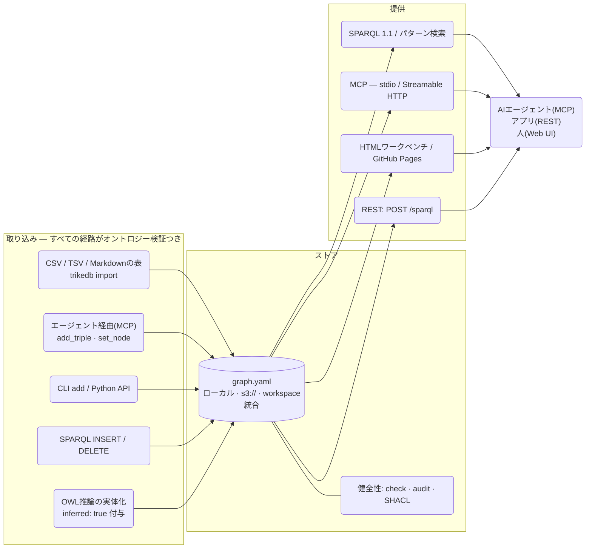
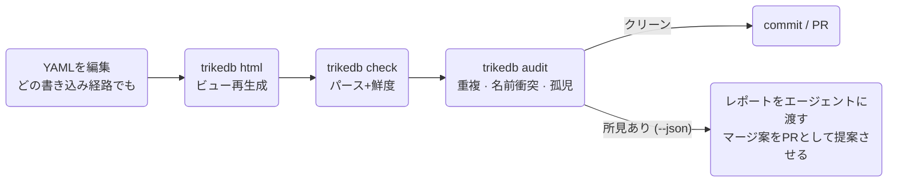

# trikedb リファレンス(日本語版)

全機能と使い方。[English version](REFERENCE.md) /
設計思想は [ARCHITECTURE.md](ARCHITECTURE.md)、ベンチマークは
[benchmarks/](../benchmarks/) を参照。

## 全体像



## ファイル形式

YAMLファイル1枚がデータベース。トップレベルは3キーで、必須は `triples` のみ:

```yaml
ontology:              # 任意 — 述語のホワイトリスト(+説明)
  predicates:
    PROVIDES: "SaaSベンダー -> 取り込みジョブ"

nodes:                 # 任意 — ノードの自由なプロパティ
  salesflow-crm: {type: saas, label: SalesFlow, url: "https://...", plan: enterprise}

triples:
  - {s: salesflow-crm, p: PROVIDES, o: crm-sync-job}    # コンパクト形式
  - s: crm-sync-job                                      # 追加のキーは
    p: INGESTS_TO                                        # すべてエッジ属性になる
    o: RAW_CRM_CONTACTS
    schedule: hourly
    prov: "design_doc.md"
```

採用を勧める慣習: `prov:`(事実の出典)、`deprecated: true`(破線描画)、
変更イベントは `AFFECTED_BY` 述語+日付入り自由文のオブジェクトで。

エッジ属性は**SPARQLで引ける**: 属性付きトリプルは標準のRDF具体化
(reification — `rdf:subject/predicate/object` を持つstatementリソース+属性)
としてもエクスポートされるので、運用の金脈(note・prov・schedule)を
「読む」だけでなく「絞り込んで結合」できる:

```sparql
# 特定のドキュメント由来の事実を全部
SELECT ?s ?p ?o WHERE {
  ?st rdf:subject ?s ; rdf:predicate ?p ; rdf:object ?o ;
      t:prov "design_doc.md" }
```

`db.sparql()`・`trikedb sparql`・MCPの`sparql`ツール・HTMLコンソールの
どこでも同じに動く(`rdf:` は全箇所でpre-bound)。reificationはエクスポート
専用 — YAMLはフラットのままで、SPARQL updateがstatementリソースを
書き戻すことはない。

**workspaceファイル**は複数グラフを読み取り専用でunionする:

```yaml
graphs:                # ローカルパスとリモートURLは混在可
  finance:  finance.yaml
  platform: s3://team-bucket/kg/platform.yaml
```

union内の各トリプルには出典グラフ名が `graph:` 属性として付き、
同名ノードはグラフ間で自動的にジョインされる。書き込みは拒否され、
メンバーグラフへの案内が返る。

## プロパティとラベルの付け方

情報を付けられる場所は3つあり、使い分けるとグラフが綺麗に保てる:

| 場所 | 個数 | 付け方 | 向いているもの |
|---|---|---|---|
| **ノードプロパティ** | ノードごとにキー無制限 | `set_node()` / `trikedb node -a` | そのエンティティ自身の事実: `url`・`owner`・`schema`・`pii` など |
| **エッジ属性** | トリプルごとにキー無制限 | `add(..., **attrs)` / `-a k=v` | **関係についての**事実: `schedule`・`prov`・`deprecated`・`since` など |
| **トリプル追加** | 無制限 | `add()` | 他のエンティティと共有される値・クエリしたい値 |

ノードプロパティのうち3つのキーはUI上の意味を持つ(各1個):

```python
db.set_node("svc-etl-01",
    label="etl-bot",    # ワークベンチでの表示名(ノードIDはキーのまま — IDは改名しない。エッジが指しているため)
    type="bot",         # 色分けグループ+凡例
    level=2)            # フローレイアウトの列(全ノードに揃っているときだけ有効)
db.set_node("svc-etl-01", owner="data-platform", pii=False)   # set_nodeはマージ — キーは後からいつでも追加できる
```

```bash
trikedb node graph.yaml svc-etl-01 -a label=etl-bot -a type=bot -a pii=false   # true/falseは自動でbool化
trikedb node graph.yaml svc-etl-01          # そのノードの全情報(プロパティ+入出エッジ)を表示
```

**複数値はリストよりトリプルで。** ノードにリスト(`aliases: [Tokyo, TYO]`)
も持てるが、値を1本ずつトリプルにするとSPARQLで個別に引けて、グラフ間の
自動ジョインにも乗る:

```python
db.add("tokyo", "HAS_ALIAS", "TYO")     # SELECT ?a WHERE { t:tokyo t:HAS_ALIAS ?a } が効く
```

目安: **「ノード自身のメタ情報→プロパティ、共有される・数える・クエリする値→トリプル」**。
ノードプロパティはSPARQLからもリテラルとして見える(`?x t:type \"bot\"`)。
さらに述語もただの名前なので、述語自体にプロパティを付けることもできる
(`db.set_node("PROVIDES", since="2024")`)— これはRDF本来の流儀。

## Python API

```python
from trikedb import TrikeDB, Triple, OntologyError
db = TrikeDB("graph.yaml", ontology={...})   # autosave=True がデフォルト
```

変更は即ファイルに書き戻される — `add()` したものがそのままディスクにある
(CLIと同じ感覚)。まとめて書きたいときは `autosave=False` で開いて
`save()` を自分で呼ぶ。

| メソッド | 説明 |
|---|---|
| `add(s, p, o, **attrs)` | トリプルをupsert(同一s,p,oは属性マージ)。未宣言の述語は `OntologyError`。絶対URIの述語は例外(OWLメタ文用) |
| `remove(s=, p=, o=)` | パターン一致を全削除。削除数を返す |
| `triples(s=, p=, o=, **attrs)` | パターンマッチ。`None`=ワイルドカード、`*`/`?` glob、attrsは完全一致フィルタ |
| `query([patterns])` | `?変数` の複数パターン結合(SPARQL的BGP、依存ゼロ) |
| `sparql(q)` | rdflib経由のSPARQL 1.1フル。SELECT→行、ASK→bool、INSERT/DELETE→増減数。`t:`/`rdf:` pre-bound |
| `search(q, k=10)` | 意味検索(`[semantic]` extra): 綴りでなく意味で事実をランク付け — 「認証まわりの注意点」がキーワード共有ゼロのkeypair/MFA事実を見つける |
| `find(question, where=None, k=10)` | ハイブリッド検索(`[semantic]` extra): 意味でのrecall→ハードな構造フィルタ(`where`: 必須ノードプロパティのdict、または `(name, props) -> bool` の関数)。`{node, props, facts}` のペイロードを返す |
| `update(q)` | SPARQL Updateを明示実行(`sparql`が書き込み形を委譲する先) |
| `subjects(p=, o=)` / `objects(s=, p=)` / `predicates()` / `nodes()` | 重複なしの項ヘルパー |
| `set_node(name, **props)` / `node(name)` | ノードプロパティ(キー数無制限。`label`/`type`/`level` はUIで意味を持つ)。SPARQLからリテラルとして参照可 |
| `import_file(path)` | CSV/TSV(s,p,oヘッダ)・Markdown(s/p/o表)・別のYAMLグラフをマージ |
| `declare(pred, characteristic)` | RDFS/OWL意味論の宣言: OWL `transitive` / `symmetric` / `functional` / `inverse_of:X`、または RDFS `subclass_of:X` / `subproperty_of:X` / `domain:X` / `range:X` — レビュー可能なトリプルとして保存 |
| `infer(apply=False)` | OWL-RL推論の実体化（RDFSの分類・階層＋OWLエッジを表面化、rdf/owlの内部ノイズは抑制）。`apply=True` で `inferred: true` 付きで追加 |
| `validate(shapes)` | pySHACLによるSHACL検証 → `(conforms, report)` |
| `audit()` | 健全性の所見(下記 `trikedb audit` 参照) |
| `content_hash()` | グラフ内容の安定指紋(HTML出力に埋め込まれる) |
| `to_html(path, title=, event_predicates=, layout=)` | インタラクティブワークベンチ(後述) |
| `to_rdflib()` / `to_jsonld()` | 相互運用エクスポート(RDF/SPARQLビュー) |
| `to_networkx(multigraph=True)` | プロパティグラフ投影(`[networkx]` extra): ノードのプロパティ＋エッジのlabel/属性を保持。同じファイルでnetworkxのアルゴリズム(最短経路・中心性)が使える |
| `save(path=)` | YAML書き込み(ローカル/リモートURL)。`autosave=True` なら変更のたびに自動 |
| `.workspace` / `.read_only` / `.ontology` / `.path` | 状態属性 |

## CLI

APIでできることは全部CLIでもできる(`pip install trikedb` または `uvx --from trikedb trikedb ...`):

| コマンド | 用途 |
|---|---|
| `trikedb add FILE S P O [-a k=v]...` | 属性つきでトリプル追加 |
| `trikedb rm FILE [-s] [-p] [-o]` | パターン一致を削除 |
| `trikedb query FILE -w "?s PRED ?o" [-w ...]` | パターン結合(表 or `--json`) |
| `trikedb sparql FILE "SELECT/INSERT..."` | SPARQL 1.1読み書き(書き込みは永続化) |
| `trikedb search FILE "クエリ" [-k N]` | 意味検索 — 事実とノードを意味でランク付け(`[semantic]` extra) |
| `trikedb import FILE SRC...` | CSV/TSV/Markdown/YAMLソースをマージ |
| `trikedb node FILE NAME [-a k=v]...` | ノード表示(プロパティ+入出エッジ)/プロパティ設定 |
| `trikedb ontology FILE [--set P=desc]` | 語彙の表示/拡張 |
| `trikedb stats FILE` | 述語別トリプル数・ノード数 |
| `trikedb html FILE [-o] [--title] [--events P1,P2] [--layout auto\|flow\|free]` | ワークベンチ出力 |
| `trikedb jsonld FILE` | JSON-LDを標準出力へ |
| `trikedb validate FILE SHAPES.ttl` | SHACL検証。違反でexit 1(CI向き) |
| `trikedb infer FILE [--apply]` | OWL-RL推論。`--apply` でタグ付き永続化 |
| `trikedb check FILE [--html PATH]` | パース確認+HTML鮮度検出(埋め込みハッシュ照合) |
| `trikedb audit FILE [--json] [--strict]` | 健全性所見。errorでexit 1(`--strict`で警告も) |
| `trikedb mcp FILE` | stdioのMCPサーバー |
| `trikedb serve FILE [--host] [--port] [--token] [--oauth-issuer] [--public-url] [--oauth-audience] [--required-scope] [--stateless]` | UI + REST + Streamable HTTPのMCP |

`FILE` 引数はどれもローカルパス・`s3://`/`gs://`/`https://` URL
(`[remote]` extra)・workspaceファイルを受け付ける。

## MCP: エージェントのためのオントロジーレイヤー

ツール11個・サーバー定義は1つ・トランスポートは2つ:

| ツール | 種別 | 備考 |
|---|---|---|
| `sparql` | 読み書き | prefix `t:`/`rdf:` は事前バインド。更新は永続化 |
| `search` | 読み | 曖昧な質問のための意味検索(`[semantic]` extra) |
| `find` | 読み | ハイブリッド検索: 意味recall + 構造`where`フィルタ(`[semantic]` extra) |
| `match` | 読み | 属性つきパターンマッチ |
| `get_node` | 読み | プロパティ+入出エッジ |
| `ontology` / `stats` | 読み | 語彙 / サマリ |
| `add_triple` / `set_node` / `remove_triples` | 書き | オントロジー検証つき・autosave |
| `import_source` | 書き | 決定論的ファイル取り込み |

```bash
# ローカル(stdio) — エージェントのセッションが子プロセスとして起動
claude mcp add kg -- uvx --from 'trikedb[mcp]' trikedb mcp /abs/path/graph.yaml

# リモート(Streamable HTTP) — 1サーバーをチーム全員で
trikedb serve s3://team-bucket/kg/graph.yaml --port 8080 --token $SECRET
claude mcp add kg https://kg.internal:8080/mcp --transport http \
  --header "Authorization: Bearer $SECRET"
```

`trikedb serve` は1プロセスで3つの入口を提供する: `/`(常に最新の
ワークベンチUI)、`/sparql`(REST: `POST {"query": ...}` → JSON)、`/mcp`。

### 認証

方式は2つ。どちらも3つの入口すべてを保護する:

| フラグ | 中身 | 用途 |
|---|---|---|
| `--token SECRET` | 静的Bearerトークン1本 | スクリプト、CI、信頼できるネットワーク内 |
| `--oauth-issuer URL` | 自社IdPに委譲するOAuth 2.1 (`[oauth]` extra) | claude.ai / ChatGPT のUI、ユーザー単位の識別 |

```bash
pip install 'trikedb[serve,oauth]'
trikedb serve graph.yaml \
  --public-url   https://kg.example.com \
  --oauth-issuer https://idp.example.com/ \
  --required-scope kg:read
```

trikedbは**リソースサーバーに徹する** — JWTを検証するだけで発行はしない。
つまり認可サーバーもセッションストアもユーザーテーブルも運用しなくていい。
初回リクエスト時にissuerのメタデータ
(`/.well-known/openid-configuration`、無ければ
`/.well-known/oauth-authorization-server`)を引いてJWKSをキャッシュし、
以降は各トークンの署名・`iss`・`exp`・`aud` を検証する。

- **audience** の既定値は `<public-url>/mcp`。クライアントがRFC 8707の
  `resource` パラメータとして送る正規MCP URIそのもの。IdP側でこの `aud` を
  発行させるか、IdPが使う識別子に `--oauth-audience` を合わせる。
  **他サービス向けに発行されたトークンでグラフを開かせない**ための検証で、
  ここを省くと意味がない。
- **スコープ** は `scope` と、IdPによって使われる `scp` / `permissions`
  クレームから読む。`--required-scope` は各々強制され、足りないトークンには
  何が不足かを添えて `403 insufficient_scope` を返す。
- **ディスカバリ** は `/.well-known/oauth-protected-resource/mcp` (RFC 9728)
  に自動で生え、トークン無しでも到達できる。`/mcp` への未認証リクエストは
  そこを指す `WWW-Authenticate` 付きの `401` を返し、これがコネクタの
  ログイン導線になる。
- **クライアント登録** はIdP側の仕事で、trikedbは一切関与しない。Dynamic
  Client Registration対応なら一番楽。MCPクライアントはClient ID Metadata
  Documentや手動発行のclient IDも受け付ける。

#### IdPに求める条件

OAuth 2.1 / OIDC のプロバイダなら何でも動く。trikedbにベンダー固有の実装は
入っていない。条件は4つで、それぞれコマンド1本で確認できる:

| 条件 | 確認方法 |
|---|---|
| issuerでメタデータを公開している | `curl -s https://idp.example.com/.well-known/openid-configuration \| jq '{issuer, jwks_uri, registration_endpoint}'` |
| アクセストークンを非対称鍵(RS256/ES256/PS256)のJWTで署名する | トークンがドット区切りの3パートになっていること。不透明な文字列ならIdPがどのAPI向けか判断できていない |
| `aud` に `<public-url>/mcp` を入れる | 実物をデコードする: `python -c "import jwt,sys;print(jwt.decode(sys.argv[1],options={'verify_signature':False}))" "$TOKEN"` |
| MCPクライアントがclient IDを取得できる(DCR / CIMD / 手動発行) | 上のメタデータの `registration_endpoint`、またはプロバイダのアプリ一覧 |

プロバイダごとの違いは、これらが管理画面のどこにあるかだけ。**トークンが
JWTでなく不透明な文字列で返る**なら「デフォルトaudience」に相当する設定を
探すこと(大半はこれが原因)。**動的登録されたクライアントが拒否される**なら、
サードパーティアプリ向けのデフォルト権限設定が別にないか探すこと。API側で
「全アプリを許可」にしても、自分で登録したクライアントは対象外という
プロバイダが多い。

trikedb側はトークン無しで確認できる:

```bash
curl -s  https://kg.example.com/.well-known/oauth-protected-resource/mcp | jq
curl -si https://kg.example.com/mcp -X POST -d '{}' | grep -i www-authenticate
```

1つ目に自分のissuerが並び、2つ目が1つ目を指していれば正しい。

#### うまくいかないとき

| 症状 | 原因 | 対処 |
|---|---|---|
| 正しそうなトークンで `401` | `aud` / `iss` / `exp` の不一致 | 上のコマンドでデコードする。`aud` は `<public-url>/mcp` と一致必須、違うなら `--oauth-audience` |
| `403 insufficient_scope` | `--required-scope` が足りない | IdPでそのスコープを付与するか、フラグを外す |
| ログイン成功**後**に `421 Misdirected Request` | `Host` ヘッダが信用されていない | `--public-url` を渡す。認証エラーに見えるが違う |
| ログイン画面まで到達しない | ディスカバリかクライアント登録の失敗 | 上の `curl` 2本を実行し、`registration_endpoint` を確認する |

リモートMCPクライアントは公開HTTPSエンドポイントを要求する。`localhost` に
は繋がらないので、開発中はトンネルを挟むこと。なお `--public-url` は同時に
SDKのDNSリバインディング対策の許可リストにもそのホスト名を入れる(既定では
localhostしか信用しない)。**プロキシやトンネル越しの構成なら、OAuthの有無に
関わらず**このフラグが必要。

### デプロイ

サーバーはローカル状態を持たない1プロセスなので、コンテナが動く場所なら
どこでもよい (Cloud Run / ECS / Fly / VM):

```dockerfile
FROM python:3.12-slim
RUN pip install --no-cache-dir 'trikedb[serve,oauth,remote]'
CMD trikedb serve "$GRAPH" \
      --host 0.0.0.0 --port "$PORT" \
      --public-url "$PUBLIC_URL" \
      --oauth-issuer "$OAUTH_ISSUER" \
      --required-scope kg:read
```

```bash
GRAPH=s3://team-bucket/kg/graph.yaml
PUBLIC_URL=https://kg.example.com
OAUTH_ISSUER=https://idp.example.com/
```

外すと分かりにくい壊れ方をするのが3つある:

- **`--host 0.0.0.0`** — 既定はループバックに束縛するため、コンテナの外から
  到達できない。
- **`--public-url` は任意ではなく必須** — リクエストはロードバランサの
  ホスト名を `Host` ヘッダに載せて届く。指定しないと**認証が成功した後**に
  `421` で拒否される。デプロイ時にURLが決まるプラットフォーム(Cloud Run)は、
  URLを知るための1回目と、それを反映する2回目でデプロイが2回要る。
- **エージェントに書かせるならグラフはリモートストレージに置く**
  (`s3://` / `gs://` / `https://` — `[remote]` extra)。コンテナの
  ファイルシステムは揮発するので、`COPY` で焼き込んだグラフは次のデプロイで
  書き込みが全部消える。リモートなら複数レプリカで1つのグラフを共有できる。
  書き込みは last-write-lands なので、単一レプリカに寄せるか、gitレビュー
  経由のバッチに寄せること。

#### `--stateless`

既定のMCPトランスポートは初回リクエストで `Mcp-Session-Id` を発行し、以降の
全リクエストでそれを返してくることを期待する。このセッションは1プロセスの
メモリ上にしか無いので、2つの構成が壊れる:

- **レプリカが複数あるとき。** レプリカAで張ったセッションはレプリカBには
  存在しないため、ロードバランサ配下だとランダムに
  `400 Bad Request: Missing session ID` が返る。
- **セッションを持ち回らないクライアント。** ヘッダをエコーしないMCP
  クライアントは、接続直後に同じ400を受け取る。サーバー側の障害に見えるが
  違う。

`--stateless` はセッション管理をやめ、各リクエストを独立したトランスポートで
処理する。どのレプリカでもどのリクエストにも答えられ、ヘッダを持ち回る必要も
なくなる。MCPツールの動作にセッションは不要なので、失うのはSSEの再開機能だけ。
認証には影響しない（トークンは毎回検証される）。

レプリカを複数立てるとき、またはこの400から抜けられないクライアントに
当たったときは、このフラグを使う。

#### 同時書き込み

保存はファイル全体を書き直すので、版Nを読んだ2者がそれぞれ版N+1を作れば
片方が消えるはずだった。S3ではそうならない。保存は「そのグラフを読んだときの
オブジェクトのままであること」を条件に実行され、他者を上書きしてしまう書き込みは
`ConcurrentWriteError` で拒否される。MCPの書き込みツールは自力で復帰する —
グラフを読み直し、依頼された1つの変更を再適用して保存し直す（間隔を空けながら）。

リクエストごとにコンテナが増えるLambda経由で、1つのS3ファイルに `add_triple` を
10件同時に投げると**10件とも残る**。条件付き書き込みを入れる前は4件で、
残り6件はどこにもエラーを残さず消えていた。

制約が2つある:

- **保証されるのはS3だけ。** 他のバックエンドは条件付き書き込みを持たないので
  last-write-wins のまま。ローカルファイルも保護されない（単一プロセス前提）。
- **長時間動くレプリカは互いを見ない。** MCPツールはプロセスの生存期間中ずっと
  同じグラフインスタンスを保持し、書き込みが衝突したときにだけ読み直す。
  一度も書かないレプリカは他のレプリカの書き込みに気づかない。再起動するか、
  読み取り専用レプリカにはエージェントではなくレビュー経由で変わるグラフを
  配ること。

## エージェントはどう読み分けるべきか

アクセス手段は3つで、**質問の形**で選ぶ — 競合ではなくカスケードに合成する:

| 手段 | 向いている質問 | 保証 |
|---|---|---|
| **ファイル丸読み** | 「何がある?」「規約は?」— 何を聞くべきかまだ不明な段階 | 全部見える(〜1kトリプルまで快適) |
| **`query` / `sparql`** | 「Xにアクセスできるのは誰?」— 語彙(述語名)を知っている | 決定的・網羅的 |
| **`search`** | 「認証まわりの注意点は?」— ノード名も述語名も知らない | ランク付き候補(保証なし) |

曖昧な質問のカスケード: **`search`で足がかり → `sparql`/`match`で裏取り・
展開 → 回答**。意味検索は索引、SPARQLは証明 — 検索ヒットだけを根拠に
事実を断定しない。小さいグラフなら最初の段は丸読みで代替できる。
(各段のサイズ上限の実測は [SCALING.md](SCALING.md) 参照。)

## HTMLワークベンチ

`to_html()` / `trikedb html` が自己完結のページを生成する:

- 力学クラスタ or 左→右フロー(`--layout auto` がグラフの形で自動選択)。
  workspaceでは各グラフが格子のセルに島として並び、グラフ別フィルタチップ付き
- ノードクリック → 詳細パネル(全プロパティ、URLはリンク化、入出エッジ)
- 凡例クリックで絞り込み: ノードtypeのチェックON/OFFでノードを、
  述語スウォッチのクリックでエッジを表示/非表示(グラフチップと併用可)
- 全文検索: ノードID・ラベル・プロパティ・エッジ属性・自由文ファクトを横断。
  入力中に件数表示、Enter/Shift+Enterでヒット巡回、**text2sparql** ボタンで
  検索語をCONTAINSクエリに変換してコンソールで編集続行
- ブラウザ内SPARQLコンソール(Oxigraph WASM、初回使用時にCDNからロード)
- 変更イベントは赤ダイヤ+下部タイムラインバー(`--events AFFECTED_BY` で述語を固定)
- ライト/ダーク切替(保存される)、`trikedb check` 用のコンテンツハッシュ埋め込み

## リモートグラフ

`TrikeDB("s3://bucket/kg/graph.yaml")` — fsspec経由で読み書き
(`[remote]` extra)。認証はAWS標準の認証チェーン(環境変数・プロファイル・
SSO・IAMロール)に委譲。trikedbは認証情報を一切保存せず、バケットポリシー
がそのままアクセス制御になる。同時書き込みはlast-write-wins — 書き込みは
単一のMCP/serveプロセスかgitレビュー経由のバッチに寄せること。

## 検証と推論

- **SHACL**(`[shacl]`): 本物の形状制約(カーディナリティ・値域)を
  `urn:trikedb:` 名前空間に対して。`trikedb validate` はCIでそのまま使える
- **OWL-RL**(`[owl]`): 述語に特性を宣言して、導かれる事実を実体化。
  推論は**魔法ではなく実体化** — 導出された事実は `inferred: true` タグ付きで
  YAMLに書かれ、diffでレビューできる。その場限りの推移閉包なら
  SPARQLのプロパティパス(`t:INHERITS+`)でOWL不要

## 育つグラフを健全に保つ



`audit` は意図的に決定論。ヒューリスティクスを超える意味的な重複整理は
エージェントの仕事で、エージェントが何を書こうとオントロジーガードが
語彙の内側に留める。

## Extras

| Extra | 追加されるもの | 依存 |
|---|---|---|
| *(コア)* | 上記すべて(↓以外) | PyYAML, rdflib |
| `[mcp]` | `trikedb mcp`(stdio) | mcp (1.x) |
| `[serve]` | `trikedb serve` | mcp, uvicorn, starlette |
| `[oauth]` | `trikedb serve --oauth-issuer` | mcp, pyjwt[crypto] |
| `[remote]` | `s3://` 等 | fsspec, s3fs |
| `[shacl]` | `validate` | pyshacl |
| `[owl]` | `declare` / `infer` | owlrl |
| `[semantic]` | `search`(埋め込み・多言語・torch不要) | model2vec, numpy |
| `[networkx]` | `to_networkx`(プロパティグラフ投影) | networkx |
