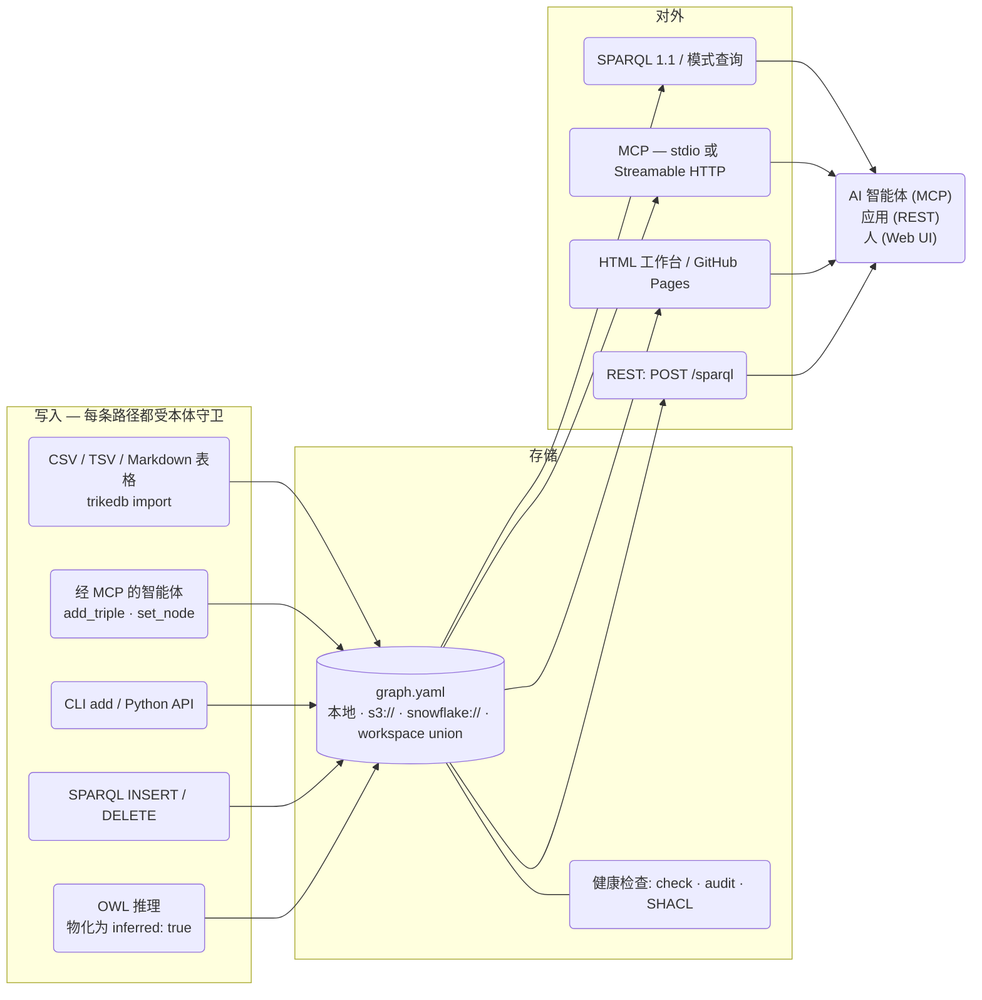
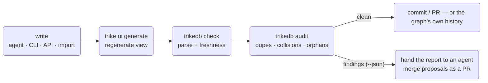

<b>简体中文</b> · [English](REFERENCE.md) · [日本語](REFERENCE_jp.md) · [简体中文](REFERENCE_zh.md)

# trikedb 参考手册

每一个功能，以及怎么用。设计理由见
[ARCHITECTURE_zh.md](ARCHITECTURE_zh.md)；基准测试方法见
[benchmarks/](../benchmarks/)。


**兼容性与安全性约定。** 这里只有一个默认图：SPARQL 读取，加上对默认图的 INSERT/DELETE 与 CLEAR/DROP；命名图与 dataset 级更新会被拒绝。历史数据中含空白字符的宾语按字面量处理；要表示 `New York` 这样的实体，请用 `rdf_terms={"o": {"kind": "iri"}}`。经 SPARQL 插入的 RDF 类型、语言标签和空白节点现在能在保存/重载后保留。RDF/JSON-LD 导出保留完整的 RDF 投影（含元数据）；pattern/NetworkX/SQL 视图使用词法名称。

API 返回的三元组与属性都是快照；请用变更 API，不要直接改返回的对象。`batch()` 在函数体失败或最终保存失败时回滚它的内存状态；块内显式保存过的内容和产生的外部副作用无法撤销。`reload()` 使用已存储的本体。白名单在配置后作用于 API 插入（HTTP(S) 述语除外）；手工编辑过的文件在加载时不做模式检查。

本地写入以原子方式整体替换文件，但多个互不相干的本地进程之间是 last-write-wins。同一个 HTTP 服务器内的 REST/MCP 共享并串行化状态；外部编辑仍然需要 reload。S3/SQL 的条件保存使用各自 commit 返回的令牌，其他 fsspec 后端没有这个保证。导出的 HTML 需要能访问 vis-network/Oxigraph 的 CDN。详见 [API 约定](https://github.com/RyutoYoda/trikedb/blob/main/docs/REFERENCE.md)。


**下文中的性能数字，是在各自记录的硬件与版本上历史测得的结果，不是本次发布重新测量的保证值。**

## 全局图景



## 文件格式

一个 YAML 文件就是数据库。三个顶层键，只有 `triples` 是必需的：

```yaml
ontology:              # 可选的述语白名单（外加说明）
  predicates:
    PROVIDES: "SaaS 厂商 -> 采集任务"   # 说明只是文档
    # 形状会被强制：写在错误节点类型之间的边，
    # 在进来的那一刻就被拒绝，而不是先存下来事后再报告
    INGESTS_TO: {description: "任务 -> 表", domain: job, range: table}

nodes:                 # 可选的自由格式节点属性
  salesflow-crm: {type: saas, label: SalesFlow, url: "https://...", plan: enterprise}

triples:
  - {s: salesflow-crm, p: PROVIDES, o: crm-sync-job}          # 紧凑写法
  - s: crm-sync-job                                            # 多出来的键
    p: INGESTS_TO                                              # 都会变成
    o: RAW_CRM_CONTACTS                                        # 边属性
    schedule: hourly
    prov: "design_doc.md"
```

值得采用的约定：`prov:`（这条事实从哪来）、`deprecated: true`（渲染成虚线），
以及把变更事件写在**被它改变的那个节点**上 —— 一条以该节点为主语的
`AFFECTED_BY` 三元组，带上 `at:`（何时）、`by:`（谁）和 `state:`（留下了
什么状态）。

这些要用 `act()` 写，而不是 `add()`：它在一次写入里打上时间戳、追加事件，
并把节点移到这次动作留下的状态。事件的身份包含它的时间，所以同一个动作跑
两次就留下两条记录 —— 往日志里追加，永远不会把日志覆盖掉。

述语声明可以是一段说明（注释而已，没有任何东西会校验它），也可以是一个形状
（`domain` = 允许出现在主语位置的节点类型，`range` = 允许出现在宾语位置的
类型）。形状由每一条写入路径强制执行：`add`、`act`、SPARQL `INSERT`、MCP
工具和 CLI。检查只在端点类型已知的地方运行 —— 类型写在用到它的边之后，
和写在之前一样常见 —— 而 `set_node` 会从节点这一侧运行同样的检查，所以
两者谁先写并不能决定这张图是否遵守自己的本体。任何写入路径都还没能检查的，
由 `audit` 报成 `unchecked-link`；而从别的途径混进来的矛盾（手工编辑过的
文件、事后补上的声明）则是一条 error 级别的发现。

形状说的是一个动作可以连接什么。另外两个键说的是**什么时候才可以执行**和
**谁才可以执行** —— 这是类型检查够不着的另一半：发货之前就送达的订单不违反
任何类型，没有人批准过的调价在类型上完全正确：

```yaml
ontology:
  predicates:
    SHIPPED_FROM: {description: "order -> depot", domain: order, range: depot}
    DELIVERED_TO:
      description: "order -> where it was handed over"
      domain: order
      range: region
      requires: SHIPPED_FROM     # 这件事必须先发生过
      by: courier                # 而这是有权执行它的人
```

`requires` 指向一个述语：在不晚于当前这个动作的时刻，它必须已经对该动作
**触及**的某样东西发生过；写成列表就表示全都要满足 —— 字面意思。是
**触及**而不是"作为主语"，因为 promotion 会把一个动作所关于的东西从边的
一端挪到另一端，而且两个方向都会挪：

- *被要求的那个事件*被 promote —— 一次带原因和批准人的下架写成
  `RET-0007 RETIRED "Copper Kettle"`，水壶自己身上并没有 `RETIRED`；
- *动作本身*被 promote —— `MIT-0007 MITIGATED INC-2025-01` 让缓解措施
  成为自己的主语，而刚刚创建出来的缓解措施没有历史可问。那个必须先被提出
  的故障，在边的另一端。

所以两条边的两端都会被读，就像 `history()` 读一个节点那样。把任何一边限制
成只看主语，都会让前提条件恰好在 promotion 存在的理由那种情形下失效。不带
时间的动作会被直接拒绝：否则"在……之前"就是一个没有东西能回答的问题。

前提条件可以跨成员图。演示里 `SHIPPED_FROM` 被声明为要求 `PLACED_BY`，
而这两者在不同的文件中 —— 一个订单的完整故事只在 union 里才是完整的，
而 `audit` 读的正是那个 union。

`by` 指的是执行者的节点类型，会与 `by=` 属性核对。一旦声明，执行者就成了
必填项 —— 没有人签署的动作，是审计轨迹上一个类型完全正确的窟窿。

### 跨多个步骤的条件

一条边往往不足以说明什么让一个动作合法。"只有买过这件东西的人才能写评价"
是 `PLACED_BY` 与 `CONTAINS` 的连接，而夹在中间的订单，评价的两端都没有提
到它，所以任何单边检查都够不着。把步骤写成 `(s p o)` 模式而不是一个名字，
它们就会按共享变量连接起来 —— `?s` 和 `?o` 代表动作自身的两端：

```yaml
    REVIEWED:
      description: "customer -> product they rated"
      domain: customer
      range: product
      requires:
        - "?order PLACED_BY ?s"
        - "?order CONTAINS ?o"
```

记得加引号：在 YAML 的 flow 写法里，开头的 `?` 是显式键标记。一条
`requires` 条目要么一个词，要么三个词；其他形式会在读取声明时就被拒绝，
而不是被当成一个永远匹配不上任何东西的述语名留下来。

时钟对每一个步骤都生效，而不带日期的步骤 —— 这里的 `CONTAINS` —— 只是
"已经为真"，而不是"那天发生的事"。条件不满足时，消息会指名**哪一个步骤**
是空的，以及它是"到那时为止是空的"还是"根本就是空的"：一个三步条件只有说
清楚在哪里断掉，才谈得上可调试：

```
REVIEWED is declared to require (?order PLACED_BY ?s; ?order CONTAINS ?o)
first, but for (TC-1008 REVIEWED Cast Iron Skillet 26cm) nothing
satisfies (?order CONTAINS ?o) at all
```

那个顾客是真的，那件商品是真的，两边的类型都对，日期也说得通。类型检查
会放它过去，条件不会。

### 当答案还没有定下来的时候

`requires` 是**单调的**：多写三元组只可能让一个条件被满足，不可能让它被
破坏。所以在一张还没建完的图上不满足的条件，是"还没写下来的证据"，而不是
违规 —— 关于"拒绝它"这件事，唯一可能出错的是**拒绝的时机**。

这决定了每项检查放在哪里。三元组自己就能定案的 —— 缺失的 `by=`、没有时间
的动作 —— 在写下它的地方被拒绝，因为之后写什么都补不回来。需要图的其余部分
才能判断的，同样在写下它的地方被拒绝，**除非有一个 batch 正开着**：那时图
还在组装中，问题会被挂起，在出口处再问一次 —— 那里图是完整的，答案是最终
的。两种情况都不会跳过任何检查，动的只是异常抵达的时刻。因此批量加载既能
强制它的条件，又不会让行的顺序决定结果；一旦失败，整块回滚，而不是留下一次
只应用了一半的导入。

两者都遵循和 `domain`/`range` 一样的两段式纪律：`add` 和 `act` 拒绝眼前这张
图就能定案的部分，剩下的由 `audit` 读完成品文件来看 —— 它调用的是 `_unmet`，
和写入路径调用的是同一个，所以两者不可能各走各的。`precondition-unmet`、
`action-has-no-actor` 和 `actor-contradicts-declaration` 是 error，
`unchecked-actor`（还没有人给执行者标类型）是 warning。加载永远不会因为行的
顺序被拒绝；谁先谁后由时钟决定。

条件按述语索引，**并且**按两端的节点索引，所以一个已经知道自己某一端的
步骤，会直接走到碰到它的那寥寥几条三元组上。一个两步条件的检查开销大约
50µs，无论图里是一千条三元组还是二十万条 —— 这正是它能负担得起在每一次
写入时强制、而不是只在 `audit` 里检查的原因。

边属性是**可以用 SPARQL 查询的**：每条带属性的三元组同时会被导出成标准的
RDF 具体化（reification：一个带 `rdf:subject/predicate/object` 和那些属性的
statement 资源），所以运维上真正值钱的东西 —— 备注、来源、调度 —— 不只是
能读，还能过滤和连接：

```sparql
# 来自某个文档的所有事实
SELECT ?s ?p ?o WHERE {
  ?st rdf:subject ?s ; rdf:predicate ?p ; rdf:object ?o ;
      t:prov "design_doc.md" }
```

这在 `db.sparql()`、`trikedb sparql`、MCP 的 `sparql` 工具和 HTML 控制台里
都一样能用（`rdf:` 在所有地方都已预先绑定）。具体化是从边属性生成的。
UPDATE WHERE 可以读到这个投影；删除生成出来的元数据会抛 ValueError。显式
插入的 RDF statement 仍然是普通事实。

**Workspace 文件**以只读方式把多张图 union 起来：

```yaml
graphs:                # 本地路径和远端 URL 可以随意混用
  finance:  finance.yaml
  platform: s3://team-bucket/kg/platform.yaml
```

union 里的每条三元组都带一个 `graph:` 属性标明来源；同名节点在成员之间自动
连接；写入会被拒绝，并返回指向成员文件的提示。

成员也可以是数仓里的行，而且它们**继承连接** —— 这正是让 union 能在
"自己开不了连接的地方"也用得起来的原因：

```yaml
# workspace.yaml 自己也可以存成一行
graphs:
  ontology: snowflake://DB.SCHEMA.T/kg/ontology
  skills:   snowflake://DB.SCHEMA.T/kg/skills
```

```python
db = TrikeDB("snowflake://DB.SCHEMA.T/kg/workspace",
             connection=get_active_session(), read_only=True)
```

**让 `TrikeDB` 去组装 union，不要自己读成员再合并。** 有三个细节决定一个
union 里到底有什么，而弄错其中任何一个都是**静默的** —— 图只是比它所依据的
那些文件稍微贫瘠了一点：

- **节点属性是按键合并的，不是按节点。** 在两个成员里都声明过的节点，每个
  **键**取先出现的值，所以只有第二个成员才有的 `description` 依然会保留。
  整个字典直接取第一个成员的，会把它丢掉，而且任何地方都不会报错。
- **本体按述语合并**，说明由靠前的成员胜出。
- **三元组的 `graph` 属性是 workspace 里的键**，不是成员的文件名或路径。

`content_hash()` 是低成本地证明"你自己拼的 union 和 trikedb 拼的一致"的办法：
哈希相同，图就相同。


## 属性与标签

可以挂信息的地方有三处，知道该用哪一处，图就能保持干净：

| 挂在哪 | 数量 | 用什么设置 | 适合放什么 |
|---|---|---|---|
| **节点属性** | 每个节点键数不限 | `set_node()` / `trikedb node -a` | 关于实体本身的事实：`url`、`owner`、`schema`、`pii`…… |
| **边属性** | 每条三元组键数不限 | `add(..., **attrs)` / `-a k=v` | 关于*关系*的事实：`schedule`、`prov`、`deprecated`、`since`…… |
| **更多三元组** | 不限 | `add()` | 任何会被别的实体共享、或者你想查询的东西 |

有三个节点属性键在 UI 上有特殊含义（各取一个值）：

```python
db.set_node("svc-etl-01",
    label="etl-bot",    # 工作台里的显示名（节点 ID 仍是那个键 —— 永远不要改 ID，边指向的是它）
    type="bot",         # 颜色分组 + 图例条目
    level=2)            # flow 布局里的列（只有每个节点都有时才生效）
db.set_node("svc-etl-01", owner="data-platform", pii=False)   # set_node 是合并 —— 随时可以加键
```

```bash
trikedb node graph.yaml svc-etl-01 -a label=etl-bot -a type=bot -a pii=false   # true/false 会变成布尔值
trikedb node graph.yaml svc-etl-01          # 显示这个节点已知的一切
```

**多值事实：优先用三元组，而不是列表属性。** 节点可以存一个列表
（`aliases: [Tokyo, TYO]`），但把每个值写成独立的三元组，才能在 SPARQL 里
查询，也才能跨图连接：

```python
db.add("tokyo", "HAS_ALIAS", "TYO")     # SELECT ?a WHERE { t:tokyo t:HAS_ALIAS ?a } 能用
```

经验法则：*关于节点自身的元数据 → 属性；任何被共享、被计数、被查询的东西
→ 三元组。* 节点属性同样暴露给 SPARQL（作为字面量：`?x t:type "bot"`），
而且既然述语也只是名字，连述语本身都可以带属性
（`db.set_node("PROVIDES", since="2024")`）—— 这是 RDF 的做法。

## Python API

```python
from trikedb import TrikeDB, Triple, OntologyError
db = TrikeDB("graph.yaml", ontology={...})   # autosave=True 是默认值
```

变更会直接写回文件 —— 你 `add()` 了什么，磁盘上就是什么，和 CLI 一样。
这意味着每次变更都要整份重写一遍 YAML，所以批量导入应该用
`with db.batch():`（结束时保存一次，其他地方 autosave 照常），或者
`autosave=False` 配上你自己的 `save()`。用一次一条、每条都 autosave 的
`add()` 去装几万条三元组是平方级的，要花好几分钟；放进 `batch()` 里，
同样的加载只要几秒。

| 方法 | 做什么 |
|---|---|
| `add(s, p, o, **attrs)` | Upsert 一条三元组（s,p,o 相同则合并属性 —— 事件还会按时间区分，所以同一个动作跑两次仍是两条事实）。遇到未声明的述语、与已声明 `domain`/`range` 矛盾的链接、与已声明 `requires`/`by` 矛盾的动作，都会抛 `OntologyError`；绝对 URI 述语除外（OWL 元陈述） |
| `act(s, p, o, state=, by=, at=, **attrs)` | 执行一个动作：打上时间（`at=` 可覆盖，否则取当前）、追加事件、并把节点 `s` 移到 `state` —— 一次写入，要么全做要么全不做。是追加而不是合并：同一个动作两次就是两条记录 |
| `history(name, p=None, *, incoming=True)` | 这个节点身上发生过的一切，最新在前（同一天的并列按文件顺序）。**双向**：指*向*某个节点的事件也属于那个节点的记录，这正是让一个动作可以[被 promote 成宾语](#文件格式)、同时又不把它触及的东西从各自的历史里切断的原因。`incoming=False` 可以只看该节点作为主语的部分 |
| `state(name)` | 节点现在所处的状态：`act()` 写下的那个属性，否则是该节点**自己**最新一个事件留下的状态。刻意不采用双向视图 —— 指向一个节点的事件说的是"有事发生在它身上"，而不是"它取得了那个事件的状态"，所以一次留下 `applied` 的调价，不会让批准人也变成 applied |
| `declare_link(p, domain=, range=, requires=, by=, description=)` | 声明一个述语连接什么、什么时候可以执行、谁可以执行，此后即强制生效。`requires` 接受述语名、按共享变量连接的 `(s p o)` 模式（`?s`/`?o` 是动作自己的两端），或者两者混用。它会去丈量它被加入的那张图，如果已有的链接或动作与之矛盾就抛错。一次声明是把整个形状重新说一遍，而不是打补丁：你没写进去的部分就是撤销了 |
| `remove(s=, p=, o=)` | 删除所有匹配项；返回条数 |
| `triples(s=, p=, o=, **attrs)` | 模式匹配。`None` = 通配，`*`/`?` 为 glob，attrs 按精确值过滤 |
| `query([patterns])` | 用 `?变量` 做多模式连接（SPARQL 风格的 BGP，零依赖） |
| `sparql(q)` | SPARQL 1.1 读取，以及受支持的默认图更新。读取跑在 Oxigraph 上，写入跑在 rdflib 上（见 [速度](#速度)）。SELECT→行，ASK→布尔，INSERT/DELETE→三元组净增量。`t:` 和 `rdf:` 已预先绑定。节点名按字面变成 IRI —— `t:調査工程` 指的就是节点 `調査工程`。只有 IRI 承载不了的字符才会被转义，所以带空格的名字需要写成 `<urn:trikedb:Baltic%20states>`。带点的词（`location.location.events`）同样需要完整 IRI —— SPARQL 会把前缀名里的点读成数字 |
| `search(q, k=10)` | 语义搜索（`[semantic]` extra）：按意思而不是拼写给事实排序。`score`/`kind`/`node`/`chunk`/`chunk_text` 是返回结构自己的键；同名的属性会被保留为 `attr_<name>` —— "認証まわりの注意点"能找出关键词完全不重合的 keypair/MFA 事实。向量按句子缓存，所以一张只多了一条事实的图只需要重新编码一个句子（见[嵌入缓存](#嵌入缓存)） |
| `find(question, where=None, k=10)` | 混合检索（`[semantic]` extra）：先语义召回，再做一次硬性的结构化过滤（`where`：必须满足的节点属性字典，或一个 `(name, props) -> bool` 可调用对象）。返回 `{node, props, facts}` 结构 |
| `update(q)` | 显式执行 SPARQL Update（`sparql` 会把写入形式路由到这里） |
| `subjects(p=, o=)` / `objects(s=, p=)` / `predicates()` / `nodes()` | 去重的词项辅助方法 |
| `set_node(name, **props)` / `node(name)` | 节点属性（键数不限；`label`/`type`/`level` 在 UI 上有含义）。在 SPARQL 里作为字面量可查。修改已有的 `type` 会被拒绝（两个同名的东西会悄悄互相覆盖）—— 确实要改就传 `replace=True` |
| `batch()` | 上下文管理器：随便改，退出时保存一次。否则 `autosave=True` 会在每次变更时重写整个文件，在批量导入下是平方级的 |
| `import_file(path)` | 从 CSV/TSV（表头为 s,p,o）、Markdown（s/p/o 表格）或另一张 YAML 图合并进来 |
| `declare(pred, characteristic)` | RDFS/OWL 语义：OWL 的 `transitive` / `symmetric` / `functional` / `inverse_of:X`，或 RDFS 的 `subclass_of:X` / `subproperty_of:X` / `domain:X` / `range:X` —— 以一条可评审的三元组存下来 |
| `infer(apply=False)` | OWL-RL 物化（RDFS 分类与层级 + OWL 边；rdf/owl 记账噪声已抑制）；`apply=True` 会加入标记为 `inferred: true` 的事实 |
| `validate(shapes)` | 经 pySHACL 做 SHACL 校验 → `(conforms, report)` |
| `audit()` | 健康检查发现（见下文 `trikedb audit`） |
| `content_hash()` | 图内容的稳定指纹（会嵌进 HTML 导出里） |
| `to_html(path, title=, event_predicates=, layout=)` | 交互式工作台（见下文） |
| `to_rdflib()` / `to_jsonld()` | 互操作导出（RDF/SPARQL 视图） |
| `to_networkx(multigraph=True)` | 属性图投影（`[networkx]` extra）：节点属性 + 边的 label/attrs；可以在同一个文件上跑 networkx 算法（最短路径、中心性） |
| `TrikeDB(path, read_only=True)` | 以只读方式打开一张图；任何变更都会抛错。`reload()` 之后依然有效 |
| `TrikeDB(path, sparql_engine="rdflib")` | 固定 SPARQL 引擎；默认是核心依赖 oxigraph，并以 rdflib 兜底 |
| `TrikeDB(url, connection=conn)` | 用一个已经打开的数仓连接或 Snowpark session，而不是自己再建一个 |
| `save(path=)` | 写出 YAML（本地或远端 URL）。`autosave=True` 会在每次变更时做这件事 |
| `.workspace` / `.read_only` / `.ontology` / `.path` | 状态属性 |

## CLI

API 能做的事，命令行都能做（`pip install trikedb`，或者
`uvx --from trikedb trikedb ...`）。会装上两个名字：`trikedb` 和更短的
`trike` —— 同一个命令，所以 `trike ui` 和 `trikedb ui` 可以互换：

| 命令 | 用途 |
|---|---|
| `trikedb init FILE [--template NAME] [--list] [--force]` | 写出一张起始图，让你第一眼看到的不是一个空文件 |
| `trikedb add FILE S P O [-a k=v]...` | 添加一条带属性的三元组 |
| `trikedb rm FILE [-s] [-p] [-o]` | 删除匹配的三元组 |
| `trikedb query FILE -w "?s PRED ?o" [-w ...]` | 模式连接（表格或 `--json`） |
| `trikedb sparql FILE "SELECT/INSERT..."` | SPARQL 1.1 读写（写入会落盘） |
| `trikedb search FILE "query" [-k N]` | 对事实和节点做语义搜索（`[semantic]` extra） |
| `trikedb import FILE SRC...` | 合并 CSV/TSV/Markdown/YAML 来源 |
| `trikedb node FILE NAME [-a k=v]...` | 显示一个节点（属性 + 边）或设置属性 |
| `trikedb ontology FILE [--set P=desc] [--link P=domain>range]` | 显示 / 扩展述语词表。`--link INGESTS_TO=job>table` 声明一个形状并即刻生效；任意一侧都可以留空，也可以用 `a\|b` 写多个类型 |
| `trike act FILE S P O [--state] [--by] [--at] [-a k=v]...` | 记录你做过的事：节点移到新状态，日志留下这次执行 |
| `trike history FILE NAME` | 一个节点身上发生过什么，最新在前，以及它现在所处的状态 |
| `trikedb stats FILE` | 每个述语的三元组数、节点数 |
| `trike ui [FILE]` | 在浏览器里打开工作台。文件参数可选：有 `workspace.yaml` 或 `graph.yaml` 就用它，否则用目录里唯一的那张图，再否则用其中唯一的那个 workspace（union 不算竞争候选 —— 它本来就包含其他几张） |
| `trike ui generate [FILE] [-o] [--title] [--events P1,P2] [--layout auto\|flow\|free]` | 把工作台写成一个可以发布的文件。（`trikedb html` 仍然可用、效果相同，只是名字挪到了 `ui` 下面） |
| `trikedb jsonld FILE` | JSON-LD 输出到 stdout |
| `trikedb validate FILE SHAPES.ttl` | SHACL；有违规则退出码 1（适合 CI） |
| `trikedb infer FILE [--apply]` | OWL-RL 推理；`--apply` 会把带标记的事实落盘 |
| `trikedb check FILE [--html PATH]` | 解析检查 + 通过内嵌内容哈希检测 HTML 是否过期 |
| `trikedb audit FILE [--json] [--strict]` | 健康检查发现；有 error 则退出码 1（`--strict`：warning 也算） |
| `trikedb mcp FILE` | 走 stdio 的 MCP 服务器 |
| `trikedb serve FILE [--host] [--port] [--token] [--oauth-issuer] [--public-url] [--oauth-audience] [--required-scope] [--actor-claim] [--stateless]` | 基于 Streamable HTTP 的 UI + REST + MCP |

所有 `FILE` 参数都接受本地路径、`s3://`/`gs://`/`https://` URL
（`[remote]` extra）、`snowflake://` 图（`[snowflake]` extra），
以及 workspace 文件。

### 从模板开始

空文件是比错文件更糟的起点：屏幕上什么都没有，就没有任何形状可以让你反对。
`trikedb init` 会写出一张小图，里面已经有词表、节点类型和几条事实，
于是第一次编辑是修正，而不是发明。

```bash
trikedb init --list                              # 有哪些模板、各自适合做什么
trikedb init graph.yaml --template agent-memory  # 写出一份
trikedb init graph.yaml --template minimal --force   # 覆盖已有文件
```

| 模板 | 适合做什么 |
|---|---|
| `agent-memory` | 你的 agent 总是搞错的那些系统事实 —— 作业、表、负责人、两个相似的东西里哪个是在跑的 |
| `service-map` | 谁调用谁、谁负责、哪一个已经废弃 |
| `decision-log` | 没有先获批就无法记录的变更：`requires` 和 `by` 直接加在动作上 |
| `minimal` | 三条事实，别的什么都没有，从这里往上搭 |

不带 `--force` 时，`init` 拒绝覆盖已经存在的文件。文件就是数据库，
所以这里的覆盖丢掉的不是一份草稿 —— 是整个数据库。每个模板在
`trikedb audit` 下都是干净的，这也让它们成了"一张能通过自己检查的图"
最短的实例。

## MCP：给 agent 的本体层

十三个工具，一份服务器定义，两种传输方式：

| 工具 | 类型 | 说明 |
|---|---|---|
| `sparql` | 读/写 | `t:`/`rdf:` 前缀已预绑定；更新会落盘 |
| `search` | 读 | 面向模糊问题的语义搜索（`[semantic]` extra） |
| `find` | 读 | 混合检索：语义召回 + 结构化 `where` 过滤（`[semantic]` extra） |
| `match` | 读 | 带属性的模式匹配 |
| `get_node` | 读 | 属性 + 出边/入边 |
| `history` | 读 | 一个节点的事件，最新在前，外加它现在所处的状态 |
| `ontology` / `stats` | 读 | 词表（含已声明的形状）/ 概况 |
| `add_triple` / `set_node` / `remove_triples` | 写 | 受本体守卫，自动保存 |
| `act` | 写 | agent 记录自己做了什么：追加事件，并把节点移到新状态 |
| `import_source` | 写 | 确定性的文件摄取 |

```bash
# 本地（stdio）—— 由 agent 会话自己拉起服务器
claude mcp add kg -- uvx --from 'trikedb[mcp]' trikedb mcp /abs/path/graph.yaml

# 远程（Streamable HTTP）—— 一个服务器，整个团队用
trikedb serve s3://team-bucket/kg/graph.yaml --port 8080 --token $SECRET
claude mcp add kg https://kg.internal:8080/mcp --transport http \
  --header "Authorization: Bearer $SECRET"
```

`trikedb serve` 用一个进程开出三扇门：`/`（工作台 UI，始终是最新的）、
`/sparql`（REST：`POST {"query": ...}` → JSON）、`/mcp`。

### 认证

两套机制，都覆盖全部三扇门：

| 参数 | 是什么 | 用在哪 |
|---|---|---|
| `--token SECRET` | 一个静态 Bearer token | 脚本、CI、可信网络 |
| `--oauth-issuer URL` | 对接你自己 IdP 的 OAuth 2.1（`[oauth]` extra） | claude.ai / ChatGPT 这类 UI，按用户区分身份 |
| `--actor-claim CLAIM` | 用哪个 JWT claim 表示调用者（默认 `sub`） | 用一个可读的名字给动作签名 |

```bash
pip install 'trikedb[serve,oauth]'
trikedb serve graph.yaml \
  --public-url   https://kg.example.com \
  --oauth-issuer https://idp.example.com/ \
  --required-scope kg:read
```

trikedb 只充当**资源服务器**——它校验 JWT，从不签发 JWT，所以没有授权
服务器、会话存储或用户表需要运维。收到第一个请求时，它会去发现 issuer
的元数据（`/.well-known/openid-configuration`，退回到
`/.well-known/oauth-authorization-server`），缓存 JWKS，然后对每个 token
校验签名、`iss`、`exp` 和 `aud`。

- **Audience** 默认是 `<public-url>/mcp`，也就是客户端按 RFC 8707
  `resource` 参数送来的那个标准 MCP URI。你的 IdP 必须签出带这个 `aud`
  的 token，或者把 `--oauth-audience` 指向它实际使用的标识符。正是这项
  检查，挡住了一个签给别的服务的 token 来打开这张图。
- **Scope** 从 `scope` 读取，也从某些 IdP 改用的 `scp` 和 `permissions`
  claim 读取。每一个 `--required-scope` 都会被强制；少一个的 token 会拿到
  `403 insufficient_scope`，并被告知缺的是哪个。
- **Discovery** 发布在 `/.well-known/oauth-protected-resource/mcp`
  （RFC 9728），且无需 token 即可访问 —— 匿名请求 `/mcp` 会得到 `401`
  和一个指向它的 `WWW-Authenticate` 头，连接器就是靠这个把登录流程启动起来的。
- **客户端注册**发生在你的 IdP 那边，trikedb 完全不参与。动态客户端注册
  （DCR）是最顺的路；MCP 客户端也接受 Client ID Metadata Document，
  或者你手工创建的一个 client id。
- **身份是签名，不只是门禁。** 经由 `/mcp` 写入的动作，`by` 会由 token
  填上，而写了别人名字的 `by` 会被拒绝 —— 见
  [一个动作是谁做的](#一个动作是谁做的)。

#### 一个动作是谁做的

`by` 是那个说明"谁做了这件事"的属性，而
`declare_link("APPROVED_BY", by="approver")` 是"只有审批人可以"的声明。
在一个会做认证的传输通道上，trikedb 自己来填 `by`，而不是相信调用方打进来的内容：

| 情况 | `by` 会怎样 |
|---|---|
| OAuth 下的 `act`，没写 `by` | 打上调用者的身份 |
| OAuth 下的 `act`，`by` 写的是别人 | `OntologyError` —— 写入被拒绝 |
| OAuth 下对声明了 `by` 的述语调用 `add_triple` | 打上调用者的身份 |
| OAuth 下对普通述语调用 `add_triple` | 留空 —— 一条事实不是一次行为 |
| 静态 `--token`、stdio，或作为库使用 | 和以前完全一样：你传什么就是什么，不传就没有 |

token 里的身份（`auth0|ryuto`）不是图认识这个人时用的名字，所以用一个
`subject` 节点属性把两边对上：

```yaml
nodes:
  Rune Halvorsen: {type: approver, subject: "auth0|ryuto"}
  crm-sync-job:   {type: bot,      subject: "auth0|bot"}
```

- 被映射到的那个节点名才是会被打上去的名字，而它的 `type` 才是已声明的
  `by` 要核对的对象。所以上面那个 bot 的 token 根本写不了 `APPROVED_BY`
  —— 不是因为它传了错的名字，而是因为它一个都没传，而它拥有的那个身份是 `bot`。
- 在任何地方都没有 `subject` 的身份，会被原样打上去。零配置也照样产出
  带签名的事件；只不过签的是 IdP 的 subject。
- 两个节点声称同一个 `subject` 是错误，不是抛硬币 —— 一个身份就是一个行为者。
- `--actor-claim email` 改用 `email` claim 来签名。缺少所配置 claim 的
  token 会被明确拒绝，而不是退回 `sub`，因为一个有时候是另一种名字的签名，
  比没有签名更糟。
- **这张映射表不允许被已认证的调用方写。** 只要请求带着身份，带 `subject`
  属性的 `set_node` 就会被拒绝 —— 一个能给自己起名的行为者不是行为者。
  它是被策展的数据，和本体一样。

#### 你的 IdP 需要提供什么

任何 OAuth 2.1 / OIDC 提供方都能用 —— trikedb 里没有任何厂商特定的东西。
四项要求，每项都有一条命令可以查：

| 要求 | 怎么查 |
|---|---|
| 在 issuer 上发布元数据 | `curl -s https://idp.example.com/.well-known/openid-configuration \| jq '{issuer, jwks_uri, registration_endpoint}'` |
| 用非对称密钥（RS256/ES256/PS256）把 access token 签成 JWT | token 有三段、用点分隔；拿到一个不透明字符串，说明 IdP 不知道这个 token 是给哪个 API 的 |
| 把 `<public-url>/mcp` 放进 `aud` | 解一个真 token 看看：`python -c "import jwt,sys;print(jwt.decode(sys.argv[1],options={'verify_signature':False}))" "$TOKEN"` |
| 让 MCP 客户端能拿到 client id（DCR、CIMD，或你手工创建的） | 上面元数据里的 `registration_endpoint`，或者你那家提供方的应用列表 |

各家提供方的差别主要在这些东西放在控制台的哪里。如果 token 回来的是不透明
字符串而不是 JWT，去找 "default audience"（或等价的）设置 —— 通常就是它。
如果动态注册的客户端被拒，去找第三方应用单独的默认权限设置：在 API 上
放开"所有应用"，往往**并不**覆盖自己注册进来的客户端。

trikedb 这一侧则完全不用 token 就能验证：

```bash
curl -s  https://kg.example.com/.well-known/oauth-protected-resource/mcp | jq
curl -si https://kg.example.com/mcp -X POST -d '{}' | grep -i www-authenticate
```

第一条必须列出你的 issuer，第二条必须指回第一条。

#### 不工作的时候

| 症状 | 原因 | 处理 |
|---|---|---|
| token 看起来没问题却 `401` | `aud`、`iss` 或 `exp` 对不上 | 解开 token（见上）；`aud` 必须等于 `<public-url>/mcp`，否则设 `--oauth-audience` |
| `403 insufficient_scope` | token 少了某个 `--required-scope` | 在 IdP 上授予那个 scope，或者去掉这个参数 |
| 登录成功**之后**才 `421 Misdirected Request` | `Host` 头不被信任 | 传 `--public-url` —— 这不是认证失败，尽管看起来很像 |
| 连接器压根到不了登录界面 | discovery 或客户端注册失败 | 跑上面那两条 `curl`，再检查 `registration_endpoint` |

远程 MCP 客户端需要一个公网 HTTPS 端点 —— `localhost` 连不上，所以开发时
用隧道。另外注意 `--public-url` 还会把那个主机名加进 SDK 的 DNS rebinding
防护白名单，而它默认只信任 localhost：**任何**部署在代理或隧道之后的场景
都需要这个参数，无论用不用 OAuth。

### 部署

服务器是一个没有本地状态的进程，所以任何容器托管都能跑 —— Cloud Run、
ECS、Fly、一台 VM：

```dockerfile
FROM python:3.12-slim
RUN pip install --no-cache-dir 'trikedb[serve,oauth,remote]'
CMD trikedb serve "$GRAPH" \
      --host 0.0.0.0 --port "$PORT" \
      --public-url "$PUBLIC_URL" \
      --oauth-issuer "$OAUTH_ISSUER" \
      --required-scope kg:read
```

```bash
GRAPH=s3://team-bucket/kg/graph.yaml
PUBLIC_URL=https://kg.example.com
OAUTH_ISSUER=https://idp.example.com/
```

有三件事必须弄对，弄错的表现都很让人困惑：

- **`--host 0.0.0.0`。** 默认绑在 loopback 上，从容器外面够不着。
- **`--public-url` 是必需的，不是可选的。** 请求到达时 `Host` 头里是
  负载均衡器的主机名；不带这个参数的话，它们会在认证成功**之后**被
  `421` 拒掉。那些在部署时才分配 URL 的平台（Cloud Run）需要部署一次
  才知道 URL，再部署一次把它用上。
- **如果 agent 会往里写，就把图放在远程存储上**（`s3://`、`gs://`、
  `https://` —— `[remote]` extra）。容器文件系统是易失的，所以用 `COPY`
  烤进镜像的图，会在下次部署时丢掉全部写入。远程存储也让多个副本共享
  同一张图；写入是后写者落地，所以要么把写路由到单个副本，要么把它们
  保持成经过 git 评审的批次。

#### `--stateless`

默认情况下 MCP 传输层会在第一个请求时发一个 `Mcp-Session-Id`，并要求
后续每个请求都带回来。这个会话活在某一个进程的内存里，于是有两种部署会坏掉：

- **多于一个副本。** 在副本 A 上开的会话，副本 B 不认识，所以一个做了
  负载均衡的部署会随机回 `400 Bad Request: Missing session ID`。
- **不把会话带下去的客户端。** 并不是每个 MCP 客户端都会把那个头回传；
  不回传的那个会在连上之后立刻拿到同样的 400，看起来像服务端故障，其实不是。

`--stateless` 去掉会话跟踪，每个请求各用各的传输，于是任何副本都能应答
任何请求，也不需要携带任何头。MCP 工具做的事没有一件需要会话，所以唯一
放弃的是 SSE 的可续传。认证不受影响 —— 每个请求仍然校验 token。

要跑多个副本，或者碰到一个卡在那个 400 上的客户端，用的就是这个参数。

#### 并发写入

一次保存会重写整份文档，所以两个都读到版本 N 的写入者，各自产出一个版本
N+1，其中一个就会凭空消失。在 S3 上和在数仓上不会发生这种事：保存是有
条件的——要求存储中的图仍然是当初读出来的那一份，而一个会覆盖掉别人的
写入会被拒绝，抛出 `ConcurrentWriteError`。MCP 的写入工具会自己恢复 ——
重新读图，把它被要求做的那一处变更重新施加一遍，再保存，并在重试之间退避。

十个并发的 `add_triple` 打向同一个 S3 文件，经由一个每请求扩一个容器的
Lambda，十个全部落地。在引入条件写之前，落地的是四个，另外六个消失了，
而且任何地方都没有报错。十个并发写入者打向同一行 `snowflake://` 同样十个全落。

这两种后端用不同方式表达同一个保证。S3 通过 `If-Match` 比较 ETag，并把
前置条件失败报成一个错误。数仓则在语句内部比较一个版本列
（`UPDATE ... WHERE name = ? AND version = ?`），把结果报成受影响行数，
于是冲突就是一个朴素的零，而不是一个需要解读的错误。

有两条限制值得知道：

- **只有 S3 和数仓后端会强制它。** `gs://`、`az://` 和纯 `https://`
  目前还没有条件写，所以它们仍然是后写者胜。本地文件也没有防护 ——
  那里的假设是只有一个进程。
- **长期运行的副本看不见彼此。** MCP 工具在进程存活期间持有同一个图实例，
  只有在写入冲突时才重新读。一个从不写入的副本，永远不会注意到另一个副本
  的写入；重启它，或者让只读副本服务于一张"通过评审而不是通过 agent 改变"的图。

## agent 应该怎么读一张图

三种访问方式，按*问题的形状*来挑 —— 而且它们是层层递进的，不是互相竞争的：

| 方式 | 适合的问题 | 保证 |
|---|---|---|
| **整份文件读一遍** | "这里有什么？""有什么约定我该知道？"—— 你还不知道该问什么 | 什么都看得见（到 ~1k 条三元组都还舒服） |
| **`query` / `sparql`** | "谁能访问 X？""A 依赖 B 吗？"—— 你已经知道词表 | 确定且完整 |
| **`search`** | "認証まわりの注意点は?" —— 你不知道节点名或述语名 | 有排序的候选，没有保证 |

面对一个模糊问题的递进路线：**`search` 找到一个落脚点 → `sparql`/`match`
去验证并展开 → 回答**。语义搜索是索引，SPARQL 才是证明；绝不要在没有确认
三元组的情况下，凭一个搜索命中就断言一个事实。对小图来说，整份文件读一遍
就替代了第一步。（每一级的文件大小限制实测见
[SCALING.md](SCALING.md)。）

## HTML 工作台

`to_html()` / `trike ui generate` 产出一个单文件、依赖 CDN 的页面：

- 力导向聚类，或者从左到右的流程（`--layout auto` 按图的形状自己选）；
  workspace 会把每个成员图铺成自己的一格，并带上按图过滤的 chip
- 点一个节点 → 详情面板（全部属性、URL 自动变链接、出入边）
- 可点击的图例：勾选某个节点类型来过滤节点，点某个述语的色块来隐藏/显示
  它的边（可以和图 chip 叠加）
- 对节点 id、label、节点属性、边属性和自由文本事实做全文搜索 —— 边打边出
  实时计数，Enter/Shift+Enter 在命中之间来回跳，而 **text2sparql** 会把这次
  搜索变成控制台里一条可编辑的 CONTAINS 查询
- 浏览器内的 SPARQL 控制台（Oxigraph WASM，按需从 CDN 加载）
- 动作层：带时间属性（`at:`、`when:`、`date:`……）的三元组，就是其主语身上
  的一个变更事件 —— 节点的 label 显示最新的 `state:`，详情面板按最新在前
  显示历史，入向事件也包含在内并标上 `←`。事件被画在它发生的地方：
  **在两个对象之间的那条线上**，用动作的颜色，标上它的日期和它留下的状态。
  点任意一条线，就会打开它所挂靠的那个节点。同样这些事件还会按时间顺序
  在底部排成一条带 —— 这是读图本身给不了的东西 —— `events` 按钮可以把它
  收起再展开，点它的标签会把整份日志打开在面板里。不是实体的事件载荷会被
  画成红色菱形；那是在提示你把这个事件 promote 掉，而不是一个已经完成的形状
  （`--events AFFECTED_BY` 可以钉死哪些述语算数）
- 明暗切换（会记住），内嵌内容哈希供 `trikedb check` 用

## 图存在哪里

存储之上的那一层，从头到尾只要求"一整份文档"，所以目的地是可换的，
别的什么都不变：SPARQL、MCP 工具、SHACL 和 `to_networkx`，无论字节在哪里
行为都一模一样。

**对象存储** —— `TrikeDB("s3://bucket/kg/graph.yaml")` 通过 fsspec 读写
（`[remote]` extra）。认证交给标准的 AWS 凭据链（环境变量、profile、SSO、
IAM 角色）；trikedb 不存任何凭据，你的 bucket policy 就是访问控制。
装上对应的 fsspec 后端之后，`gs://`、`az://` 和只读的 `https://` 也是一样的。

**数仓的一行** —— `TrikeDB("snowflake://DB.SCHEMA.TABLE/sales/crm")`
或 `TrikeDB("bigquery://project.dataset.TABLE/sales/crm")` 把图存在一行里
（`[snowflake]` / `[bigquery]` extra）。一张表装很多张图，所以引入 trikedb
的代价是一张表，而不是每张图一张表：

| 列 | |
|---|---|
| `name` | 是哪张图，取自表名之后的那段路径 |
| `doc` | YAML 文档，一个字节不差 |
| `version` | 让保存变成有条件的那个令牌 |
| `updated_at` | 上次变更的时间 |

没有本地副本，也没有什么需要同步的 —— 那一行**就是**图。打开时读整份文档，
保存时写整份文档，所以这适合几 MB 以内的图，而不是几十 MB。

这同时也意味着这里没有工作区，事实落库之前也没有 diff —— 换句话说，
**选存在哪里，也就是在选评审发生在哪里** ——
见[用一个页面来养这张图](#用一个页面来养这张图)。

在这里 `doc` 存的是 JSON，而文件里存的是 YAML。这是存储格式唯一不同的地方，
而它换来了下一节：SQL 没有 YAML 解析器，所以列里放一个 YAML 字符串，等于
造出一张除了 trikedb 谁都读不了的图。JSON 是 YAML 的子集，所以加载器不用改，
它之上的任何东西也不用改。

### 用 SQL 读这张图

`sql-init` 会在表旁边建四个视图，而它们正是"选数仓来放图"值得的原因：
同一张图，在内存里回答 SPARQL，在数仓里回答 SQL，不需要维护第二份副本。

| 视图 | 列 |
|---|---|
| `KG_NODE` | `GRAPH`、`NODE_ID`、`NODE_TYPE`、`NAME`、`PROPS`、`TS_UPDATED` |
| `KG_EDGE` | `GRAPH`、`EDGE_ID`、`SRC_ID`、`DST_ID`、`EDGE_TYPE`、`PROPS`、`TS_UPDATED` |
| `KG_PREDICATE` | `GRAPH`、`PREDICATE`、`DESCRIPTION` |
| `KG_TRIPLE` | `GRAPH`、`S`、`P`、`O`、`ATTRS` |

`KG_NODE` 和 `KG_EDGE` 遵循 Snowflake 上属性图惯用的节点/边列形状 ——
和 [Snowflake-Labs 的知识图谱参考实现][kg-ref] 同一套布局 —— 所以照着那个
形状写的 Cortex Analyst 语义模型或查询模式，在这里同样适用。这种对齐是
有意为之的副产品，不是依赖：没有从那边引入任何东西，SQL 是从 trikedb
自己的模型生成的，而且 trikedb 与 Snowflake 没有任何隶属关系，也未获其背书。

把一份存下来的文档投影成节点/边/三元组视图，这个想法是通用的；只有把它
写出来的那段 SQL 是方言相关的 —— 这里是 `TRY_PARSE_JSON` 和
`LATERAL FLATTEN`，Postgres 上是 `jsonb_to_recordset`，SQLite 上是
`json_each`。所以视图和类型、upsert 语法一起放在 `_Dialect` 上，
于是接第二个数仓就是多一个 `_Dialect` 字面量，而不是一堆散落在模块各处的改动。
`NODE_ID`、`SRC_ID` 和 `EDGE_TYPE` 是属性图的通用术语，原样沿用。

[kg-ref]: https://github.com/Snowflake-Labs/knowledge-graph-snowflake

这个投影就是 `to_networkx()` 已经在做的那一个 —— 三元组变节点和边 ——
只不过对象换成了 SQL 而不是 networkx。`KG_PREDICATE` 在那边没有对应物：
属性图的边类型只是一个光秃秃的标签，而这里的述语是本体会描述的一等名字，
丢掉它会改变这张图的含义。`KG_TRIPLE` 是同一批行的 RDF 视图，给那些用
三元组思考的人。

节点属性落在 `PROPS` 里，边属性落在边的 `PROPS` 里，都是 VARIANT，
所以加一个述语或一个属性，永远不需要改 DDL。`type` 和 `label` 被提升成
`NODE_TYPE` 和 `NAME`，因为它们在工作台里本来就有含义，这让
`WHERE NODE_TYPE = 'table'` 成了最自然的过滤写法。`EDGE_ID` 是
`s|p|o` 的 MD5：一条三元组正是由这三者唯一确定，所以重新读视图，
永远不会把一条没变过的边改名。

整套安排就是为了这件事 —— 去问图是不是还和现实对得上：

```sql
SELECT k.NODE_ID, t.TABLE_NAME
FROM MYDB.PUBLIC.KG_NODE k
LEFT JOIN MYDB.INFORMATION_SCHEMA.TABLES t ON t.TABLE_NAME = k.NODE_ID
WHERE k.NODE_TYPE = 'table' AND t.TABLE_NAME IS NULL;   -- 图里说有，实际已经没了
```

刻意用视图而不是表：什么都不会存两份，什么都不会漂移，代价是零。
Snowflake 会把 `AT(TIMESTAMP => ...)` 下推到基表，所以视图读过去和读现在
一样自然：

```sql
SELECT * FROM MYDB.PUBLIC.KG_TRIPLE AT(TIMESTAMP => '2026-08-20 01:21:03-07:00');
```

代价是视图没法剪枝。Snowflake 自己的建议是：等这开始让你心疼了，再拍平成
关系列，所以到那时再物化 —— 节点上 `CLUSTER BY (NODE_TYPE)`，边上
`(EDGE_TYPE, SRC_ID, DST_ID)` —— 不要提前。`--no-views` 可以完全跳过它们。

第一次使用前先把表建出来；trikedb 不会擅自在你的数仓里跑 DDL：

```bash
trikedb sql-init snowflake://DB.SCHEMA.TABLE/sales/crm --print   # 打印 DDL
trikedb sql-init snowflake://DB.SCHEMA.TABLE/sales/crm           # 或者直接执行
trikedb sql-init … --no-views                                    # 只建表
```

schema 要挑得有意为之。会出现五个对象 —— 一张表和四个视图 —— 如果你的环境里
有什么东西按 schema 统计对象数（用总数当分母的数据质量看板、层级前缀约定），
它们就会出现在那里面。给 trikedb 单开一个 schema 就避开了这个问题。

连接配置来自环境变量 —— `SNOWFLAKE_ACCOUNT`、`SNOWFLAKE_USER`，以及
`SNOWFLAKE_PRIVATE_KEY_PATH`（一份 PKCS#8 PEM）或 `SNOWFLAKE_PASSWORD`
二选一，另外还有可选的 `SNOWFLAKE_ROLE`、`SNOWFLAKE_WAREHOUSE`、
`SNOWFLAKE_DATABASE`、`SNOWFLAKE_SCHEMA` 和 `SNOWFLAKE_AUTHENTICATOR`。
如果你们组织已经用 `connections.toml` 统一了 Snowflake 接入，那就直接写
条目名，剩下的交给它：

```bash
export SNOWFLAKE_CONNECTION_NAME=analytics
```

如果你的账号走浏览器 SSO（`authenticator = externalbrowser`），还要把
connector 的 `secure-local-storage` extra 一并装上。没有它，SSO token
不会被缓存，于是**每一个进程**都会弹一次浏览器 —— 这让 CLI 在循环里没法用，
CI 步骤更是不可能：

```bash
pip install 'snowflake-connector-python[secure-local-storage]'
```

**自带连接。** 有些宿主环境只有一个 session，而且没办法再开一个：
在 Streamlit in Snowflake 里面，既找不到凭据，也开不了对外连接，
只有宿主已经持有的那个 session。那就把它传进来：

```python
from snowflake.snowpark.context import get_active_session

db = TrikeDB("snowflake://DB.SCHEMA.T/sales/crm",
             connection=get_active_session(),
             read_only=True)
```

DB-API 连接同样可以。分派看的是这个对象能做什么，而不是某个 import 进来的
类型，所以两条路径互不要求对方的驱动被安装：有 `cursor()` 就是 DB-API，
受影响行数从 `rowcount` 取；有 `sql()` 就是 Snowpark，那里 `collect()`
两种情况都返回行，而 Snowflake 对 DML 的回答**本身**就是一行，其第一格
就是条数。注入进来的连接会被原样使用 —— trikedb 既不缓存也不重连，
因为它的生命周期属于把它传进来的那个人。

**以只读方式打开一张图。** `TrikeDB(url, read_only=True)` 拒绝一切变更 ——
`add`、`remove`、`set_node`、`save` 和 SPARQL 更新一律拒绝 —— 而且
`reload()` 之后依然拒绝。一个只读的应用，没理由握着一条写路径：
一个 bug 或者一个 agent，花不掉它从来没被给过的能力。当写入属于 git 里
一份经过评审的文件、而数仓是用来分发和 SQL 访问时，就该用这个形状。

```python
db = TrikeDB("snowflake://DB.SCHEMA.T/sales/crm", read_only=True)
db.sparql("SELECT ?o WHERE { t:crm-sync-job t:INGESTS_TO ?o }")   # 没问题
db.add("x", "P", "y")                                             # ValueError
```

数仓的 DML 按表串行，所以就算写的是同一张表里*不同的*图，也会串行。
在 agent 编辑的速率下这是看不见的；真要往里推实际写入吞吐量，就分片成几张表。

表名没法参数化，所以 URL 里的那个会被当作标识符校验
（`DATABASE.SCHEMA.TABLE`，最多三段）而不是加引号，别的写法在语句被拼出来
之前就会被拒掉。

加一个后端只发生在 `storage.py` / `storage_sql.py` 里，别处都不用动。
一个数仓就是一个 `_Dialect` —— 四段 SQL 模板加一个连接函数。

## 速度

图活在内存里，所以耗时的是打开它和查询它。两者都可调，而且都不需要改变
你写图的方式。

在 40,800 条三元组上用 `benchmarks/backend_bench.py` 实测，三次取中位数，
Apple silicon：

| 后端 | 打开 | 1 跳 | 2 跳连接 | 写 1 条事实 |
|---|---|---|---|---|
| 本地 `.yaml` | 992 ms | 0.04 ms | 55 ms | 1,957 ms |
| 本地 `.json` | **57 ms** | 0.04 ms | 55 ms | **148 ms** |
| `snowflake://` 行 | 507 ms | 0.04 ms | 56 ms | 2,889 ms |

从中能看出三件事。**查询不在乎图存在哪里** —— 三者完全一致，因为它们都跑在
内存里。**格式比介质更重要**：同一张图存成 `.json` 打开比 `.yaml` 快 17 倍，
而数仓里的一行尽管要过网络，仍然快过本地 YAML 文件，因为它的文档本来就是
JSON。**数仓写入是昂贵的那一步** —— 读、重写、条件更新 —— 所以用
`autosave=False` 批量来，而不是把它放进循环里。

引擎这边，在同一张已经建好的图上：

| | 1 跳 | 2 跳连接 | 全量计数 |
|---|---|---|---|
| rdflib | 0.90 ms | 342 ms | 432 ms |
| oxigraph（默认） | **0.04 ms** | **52 ms** | **11 ms** |

一个可调的旋钮，和一件已经开着的事 —— 两者都不改变存下来的内容：

**存 JSON 而不是 YAML**，如果这张图被读的次数远远多过被评审的次数 ——
把文件叫作 `graph.json`，或者放进数仓的一行里，那本来就是 JSON。
API 一样，SPARQL 一样，打开快约 30 倍。代价正是当初选 YAML 的理由：
没人愿意读一份 JSON 的 diff。

**快的那个 SPARQL 引擎已经在那儿了。** 读查询跑在
[Oxigraph](https://github.com/oxigraph/oxigraph) 上，一个带真索引的 Rust
引擎；`pyoxigraph` 是核心依赖，因为在实测过的每一种图规模上它都更快，
小到几百条三元组也是。两者都是 SPARQL 1.1，而测试套件断言它们的答案一致
—— 包括那个扎手的地方，带类型的字面量：`?x t:pii true` 必须匹配一个布尔值，
而不是字符串 `"true"`。`TrikeDB(..., sparql_engine="rdflib")` 可以钉住旧引擎，
如果你想拿真实查询把两者比一比，这是值得做的。万一哪天 pyoxigraph 不在
—— 只 vendor 了一部分文件、或者某个还没有 wheel 的解释器 —— 读会自己退回
rdflib，而不是直接失败。

更新（`INSERT`/`DELETE`）、OWL 推理和 SHACL 一律走 rdflib —— 这些路径要么
改数据，要么把图交给 `owlrl`/`pyshacl`，在那里做第二套实现毫无收益。

**不可调**的是这个形状：打开时读整份文档，保存时重写整份文档。这是"一张
能在 diff 里评审的图"的价码，也是为什么实用上限是几 MB 而不是几 GB。

有两件事会让一张大图感觉很慢，但那不是图的错：

- **在循环里 `autosave=True`。** 每次变更都整份重写一遍。28k 条三元组这么
  装大概要一个小时；同样的加载放进 `with db.batch():` 里只要几秒。
- **为语义搜索做编码。** 27.5k 个句子第一次嵌入约 10 秒，之后约 0.1 秒
  —— 见下文。

### 嵌入缓存

`search()` 和 `find()` 会把图嵌入成向量，而这些向量会被缓存，所以只算一次。
键是按*句子*来的，所以多加一条事实只会重新编码一个句子，而不是整个语料
（27.5k 个句子：冷启动 10.4 秒，热 0.11 秒，写入之后 0.10 秒）。

这个缓存**不会**放在图的旁边 —— 一个二进制 blob 挨着一份"存在意义就是可评审
diff"的 YAML，第一次 `git add -A` 就会被提交进去。它放在 `TRIKEDB_CACHE_DIR`
（如果设了），否则 `$XDG_CACHE_HOME/trikedb`，再否则 `~/.cache/trikedb`，
每个（图，模型）组合一个文件。删掉它永远是安全的。放在 S3 或数仓里的图
完全不做缓存。

如果命中的节点，其某个属性里装着一整份文档，返回的是那个值的带标签预览，
外加 `chunk_text`，也就是真正匹配上的那一段 —— 以前一个 54 万字符的正文
会被整个返回回来。`node()` / `get_node` 仍然返回原封不动的值。

## 校验与推理

- **SHACL**（`[shacl]`）：真正的形状约束 —— 基数、取值范围 —— 针对
  `urn:trikedb:` 命名空间。`trikedb validate` 可以直接用在 CI 里。

  **把 target 打在属性上，不要打在类上。** 节点的 `type` 是一个节点*属性*，
  所以它投影出来是 `t:type "table"` —— 一个字面量，而不是
  `rdf:type t:table`。按惯用写法从 `sh:targetClass` 开头的 shape 什么都
  匹配不到，然后报 `Conforms: True`：检查通过，是因为它压根没跑。
  改用 `sh:targetSubjectsOf t:type`（每一个有 type 的节点），或者一个基于
  SPARQL 的 target。

  ```turtle
  t:ContractShape a sh:NodeShape ;
    sh:targetSubjectsOf t:type ;          # 而不是 sh:targetClass
    sh:property [ sh:path t:契約単位 ; sh:minCount 1 ] .
  ```
- **OWL-RL**（`[owl]`）：声明特性，然后把推出来的东西物化下来。推理是
  *物化，不是魔法*：推导出的事实会落进 YAML 并打上 `inferred: true`，
  在 diff 里可以评审。只是想要临时的传递闭包的话，SPARQL 的属性路径
  （`t:INHERITS+`）根本不需要 OWL。

## 你必须写 YAML 吗？

不必。YAML 是*存储*格式，不是写入界面 —— 它是这张图被记下来的样子，
之所以选它，是为了让人能读懂 diff。没有任何地方要求你亲手敲它。
下面每一条写入路径都走同一个核心、受同一套本体检查、产出同一份文档：

| 写入路径 | 什么时候用 |
|---|---|
| `db.add(s, p, o, **attrs)` | Python —— 脚本、notebook、ETL |
| `trikedb add FILE S P O -a k=v` | 从 shell 或 Makefile 里写一条事实 |
| `trikedb import FILE data.csv` | 事实已经在表格、TSV 或 Markdown 表里了 |
| `db.sparql("INSERT DATA {...}")` | 你用 SPARQL 思考，或者你正从某个三元组库迁过来 |
| MCP `add_triple` / `set_node` | 由 agent 来写 —— 最常见的情况 |
| `db.infer(apply=True)` | 让 OWL-RL 把已经能推出来的东西物化掉 |
| 手工编辑 YAML | 评审或订正一张小图；文本编辑器是一个正当的客户端 |
| `examples/streamlit_app.py` | 懂业务、但这辈子不会打开一个 diff 的人来写 |

本体守卫对它们一视同仁，所以"agent 写的"和"人写的"不可能在词表上分叉。
这正是"在写入边界上摆一份受控述语清单"而不是"事后跑个 linter"的意义所在。

### 用一个页面来养这张图

上面表里的倒数第二行 —— *手工编辑 YAML* —— 对写下这份本体的人是诚实的，
对其他所有人则毫无用处。`examples/streamlit_app.py` 站在它的另一端：
一个表单，两个对象槽，中间一个关系；有英文和日文两种语言，给那些懂业务、
但这辈子不会打开一个 diff 的人用。

它短，是因为**守卫把活干了**。这个页面里没有一行校验代码：每一次写入都走
`db.add` / `db.act` / `db.declare_link`，`OntologyError` 就照它本来的样子
显示成一次拒绝。页面真正的工作只有一件 —— 把已经声明过的东西摆出来，
好让人去**选**，而不是去发明。

它以示例的形式交付，而不是做成 `trikedb.ui.write`，这是有意的。写入界面是
一个团队的词表露头的地方 —— 标签、真正要紧的那两三个述语、哪些字段必填、
日文该怎么说 —— 这些属于运营这张图的人。复制过去的文件可以改；
库里的页面只能配。

**你把它指向哪里，就决定了评审发生在哪里。** `TRIKEDB_GRAPH` 接受一个路径
或任意存储 URL，表单两边完全一样，只有页面最后一节不同：

| `TRIKEDB_GRAPH` | 谁能写 | 评审在哪里发生 |
|---|---|---|
| clone 下来的仓库里的 `ontology/graph.yaml` | 手上有这个仓库的人 | 页面把 diff 摆出来并推一个分支 —— 照旧由 pull request 把门 |
| `snowflake://DB.SCHEMA.TABLE/sales/crm` | 任何打得开这个页面的人 | 写入立刻落库；一天的量由一个 pull request 一起带走 |

第二行才是让没有 git 的人也用得上这个页面的那一行 —— 这正是做它的目的。
它挪动的不是"要不要评审"，而是**评审的时刻**：

```
文件：  写 -> pull request -> 评审 -> 事实进入图
数仓：  写 -> 事实进入图 -> pull request -> 评审
```

能挡住危险错误的那一半，两边都留着：本体守卫是在**写下去的那一刻**跑的，
所以没声明过的述语、方向写反的边、前置条件根本没发生过的动作，都会在页面上
被拒绝，压根到不了存储。pull request 在这之上补的是判断 —— *这是真的吗* ——
对一张精心维护的图来说，一天读一次通常就够了。如果某处"格式正确但内容是错的"
代价很高（谁拥有什么、哪个服务还活着、谁可以读哪张表），就把那张图留在文件
这一侧，其余的放数仓。

`examples/export_to_git.py` 就是那个每日任务：读数仓里的图，用 `db.save()`
把它作为 YAML 写进仓库，然后开 pull request —— 没有变化就一声不响地退出。
`examples/graph-export.yml` 是跑它的 GitHub Actions 定时任务。库里没有任何
东西是为它们加的：`db.save(path)` 本来就能把任何来源的图写成 YAML，
这就是导出的全部。

如果跑在 Streamlit in Snowflake 里，到数仓的连接就是这个应用已经身处其中的
那个会话 —— 把 `get_active_session()` 交给 `TrikeDB(..., connection=)` 即可。
不需要 token，不需要网络规则，没有要轮换的 secret，图也从不离开这个账号。

## HTML 工作台输出到哪里

工作台是图的一次*渲染*，不是图的一部分。图存在哪里，从来不决定页面去哪里：

```bash
trike ui generate graph.yaml                      # -> graph.html，就在它旁边
trike ui generate s3://bucket/kg/graph.yaml       # -> 工作目录下的 graph.html
trike ui generate snowflake://DB.SCHEMA.T/sales/crm   # -> 工作目录下的 crm.html
trike ui generate graph.yaml -o docs/index.html   # 或者明确指定写到哪
trike ui generate graph.yaml -o s3://site/kg.html # 直接发布到一个 bucket
```

远程的图默认渲染到工作目录，用图的名字命名，因为一个 URL 旁边没有兄弟文件
可以摆。`-o` 接受本地路径或对象 URL。它不接受数仓 URL —— 那里的一行装的是
一张图，把一个页面写进去，等于把图换成加载器读不懂的标记。

这个页面是单文件、依赖 CDN 的（一个文件，没有构建步骤，没有服务器），
所以"发布"它无非就是把它放到某个地方：提交给 GitHub Pages、推到一个 bucket，
或者贴到一张工单上。`trikedb check --html PATH_OR_URL` 会把页面里内嵌的
内容哈希和图比对，页面过期就失败，正是这一点让"把生成出来的视图放进版本
控制"变得安全。

## 让一张在长大的图保持健康



`audit` 的发现项：`duplicate-triple` 和 `link-contradicts-declaration`
是 error（退出码 1）；`name-collision`、`similar-facts`、`orphan-node`、
`unused-predicate`、`unchecked-link` 和 `event-written-on-node` 是 warning。
事件是整体比对的：只有当每一个属性都相同时 —— 同样的时间、同样的行为者、
同样的状态 —— 两个事件才算重复。两天里读起来一样的两个动作，或者同一瞬间
落地却做了不同事情的两个动作，是发生过的两件事，不是同一条事实写了两遍。
这才是日志该干的活。

`audit` 刻意是确定性的；超出它启发式范围的语义近重复，是 agent 的活儿，
而本体守卫负责让 agent 写下的任何东西都留在你的词表之内。

**评审这一步怎么做，取决于图存在哪里**，而这值得在挑后端之前先想清楚：

- **git 里的一个文件** —— 最初的那个故事，至今仍然是最有力的一个。
  每次变更都是一份可评审的 diff；`audit` 和 `check` 跑在 CI 里；
  历史和 blame 白送。只要图小到能评审、写入者又不多，就选这个。
- **对象存储或数仓里的图** —— 没有 pull request。写入立刻落地，所以评审
  必须挪到别处去：写入边界上的本体守卫（这正是它存在的理由）、
  按计划而不是按每次变更跑的 `audit`，以及后端自己的历史 —— S3 的对象版本，
  或者数仓的 time travel 和 `updated_at` 列。agent 一起编辑一张共享图，
  正是这一条针对的情况。
- **两者都要，而且是有意的** —— 有些团队把经过评审的图放在 git 里，
  让 agent 去写另一张共享图，再用一个 workspace 文件把两者 union 起来。
  策展和积累各自分开，谁也不挡谁。

无论选哪个，这个循环的形状都一样：写、重新生成视图、check、audit、
针对发现项行动。变的只是最后那道关卡。

## Extras

| Extra | 增加什么 | 依赖 |
|---|---|---|
| *(核心)* | 除 ↓ 以外上面说的一切 | PyYAML, rdflib, pyoxigraph |
| `[mcp]` | `trikedb mcp`（stdio） | mcp >=1.30,<2 |
| `[serve]` | `trikedb serve` | mcp, uvicorn, starlette |
| `[oauth]` | `trikedb serve --oauth-issuer` | mcp, pyjwt[crypto] |
| `[remote]` | `s3://` 等 | fsspec, s3fs；gs:// 再加 gcsfs |
| `[snowflake]` | `snowflake://` 图 | snowflake-connector-python |
| `[bigquery]` | `bigquery://` 图 | google-cloud-bigquery |
| `[shacl]` | `validate` | pyshacl |
| `[owl]` | `declare` / `infer` | owlrl |
| `[semantic]` | `search`（嵌入，多语言，不需要 torch） | model2vec, numpy |
| `[networkx]` | `to_networkx`（属性图投影） | networkx |
| `[oxigraph]` | 什么都不加 —— pyoxigraph 本来就是核心依赖 | pyoxigraph |

## RDF 词项表示

`rdf_terms` 是一个保留的三元组字段（也是 `add` 的关键字），不是边属性。它把 `s`/`p`/`o` 映射到一个带 `kind` 的 spec：`iri`、`bnode` 或 `literal`。只有宾语可以是字面量；述语必须是 IRI。可选的 `value` 提供完整的 RDF 词法值，否则就用 s/p/o 的文本。字面量 spec 可以设 `language` 或绝对的 `datatype`，但不能同时设。字面量可以为空。一个没有 value 的显式 IRI 使用常规的 base/name 转义。类型元数据用来区分词法上原本完全相同的三元组。

```python
db.add("a", "P", "New York", rdf_terms={"o": {"kind": "iri"}})
db.add("a", "P", "hello", rdf_terms={"o": {"kind": "literal", "language": "en"}})
db.update('INSERT DATA {t:a t:P "42"^^<http://www.w3.org/2001/XMLSchema#integer>}')
```

NetworkX 的边 key 通常用述语；否则会相撞的 RDF 词项会拿到一个互不相同的元组 key。用户自己的 `label` 会覆盖显示标签，用户自己的 `key` 仍然保留为属性。NetworkX 和模式查询按词法文本来识别端点，所以文本完全相同的一个 IRI 和一个字面量，并不是两个不同的属性图节点。RDF 导出会保留这个区别。
